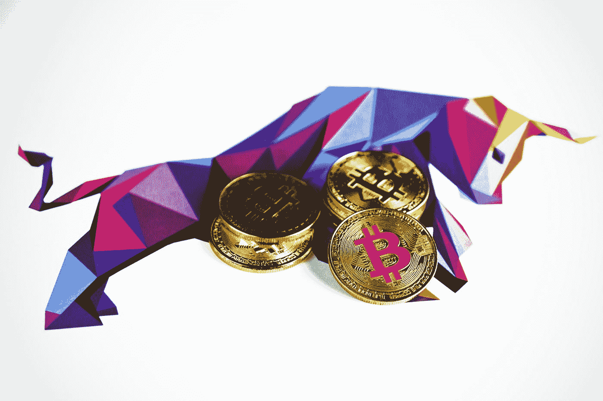

# 以太坊创造者羞辱比特币制造者对萨尔瓦多总统不加批判的支持

> 原文：<https://medium.com/geekculture/ethereum-creator-shames-bitcoiners-for-uncritical-support-of-el-salvadors-president-10cb6e34f581?source=collection_archive---------12----------------------->

## 布克勒总统将比特币合法化，引发了国内的抗议

Photo by [Executium](https://unsplash.com/@executium?utm_source=medium&utm_medium=referral) on [Unsplash](https://unsplash.com?utm_source=medium&utm_medium=referral)

以太坊(第二大流行的加密货币)的联合创始人 italik Buterin 在 Reddit 上羞辱了“比特币最大主义者”,因为他们不加批判地赞扬了萨尔瓦多总统 Nayab Bukele，他创造了…