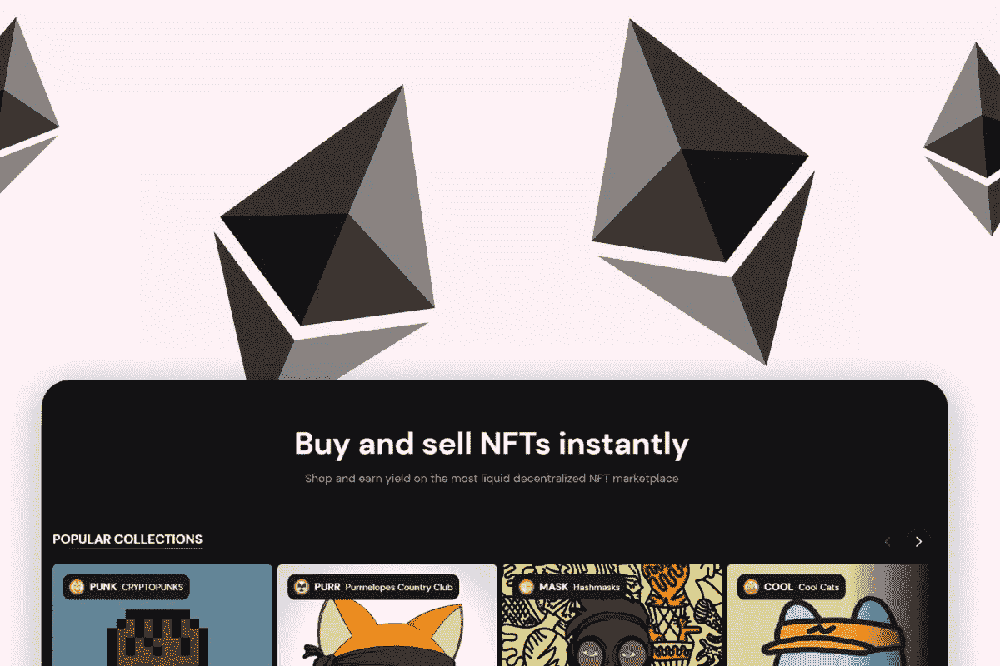
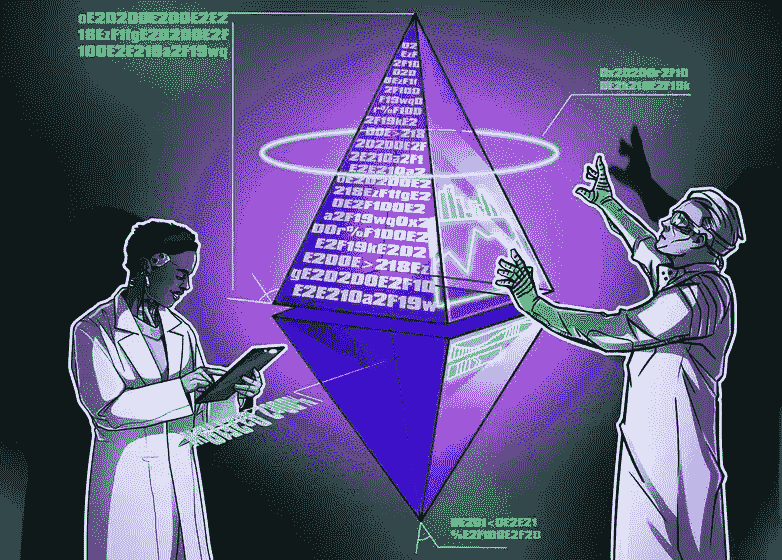

# 以太坊 NFT 市场开发:如何在以太坊上推出 NFT 平台？

> 原文：<https://medium.com/geekculture/ethereum-nft-marketplace-development-how-to-launch-nft-platform-on-ethereum-e3756a4f678e?source=collection_archive---------16----------------------->

随着 NFTs 的出现，对个人来说，直接与人接触的方式变得非常可能。就非食物疗法而言，它们不需要任何中介，因为它们可以直接加工并出售给人们。不可替代的代币为轻松交易建立了清晰的路线。数字收藏品是在区块链技术的支持下开发的，该技术存储并记录了关于 NFTs 的每一个数据和交易。防篡改 NFT 为个人拥有它们创造了新的宣传。很明显，人们需要一个数字平台来交易这些数字收藏品。

NFT 市场允许创作者和收藏者聚集在一起创作、购买和出售他们的 NFT。对非功能性金融交易日益增长的认识极大地促进了对交易非功能性金融交易的广泛的 NFT 平台的需求。准备一个 [**以太坊 NFT 市场开发**](https://www.appdupe.com/nft-marketplace-development) 怎么样？这个博客将指导你开发一个强大的 NFT 平台。

# **你需要了解的 NFT 市场重要信息**

NFT 市场是分散的平台，个人会发现自己充斥着各种 NFT 相关的服务，如创造，铸造，代币，购买和销售。这些 NFT 平台提供多种支付选择，人们可以通过加密货币或法定货币支付。此外，这些平台建立了一个数字创作者和收藏者聚集在一起交易数字代币的平台。创作者在为他们的 NFT 定价时会得到完全的支持。此外，他们还可以决定是出售还是拍卖他们的非专利技术。

当 NFTs 在区块链网络上运行时，市场也需要一个强大的网络来支持保护数据和交易。因此，这些 NFT 平台是在区块链技术公司的支持下开发的，该公司将保护 NFTs 的活动和操作。不可替代的代币已经在各个行业创造了一场巨大的革命，让每个投资者都充满了热情。NFT 不仅仅是数字收藏品，因为它们被用于各种领域，如游戏行业、体育和娱乐。随着 NFT 的使用案例变得如此广泛，这也提高了对基于其专业化的 NFT 上市专用平台的需求。

# **为什么以太坊是 NFT 市场发展的首选？**

以太坊是一种分散的区块链技术，它将建立一个安全的对等网络。这将安全地执行和验证名为智能合同的应用程序代码。智能合约的出现将消除对任何中央权力机构的需求，以促进交易。在区块链中维护的交易记录是透明的、不可变的、可验证的，并且安全地分布在网络上。这样，用户将能够获得完全的所有权和可见性。

在以太坊支持的系统中，交易由用户创建的以太坊账户发送和接收。DApps 的 [**概念最早是在以太坊的支持下杜撰出来的。DApps 是在以太坊和智能合约上运行的去中心化应用。以太坊网络以清除区块链中任何第三方干预、操纵、所有权和停机的需要而闻名。**](https://ethereum.org/en/developers/docs/dapps/)

# **选择以太坊区块链网络的优势**

以太坊作为一个区块链网络，对消费者来说有几个好处。然而，详细了解它们的好处是很重要的。这里列出了以太坊给系统网络带来的好处。

*   **数据协调**

以太坊的分散式网络消除了依赖单一权威来运行系统和执行交易的需要。它分发数据并在用户之间建立信任。

*   **可扩展性和性能**

权威共识的证明，加上自定义的阻塞时间和气体限制，在以太坊区块链建立的网络将每秒处理数百次交易。第 2 层扩展解决方案(如等离子体)为以太坊提供了各种机会来提高其未来的性能。

*   **快速部署**

以太坊网络让个人快速创业变得容易。企业无需从头开始部署区块链网络，而是可以在平台上即时安装和监控交换、挖掘和存储。

*   **网络规模**

以太坊主网将展示以太坊网络如何与多个节点和数百万用户一起工作。对于任何企业联盟来说，他们都被要求超越几个节点，网络规模是至关重要的。

*   **标记化**

企业可以将以太坊网络中已经是数字格式的任何资产进行令牌化。在对资产进行令牌化的同时，组织可以对整体资产进行令牌化，并扩展他们的产品线。

# **基于以太坊的 NFT 平台的重要特性**

以太坊 NFT 市场开发在显著特性和功能的支持下有效地工作。以下是在您的 [**NFT 平台开发**](https://www.appdupe.com/nft-marketplace-development) 中不应该错过的重要特性。

*   **店面**

NFT 市场的店面就像一个仪表板，将记录关于 NFTs 的所有信息。店面将包含关于数字资产的所有信息和描述，例如它们的投标值、定价和关于创作者的信息。

*   **搜索和过滤**

高级搜索选项将帮助用户从平台上列出的 NFT 库中搜索他们想要的 NFT 收藏。他们可以在搜索选项中输入他们想要的领域，如艺术或音乐令牌，并被定向到这些列表。用户还可以根据价格或其他属性对搜索进行分类，从而过滤搜索结果。

*   **加密钱包**

为了让用户存储和处理 NFTs，您需要一个加密钱包。但是，您可以允许用户将其加密钱包帐户与 NFT 平台集成，以存储、标记和交易 NFT。

*   **清单**

一旦创作者铸造了他们的 NFT，你可以允许他们在平台上列出他们的 NFT 收藏。当他们向公众列出这些数字收藏品时，他们将能够向个人出售或竞标这些数字收藏品。

*   **拍卖和销售**

NFT 平台应该允许创作者选择拍卖和出售。创作者可以为他们的 NFT 定价，或者他们可以为 NFT 定价并选择萌芽。

*   **多样化的支付选择**

NFT 平台应该为用户提供多种支付方式。用户可以在加密货币或法定货币这两个选项之间进行选择。

# **为什么选择以太坊对你的 NFT 平台来说是一个明智的选择？**

你计划推出以太坊 NFT 平台吗？在你继续之前，这里是你需要知道的关于在区块链以太坊建立 NFT 市场的意义。

*   以太坊是一个流行的区块链网络，广泛应用于 NFT 市场。在以太坊中，交易历史和令牌元数据在以太坊上是公开的。因此，追踪所有权历史很容易。
*   交易信息和令牌信息可供公众验证，以证明数字资产的所有权。
*   NFT 交易是通过点对点交易进行的。这将消除平台收取巨额佣金和赔偿的需要。
*   以太坊永远不会倒下，并且 NFT 永远可以出售或交易。
*   所有以太坊对象将共享同一个后端。所以 NFT 在网络中可以变得如此紧凑。

## **总结**

随着 NFT 市场的发展，这将是你在以太坊 上 [**创建你的 NFT 市场的绝佳时机。当你决定推出以太坊 NFT 平台时，你必须开始研究最好的 NFT 开发公司，以创建你无懈可击的解决方案。**](https://www.appdupe.com/nft-marketplace-development)