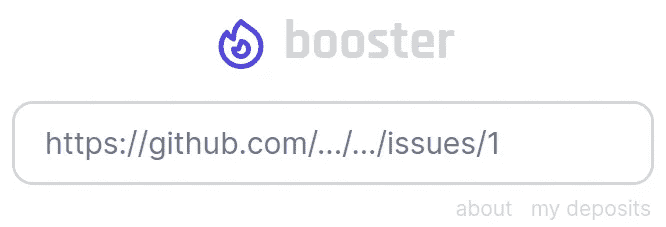

# GitHub 上的以太坊

> 原文：<https://medium.com/geekculture/ethereum-on-github-a752e33d6f19?source=collection_archive---------11----------------------->

## 通过 GitHub 操作实现自动支付

*本文假设* [*GitHub 动作*](https://github.com/features/actions) *和以太坊的基础知识。*

我参与了几个加密项目和原型，试图为开源基金创造一些有用的东西。但是到目前为止什么都没有实现。至少没有“一刀切”的解决方案。所以我试着把事情分解成小积木。我开始尝试 GitHub Actions，GitHub 的 CI/CD 工作流自动化平台，我看到了将加密交易集成到这些工作流中的巨大潜力。作为一个简单的例子，当拉请求被合并时触发支付。事实证明，有了 GitHub Actions，你可以做很多很酷的事情……不仅仅是部署 docker 映像或运行测试。经过更多的试验和前几天看了 GitHub 的 Web3 社区调用后，我对此很有信心。你得到的是一个用于软件项目的超级灵活的支付自动化平台，就在它们被构建的地方(至少是许多软件项目)，当然，一般的想法也可以应用于其他环境，连接到不同的区块链。GitHub Actions plus Ethereum 对我来说是显而易见的选择，在我正在进行的一个现有项目的背景下。

(If you’d ask me to put it in one sentence like an ad guy. [https://web3actions.github.io/](https://web3actions.github.io/))

我首先创建了一个简单的 [GitHub 动作](https://github.com/web3actions/tx)，它允许您将 RPC 节点和(可选的)钱包密钥[配置为存储库](https://docs.github.com/en/actions/security-guides/encrypted-secrets)中的秘密，然后在工作流中进行任何类型的事务。要从合同中读取余额或数据，您不需要提供密钥。但如果你这么做了，你就可以转移价值，签订合同，签署信息。凭借这一点和一些可靠性，我已经能够建立一个多重签名的 oracle 机制，并在此基础上建立一个奖金制度的问题和贡献为基础的令牌空投。

这仍然是非常实验性的，我写这篇文章是因为我现在有很多“概念验证”代码需要审查、测试、改进、润色等等。我想邀请任何感兴趣的人加入 GitHub 的讨论区[。如果你已经有了一些 GitHub 动作和 Web3 的经验，那就太好了。](https://github.com/cryptoactions/cryptoactions.github.io/discussions)

# 甲骨文、签名者和工作流客户端

我的一个主要动机是找到一种更好的方式来提供来自 GitHub 的数据合同。当我学习可靠性和智能合同开发时，我很快就遇到了 oracle 问题。我通过运行带有一些自定义适配器的 Chainlink 节点解决了这个问题。我花了一段时间才明白，Chainlink 主要是一个分散的价格反馈提供商。但是对于像 GitHub API 这样依赖于单一来源的应用程序来说，运行 Chainlink 节点除了监听您的契约、运行服务器进行 API 调用并发回数据之外，并不能为您做更多的事情。如果您不想自己实现它，您可以运行一个 Chainlink 节点，这样就可以了。无论如何，阅读价格提要是一个免费的只读操作。

因为我现在已经在 GitHub 工作流中处理事务了，所以我试图创建一些更适合我正在做的项目的东西。让我们看看我是否成功了。从技术上讲，oracle 是一个帐户，被授权向智能合同写入数据。您是否有多个 oracles 或者数据是否在某个地方被聚合是另一个话题。如果你的合同中有一个`onlyOwner`修饰符，那么`owner`就是你的“神谕”。

有时，你只需要向你的用户保证，如果他们在你的智能合同中存入一些东西，你不可能带着他们所有的钱逃跑。你基本上想要的是一个简单的多重签名方法。一个或多个独立方需要验证和签署某些交易。现在你需要与你选择的签名者合谋来偷钱，你的使用可以基于你的签名者的可信赖性和独立性而得到更多的信任。

## 工作流客户端

我发现这是一个可行的解决方案。在任何情况下，您都有一些触发链上状态变化的链外逻辑，并且您希望该逻辑以透明和永久的方式执行。GitHub Actions 使这变得非常简单，而且它是绝对透明的，就像带有自定义适配器的 Chainlink 节点、内置的 GitHub 身份验证模型和可公开访问的作业运行仪表板。由 GitHub 运行，对公共存储库免费。

因此，GitHub 动作工作流是 Yaml 文件，位于您的存储库中，定义了一些要执行的链外逻辑，包括 Web3 事务。这可以是任何代码，但是您应该确保任何外部源都被确切的提交散列所引用，以确保透明性。

链上部分是一个智能契约，它继承了`[GithubWorkflowClient](https://github.com/web3actions/contracts/blob/main/src/GithubWorkflowClient.sol)` [契约](https://github.com/web3actions/contracts/blob/main/src/GithubWorkflowClient.sol)，设置了工作流文件哈希、独立签名者的地址(运行[签名者工作流](https://github.com/web3actions/signer/blob/main/.github/workflows/signer.yml))并正确实现了`verifyGithubWorkflowRun`功能。

通过这种方式，可以信任一个契约基于由该工作流文件定义的完全相同的链外逻辑进行操作。一旦您更改了工作流文件，如果您的签名者值得信任，事务将会失败。签名者将通过 GitHub API 获取关于您请求签名的工作流运行的信息，并对正在执行的文件的散列以及运行的 id 进行签名。目前不支持多个签名者，但应该不会有太大问题。

一开始可能不太直观，尤其是如果你不太熟悉 GitHub 的动作，我甚至不敢说它没有任何缺陷。但是我想鼓励你们思考一下。也许举个例子:

这里有一个[合同](https://github.com/web3actions/contracts/blob/main/src/token/Airdrop.sol)，处理令牌空投和相关的[工作流](https://github.com/web3actions/web3actions.github.io/blob/main/.github/workflows/airdrop.yml)，根据用户在 GitHub 上的贡献发布令牌。你其实可以在我准备的网页上试试 airdrop:https://web 3 actions . github . io

[web 3 actions/signer](https://github.com/web3actions/signer)repository 免费签署工作流运行。您打开一个包含 JSON 编码字符串的问题(可能通过一个应用程序)来发出请求。您不一定需要通过发布问题来进行这种沟通。你可以基于这些事件实现任何机制，包括定制的网络钩子。但是为了简单起见，我只使用问题。

以下是签名请求的示例:

 [## 请求签名问题# 76 操作/签名人

### 此时您不能执行该操作。您已使用另一个标签页或窗口登录。您已在另一个选项卡中注销，或者…

github.com](https://github.com/web3actions/signer/issues/76) 

要点是，您的应用程序的存储库可以同时是它的 oracle。在许多情况下，你不需要一个庞大的神谕网络。你只需要一种简单、透明、可靠的方式将数据“放在链上”。对于不希望用户盲目信任您的情况，请使用一个或多个第三方签名。如果你需要分散的价格源，使用 Chainlink。如果您的工作流程中需要分散的价格反馈，请使用[这个 GitHub 动作](https://github.com/web3actions/price-feeds)。

# Web3 操作令牌(W3ACT)

自从我在 2020 年 8 月开始学习 Solidity 以来，我一直想推出自己的 token，只是为了体验。因此，我的一个演示实现是前面提到的令牌空投。并且令牌实际上有一个值得一提的独特属性。

令牌实现了 ERC677 标准。我发现 ERC20 标准(ERC677 继承自它)并没有要求它的`transfer`函数是“可支付的”(为什么要呢？)，ERC677 的`transferAndCall`和`onTokenTransfer`也没有。这意味着，在转移令牌时，你不能在同一个交易中发送以太网，即使这在技术上是可能的，即使没有任何兼容性问题，无论这有什么用途。如果你向一个合约发送 ERC20 令牌，该合约甚至不被告知交易，也不能对其采取行动。它只是发生在代币的契约内。ERC677 通过添加一个`transferAndCall`函数来解决这个问题，它只是在幕后使用标准的 ERC20 `transfer`函数，但允许契约实现一个`onTokenTransfer`函数，然后由`transferAndCall`调用该函数来通知契约(仅当接收者是契约时)。但是 ERC677 也不要求这些功能同时接受以太支付。Solidity 中的一个函数需要被标记为`payable`才能接收 Ether，所以我给`transferAndCall`添加了`payable`修饰符，这样一个接收契约就可以实现一个应付款`onTokenTransfer`，任何 Ether 值都会被转发。这样，您可以在一次交易中发送这些令牌和以太网。

我想在第二个“演示”中的 [booster](https://web3actions.github.io/booster) 中实现这个功能的一个可能的用例。在为某个问题存入 ETH 奖金时，您还可以使用 W3ACT 代币支付额外的促销费用，而无需进行第二次交易。

因此，如果你有一个 GitHub 帐户，并且从创建之日起就没有完全不活动过，你可能会在这里申请一些(kovan)令牌。

# 助推器

Booster 是针对 GitHub 问题的超级极简赏金服务。你可以在任何当前公开的问题上存放 ETH。关闭问题的用户可以通过评论将奖金发放给另一个用户。如果问题是由一个合并的拉请求自动关闭的[，该拉请求的作者可以获得奖金。要提取奖金，您需要通过发布问题和触发工作流程来确认您的 GitHub 帐户。可以提供任何以太坊地址作为收件人。发送奖金的费用会自动包含在 1%的费用中。一个新创建的空钱包，足以提取您的第一笔奖金。](https://docs.github.com/en/issues/tracking-your-work-with-issues/linking-a-pull-request-to-an-issue)

关注 Twitter 上的[@ web 3 actions](https://twitter.com/@web3actions)，以便在有新的奖励时获得通知(并且实现了推广功能)。

现在就试试:[https://web3actions.github.io/booster](https://web3actions.github.io/booster)

# 反馈

我与之交谈过的大多数人起初都有点担心，因为 GitHub 是一个存储密钥(作为存储库或组织机密)的中央实体，但这可能会通过使用[自托管运行器](https://docs.github.com/en/actions/hosting-your-own-runners/about-self-hosted-runners)得到改善。我想邀请你检查一下空投和助推器(在 kovan 上),也许可以根据你自己的要求试验一下这个想法。 [GitHub 似乎普遍非常支持加密项目](https://youtu.be/Bufm7VR4nfg?t=3650)。在此分享您的想法、问题和反馈:[讨论](https://github.com/web3actions/web3actions.github.io/discussions)

如果你想支持这个项目，请查看 Gitcoin 上的资助项目:[https://gitcoin.co/grants/3781/web3-actions](https://gitcoin.co/grants/3781/web3-actions)
我不能做出任何承诺，但我越不需要考虑钱，我就越有可能继续从事这项工作。

*如果你打算成为中等会员，可以使用我的推荐页面支持我:*[*https://markus-kottlaender.medium.com/membership*](https://markus-kottlaender.medium.com/membership)