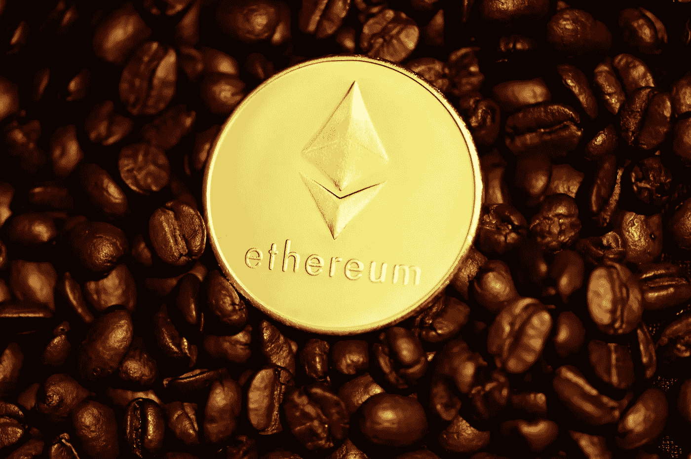
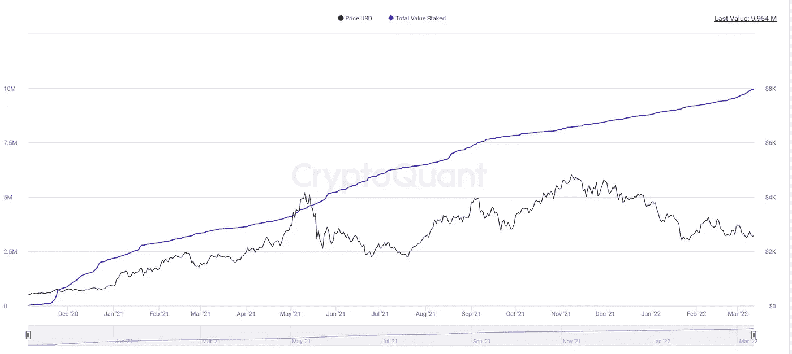
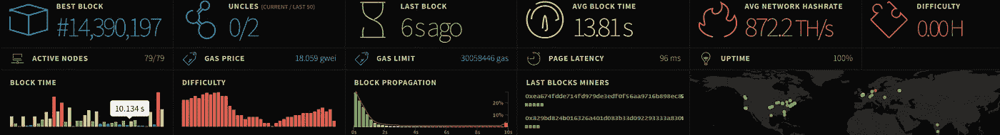
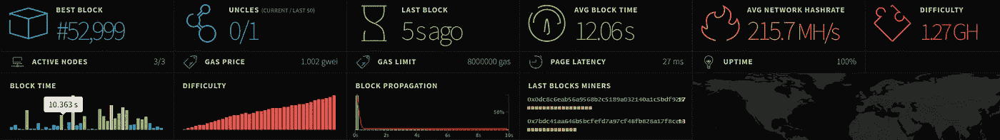
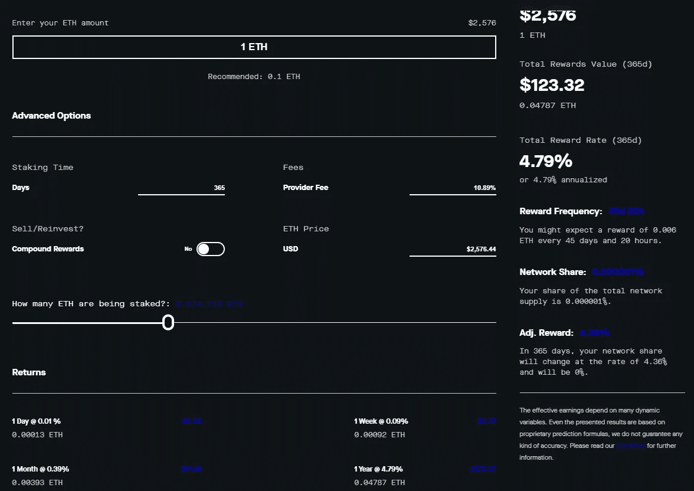

# 以太坊将于 2022 年在 Q2 升级。有什么新鲜事？

> 原文：<https://medium.com/geekculture/ethereum-upgrade-is-coming-in-2022-q2-whats-new-8df0c7f6b8cf?source=collection_archive---------3----------------------->

用简单的术语解释

Photo by [Kanchanara](https://unsplash.com/@kanchanara?utm_source=unsplash&utm_medium=referral&utm_content=creditCopyText) on [Unsplash](https://unsplash.com/s/photos/ethereum?utm_source=unsplash&utm_medium=referral&utm_content=creditCopyText)

以太坊可能是所有现有加密协议中最接近大规模采用的一个，但距离它还有很长的路要走。目前(2022 年 Q1)，每天大约有[100 万个地址](https://bitinfocharts.com/comparison/ethereum-activeaddresses.html#3y)，尽管如此，网络仍然存在规模和安全问题。

以太坊的最终更新已经准备了很长时间。这一演变过程有多种原因:

*   高昂的汽油费
*   与其他协议甚至传统的法定货币系统相比，交易速度较慢
*   矿工验证
*   缺乏可扩展性和安全性

其中大多数的整体解决方案是从一个可靠但旧的工作证明(PoW)共识算法切换到一个新的但可疑的利害关系证明(PoS)。在 PoS 现实中，交易会得到主要玩家的确认，并有足够数量的代币下注。在 Eth2 现实中，单次验证的数量高达 32ETH，目前总计近 80000 美元。为了转向新的确认事物的方式，以太坊社区不得不实现更新，并逐渐将它们引入网络，这从 2020 年就开始了。到目前为止，主要的非技术障碍是积累足够的验证器，看起来我们就快到了。

More than 10M ETH staked into Eth2.0 networks. Initially, developers estimated 10M exactly to be enough for a successful launch. Graph taken from cryptoquant.com.

# 最近更新

然而，仍有一些技术进步有待实现。据协议之父 Vitalik Buterin 称，该网络已经为发布做好了 50%的准备，在当前的测试阶段之后，将达到 80%。[尽管如此，期待 2022 年 Q2 奥运会的某个地方正式推出还是合情合理的。](https://ethereum.org/en/upgrades/beacon-chain/)

3 月 10 日，以太坊社区开始 klin testnet 测试更新。您可以在这里参加测试并查看相关指标:【https://kiln.themerge.dev/】T4。从 [ethstats 仪表盘](https://ethstats.kiln.themerge.dev/)中可以看出，这个过程进行得非常顺利。例如，klin networks 参与者享有几乎稳定的 1gwei 天然气价格和略低的平均阻塞时间。

Regular Network

Klin network

# 打桩分析

为了确认交易一定数量的以太坊，硬币必须被锁进验证器块。为此，所有者将获得一定数额的奖励，这是一种有效的被动收入方式。让我们回顾一下这个解决方案是否仍然有趣。

Calculations made by [stakingrewards.com](https://www.stakingrewards.com/calculator/ethereum-2-0/)

正如你在上面的图片中看到的，通过赌注池下注以太坊有<5% APR. It's probably fair to say that the actual APR would be slightly lower due to the tendency of the network to grow and the risks of participating at staking pools. You can access potential decrease by moving the slider labelled as "How many ETH are being staked". Bear in mind that this model also does not consider potential appreciation in case the network gets successful adoption.

# Other Opportunities

Speaking of successful adoption, let us review how we can benefit from an upgrade without putting financial assets into a few-years lockdown.

One option that jumps on you immediately is to try and speculate on a potential price increase closer to the actual upgrade date. While I cannot give you substantial financial insights, I believe that it is a bit too late for that. It seems like recent positive Ethereum community news is not impacting the price action, raising the hypothesis that the closeness of the upgrade is already incorporated in values of eth's. Historically, it seemed truthful for other major networks like Cardano or Polkadot, where the price wasn't changing much after official rollouts.

A better option to benefit from the technology shift would be actually to use that technology. There are many ways how you can leverage Serenity to build better, faster apps. Judging by the c[当前的应用列表](https://consensys.net/blog/news/90-ethereum-apps-you-can-use-right-now/)，有理由认为基于 Eth2.0 的软件将集中在去中心化金融和 NFTs 上。这两个类别包含主要的流行应用程序，升级本身不会立即引发偏离趋势。

如果你想避免竞争，追求新奇，我建议你研究任何与大数据相关的领域:物联网、社交网络、数据交易等。Crypto 在这些分支中已经有了不错的用例，但是在用户较少的网络中。当涉及到许多高频交易时，以太坊的更新应该会带来另一个水平，可能是值得关注的事情。

如果你被说服参加聚会，这里有两个不错的课程可以开始:

*   [Udemy 上的以太坊和实体课程](https://www.udemy.com/course/ethereum-and-solidity-the-complete-developers-guide/)
*   [Coursera“区块链专业化”](https://www.coursera.org/specializations/blockchain)

# 摘要

似乎我们即将见证整个加密社区的重大更新，尽管它可能不会立即将电子硬币融入你的生活，但它会让它更近一步。请在评论区告诉我你对此的看法。

**附言**虽然我有能力在媒体上发布新的科技文章，[但我仍然希望你关注我的国家目前发生的事情](https://destiq.medium.com/my-country-fights-online-too-d0f76f52fff4)。如果你能帮忙就帮忙，如果不能帮忙就提高意识，如果这两种方法都不起作用，给我们一些积极的能量。我们仍在战斗，并将一直战斗到胜利。