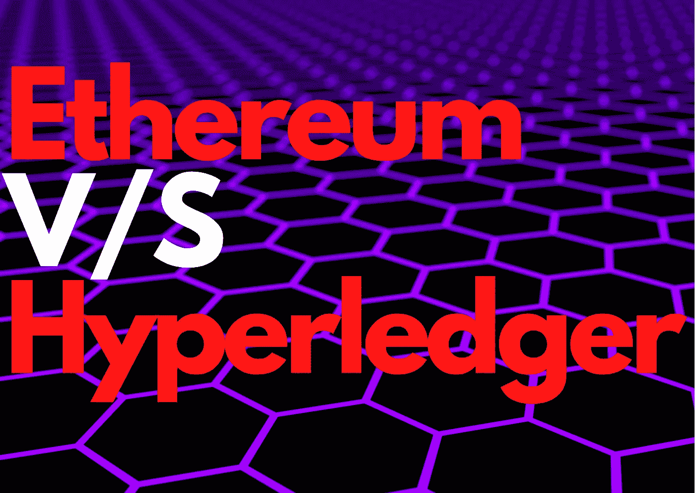
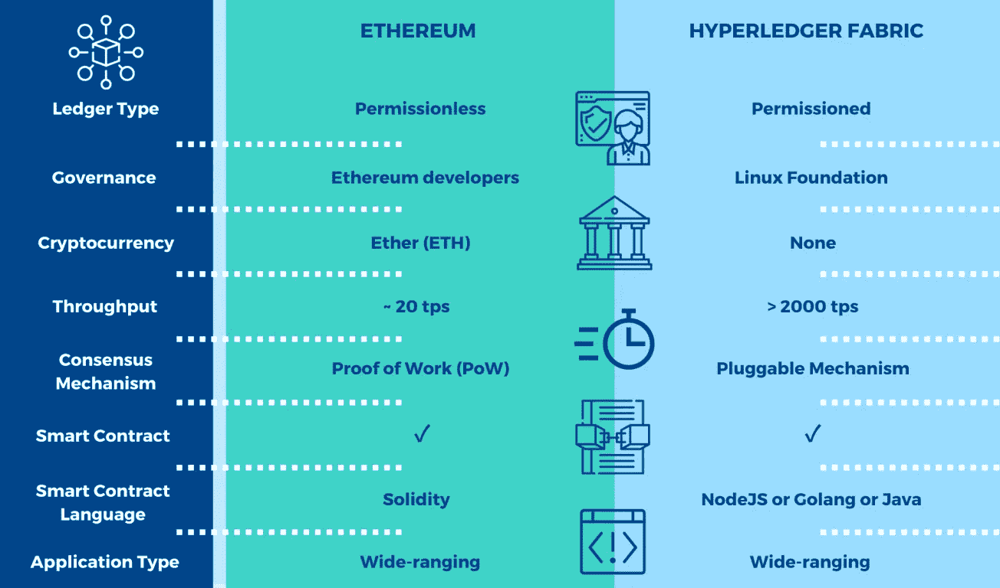

# 以太坊虚拟分类帐

> 原文：<https://medium.com/geekculture/ethereum-v-s-hyperledger-f1b0c5e05b40?source=collection_archive---------9----------------------->

Hyperledger 和以太坊是世界上使用最广泛的两个区块链平台。两者都是免费使用的。除了解决几个行业级的困难之外，他们还帮助开发了大量的区块链应用程序。随着区块链技术的成熟和越来越多的开发人员进入这个领域，“我应该使用哪个区块链平台？”以及“我应该何时采用区块链技术？”变得越来越普遍。为了回答这个问题，抓住这两个区块链之间的区别是至关重要的。

# 以太坊是什么？

以太坊是一个公共的、分布式的、去中心化的、社区构建的平台，旨在执行智能合约(一个脚本，当使用特定参数调用时，如果某些事件被触发，它会执行一些操作或计算。以太坊虚拟机是以太坊区块链上的一个单一的、规范的计算机状态。由于它是一个公共的和分散的平台，网络上的每个节点都同意该虚拟机的状态，并保存该计算机状态的副本。每当新块被添加到块链时，它将被添加到驻留在网络的所有节点内的网络的全局副本中。

# 什么是 Hyperledger？

Hyperledger 是一个模块化的开源框架，用于构建具有高度保密性、灵活性、健壮性和可伸缩性的分布式分类帐系统。因此，基于该平台构建的解决方案可以针对任何行业进行定制。Linux 基金会管理着这个私有的秘密的区块链框架。

# 以太坊和超级账本的区别

以下是以太坊和 Hyperledger 的主要区别:

## 1.功能:

*   以太坊是一个构建 B2C 和去中心化 app 的平台。它的创建意图是在以太坊虚拟机(EVM)上运行智能合约，并生成广泛使用的去中心化应用。
*   Hyperledger 是一个构建 B2B 和跨行业应用的平台。它促进了组织或行业与使用分布式账本技术(DLT)的开发者之间的协作。这可用于构建访问受限的定制区块链应用。

## **2。隐私:**

*   以太坊是一个公共网络，因此没有隐私这回事。所有的交易都是完全透明的，任何能上网的人都可以看到。
*   Hyperledger 是一个访问或权限受限的区块链网络。这是一个高度安全和保密的交易。网络上的所有交易只能由拥有授权证书的公司或个人查看。

## **3。治理:**

*   以太坊网络仅由以太坊开发者管理。Vitalik Buterin 是以太坊的主要开发者和创始人。这主要是内部开发而不是协作的一个例子。
*   Hyperledger fabric 由 Linux 基金会管理。IBM 也是这个框架的主要贡献者之一。这是这两家公司大规模合作的产物，并取得了巨大的成功。

## 4.参与度:

*   以太坊是没有权限的公网。任何有互联网连接的人都可以获得该软件，并开始挖掘以太坊。
*   Hyperledger 严格控制谁可以加入网络。Hyperledger 平台及其功能只对经批准的成员和授权成员选择的同行开放。这使得有价值的和秘密的信息对外人隐藏起来，防止他们篡改。

## **5。智能合约:**

*   以太坊首先提出了智能合约。智能合同是一个计算机程序或用代码编写的条件，当满足某些条件时，它会自动触发。它控制合同双方之间的数字资产转移。它是不可变的，一旦条件被创建，任何第三方都不能改变它。
*   与智能合同一样，Hyperledger fabric 也允许成员组织在对等方上运行一些代码，以便在特定条件下创建交易。这些被称为*链码*。

## **6。编程语言:**

*   对于编写智能合同，以太坊使用 solidity，对于开发应用程序，可以使用一些高级语言，如 [JavaScript](https://www.geeksforgeeks.org/javascript-tutorial/) 、 [Python](https://www.geeksforgeeks.org/python-programming-language/) 、 [Golang](https://www.geeksforgeeks.org/golang/) 。
*   在 Hyperledger *中，Go* 被广泛用于编写链码，同时也使用了一定程度的 Java 和 JavaScript。

## **7。共识机制:**

*   因为以太坊是一个分散的网络，区块链使用工作证明(POW)或共识方法。它帮助分散网络的成员节点就账户余额和交易顺序等问题达成一致，防止用户产生虚假交易和重复消费硬币。
*   Hyperledger 不需要 POW 或共识流程来验证交易，因为它是一个私有的许可网络。如果两个参与者就一个给定的交易达成一致，则没有第三方可以看到或干预该交易。这提高了网络的可扩展性和交易速率，以及其整体性能。

## **8。交易速度:**

*   因为以太坊是一个公共领域，它有一个减慢交易速度的电源机制。这相当于每秒 20 次交易。
*   作为一个许可的区块链网络，Hyperledger fabric 不需要以太坊那样庞大的 POW 机制。这加快了交易过程。这相当于每秒 2000 次交易。这可比以太坊大多了。

## **9。加密货币:**

*   以太坊有自己的原生加密货币，叫做以太坊(ETH)。任何参与节点都可以通过付气的方式挖掘 ETH。
*   Hyperledger 没有自己的加密货币，也不涉及采矿。

# **特色**

# 什么时候用什么？

以太坊和 Hyperledger 的使用案例如下:

## **以太坊:**

*   **公共或 B2C 应用**:开发者或开发中的企业可以利用以太坊智能合约创建分散的应用，供客户在公共或 B2C 应用中使用。任何人都可以加入以太坊网络并构建一个节点。该网络中的每个节点都有一份完整区块链的副本。
*   **社区主导的开源应用**:这些应用由世界各地的区块链开发者社区构建和托管，不需要任何保密。以太坊可以用来创造它们。

## **总账:**

*   **私人或 B2B 应用**:企业不想在以太坊这样的公共区块链上维护他们的机密数据。作为一个许可的区块链网络，Hyperledger 可以克服这个问题。它提供了构建区块链应用程序的能力，同时保留了组织数据的隐私。
*   **创建定制的区块链算法**:当一个组织或公司希望开发自己独特的区块链算法时，Hyperledger 可能会非常有用。整个区块链的底层基础设施可以在 Hyperledger 计划中更新。这种适应性被证明是开发定制的商业区块链应用程序的宝贵资产。

# 结论

独一无二的问题需要独一无二的 Hyperledger 和以太坊对于解决某些业务和客户端问题都很有用。它们都有各自的优点和缺点。因为这两个工具有不同的用例，所以它们之间的决定是基于项目的需求。

> *你可以在这里* *买一杯咖啡支持我和我的内容☕* [***。***](https://www.buymeacoffee.com/amanagarwal)
> 
> *关注我上* [***推特***](https://twitter.com/02amanag) *和*[***LinkedIn***](https://www.linkedin.com/in/02amanag/)*。*

# 了解更多信息

 [## 与 Golang 的智能合同

### 通过 golang 与智能合约交互

medium.com](/nerd-for-tech/smart-contract-with-golang-d208c92848a9)  [## 什么是 ERC-721 和 ERC-1155？

### 新一代令牌的基础

medium.com](/nerd-for-tech/what-are-erc-721-and-erc-1155-44b1eb592d87)  [## 比特币基地与戈朗的贸易

### 如何使用 Golang 接受加密货币支付

enlear .学院](https://enlear.academy/coinbase-commerce-with-golang-cd70b7431cc8)