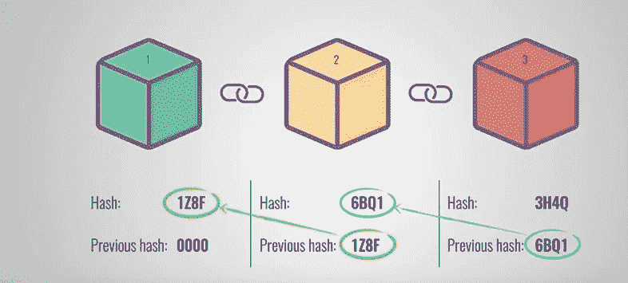
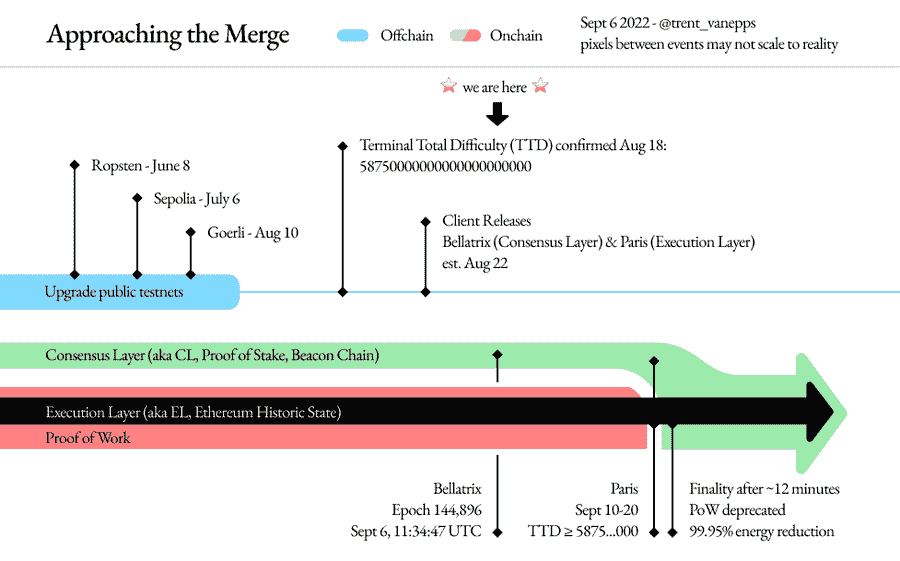

# 以太坊的合并:权力与地位

> 原文：<https://medium.com/geekculture/ethereums-merge-pow-vs-pos-3924140ed594?source=collection_archive---------2----------------------->

## 深入了解后端的合并情况

Image from [ethereum.org](https://ethereum.org/en/upgrades/merge/)

如果您关注 crypto，那么您肯定听说过最近流行的术语“合并”。

这听起来像是漫威和 DC 令人难以置信的暧昧交叉，但它远比这更有影响力(至少可以这么说)。

简单地说，合并是以太坊区块链从工作证明(PoW)到利益证明(PoS) 的转变。这一变化将从根本上改变最初给以太坊带来去中心化的共识协议——很可能是永久性的。

合并的传闻已经有一段时间了，经常被冠以不同的名字，比如“以太坊 2.0”。人们期待这种从工作证明到利益证明的转变已经有一段时间了，这主要是因为它符合以太坊的路线图，即成为一个可扩展、安全且**可持续的**网络。

加密货币背后的区块链的可持续性一直是许多人在采用期间的主要担忧。工作证明(以太坊预合并使用的协议)需要非常高的计算能力。仅区块链以太坊一家，去年就消耗了 112 太瓦时的电力——比整个荷兰消耗的还多。

不幸的是，消耗的大部分电力也不是来自可再生资源，这导致了媒体对使用加密货币的道德性的大量批评。

切换到利益相关证明的目的是**降低以太坊 99.9%的能耗**，为有环保意识的大众在以太坊链上采用加密技术清除障碍；因此，给整个行业起一个更好的名字。

要理解这种能源消耗是如何通过共识机制的一个简单变化(哈哈——简单…)而大幅降低的，首先重要的是理解 PoW 的现状以及 PoS 带来的变化。

# 理解工作证明

> 对区块链功能的基本了解是理解以下材料的前提。

我们都知道，区块链的独特之处在于他们能够创建一个本质上分散的安全数据库。这两个功能协同工作是通过共识机制实现的，在这种机制中，许多个人能够确认某件事情的有效性，而不仅仅是一个人。

PoW 是区块链第一个也是最广泛使用的共识机制。它的工作原理是使用特定数量的计算能力，通过从安全层**“解开”来验证每个块。一旦数据块通过验证，就可以将其添加到区块链中，并且每个人的区块链副本都可以使用该数据块进行更新。**

**不过，首先，我们需要看看每个块是如何固定的，以便理解这是如何工作的。**

## **密码学的一些背景知识**

**在区块链上进行的每个事务都被添加到一个块中。一旦该块达到它可以持有的最大交易数量(根据正在执行的合同而变化)，它就被包装在一个 **SHA-256 函数**中——一种数学算法，它接受一个输入并创建一个设定数量的字符的随机输出。**

> **下面举个例子:
> ***输入:*** *“这是一笔交易输入”* ***输出:****7e 22973 b 7926055 f 73 f 8416 e 9 cc 9 f 50 E3 C1 f 4 f 34 fcffed 7972 fdeaac 83 C1 caaa***

**任何时候你在以太坊网上进行交易，你都可以通过查找你的钱包地址在[以太扫描](https://etherscan.io/)上直接查看它的哈希。**

**输入数据中甚至一个字符的变化都会极大地改变您得到的输出；因此，试图从输出中精确地找出输入是什么变得极具挑战性。然而，反之则容易得多——这意味着一旦有人想出了输入，验证他们的答案就很简单了(简单地通过 SHA-256 算法运行它，看看输出是否匹配)。**

**输入数据本身包含各种字符串，包括前一个块的散列。这就是在区块链中**块**被**链**在一起的方式。通过将前一个块的散列合并到下一个块的输入数据中，这些块被连接起来。**

****

**Image by [Simply Explained](https://www.youtube.com/watch?v=SSo_EIwHSd4&t=61s)**

**任何想要改变一个块的数据的人(记住，即使改变一个字符也会彻底改变整个散列)，都必须操作前一个块的散列…然后是前一个块的散列，再前一个块的散列…**

**并且这些都必须在添加下一个块之前完成；因此，除非有人运气很好，能够第一次尝试就猜出区块的散列值，对于连续 1000 万个区块(以太坊链的当前大小)，他们基本上没有机会做任何欺诈行为。**

**输入数据的另一个最重要的组成部分是 **nonce** (使用一次的数字)。用于信息数据的所有其他信息，如块哈希、块时间戳等，都是公开可用的。然而，随机数是随机生成的字符串，是唯一不公开的输入数据。因此，任何想要解码 SHA-256 函数(从而验证块)的人实际上只需要求解随机数。**

*   **[nonce——例如:](https://ethereum.org/en/developers/docs/consensus-mechanisms/pow/#:~:text=Ethereum%2C%20like%20Bitcoin%2C%20currently%20uses,certain%20kinds%20of%20economic%20attacks.) `0xd3ee432b4fb3d26b`**

## **挖掘器和验证器**

**我在整篇文章中提到的这些“某人”是**矿工**——如果你对区块链有所了解，你可能会对这个术语很熟悉。矿工只是专门为解决这些能源问题和验证区块链区块而建造的计算机。这些计算设备由非常强大的硬件构成，以确保它们能够在尽可能短的时间内解决尽可能多的问题。**

**由于世界各地成千上万台这样的计算机不断运行，大量的电力被用于验证和维护区块链。**

**一个人不怕麻烦，购买所有零件来组装这样一台机器，然后支付运营成本的动机，都源于他们正在验证的货币——以太(ETH)。未成年人每通过一次测试，就会获得 2 块乙醚以及相关的汽油费。**

**燃气费是在以太坊区块链进行任何交易时都会产生的费用。根据你希望交易进行的速度，你需要支付一笔油费，作为对矿商的额外激励，让他们优先验证你的交易。**

## **TL；战俘博士**

**通过对 PoW 的这一简短深入研究，很明显为什么它会成为这么长时间以来的首选协议。这个链条可以通过计算能力建立一道屏障**来使自己不受欺诈影响**。除非有人能够开发出比目前矿工使用的计算设备(硬件也在不断更新)更强大的硬件，否则区块链不会受到欺诈。**

**即使出于某种原因，一个组可以访问比其他人拥有的硬件优越得多的硬件，区块链也可以被编程为在 nonce 中包含更多的字符(在哈希中[以 0 开头)，这增加了阻止的难度。](https://www.quora.com/Why-is-difficulty-measured-in-hash-s-leading-zeroes)**

# **理解利害关系的证据**

> **对工作证明的适度技术深度是理解利害关系证明的先决条件——但是看，现在你有了！**

**PoW 的一个问题是维护区块链需要高水平的计算能力。不一定是散列的实际求解需要高水平的计算能力(几乎任何现代设备都可以在相当短的时间内做到这一点)，而是由为每个验证的块提供的激励所驱动的竞争。**

**以太坊区块链没有参与点。你要么验证一个方块并得到以太奖励，要么不要。结果，人们优化拥有最强大的机器，以便在网络上击败其他矿工，并首先解决障碍。这种竞争促使昂贵且耗能的计算机成为矿工。**

## **消除对强大硬件和高能耗的需求**

**PoS 的目的是通过针对根本原因(硬件驱动的竞争)来完全消除对高能耗机器的需求。PoS 将竞争的驱动力从能源支出转移到 ETH 支出。**

**本质上，在 PoS 共识协议中，挖掘者/验证者只是那些在[智能合约](https://www.ibm.com/topics/smart-contracts)上以自己的 **ETH 作为抵押品**的人。如果任何一个矿工被发现进行欺诈交易，他们的股份就会被销毁。**

**验证块的方式基本上是一样的。挖掘者必须尝试找到 nonce 值。然而，在另一名矿工之前解决障碍不再是一场比赛。虽然这种**消除了进入这个领域**需要顶级硬件的需求，但它也设置了另一个进入壁垒——钱。**

**根据 2022 年 6 月 9 日的[以太坊文件](https://ethereum.org/en/developers/docs/consensus-mechanisms/pos/#top)，一名矿工至少必须持有 32 ETH 股份(在撰写本文时大约为 60，000 美元)才能成为验证组的一员。最重要的是，在 PoS 中，矿工是根据他们下注的多少来选择的。一方的赌注越大，他们获得验证块的机会就越大。因此，它仍然没有使密码挖掘成为普通人容易理解的东西，这有好有坏(另文讨论)。**

## **TL；位置上的灾难恢复**

**总的来说，仅仅基于 CPU 能力的竞争的消除意味着使用更少的计算能力——如简介中所述，维持以太坊区块链合并后所需的 **99.95%** **更少的能量**。**

**PoS 作为一个整体似乎是所有共识协议的黄金平衡，因为它能够继续以与 PoW 一样高的速度推出交易，同时还保持环境意识并增加区块链中任何参与者作为验证者加入的公平性。**

# **PoS 过渡的各个阶段**

> **本节中提到的词汇和主题与刚才讨论的内容不相关。其目的是提供一个关于合并实施计划的高层次概述，以了解从 PoW 到 PoS 过渡的复杂性。**

**许多年来，许多区块链像卡尔达诺、波尔卡多特和多边形都使用了 PoS。这种共识协议并不是我们第一次看到的新东西。**

**合并之所以如此重要，是因为这是第一次任何主要区块链将其共识协议从一个过渡到另一个。正如《福布斯》的一篇文章所描述的那样，这相当于在飞行途中更换宇宙飞船的引擎——非常危险&非常复杂。**

**因此，至少从 2020 年 12 月 1 日起，已经制定了一个精确的路线图，以确保这一过渡尽可能平稳。下面是合并路线图的可视化表示。**

****

**Image from [trent.eth](https://twitter.com/trent_vanepps) on Twitter**

**我们来分析一下。**

**要理解这种合并的一个主要概念是存在**信标链**(绿线，称为“共识层”)和**以太坊主网**(黑线，称为“执行层”)。信标链使用 PoS 共识机制，但它目前不托管以太坊网络上的任何交易。这些仍然保留在 Mainnet 上，我们知道 Mainnet 使用 PoW。**

**信标链上仍然有活动发生，只是目前创建的块中没有一个处理真正的以太坊。它主要关注于为所有将要在链上的验证器的钱包建立一个分类帐。**

**回到路线图——几天前的 9 月 6 日, **Bellatrix 硬分叉**发生了，它更新了信标链上的代码库，并提示以太坊链上的[节点](https://ethereum.org/en/developers/docs/nodes-and-clients/#:~:text=A%20%22node%22%20is%20any%20instance,and%20keeps%20the%20network%20secure.)更新它们的客户端，准备开始在信标上创建块。从高层次来说，这是区块链以太坊在合并前需要的最后一次升级。**

**现在剩下的是巴黎更新，那时**信标链和 Mainnet 将合并**为一，所有未来的交易都将在 PoS 共识机制上得到验证。这个更新什么时候发布还有点不确定，但预计会在 9 月 15 日左右。**

**一旦执行层达到总终端难度(TTD)5875000000000000000000，将执行此更新。TTD 是一种从整体上衡量网络挖掘难度的方法，并且它将被用作一种指定 PoW 共识机制的最后一块是什么的方法。一旦一个方块达到这个难度级别，添加到链中的所有后续方块将通过 PoS 完成(在 12 分钟的时期之后)。**

**简而言之，它为合并的进行开了绿灯。**

# **“这对我的加密有什么影响？”**

**你会期望，由于后端发生的巨大变化，你，持有 ETH 的人，将不得不注意到这给你的加密交易生活方式带来的一些变化。**

**好吧，实际上什么也改变不了。**

*   **汽油费——保持不变。**
*   **处理事务的时间——大致保持不变。**
*   **进行交易的方式也保持不变。**

**虽然向 PoS 的过渡将为区块链以太坊和整个行业带来巨大的好处，但设计和推出是为了确保最终用户的**体验保持不变。****

**那些反对合并的人(很少很远)似乎是任何与当前加密采矿方式有利害关系的人(拥有昂贵的钻机，投资于做加密采矿的公司，等等)。).对变革的抵制总是意料之中的，因为不可能适应每一个群体。然而，似乎除了这一小部分人，几乎所有人都将从合并中受益。**

# **最后的想法**

**以太坊从 PoW 到 PoS 的转变简直令人难以置信。作为活动和市值最大的区块链之一(目前超过 2000 亿美元)，他们正在引领密码行业的一场革命。**

**区块链和 crypto 受到媒体的密切关注。对来自不可再生资源的大量能源使用的环境影响的担忧总是在许多人的脑海中将“加密”或“区块链”与负面含义联系在一起。**

****这是一个转折点。****

**不仅有压倒性水平的支持转向合并，而且以太坊正在展示这种可能性的事实将不可避免地促使其他区块链，更重要的是，未来的那些，跟随。**

**许多人经常忘记，加密和区块链技术作为一个整体，在其生命周期的早期是可笑的。以太坊要成为最可持续、最可扩展、最安全的区块链，还有很长的路要走。**

**酷——让我们把**想得更大。****

**任何因环境问题而受阻的非财务区块链项目都不再有这种障碍。以前排除区块链的未来解决方案和想法现在将有更多的理由采用这项技术。这包括大公司、医院、政府部门、金融行业，应有尽有。**

**众所周知，Meta、脸书和微软等公司都曾尝试与区块链技术公司合作，但由于可持续性和可扩展性方面的障碍，它们还需要数年时间才能向消费者发布任何类型的去中心化服务。这一合并朝着正确的方向迈出了一步，使这项技术能够得到更广泛的采用。**

**合并的直接影响是显而易见的— **降低环境影响**。但它有可能成为导致更广泛采用去中心化技术的最根本的变化之一，这是一种连锁反应，我认为我们将在未来几年目睹这种连锁反应。**

****

**Image from [Fortune](https://fortune.com/2022/08/19/everything-to-know-about-the-ethereum-merge/)**