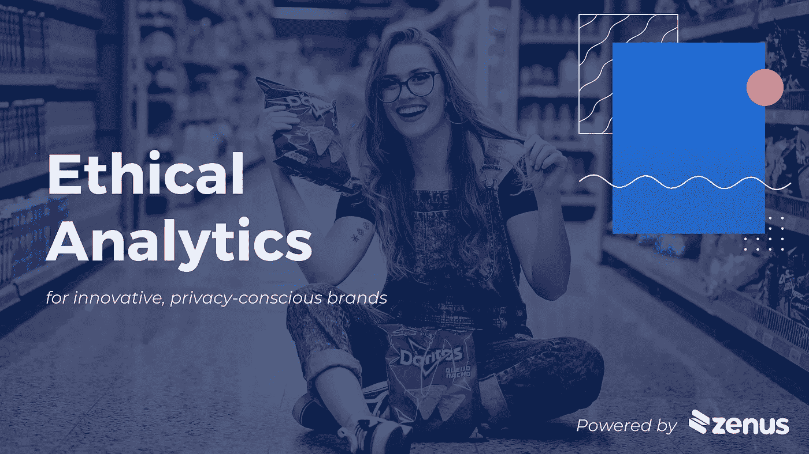
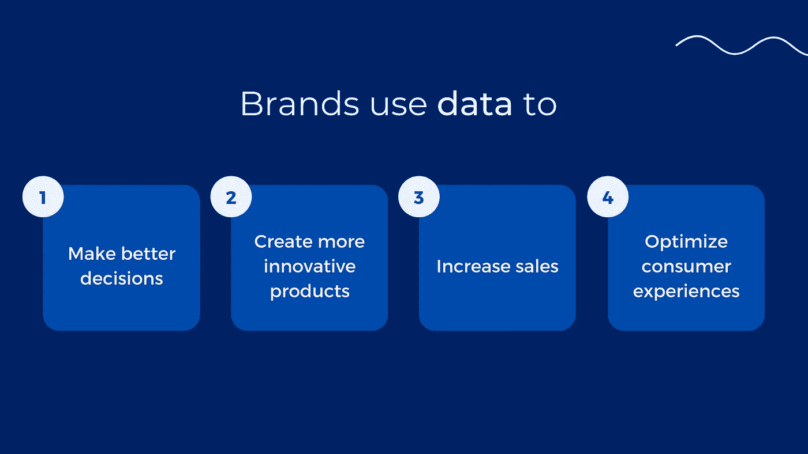
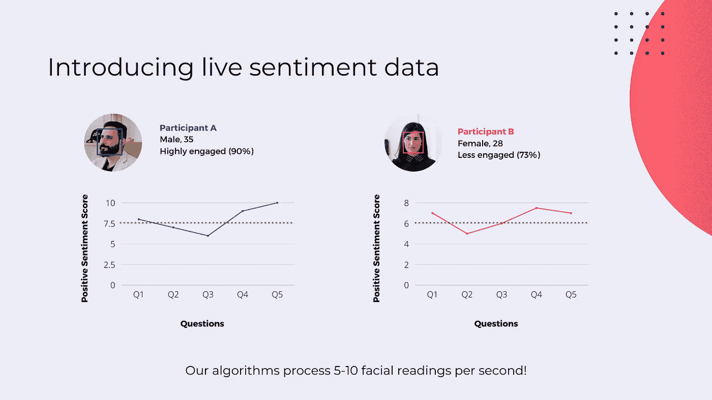
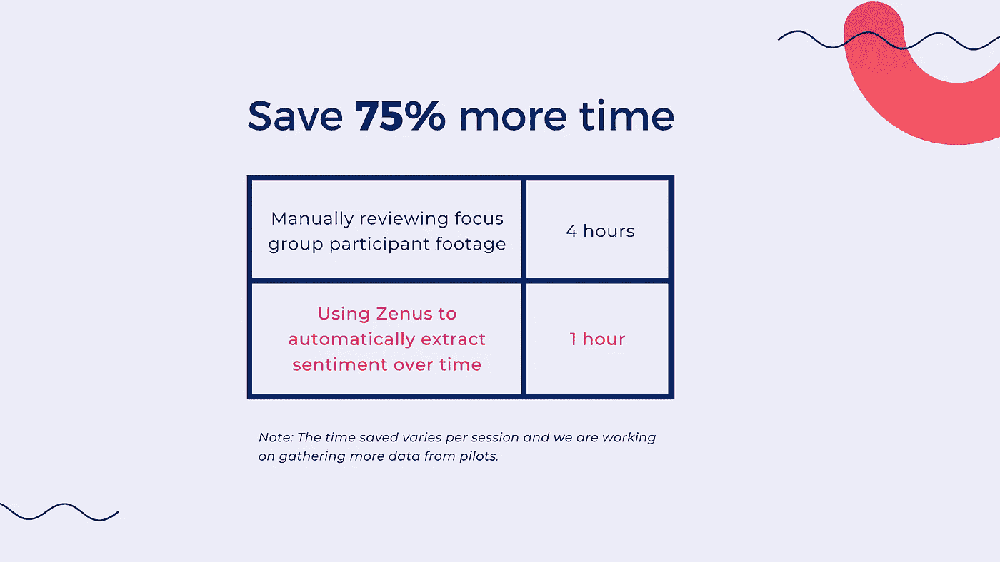
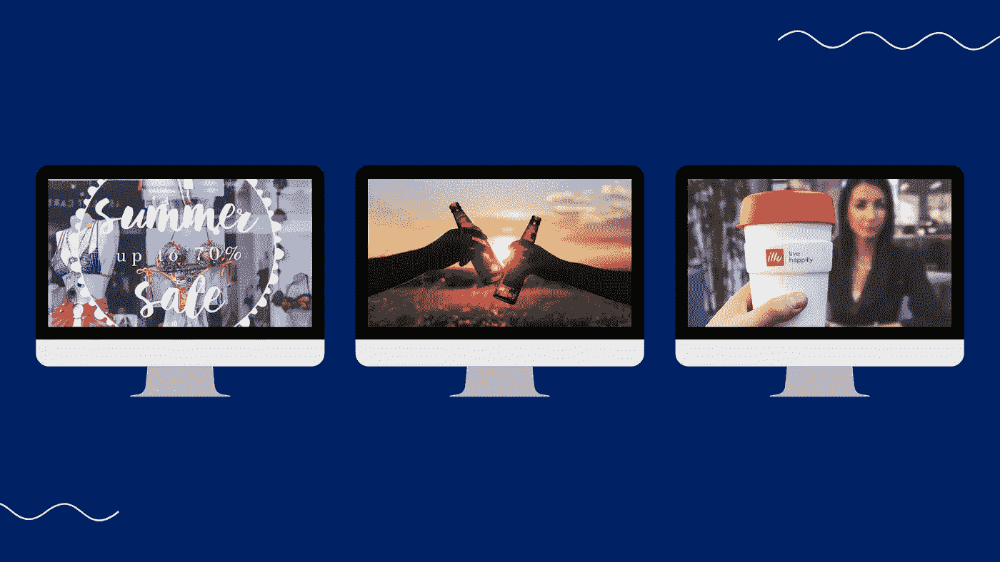

# 隐私意识品牌的伦理面部分析

> 原文：<https://medium.com/geekculture/ethical-facial-analysis-for-privacy-conscious-brands-17ba3dfd8e69?source=collection_archive---------23----------------------->

增强您的市场研究、购物体验和销售

Learn how to collect consumer insights without collecting personal data

根据皮尤研究中心的数据，70%的美国人认为他们的个人数据没有五年前安全。

虽然我们不能重写过去的事件，但我们可以共同努力，创造一个个人数据不被泄露甚至不被收集的未来。

现代消费者更加了解他们选择购买的品牌。与此同时，品牌需要**数据**来增加销售，创造更好的产品，并推动决策。

Data-driven decision making is key for growth

这就是我们介绍道德面部分析能力的地方。

# 什么是伦理面部分析？

> 92%的消费者表示公司必须主动保护数据。(普华永道)

面部技术本身并不新鲜，但是 Zenus 的奇才们(就是我们！)发现了一种方法来解决主要的工程和隐私挑战，同时为品牌提供全面的分析。我们来分解一下！

**伦理:**指的是消费者数据的收集和处理方式和地点。为了保护人们的隐私，我们的设备只收集总体(组级)见解。例如，在下午 5 点检测到 100 张快乐的脸。数据是在源位置汇总的，不能反向查找个人。个人身份信息(PII)不会被传输或存储。

**:面部分析:**是指对上述数据的实际处理。*面部识别*识别个人身份，而*面部分析*只是检测某个区域的面部。我们稳健的算法每秒检测数百张人脸，准确率超过 95%。品牌获得的洞察包括客流量、[积极情绪](/mlearning-ai/how-to-collect-in-store-retail-analytics-on-a-massive-scale-8d33a68b8212)、人口统计数据(年龄/性别)等等。一个训练有素的系统甚至可以在昏暗的灯光下和戴着面具的情况下检测人脸。

# 品牌如何受益

既然我们已经讨论了什么是道德面部分析，让我们来讨论品牌如何受益。这项强大的技术有广阔的应用前景。下面我们重点介绍三种最常见的使用案例:

1.  小组讨论
2.  个性化显示
3.  店内活动渠道(数据分析)

## **焦点小组**

Granular facial reads of focus group participants

品牌利用焦点小组收集有价值的消费者意见。这种研究方法需要对参与者进行手动且耗时的分析。我们的技术通过捕捉面部微表情来自动化和增强数据收集过程。无论是对话还是产品品尝，您都可以获得每位参与者的真实反应，精确到毫秒。如果一个微笑可以短至 200 毫秒，即使训练有素的人眼也很难发现微表情。

Spend 75% less time transcribing and more time reviewing the data

工作原理:

面向焦点小组参与者安装一台 Zenus 智能摄像机。像平常一样主持你的会议。在我们的仪表板上查看参与者的实时情绪更新，或提取原始的逐秒数据以获得更精细的读数。平均来说，R&D 团队花在抄写上的时间减少了 75%,花在审查实际数据上的时间增加了。

**注:**计算每个参与者的个人情绪得分并归一化。这可以让你对每个参与者的反应进行公平直接的比较。

## **个性化 POP 显示屏**

随着越来越多的人回归实体零售，品牌有机会改善其视觉营销战略和店内体验。

> "超过三分之一的受访者表示，看到售货亭上的广告会影响购物行为。"⁴

购物点(POP)展示用于吸引购物者的注意力并提高品牌知名度。使用 Zenus 技术，品牌和店主可以根据购物者的人口统计数据(年龄/性别)提供个性化广告。这可以让你把一个已经有效的流行展示变成一个无与伦比的广告机器。

Create tailored, interactive displays that catch people’s attention

工作原理:

将我们的视频分析技术与 POP 显示器、端盖甚至橱窗显示器相结合，打造互动体验。待机时，屏幕会显示中性广告。如果一个男性/女性走过，它会立即切换到一个更适合的广告。融入动态照明元素，甚至是一个人工智能聊天机器人，以进一步吸引购物者。最精彩的部分？绝对不会收集任何个人数据。

## **店内活动漏斗**

印象、参与和转化是在线广告世界的关键指标。如果你可以在现实世界中离线访问这些信息，会怎么样？

Watch as Panos (CEO of Zenus) walks us through the funnel dashboard view

品牌目前只能获得店内顾客体验的快照:销售数据。Zenus analytics 通过提供行为洞察，如实时客流量、合格线索、参与度报告、人口统计(年龄/性别)等，填补了这一空白。这为品牌提供了一个更全面的表现视角，超越了销售数据。面部分析还结合了转化数据(如 POS 整合)，为品牌提供了一个完整的店内和亲身体验营销漏斗。

工作原理:

在感兴趣的关键点安装智能摄像头。当购物者在商店中穿行时，我们的设备会处理并提取关于他们购物行为的总体统计数据。通过基于网络的仪表板随时随地访问 12 多项指标。无论是短期的[品牌激活](http://nyfta.org/2020/10/19/why-your-brand-activation-should-be-data-driven)还是永久的商店舰队，公司都可以获得一整套见解，以做出更好的数据驱动型决策。

## 总结

公司不必牺牲客户的隐私来实现重要的商业目标。事实上，即使个性化的店内体验也可以在不收集任何 PII 的情况下创建。

零售业的未来在于人工智能，即道德面部分析。通过利用我们针对焦点小组、个性化展示和店内分析的人工智能解决方案，确保您的品牌经得起未来考验。

点击[此处](https://www.zenus.ai)了解更多关于道德面部分析的信息。

来源

[https://www . pewresearch . org/internet/2019/11/15/Americans-and-privacy-concerned-confused-and-feel-less-control-over-their-personal-information/](https://www.pewresearch.org/internet/2019/11/15/americans-and-privacy-concerned-confused-and-feeling-lack-of-control-over-their-personal-information/)

[https://www . statista . com/statistics/1026890/data-and-privacy-consumer-opinions-in-the-United kingdom-and-Ireland/](https://www.statista.com/statistics/1026890/data-and-privacy-consumer-opinions-in-the-united-kingdom-and-ireland/)

[https://www . Forbes . com/sites/Blake Morgan/2020/06/22/50-stats-showing-why-companies-need-priority-consumer-privacy/？sh=c95901737f61](https://www.forbes.com/sites/blakemorgan/2020/06/22/50-stats-showing-why-companies-need-to-prioritize-consumer-privacy/?sh=c95901737f61)

⁴[https://www . Forbes . com/sites/bradadgate/2021/03/05/getting-shoppers-back-to-stores-post-疫情/？sh=2e8adc4a5b42](https://www.forbes.com/sites/bradadgate/2021/03/05/getting-shoppers-back-to-stores-post-pandemic/?sh=2e8adc4a5b42)