# 使用 Dataprep 在 Google Cloud 上进行 ETL

> 原文：<https://medium.com/geekculture/etl-on-google-cloud-with-dataprep-ab3c4c2e2cd2?source=collection_archive---------16----------------------->

image source: Motionwares blog

*注意:假设读者对大数据和谷歌云平台，或者至少任何云平台是如何工作的有一个基本的了解。*

# 什么是 ETL？

ETL 是指数据集成中的三个顺序步骤:**提取、**转换、**加载**。该过程用于混合来自不同来源的数据，如关系数据库、平面文件、web 服务、RSS 提要、XML、JSON 和物联网设备。在这一系列动作的过程中，从一个或多个源中提取数据，将数据转换成适于分析的统一格式，并将数据加载到数据仓库或任何其他集成数据仓库中。

ETL 使企业能够从各种不同的来源收集大量的数据，并将它们集中在一个单一的集中系统中，并有效地将其转化为可操作的商业智能。

[**提取、加载、转换(ELT)**](https://en.wikipedia.org/wiki/Extract,_load,_transform) 是 ETL 的替代方案，用于在转换阶段之前将数据以原始格式存储在数据湖中。

**Google Cloud data prep**
data prep 由 Trifacta 设计，是一款完全托管的 Google Cloud 数据服务，用于探索、清理、结构化和丰富结构化和非结构化数据。

Dataprep 是高度可视化和交互式的。这允许用户通过将文件转换成表格和可视化表示来可视化地浏览数据。操纵数据变得更加容易，从而加快了整个过程。

数据提取和转换可以是一轮编码，但是这很费时并且容易出错。凭借其开发良好的 UI，Dataprep 建议进行数据转换，并创建一个更有效的工作流，而没有编写代码的麻烦。

为了运行我们的数据处理管道，我们将依赖**谷歌云数据流。** Dataflow 是一个完全托管的服务，用于在[谷歌云平台](https://en.wikipedia.org/wiki/Google_Cloud_Platform)生态系统内执行 [Apache Beam](https://en.wikipedia.org/wiki/Apache_Beam) 管道。它无需服务器，经济高效，速度快，可以处理流和批处理作业。

# Dataprep ELT 流水线架构

打开 Google Cloud 控制台并登录。
您可以点击左上角的导航菜单，查看 Google Cloud 产品和服务列表。

下一步是启用 Dataprep API。在云控制台中，在顶部搜索栏中输入“Dataprep API ”,然后单击 Dataprep API 的结果。

# 第一步:提取过程

在 ETL 过程的第一步中，结构化和非结构化数据被导入并整合到一个存储库中。数据可以从不同的来源提取，例如:

1.  内部环境。
2.  云存储。
3.  数据仓库。
4.  平面文件。
5.  数据库。
6.  应用程序

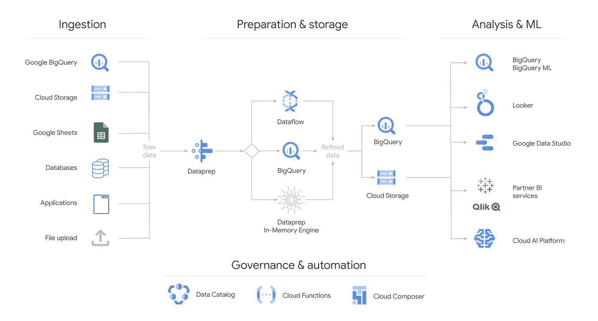

image source: [https://cloud.google.com/dataprep](https://cloud.google.com/dataprep)

单击导航菜单，然后向下滚动到大数据，选择 Dataprep。

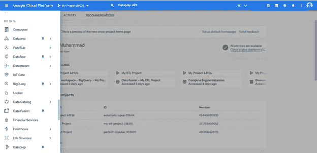

在 Dataprep 主页上，单击 Import Data 开始摄取阶段。

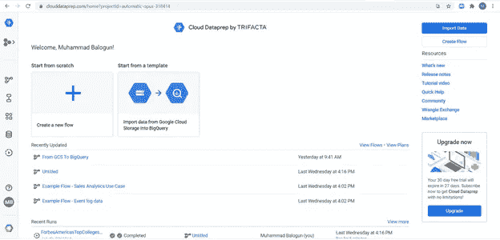

您可以拖放或从本地存储库中选择一个文件，并从 Google 云存储中选择，直接从 Google Sheets 和/或 BigQuery 中选择。

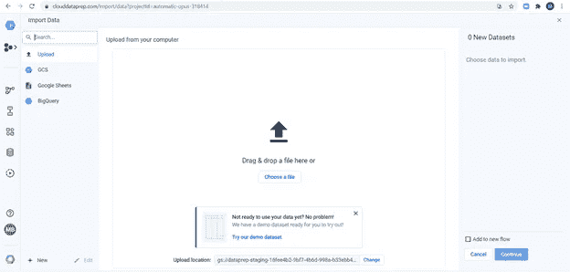

通过单击左下角的 New 按钮，还可以从其他来源访问数据集，如 Microsoft SQL Server、Oracle database、IBM DB2、Cassandra 和 Salesforce 等云应用程序。

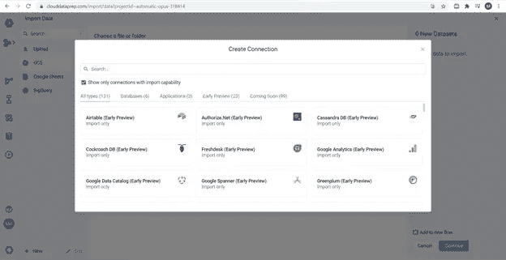

或者，您可以单击“创建流程”开始该过程。

您可以在提取阶段添加来自不同来源的数据。选择您的数据后，点击**在新流程中使用** …

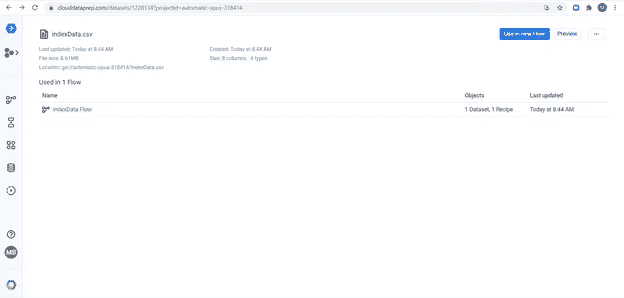

然后，您的数据集以表格和条形图的形式显示在 Transformer 网格中。

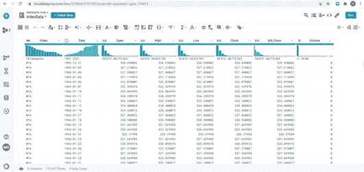

# 第二步:转变过程

转换通常被认为是 ETL 过程中最重要的部分。数据转换创建了不同数据集之间的兼容性，并增强了数据集的质量和完整性。

Dataprep 允许您使用点击交互来轻松清理数据。

Transformer grid 提供了关于数据集的可视信息，并建议在每次用户交互时进行转换。

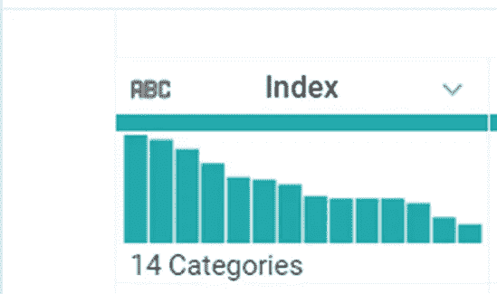

在上图中，数据类型显示在左上角(ABC 表示字符串格式)，列名为 Index。每一列的右上角都有一个列菜单选项，这是启动转换过程的一个简单方法。

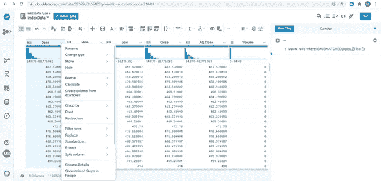

在这些集合的下面是水平的数据质量条，它指示每一列中数据的*健康*状态:灰色点表示丢失的值，而红色表示不匹配的值。条形图聊天以竖条的形式显示数据，竖条的高度与其代表的值成比例。

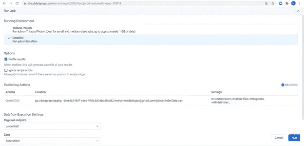

我们使用配方来转换数据集。配方是将所选数据集转换为新数据集的一系列步骤。这些步骤可能包括数学运算、标准化、重复数据删除、清理不匹配和缺失的数据、结构化、排序、合并数据集以及其他提高数据集质量的任务。菜谱使用了[的扯皮语言](https://docs.trifacta.com/display/DP/Wrangle+Language)。

我们还可以选择 transformer 网格顶部的一个图标来转换一个或多个列。

我们可以在右边的面板中查看所有的转换步骤。单击编辑配方以浏览和修改配方。

到目前为止，所有步骤只对浏览器上显示的数据应用转换。所有转换都不会修改源数据。

一旦您对转换感到满意，下一步就是通过使用数据流运行所有配方步骤并发布新的数据输出来生成结果。

点击右上角的**运行**运行所有配方步骤。

选择**数据流**，点击**运行**。

您可以在作业工作区中查看当前作业的状态和进度。您将获得作业的概述、输出目标、配置文件和依赖关系图。您可以使用这些选项卡来了解更多关于已转换数据的信息。

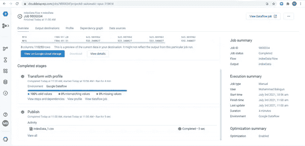

您可以在输出目的地下载结果文件。

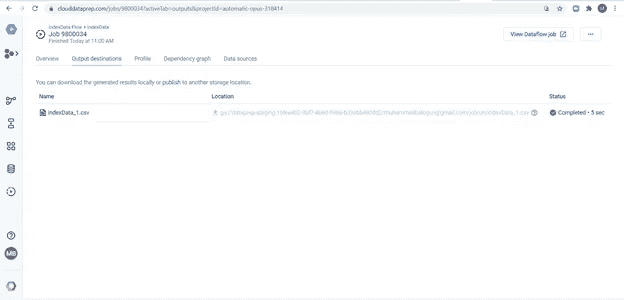

您可以单击 profile 选项卡来验证数据输出是否准确。

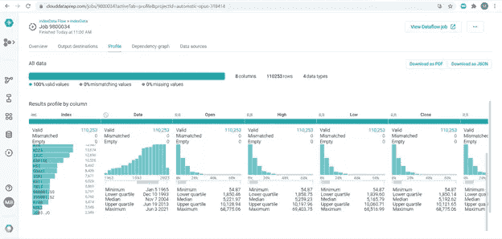

您还可以通过点击右上角的**查看数据流作业**来查看数据流上的作业图表和指标。

# 第三步:加载过程

ETL 过程的最后一步是将转换后的数据加载到新的目的地。你可以把你的新数据加载到 BigQuery，Google Cloud Storage，下载到一个本地主机或者任何其他的集成数据仓库。

默认情况下，您的数据将在此位置发布。要添加新位置，可以使用添加发布操作并选择以不同的文件格式或 BigQuery 表发布。

默认情况下，结果以 csv 格式发布，尽管其他格式也可用。

数据可以一次全部加载(全加载)，也可以按预定的时间间隔加载(增量加载)。

您可以计划定期运行数据准备作业，以保持数据最新。这可以通过在计划流程中添加计划来完成，并决定您希望作业刷新的频率。

有许多因素可以决定满载或递增负载的选择。无论是哪种情况，如果选择“满负荷”选项，建议您在非高峰时段运行作业，以获得更好的性能。增量加载可以在其他时间运行。

希望会有一个关于如何在数据流上安排作业的综合帖子。