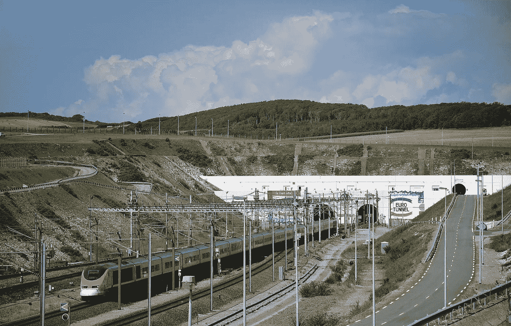

# 欧洲隧道:当成功意味着灾难

> 原文：<https://medium.com/geekculture/eurotunnel-when-success-spells-disaster-6e470fe321d?source=collection_archive---------2----------------------->

## 通车 25 年后，隧道在经济上变得可行的前景变得暗淡

Eurotunnel with a Eurostar high-speed train (source: [Wikimedia Commons](https://commons.wikimedia.org/wiki/File:TGV_TMST_3011-2_-_Sortie_Tunnel_sous_la_Manche_à_Coquelles.jpg))

在许多情况下，看似人类成就和创造力奇迹的大型项目被证明是经济灾难。英吉利海峡隧道——欧洲最长的水下铁路隧道…