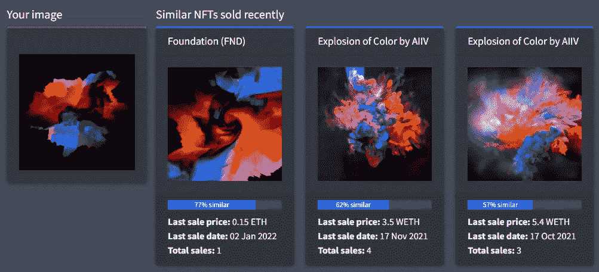
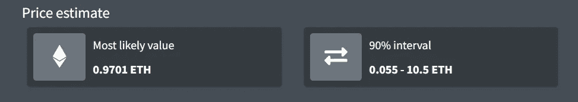
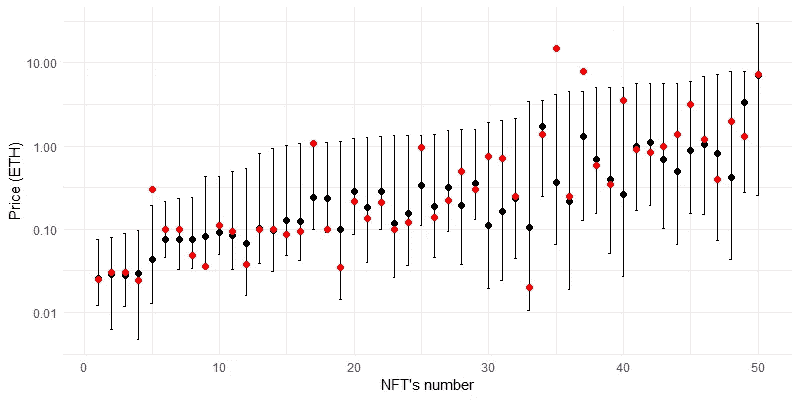

# EvaluateNFT:帮助数字艺术家和 NFT 投资者做出定价决策

> 原文：<https://medium.com/geekculture/evaluatenft-helping-digital-artists-and-nft-investors-to-make-pricing-decisions-4d3455407b9?source=collection_archive---------7----------------------->

## 众所周知，作为不可替代代币交易的数字艺术品很难定价。EvaluateNFT 旨在借助机器学习来解决这个问题

Photo by [Richard Horvath](https://unsplash.com/@orwhat?utm_source=medium&utm_medium=referral) on [Unsplash](https://unsplash.com?utm_source=medium&utm_medium=referral)

# 艺术 NFT 是一种低流动资产类别，很难定价

不可替代代币的全球市场最近出现了爆炸式增长。2021 年[的 NFT 交易总额达到 220 亿美元](https://www.theguardian.com/technology/2021/dec/16/nfts-market-hits-22bn-as-craze-turns-digital-images-into-assets)，高于 2020 年的 1 亿美元。这一卷主要是被归类为*艺术*和*收藏品*的非艺术收藏品(Hays 等人 2021)；[纳迪尼等人 2021](https://www.nature.com/articles/s41598-021-00053-8) 。

然而，快速浏览一下 [OpenSea](https://medium.com/u/b7346f3882bb?source=post_page-----4d3455407b9--------------------------------) 上的[艺术版块](https://opensea.io/collection/art)就会发现，艺术 NFT 供过于求，其中大部分从未售出。原因有很多，包括市场营销不足，缺乏艺术家的社交媒体存在，缺乏粉丝，*错误的定价*等。([cryptomogle](https://medium.com/u/80313ea56e23?source=post_page-----4d3455407b9--------------------------------)[2021](/@cryptomoogle/why-your-nft-may-not-sell-fa662a684993))。即使一件艺术品真的卖出去了，它也不太可能在短期内再次转手。[纳迪尼等人 2021](https://www.nature.com/articles/s41598-021-00053-8)；[帕克](https://medium.com/u/8d5f72453c55?source=post_page-----4d3455407b9--------------------------------)2021。从这个意义上说，艺术 NFT 类似于传统艺术品( [DrFazal](https://medium.com/u/475c9dfc2de6?source=post_page-----4d3455407b9--------------------------------) [2019](https://drfazal.medium.com/collectable-art-the-most-inflationary-illiquid-asset-class-2aff3bbe1c5e) )。

再加上它们与生俱来的独特性，艺术品 NFT 的高流动性使得它们很难有效定价。反过来，这阻碍了非金融交易的整体采用，并阻碍了基于该资产类别的新金融产品的开发(如 NFT 指数、非金融交易债券承销等)。—参见[Emmons](https://medium.com/u/f1e5e0ad560e?source=post_page-----4d3455407b9--------------------------------)2020，[2021](https://mirror.xyz/0x82FE4757D134a56BFC7968A0f0d1635345053104/7H7NJWxVNZfYC4aIeJ6_wZ6LT1JtM_a1y5RZv4X1VNc)；[海斯等人 2021](https://docsend.com/view/yfq9898d9ixz73qt) 。

本文介绍了一个基于机器学习的艺术品估价平台 [EvaluateNFT](https://evaluatenft.io/) 。我们在 [Next Game Solutions](http://nextgamesolutions.com/) 的团队开发了 EvaluateNFT 来*帮助数字艺术家和 NFT 投资者做出明智的定价决策*。我们关注一个特别具有挑战性的问题——预测从未交易过的艺术品的价格。

# 艺术品非功能性交易的估价可以用不同的方式进行，每种方式都有其优点和缺点

## 在线拍卖

[OpenSea](https://medium.com/u/b7346f3882bb?source=post_page-----4d3455407b9--------------------------------) 、[rarable](https://medium.com/u/9992ae165478?source=post_page-----4d3455407b9--------------------------------)、 [Foundation](https://foundationapp.pw/) 、 [LooksRare](https://looksrare.org/) 等平台上的线上拍卖。是销售艺术品最常见的方式。虽然使用在线拍卖是发现市场参与者愿意为一件数字艺术品支付的价格的自然方式，但由于上述原因，许多艺术品仍然没有售出。

其中一个原因是错误的要价，这可能会阻止潜在的买家。一方面，过高的价格可能会吓退许多囊中羞涩的散户投资者。另一方面，不必要的低价可能会被投资者视为对该批拍品缺乏兴趣(也意味着将来转售该批拍品获利的机会较低)。

此外，在线拍卖经常遭受价格操纵，如*洗盘交易*(虚增交易量)和*抬价竞价*(串通投标人人为抬高价格)。价格操纵的结果是，投资者有可能为相应的非功能性交易支付过高的价格，并在以后进行二次销售时遇到困难( [Hays 等人，2021](https://docsend.com/view/yfq9898d9ixz73qt) )。

## 基于评估的估价

当涉及到传统(实物)艺术品、古董、房地产、收藏葡萄酒和其他类似的低流动资产时，专家评估是一种常见的估价机制。

为拍卖行工作的专业评估师通常会根据多种因素为艺术品提供低估价和高估价，这些因素包括艺术家的身份、艺术品的年代、签名、材料、尺寸、稀有程度、主题等。他们还会将正在评估的艺术品与最近在拍卖会上出售的*类似物品*进行比较，并说明当前的市场需求([奥布里等人 2019](https://damore-mckim.northeastern.edu/wp-content/uploads/2019/04/Northeastern_Spaenjers.pdf)；[贝利 2020](https://hdsr.mitpress.mit.edu/pub/1vdc2z91/release/2) )。重要的是，这种方法可以让人们获得一个合理的价格估计，即使是首次投放市场的艺术品。

对 2016 年和 2017 年从[佳士得](https://www.christies.com/en)和[苏富比](https://www.sothebys.com/en/)售出的超过 195，000 件拍品的[回顾性分析显示，实际锤子价格分别有 41%和 37%的时间落在评估者的高估价和低估价之间。这一结果表明，基于评估的估价确实在大量情况下提供了准确的估计。](https://mearto.com/accuracy-of-sothebys-and-christies-estimations-revealed)

几个组织(如[鉴定局](https://appraisalbureau.com/home/#nft)、[NonFungible.com](https://nonfungible.com/services/collectors)、[塔莫伊金艺术基金](https://worldart.news/2021/04/04/worlds-1st-nft-appraisal-system-developed-and-offered-exclusively-by-the-tamoikin-art-fund-seeking-partnership/))和[个人专家](https://kunst-gutachter.de/en/nft-valuation/)现在为非艺术信托提供鉴定服务。然而，评估会受到专家经验和个人偏见的严重影响。人工评估也很慢，很贵，并且受到专家可用性的限制([Aubry et al . 2019](https://damore-mckim.northeastern.edu/wp-content/uploads/2019/04/Northeastern_Spaenjers.pdf)；[贝利 2020](https://hdsr.mitpress.mit.edu/pub/1vdc2z91/release/2) )。已经有一种尝试(“Upshot One”应用程序)通过从一组分散的、匿名的评估人员那里汇总对非交易资产的评估来克服这些缺点，这些评估人员在经济上受到激励以给出诚实的评估( [Emmons 2020](https://blog.upshot.io/an-efficient-price-mechanism-for-nfts-efb078dde580) )。不幸的是，在写这篇文章的时候，Upshot One 似乎还在开发中。

## 基于机器学习的自动估价

鉴于市场上有大量的非艺术基金，显然需要对其价值进行自动化和可扩展的评估。毫不奇怪，最近使用机器学习开发了许多这样的自动化系统。例子包括但不限于， [NFTBank](https://nftbank.ai/) 、[结果](https://app.upshot.xyz/)、[深度 NFTValue](https://deepnftvalue.com/) 、[十二宫 NFT](https://zodiacnft.art/#/appraisal) 、[NFT evaluations](https://nftvaluations.com/)和 [Ginoa](https://ginoa.io/) 。

这些系统在其成熟度和底层机器学习方法方面有所不同(例如，参见[Emmons 2021](https://mirror.xyz/0x82FE4757D134a56BFC7968A0f0d1635345053104/dHNbc5bE8hnXB3xtjZInZ7TApKrE-S8QcexXrcj2QPo)；[莱克](https://medium.com/u/1b573bb17e68?source=post_page-----4d3455407b9--------------------------------)[2021](/nftbank-ai/how-to-value-items-in-nft-projects-part-1-a87be8bcb21d)；[亚科文科](https://medium.com/u/5ad679c18236?source=post_page-----4d3455407b9--------------------------------) [2021](https://moscow25.medium.com/predicting-cryptopunk-prices-the-case-for-jpegs-e4fc0f0fafd1) 。然而，它们中的大多数都是相似的，因为它们目前都专注于频繁交易的 NFT 收藏(例如，Cryptopunks、Bored Ape Yacht Club、Meebits 等)。)，其单个项目可以通过离散的特征来描述(例如，“背景”、“衣服”、“眼睛”、“毛皮”、“帽子”和“嘴”，在无聊猿游艇俱乐部的情况下)。由于这些明确定义的特征和历史价格的可用性，实际上经常有可能[非常准确地](https://docs.upshot.xyz/upshot-api/contract-addresses)预测各个项目的未来价格([Emmons 2021](https://mirror.xyz/0x82FE4757D134a56BFC7968A0f0d1635345053104/dHNbc5bE8hnXB3xtjZInZ7TApKrE-S8QcexXrcj2QPo)；[莱克](https://medium.com/u/1b573bb17e68?source=post_page-----4d3455407b9--------------------------------)[2021](/nftbank-ai/how-to-value-items-in-nft-projects-part-1-a87be8bcb21d)；[亚科文科](https://medium.com/u/5ad679c18236?source=post_page-----4d3455407b9--------------------------------) [2021](https://moscow25.medium.com/predicting-cryptopunk-prices-the-case-for-jpegs-e4fc0f0fafd1) 。这一观察结果符合采用机器学习对实物艺术品进行估价的结果([Aubry et al . 2019](https://damore-mckim.northeastern.edu/wp-content/uploads/2019/04/Northeastern_Spaenjers.pdf)；[贝利 2020](https://hdsr.mitpress.mit.edu/pub/1vdc2z91/release/2) )。

虽然将最初的重点放在具有可识别特征的高流动性收藏品上是完全合理的，但今天市场上的大部分 NFT 艺术品既不能用这种离散的特征来描述，也没有任何销售历史(例如，参见 OpenSea 上的 [Art Blocks collections](https://opensea.io/collection/art-blocks) )。这就是我们的平台[evaluate ft](https://evaluatenft.io/)发挥作用的地方。

# 评估模仿传统的艺术评估过程

如上所述，评估实物艺术品的鉴定专家通常会

*   评估艺术品各种*关键特征*，
*   将其与之前出售的*类似物品*进行比较，以及
*   说明当前*市场需求*。

EvaluateNFT 的目标是在预测没有销售历史的 NFT 的价格时模仿这一传统过程。这是按如下方式完成的。

## 提取查询图像的关键特征

在其当前的实现中，EvaluateNFT 通过将*查询图像*(即被评估的 NFT 艺术品)传递通过[卷积神经网络](https://en.wikipedia.org/wiki/Convolutional_neural_network)并获得该图像的[矢量表示](https://rom1504.medium.com/image-embeddings-ed1b194d113e)来实现这一点。这里的假设是，查询图像的视觉属性(在其矢量表示中编码)是其市场价值的主要决定因素之一。当然，这是一个相当强的假设，因为可能有许多其他重要的驱动因素，如作者的身份、图像属于某个流行收藏、作者试图出售该图像的背景等。然而，现有的研究表明，视觉属性确实是影响艺术品市场价值的一个重要因素([Aubry et al . 2019](https://damore-mckim.northeastern.edu/wp-content/uploads/2019/04/Northeastern_Spaenjers.pdf)；[纳迪尼等人 2021](https://www.nature.com/articles/s41598-021-00053-8) 。

## 找到相似的最近售出的艺术品

具有查询图像的视觉特征的矢量表示使得人们能够执行**的相似性搜索。*在 EvaluateNFT 中，这种搜索是针对成千上万个 NFT 的向量表示的索引进行的，这些 NFT 之前已经交易过，因此其价格历史是已知的。用于构建该指数的数据是通过 API 从 OpenSea market place 获取的。*

*搜索操作返回最多三个最相似的图像，以及它们的相似程度、最后销售日期、最后销售价格和迄今记录的销售总数的信息。图 1 展示了搜索结果的样子。重要的是，EvaluateNFT 对最近*(即过去几个月内)售出的 NFT 执行相似性搜索。这种方法增加了比较的相关性，因为它考虑了当前的市场需求和价格趋势。**

****

**Figure 1\. EvaluateNFT returns up to three artworks that are similar to the query image.**

## **估计查询图像的价格**

**最后，我们使用专有的预测模型，根据相似性搜索返回的类似 NFT 的最后销售价格和其他数据点来估计查询图像的价格(以 [ETH](https://en.wikipedia.org/wiki/Ethereum) 表示)。**

**重要的是，我们的模型不仅产生了*点估计*(即最可能的价格)，而且产生了 90% *预测区间*(即真实价格有 90%的概率可能处于的区间；图 2)。这个区间的下限和上限代表了评估人员通常提供的价格范围。拥有这样的预测区间在实践中至关重要，因为它可以让艺术家和 NFT 投资者了解报告估值的不确定性，从而做出更明智的定价决定。**

****

**Figure 2\. EvaluateNFT produces a point estimate and a 90% prediction interval for the price of the query image. The price estimates shown here were obtained based on the search results presented in Figure 1.**

# **EvaluateNFT 产生合理的价格估计，但仍有改进的空间**

**我们使用以下两个指标来评估 EvaluateNFT 对没有销售历史的艺术品进行预测的准确性:**

*   ***中位数* [*相对误差*](https://www.wikihow.com/Calculate-Relative-Error) (MRE)对点位价格的估计；**
*   **[*预测区间的经验覆盖*](https://www.bryanshalloway.com/2021/03/18/intuition-on-uncertainty-of-predictions-introduction-to-prediction-intervals/) ，即来自维持数据集的观察值的百分比实际上落在它们各自的 90%预测区间内。**

**为了计算这些指标，我们使用了对 2022 年 2 月初首次售出的 330 件 art NFTs 的维持数据集的预测。**

**此维持数据集上的 MRE 构成了 ca。 **40%** 。这意味着由我们的模型生成的点价格估计值通常误差不超过 40%。该值大大高于[结果平台](https://app.upshot.xyz/)中使用的预测模型的 MREs [报告值](https://docs.upshot.xyz/upshot-api/contract-addresses)(8%–19%)。然而，结果模型产生高流动性集合的价格估计，因此不能与我们没有销售历史的 NFT 的结果直接比较。然而，Upshot 报告的 MRE 仍然有助于进行比较，因为它们可以作为额外准确性的指标，通过将销售历史记录纳入 NFT 的定价模型，可以潜在地获得额外的准确性。**

**我们的模型的预测区间显示了 92% 的经验覆盖率，这与理论上的 90%非常接近。可以说，从实用的角度来看，这个令人鼓舞的结果比模型在 MRE 方面的表现更重要。与单点估计相比，统计上可靠的预测区间提供了对被评估艺术品的可能价格的更有用的洞察。**

**图 3 显示了从维持数据集中随机选择的 50 个 NFT 的定价模型产生的点估计及其 90%预测区间(注意 log *Y* 标度)。可以看出，大多数预测区间相当窄，这意味着该模型对于真实价格的位置相当确定。**

****

**Figure 3\. Point estimates (black dots) and their 90% prediction intervals (black “whiskers”) produced by our pricing model for a sample of 50 NFTs from the holdout dataset. The red dots are the actual first-sale prices of these NFTs. Notice that some of the red dots fall outside the respective prediction intervals. This is to be expected as the prediction intervals are supposed to correctly capture 90% (not 100%) of all cases.**

**然而，一些区间非常宽，反映了真实价格的高度不确定性。例如，图 3 中第 50 个 NFT 的预测下限是 0.26 ETH，而上限扩展到 31.15 ETH(参见图 2)。围绕某些预测的这种高度不确定性是模型所训练的艺术品之间极高(然而是自然的)价格变化的结果。需要对有助于解释这种差异和进一步改进模型的因素进行额外的研究。我们的团队一直致力于这样的改进，我们将继续在 Medium 上发布。**

# **结论**

**[EvaluateNFT](https://evaluatenft.io/) 是一个新的、基于机器学习的艺术品估价平台。它的建立是为了解决一个特别困难的问题——预测以前没有卖出去的艺术品的价格。目前市场上有数以千计的此类休眠艺术品，我们希望 EvaluateNFT 将有助于激活这些尚未开发的资产，并推动 NFT 和区块链技术的进一步采用。**

**现在，前往 [evaluatenft.io](https://evaluatenft.io/) 试试吧！我们在 [Next Game Solutions](http://nextgamesolutions.com/) 的团队希望听到您对我们如何改进 EvaluateNFT 的反馈和建议——只需[给我们留言](mailto:info@nextgamesolutions.com)或在本文下发表您的评论。**

## **您可能还喜欢:**

** [## 区块链的数据科学:了解当前形势

### 数据科学和区块链技术是天生的一对。但是有多少和什么样的真实世界…

towardsdatascience.com](https://towardsdatascience.com/data-science-for-blockchain-understanding-the-current-landscape-c136154c367e)  [## 检测区块链交易时间序列的结构变化

### 使用 R

medium.com](/geekculture/detecting-structural-changes-in-blockchain-transaction-time-series-cf62bfea3e2a)  [## 8000 种加密货币的市场数据，触手可及

### 介绍 geckor，一个查询 CoinGecko API 的 R 包

medium.com](/geekculture/market-data-for-8000-cryptocurrencies-at-your-fingertips-c76d7e8f43ca)**