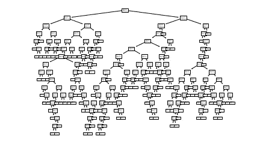
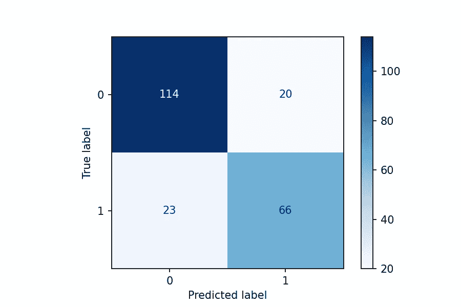
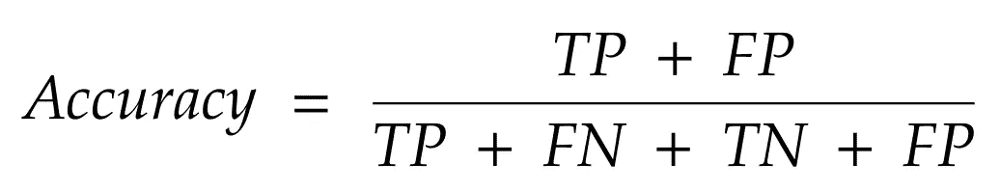
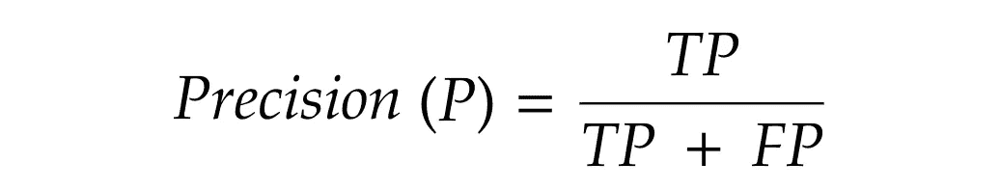
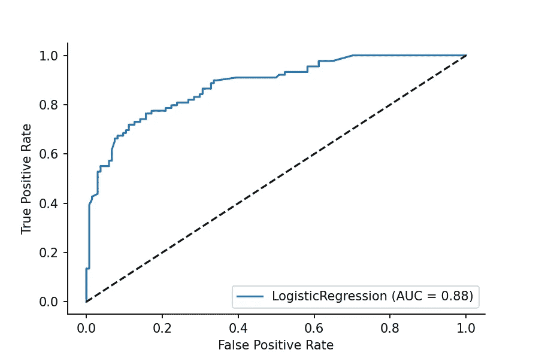

# 评估分类模型

> 原文：<https://medium.com/geekculture/evaluating-classification-models-3a28a569962c?source=collection_archive---------37----------------------->

## 常用工具和指标概述

# 介绍

分类模型代表了机器学习世界中一些最有用和最实用的算法。从预测是否会下雨到确定信用卡欺诈活动，这些类型的模型使用提供给它们的可用数据将它们的预测输出分成两组或更多组。多年来，出现了各种解决分类问题的策略，包括逻辑回归、决策树、k 近邻等等。

Example of a complex decision tree. Image by author.

考虑到可用的不同策略，一个自然的问题出现了:**如何对分类模型进行评估和相互比较？**虽然构建分类模型的实际过程将留待下次讨论，但本文将带您了解一些最常用的评估工具和指标。

# 混乱矩阵

在深入研究通常用于回答上述问题的具体指标之前，我们必须首先了解基础知识。为了简单起见，我们只看二进制分类模型，但是要知道后面的概念也很容易扩展到多维数据。混乱矩阵，顾名思义，相当简单。它向我们展示了一个模型的预测是如何与真实和正确的值相比较的，也就是所谓的基本事实。让我们看一个例子:

Example of a confusion matrix. Image by author.

这里有四个要点，每个象限一个:

1.  **真阴性(TN)** 是预测标签为 0 且真实标签也为 0 的预测数。这可以在左上象限找到。注意:在这个上下文中，负数不一定意味着负值，而是代表真/假、开/关、活/死等的二进制的一部分。
2.  **真阳性(TP)** 与真阴性相似，但有相反的标记(在本例中为 1)。这可以在右下象限找到。
3.  **假阴性(FN)** 是模型预测为负值，而实际情况为正值的场景。这可以在左下象限找到。
4.  **假阳性(FP)** 是模型预测为正值，而实际为负值的情况。这可以在右上象限找到。

这四条信息可以以各种方式组合起来，以描述模型的整体有效性。现在，让我们来看看其中的一些具体指标。

# 韵律学

## 准确(性)

准确性是最直观的度量标准，本质上是对一个模型的预测有多少是正确的——也就是说，与事实相符——的一种度量。

Formula for Accuracy. Image by author.

虽然看起来除了这个度量标准之外没有什么需要，但是仅仅依靠准确性来评估分类模型是错误的。考虑下面这个经常被引用来强调这个问题的场景:100 个病人正在接受一种疾病的测试，而这种疾病只发生在 1%的人身上。一个预测根本没有人患病的模型在技术上有 99%的准确率，但对于实际发现被感染的病人来说完全没有用！

使用在混淆矩阵示例中找到的值，准确度大约为 80.72%。

## 精确

一个模型的正预测包含真阳性和假阳性。Precision 查看所有预测的正值，并确定百分之多少是真正的正值。

Formula for Precision. Image by author.

使用在混淆矩阵示例中找到的值，精度将大约为 76.74%。

## 回忆

Recall scores 模型预测的真实阳性数占真实阳性总数的百分比。

Formula for Recall. Image by author.

在“准确性”一节中提到的疾病场景的背景下考虑这个指标。虽然准确率为 99%，但召回率将为 0%，因为将有零个真阳性和一个假阴性(实际患有疾病的患者，但模型自动分类为没有患病)。

使用混淆矩阵示例中的值，召回率大约为 74.16%。

## F1 分数

精确度和召回率呈现出相反的关系，它们的相对重要性完全取决于所处理的数据的上下文。一般来说，在这两个指标上都获得高分是更好的选择。F1 分数代表精确度和召回率的调和平均值，并作为两者之间平衡的衡量标准。

Formula for F1 Score. Image by author.

作为使用调和平均值而不是算术平均值的结果，只有当*精度和召回都具有高值时，F1 分数才能具有高值。任何一个指标的低值都会显著降低 F1 分数。*

*使用在混淆矩阵示例中找到的值，F1 分数将约为 75.43%。*

# *ROC 曲线*

*对于那些希望有更直观的分类模型评估方法的人来说，你很幸运。受试者工作特征(ROC)曲线绘制了假阳性率与真阳性率的关系，并提供了模型有效性的快速解释可视化。*

**

*Example of an ROC Curve. Image by author.*

*斜虚线表示随机猜测的模型。具有某种程度预测能力的有用模型将具有向左上方延伸的曲线。在本例中，逻辑回归模型的性能用蓝线表示。多个模型迭代和类型的 ROC 曲线可以覆盖在同一个图上，以便快速比较。通过[积分](https://en.wikipedia.org/wiki/Integral)测量曲线下面积(AUC ),仍可对单个曲线进行定量评估和比较。在上面的例子中，这个值用“AUC = 0.88”表示。完美分类所有值的模型将具有 1.00 的 AUC。*

# *结论*

*理解这些工具和指标以及它们之间的区别是正确评估分类模型性能的关键。不同的问题需要调优模型，根据对领域最有意义的东西来优化不同的度量。虽然存在其他评估方法，但本文涵盖的主题提供了一个坚实的基础。*

*如果你喜欢这篇文章，请留下👏或者有任何反馈的评论！*

***Github**:[https://github.com/tjkyner](https://github.com/tjkyner)
**中**:[https://tjkyner.medium.com/](https://tjkyner.medium.com/)
**LinkedIn**:[https://www.linkedin.com/in/tjkyner/](https://www.linkedin.com/in/tjkyner)*