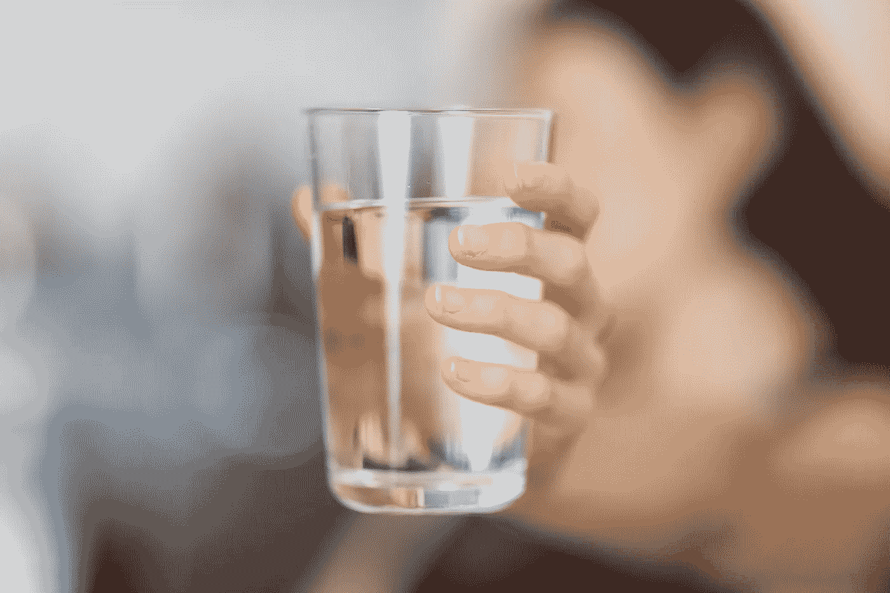

# 纽约市饮用水质量评价

> 原文：<https://medium.com/geekculture/evaluating-drinking-water-quality-of-new-york-city-3269f2abb691?source=collection_archive---------8----------------------->

Source — unsplash.com

# 概观

安全的饮用水供应是一个国家经济和公民健康的支柱。一个无法获得安全饮用水的国家的公民面临着感染水传播疾病的高风险。 [CDC 估计，在美国，传染性水传播疾病的医疗费用高达 33 亿美元，超过 6，600 例死亡与水传播的疾病有关。](https://www.circleofblue.org/2020/world/cdc-estimates-costs-of-waterborne-pathogens-in-the-united-states/) [报道称美国拥有世界上最安全的饮用水](https://www.cdc.gov/healthywater/drinking/public/water_quality.html)

即使美国的自来水供应被认为是世界上最安全的，水污染仍然会发生。有许多可能的污染源，包括:

*   污水排放
*   天然存在的化学物质和矿物质(例如，砷、氡、铀)
*   当地土地使用做法(例如，化肥、杀虫剂、牲畜、集中饲养作业)
*   制造过程(例如，重金属、氰化物)
*   现场废水处理系统故障(例如，化粪池系统)

# 为什么要试水？

美国环境保护署(EPA)经常违反[饮用水法规](https://www.epa.gov/dwreginfo/drinking-water-regulations)进行水质检测。以下是世界卫生组织和美国环保署推荐的几个参数值

*   **残余游离氯(mg/L)** —饮用水中残余游离氯的最大允许世卫组织值为 5 mg/L
*   **浊度(NTU)** —美国环境保护署将成品饮用水的最大浊度水平设定为 1 NTU
*   **氟化物(毫克/升)** —美国环境保护署(EPA)设定饮用水中允许的最大氟化物含量为 4.0 毫克/升
*   **大肠菌群(Quanti-Tray)(MPN/100 毫升)** —每 100 毫升样品中不得含有超过 10 个大肠菌群
*   **大肠杆菌(Quanti-Tray)(MPN/100 毫升)** —指定泳滩的大肠杆菌含量在任何一个样本中不应超过每 100 毫升 88 个，或超过 60 天内三个样本的几何平均值 47/100 毫升

# 目标

虽然专家可以更好地了解水质参数，但我们可以依靠数据集中提供的阈值、最小值或最大值来分析纽约市的饮用水质量测试

# 数据

*   ka ggle source—[https://www . ka ggle . com/meet nagadia/饮用水质量分布监控](https://www.kaggle.com/meetnagadia/drinking-water-quality-distributionmonitoring)
*   原始来源—纽约市开放数据门户—【https://data.cityofnewyork.us/d/bkwf-xfky 

# 调查的结果

*   **没有一个样品的残留游离氯值超过世卫组织建议的数值**
*   **11%的样品认为水因浊度高而不适于饮用** — 5924 份样品，即 11%的样品被发现有高浊度。在这些样本中,“SS-S/S 19 Ave，btw 41&Steinway Sts，60 inch”的样本数量最多，超过了规定的风险限值。
*   **0.13 %的样本表明水因大肠菌群值高而不适于饮用** —发现 70 个样本的大肠菌群值高于每 100 毫升饮用水 10 个的推荐量。
*   **7%的地点的水不适合饮用** —纽约有 55 个地点同时存在高浊度和高大肠杆菌数量

# 源代码—笔记本

**有关如何进行探索性数据分析的详细信息，请参阅我的笔记本上的** [**我的 kaggle 个人资料。**](https://www.kaggle.com/aashaymaheshwari/evaluating-drinking-water-quality-of-new-york-city)