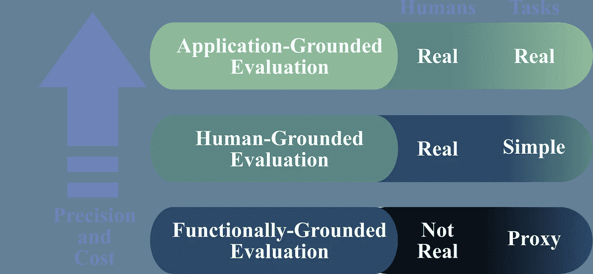

# 评估机器学习模型的可解释性

> 原文：<https://medium.com/geekculture/evaluating-interpretability-in-machine-learning-models-a9fd4ebb1b10?source=collection_archive---------23----------------------->

如何评价一个没有统一度量的东西？提示:通过设计合适的实验。

Photo by [**Ksenia Chernaya**](https://www.pexels.com/@kseniachernaya?utm_content=attributionCopyText&utm_medium=referral&utm_source=pexels) from [**Pexels**](https://www.pexels.com/photo/opened-box-with-optical-lenses-and-rim-5752267/?utm_content=attributionCopyText&utm_medium=referral&utm_source=pexels)

解读的艺术不是播放写好的东西——巴保罗·卡萨尔斯

**可解释性**是可解释人工智能的黄金标准(XAI)。这种品质**有助于人类理解一个经过训练的模型在其输入或算法**中的任何变化的行为。我已经讨论过[不应该与可解释性](/geekculture/the-explainability-interpretability-paradigm-the-whys-and-the-why-nots-f71f3587d2b0)混淆。

在我们坐在雪橇上了解可解释性的复杂性之前，我们应该清楚地理解这个概念对不同的研究者有不同的意义。例如，它可以帮助决定一对生成的解释中哪一个更好。而在另一种情况下，如果某个属性发生变化，它可以简单地显示预测变化的概率。此外，对于模型的可解释性，没有一个通用的度量标准。事实上，一个问题可以拥有各种数据和主题(如人类)，增加了可解释性评估的复杂性。

那为什么要为这样一种无形的品质而烦恼呢？虽然可解释性本身是一个复杂的概念，它有助于理解，从而实现 ML 系统的重要需求。

可解释性有助于实现:

*   *公平性*通过显示某个类别没有被模型明确或隐含地歧视
*   *隐私*通过保护数据中的敏感信息，并确保其与预测质量之间的权衡不会受到损害
*   *可靠性*通过确定输入变化对模型性能的影响
*   *因果关系*通过将现实生活中的不可预测性映射到预测的输出变化
*   *可用性*通过向用户提供信息和进一步增强的可能性
*   最后也是最重要的，*信任*，通过向模型提供参数来获得人类用户的信任。

可解释性有助于定性地确定是否满足了其他需求——如公平性、隐私性、可靠性、健壮性、因果性、可用性和信任度。

> 等等！我部署的模型不提供可解释性。那还不够吗？

答案取决于系统的运行是否需要一个解释才能正常工作。如果你的模特正在给库存的时尚产品贴标签，或者决定洗车场的水量，或者甚至在汽车导航系统上预测最佳路线；经过大量测试后，输出是否需要人工干预？此外，错误的计算会导致什么严重的后果吗？而且模型小说解决的问题，没有经过现实生活的检验吗？如果你对这三个问题的回答都是否定的，那么这意味着对上述模型的解释是不必要的，你可以松一口气了。

**对可解释性的需求源于对问题理解的*不完整*** ，或者系统在错误预测的情况下引起重大反响。在这些情况下，受试者或观察结果中的未知因素可能会导致特定的差异。现在想象一个导弹制导系统，它使用人工智能根据地形、大气密度和其他属性来计算导弹轨迹。您可能会面临有限数据集的不完整性，或者传感器数量不足。这种现实生活中的不可预测性会产生重大后果，从而使得可解释性对于理解输入变化对输出的影响非常重要。

**尽管没有可解释性的具体标准，但可以根据手头问题的性质进行评估，并相应地设计实验。**因此，根据经过深思熟虑的研究，可解释性评估可分为三种方法。这些因素取决于任务的复杂性，包括从一般问题到精确问题，以及对人工干预的依赖性，以确定可解释性。因此，为了设计一个有人类受试者或他们缺席的实验，对于给定的任务，评估分类可以这样划分

Image redrawn by the author. Icons by [Freepik](https://www.freepik.com/vectors/background)

基于应用的可解释性评估包括真实应用中的人体实验。一个例子可以是用于从医学图像中检测前列腺肿瘤的存在和发展的诊断模型。衡量预测正确性的最好方法是通过医生的评估。这种评估背后的意图是确定人类产生的解释在多大程度上帮助了试图完成任务的其他人。

以人为基础的可解释性评估涉及对更简单的人类受试者的实验，而任务与实际应用有一些相似之处。当目标社区不可用时，或者使用抽象任务来测试评估时，使用这种评估。例如，[向一群外行人展示混合图像，其中突出显示的区域是由一个判别模型](/geekculture/explaining-a-trained-model-d750c70b60a8)生成的，还有一些是添加了噪声的，并询问他们哪些图像最好地突出了像这样的区别特征。这样的练习将衡量人类是否正确理解了模型的真实输出。

以人为基础的评估可以向受试者提供一对解释，他们必须选择一个被认为更好的解释，如上例所示。还可以向受试者提供解释和输入，并且受试者必须模拟模型的输出。例如，受试者需要根据工作场所的参数来预测员工的流失。最后，这种评估可能涉及一个更复杂的练习，向受试者提供一个解释、一个输入和一个输出；然后他们会被问及可能导致输出变化的变化。例如，该模型预测了某些工作场所参数的员工流失。现在，受试者会建议改变某些参数来防止磨损。输入变量的范围可以从改变交通津贴到是，或者玩弄小吃的可用性。

**基于功能的可解释性评估不涉及人类受试者**。这些实验之所以吸引人，是因为与人类受试者相关的成本，或者这项任务可能不是面向人类的。这种评估可以用于显示已经被证明是可解释的模型的预测性能的改进(可能通过一些先前的人类实验)。

来源:

[迈向可解释机器学习的严谨科学](https://arxiv.org/abs/1702.08608)