# 评估你的假设，理解偏差和方差

> 原文：<https://medium.com/geekculture/evaluating-your-hypothesis-and-understanding-bias-vs-variance-86512cce4253?source=collection_archive---------18----------------------->

Photo by [Brett Jordan](https://unsplash.com/@brett_jordan?utm_source=medium&utm_medium=referral) on [Unsplash](https://unsplash.com?utm_source=medium&utm_medium=referral)

这是我正在从事的系列的第五部分，其中我们将讨论和定义介绍性的机器学习算法和概念。在这篇文章的最后，你会找到这个系列的所有前几篇文章。我建议你按顺序读这些。原因很简单，因为我在那里介绍了一些概念，这些概念对于理解本文中讨论的概念至关重要，我将在许多场合引用它们。

到目前为止，我们已经研究了数据预处理，以及三种**监督学习**算法。即线性回归、逻辑回归和神经网络。今天，我们将看看如何评估我们的模型，以及讨论偏差与方差的概念。

让我们开始吧。

# 评估你的假设

在以前的帖子中，我们经常使用“非常适合”或“训练有素”这样的术语。但是，对于一个模特来说，训练有素到底意味着什么呢*？例如，考虑以下几点:*

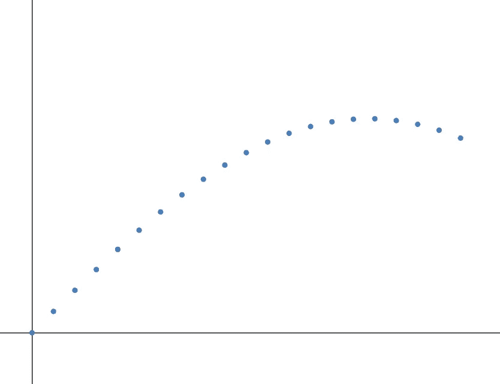

**Figure 1:** Points On A Graph

下面的线用来拟合这些点:

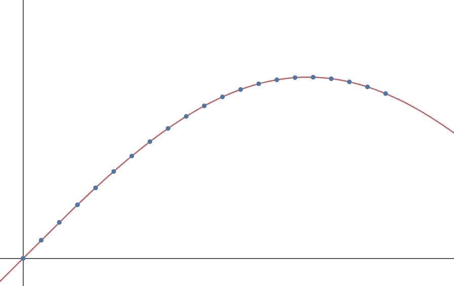

**Figure 2:** Overfitted Model

**Figure 3:** RightModel

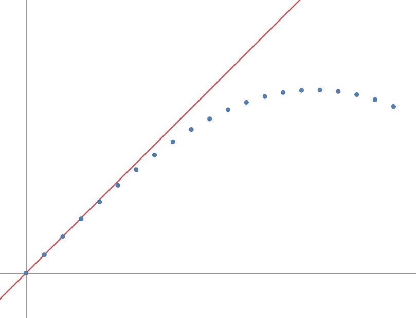

**Figure 4:** Underfitted Model

你认为哪种型号是合适的？答案是**图 3** 中画的模型。为了理解这一点，现在假设我们增加了一个新的点。该点在下图中用红色表示:

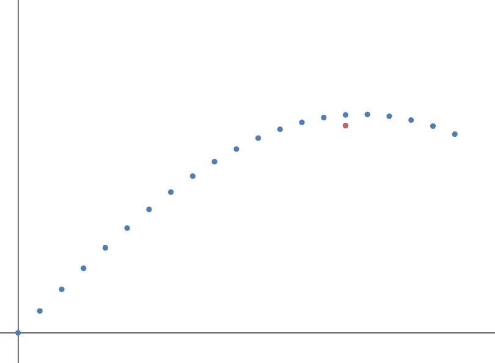

**Figure 5:** Same Graph withRandom Point Inserted

添加该点后，什么图形会产生最小的误差？不需要任何方程，直观上我们看到使用**图 3** (蓝线)所示的线时，点到线的距离是最小的:

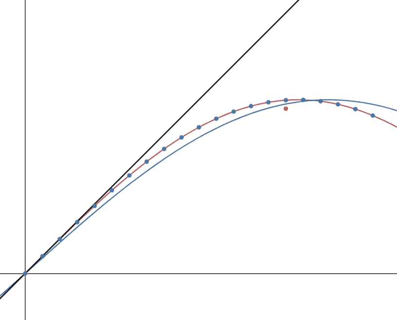

**Figure 6:** All Graphs Compared

这里显示的概念是**过拟合、欠拟合和一般化**。在**图 2** 中，我们的模型过度拟合。这意味着它完全符合我们的训练点，使我们没有成本函数产生的误差。有些人可能认为这是一件好事。然而，我们在图 6 中看到，这种类型的模型不适用于未来数据。毕竟，训练我们的模型的全部意义在于，我们可以用它来预测新的、前所未见的数据的输出。在**图 4** 中，我们的模型装配不足。这条线在描述我们的数据点方面做得很差，给我们留下了一个由成本函数计算的大误差。我们的目标是用一条线来描述我们的训练数据的一般行为。**图 3** 就是这样完成的。这不仅可以很好地描述我们的训练数据的行为，还可以适应新的信息。

视觉上，这是有道理的。但是我们如何对更复杂的问题进行这样的分析呢？与我们刚刚看到的例子不同，我们有两个以上的特征来描述我们的数据点，或者，比两个特征的阶数更高。

## 训练集对测试集对验证集

您有以下功能:

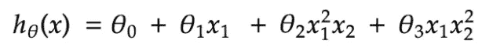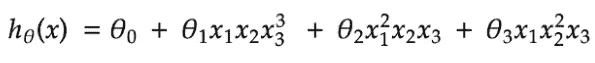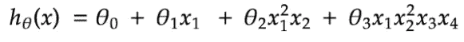

**Figure 7:** Three Different Possible Functions

您想要决定哪一个`h`最适合您的数据点。我们在过去已经看到了如何使用我们的数据来训练这些模型。训练数据将为我们提供将最小化我们的成本函数的`Theta`向量。然而，我们没有提到的是，如何检查我们训练的模型将在新数据上工作。

我们通常不需要整个数据集来训练我们的模型。大多数时候，我们将数据集分成三个不同的部分:

1.  **训练集:**这些数据正是我们一直在做的——训练我们的模型，使它的`Theta`向量最小化成本函数。我们通常使用数据集的 60%来训练我们的模型。
2.  **验证集:**该集用于调整和决定我们的模型要使用的参数。不要混淆参数和我们的`Theta`向量。他们不一样。我们这里所指的参数是任何改变模型行为的输入。一个例子是我们在梯度下降中看到的**学习率** `alpha`，或者我们在使用神经网络时看到的**正则化项** `lambda`。这些参数可以被调整来改变我们的模型的行为。我们通常使用数据集的 20%作为验证数据。
3.  **测试集:**这是用来测试我们的模型在新的、以前从未见过的数据上表现如何的集合。我们通常使用数据集的 20% T21 作为验证数据。

很多时候，人们会交替使用术语“验证”和“测试”。应该明确的是**测试集和验证集是不同的。验证集不应该用来测试你的模型，否则，你会引入偏见，我们稍后会看到。**

现在我们知道了不同类型数据集之间的区别，下面是在不同模型之间进行选择的一般框架，如图**图 7** 所示:

1.  使用训练集训练您的模型
2.  **使用验证集交叉验证**，即使用您的验证集计算您所有训练模型产生的误差。输出最小误差的模型是您选择用于测试的模型
3.  使用测试集测试模型，以查看它在处理新数据时的表现

假设现在，你已经完成了上面强调的前两步。测试模型的时候到了，但出乎意料的是，它在测试集上表现不佳。你有什么选择？以下是一些例子:

*   获取更多培训示例
*   尝试更小的功能集
*   尝试附加功能
*   尝试多项式特征
*   增加或减少λ(正则项)

任意决定采取这些步骤中的哪一个是非常耗时的。了解了偏差与方差，我们就能更好地理解为什么我们的模型表现得不够好，从而选择下一步要采取的正确步骤。

# 偏差与方差

当我们的图表欠拟合时，我们说我们有一个高的**偏差**。在高偏差的情况下，我们的成本函数`J`的值对于我们所有的数据集都将是高的，无论是训练、验证还是测试。**图 4** 是一个高偏差图形的例子。

当我们的图过度拟合时，我们说我们有一个高方差。由于方差较大，该模型在我们的训练数据上表现良好，但在我们的验证和测试数据上表现不佳。如果你理解过度拟合的概念，这应该是非常直观的。由于我们的模型完全符合我们的训练点，我们的成本函数`J`没有理由为我们的训练数据输出高值。然而，对于我们的验证和测试数据，过度拟合的模型不够一般化，因此我们的成本函数将指示高值，比我们的训练集高得多。**图 2** 是一个方差很大的图的例子。偏差和方差由我们使用的函数的复杂性控制。对于非常高阶的函数，我们有过拟合的机会。相反，对于非常低阶的函数，我们有欠拟合的机会。

通过理解某些模型特征对我们的偏差方差比的影响，人们可以更好地理解采取什么步骤来从他们的模型中获得更好的结果。我们将要分析的所有图表都取自 Coursera 上[吴恩达](https://medium.com/u/592ce2a67248?source=post_page-----86512cce4253--------------------------------)的机器学习课程介绍。

## 多项式次数

首先，对于训练集和验证集，让我们比较我们得到的误差与我们的函数多项式的次数:

**Figure 8:** Cost vs Polynomial Degree

对于低阶函数，无论数据集如何，图表都显示非常高的误差值。我们之前提到过，在这种情况下，我们有一条欠拟合曲线。随着函数的次数增加，训练集的误差减小。有道理，对吧？通过更复杂的曲线，我们可以训练我们的数据，以更好地了解我们的数据点。但是如果我们的模型*完全*拟合，那么就会出现过度拟合，如图所示。由于我们的模型过度拟合，它不会对新数据做出正确的反应，并且对于非常高的函数阶数，我们的验证集的误差会增加。我们可以得出两个结论:

1.  如果您的模型呈现高偏差，一个解决方案是增加函数的阶数
2.  如果您的模型呈现高方差，一个解决方案是降低函数的阶数

## 正则化参数

在上一篇文章中，我们非常快速地描述了成本函数中正则化参数的需要，以避免过度拟合。这个参数通过给我们的`Thetas`增加一个额外的权重来工作。梯度下降算法将认识到，它必须努力减少这个增加的权重的值，并使我们所有的`Theta`值减少到足以防止过度拟合。对这种方法的一个警告是，如果我们的正则化参数太大，梯度下降将**大大**减少参数，导致曲线拟合不足。如果λ太小，我们将无法减少大θ的重量，导致曲线过度拟合。我们需要找到*只是*正确的λ。对于训练集和验证集，我们可以将得到的误差与正则化参数进行比较:

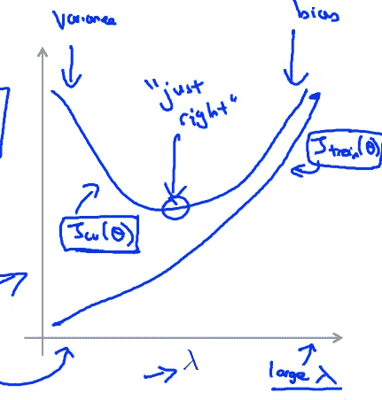

**Figure 9:** Cost vs Regularization Parameter

该图显示的信息与我们刚刚描述的正则化参数完全一致。对于太大的λ，我们的模型将会不合适，导致高偏差和误差。对于过小的λ，我们的模型会过度拟合，从而导致高方差和较小的误差。含义:

1.  如果我们的模型有很大的偏差，我们可以尝试减小正则化参数
2.  如果我们的模型呈现高方差，我们可以尝试增加我们的正则化参数

## 学习曲线

在处理一个糟糕的模型时，我们可以关注的最后一件事是数据集的大小。我们如何断定我们的模型是否因为没有提供足够的训练数据而表现不佳？让我们看两种可能的情况。一种是模型具有高偏差，另一种是模型具有高偏差。

下面的**学习曲线**展示了在我们的模型具有高偏差的情况下，训练集的大小对我们的模型的误差的影响:

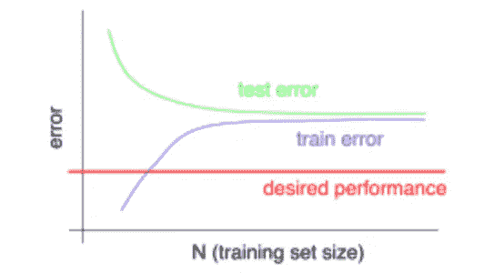

**Figure 10:** Cost vs Training Set Size For High Bias Model

**图 10** 清楚地表明，增加训练集的大小对我们模型的性能没有任何帮助。现在这应该说得通了。如果我们的模型有很高的偏差，那么我们知道它在训练集和测试/验证集上都表现不佳。增加训练集的大小不会有任何影响。虽然测试集上的误差会减少，但它不会以足够高的速度达到我们期望的性能。

下一条**学习曲线**展示了在我们的模型具有高方差的情况下，训练集的大小对我们的模型的误差的影响:

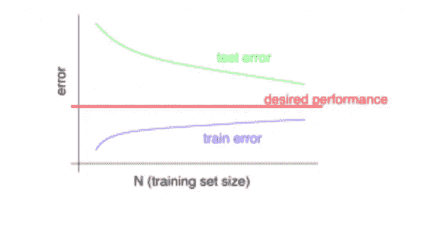

**Figure 11:** Cost vs Training Set Size For High Variance Model

在这种情况下，增加训练集的大小将提高我们的性能。虽然我们的训练误差会增加，但我们的测试误差会减少，留给我们的是一个更一般化的模型。我们的结论是:

1.  对于具有高偏差的模型，添加训练样本不会提高我们的性能
2.  对于具有高方差的模型，添加训练样本将提高我们的性能

# 结论

在本文中，我们看到了如何评估他的模型的性能。我们研究了不同的数据集，以确保我们选择了最好的模型。它不会过度拟合或欠拟合我们的数据，而是以一种能够在新的、从未见过的信息上表现良好的方式进行概括。我们还研究了偏差和方差的概念，以及如何调整超参数以获得最佳偏差方差比。最后，我们讨论了如何使用所有这些概念来决定在处理表现不佳的模型时采取的最佳步骤。

在接下来的文章中，我们将通过介绍支持向量机来结束监督学习部分。在此之前，我留给你以下几点思考:

*   我们讨论了使用验证集如何给模型带来偏差。为什么？
*   仔细研究我们给出的两条学习曲线。它们有意义吗？例如，当我们有很高的偏差时，为什么添加更多的训练数据会增加我们训练集的误差？尝试用一个训练示例拟合一条穿过数据集的线，然后添加另一个训练示例，再添加另一个，直到您注意到我们试图表达的观点。
*   我们的数据集是否总是需要以我们展示的 60%-20%-20%的方式分割？我们应该何时添加/删除不同的拆分？

# 过去的文章

1.  **第一部分:** [数据预处理](https://ali-h-khanafer.medium.com/data-pre-processing-ee81bbe5cc77)
2.  **第二部分:** [使用梯度下降的线性回归:直觉和实现](https://ali-h-khanafer.medium.com/linear-regression-using-gradient-descent-intuition-and-implementation-522d43453fc3)
3.  **第三部分:** [使用梯度下降的逻辑回归:直觉和实现](/geekculture/logistic-regression-using-gradient-descent-intuition-and-implementation-36a8498afdcb)
4.  **第四部分— 1:** [神经网络第一部分:术语、动机和直觉](/geekculture/neural-networks-part-1-terminology-motivation-and-intuition-73675fc43947)
5.  **第四部分— 2:** [神经网络第二部分:反向传播和梯度检测](/geekculture/neural-networks-part-2-backpropagation-and-gradient-checking-4f8d1350fb0b)

# 无耻的插头

*   **推特:**【twitter.com/ali_khanafer2】T2
*   领英:[linkedin.com/in/ali-khanafer-319382152/](https://www.linkedin.com/in/ali-khanafer-319382152/)

# 参考

1.  [吴恩达的机器学习 Coursera 课程](https://www.coursera.org/learn/machine-learning?page=1)
2.  [机器学习掌握:测试和验证数据集之间有什么区别？](https://machinelearningmastery.com/difference-test-validation-datasets/)