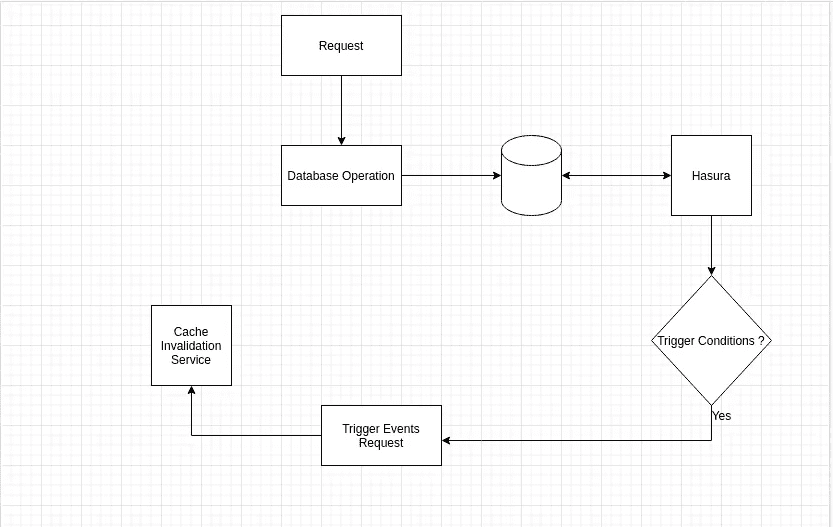
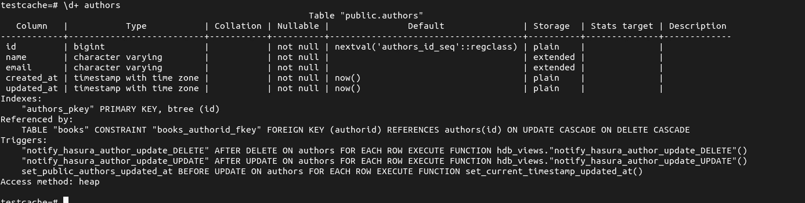
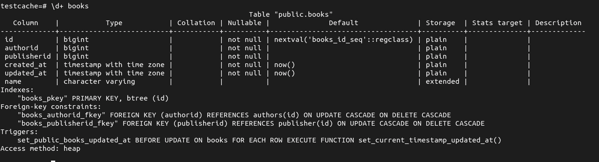
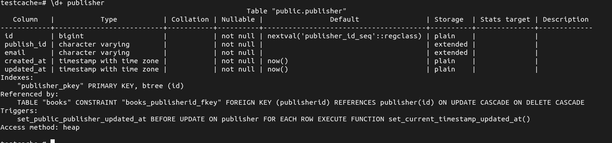
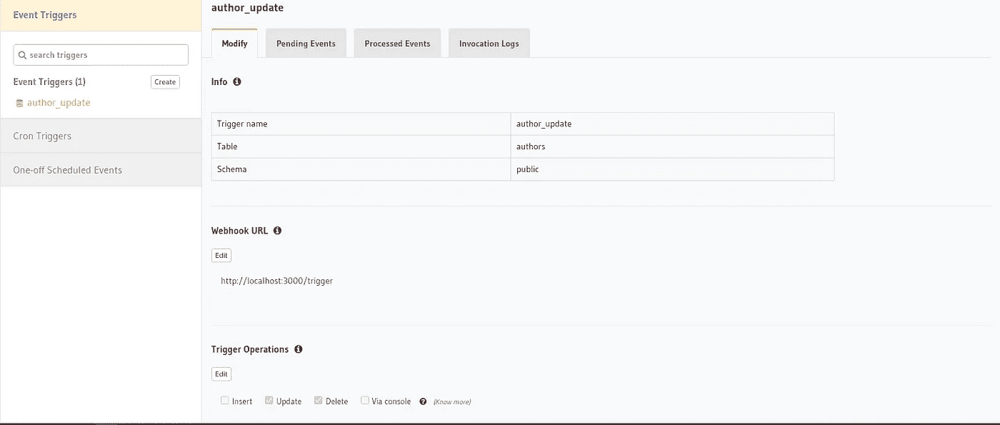
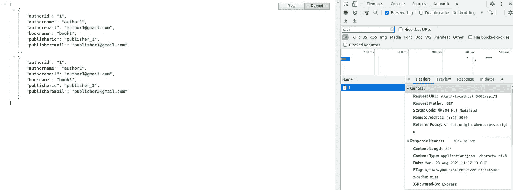
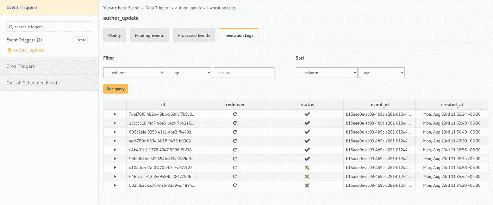

# 使用 Hasura 触发器和 Redis 的事件驱动缓存服务

> 原文：<https://medium.com/geekculture/event-driven-cache-service-using-hasura-triggers-and-redis-9a3eb7192808?source=collection_archive---------28----------------------->



根据维基百科，缓存是，

"缓存是一个存储数据的软件组件，以便将来对该数据的请求可以得到更快的服务；存储在缓存中的数据可能是早期计算的结果，也可能是存储在其他地方的数据的副本。当请求的数据可以在缓存中找到时，发生*缓存命中*，而当不能找到时，发生*缓存未命中*。通过从缓存中读取数据来服务缓存命中，这比重新计算结果或从较慢的数据存储中读取要快；因此，缓存可以处理的请求越多，系统的运行速度就越快。”

在这里，我们将使用 Node.js、Redis 和 Hasura (Graphql)构建一个缓存解决方案。我们正在创建一个简单的 API 端点，它将通过连接两个或多个表来返回一些结果。

这里我们使用 Haura 作为我们的后端服务器。尽管我们使用 Hasura 作为后端，但我们不会在这里使用 Hasura Graphql 端点。我们将使用 express 创建一个单独的 API 端点，用于为将要缓存的数据提供服务。Graphql 缓存超出了本文的范围。

> 在这里，我们将探索如何扩展 hasura 触发器的功能来创建缓存服务。

Nodejs 服务器包含我们将要缓存的 API 端点。API 是两个表连接的结果，这两个表由客户独立修改。

> 我们没有使用任何基于 TTL 的缓存策略，因为我们需要一个事件驱动的解决方案来使缓存无效。总是推荐你的缓存使用 TTL。它将确保密钥总是无效的。

因此，只要连接表达式中的表发生变化，缓存就需要失效。否则，我们将提供陈旧的数据。所以我们的失效必须依赖于数据库模型。作为 CRUD 操作的一部分，我们可以编写几乎所有的失效代码。但是这使得我们的代码分散，几乎无法调试。所以这里我们把复杂的任务交给了 Hasura。这意味着无论何时数据库表级别发生 CRUD，我们都将使用 Hasura 来通知我们。Hasura 有一个特性叫做**触发器**，它可以通过监听一个表的创建、删除和更新操作来扩展你的业务逻辑。

这很好，因为我们可以创建单独的路由/服务来使缓存无效，并在那里写入所有与缓存相关的逻辑。可扩展的清洁解决方案。

所以让我们开始吧。假设您已经根据下面的模式设置了 Hasura 和 Postgres。



上面给出的是我们正在使用的模式的截图。这是非常基本的，不用担心索引和触发器。它们是在使用 Hasura 控制台生成表时自动创建的。

我们使用下面的查询来执行我们将要缓存的 API 端点。这个查询连接了`author, books and publisher`表。基本的东西。

```
SELECT athrs.id as authorid,athrs.name as authorname, athrs.email as authoremail,bks.name as bookname,pbrs.publish_id as publisherid,pbrs.email as publisheremail from authors athrs  inner join books bks ON athrs.id=bks.authorid INNER JOIN publisher pbrs ON bks.publisherid=pbrs.id WHERE athrs.id=:authorId;
```

现在，让我们编写一个中间件，它在收到请求时检查缓存数据，当出现未命中时，它会将请求转发给从数据库获取数据的中间件。

> 在这个实现中，我们将缓存层创建为应用服务器的一部分，而不是一个单独的服务。但是我们可以很容易地把它取出来，作为一个单独的服务进行部署。

给定下面的中间件代码，

现在为我们将要监听的表创建触发器。转到 Hasura 控制台，单击 events 选项卡并创建触发器。每当表上发生插入、更新和删除操作时，我们都可以创建一个触发器。选择您的业务逻辑所依赖的事件。在下面的截图中，我勾选了更新和删除触发操作。在示例中，我只在`author`表上添加了`author_update`触发器。



前往 chrome，打开网址和控制台。现在在网络选项卡上检查标题。在初始加载时，我们可以通过检查标头`x-cache: miss`来查看缓存未命中，如下图所示。



现在再次重新加载，您可以看到标题指示缓存命中，`x-cache: hit`。当缓存未命中发生时，从数据库中提取数据，并将其添加到 Redis 中。下面给出的是截图。


现在我们的缓存正在工作，让我们检查失效策略。更新作者表中的条目。我们可以通过 Hasura 控制台/使用 SQL update 语句进行更新，也可以使用控制台中的编辑功能。将表头更新到 Hasura 控制台后，单击 event 选项卡并选择您已经创建的触发器。在那下面，你可以看到`Invocation Logs`标签页如下图所示。



单击它，您可以看到所有到我们配置的端点的交付尝试。然后到浏览器那里重新加载。现在检查一下，我们可以发现缓存已经失效，再次重新加载时，我们可以看到缓存命中。

我们的缓存失效工作得很好。这个实现看起来简洁高效。您可以根据自己的业务逻辑修改实现。每当创建新条目并预填充缓存时，您都可以运行复杂的查询。此外，您可以完全创建一个单独的缓存失效服务，并将所有逻辑移到那里。

这个教程有点啰嗦，需要哈苏拉的知识。Hasura 是一个很棒的平台，它可以提高你的生产力，并将你的开发成本降低一半。如果你还没查过哈苏拉。请看这里的。

*如果你喜欢我的工作并想支持它，* [*请我喝杯咖啡吧！*](https://www.buymeacoffee.com/sujesht) 回购的代码可以在[这里](https://github.com/sujeshthekkepatt/hasura-redis-express-cache/tree/main)找到。