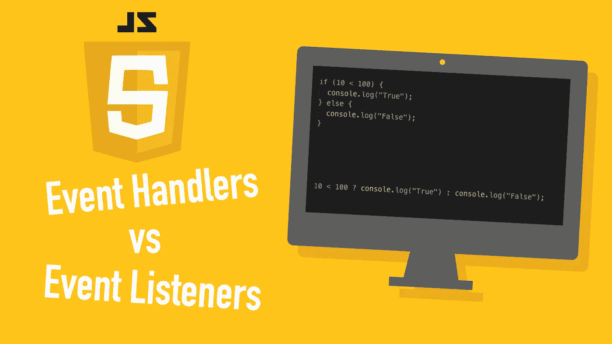

# JavaScript 中的事件处理程序与事件监听器

> 原文：<https://medium.com/geekculture/event-handlers-vs-event-listeners-in-javascript-b4086b8040b0?source=collection_archive---------0----------------------->

## 您知道事件处理程序和事件侦听器之间的区别吗？

Image Credit: Author

在 JavaScript 中，一个*事件*可以是比如一个按钮点击或者鼠标悬停。对事件做出响应是很重要的，比如当点击一个按钮时显示一个模态。