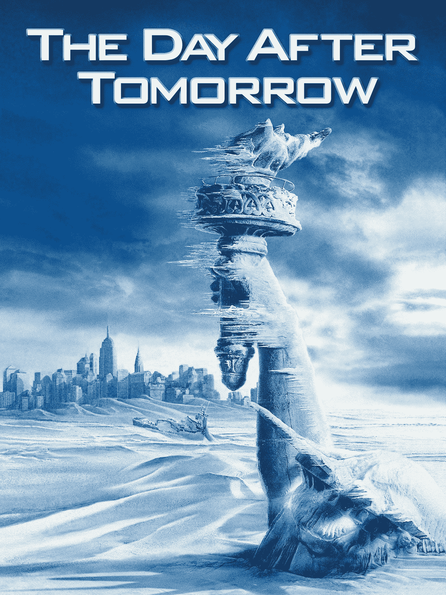
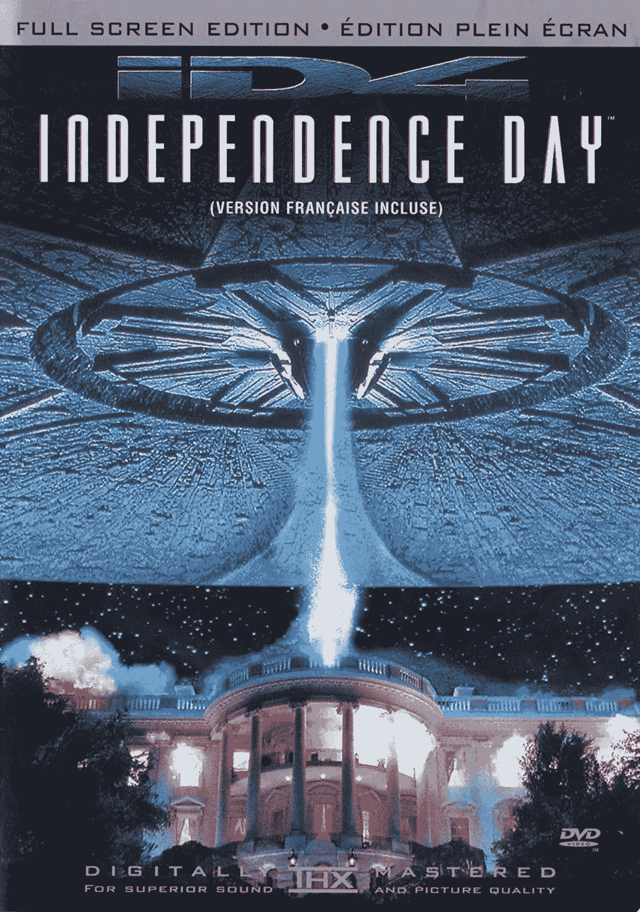
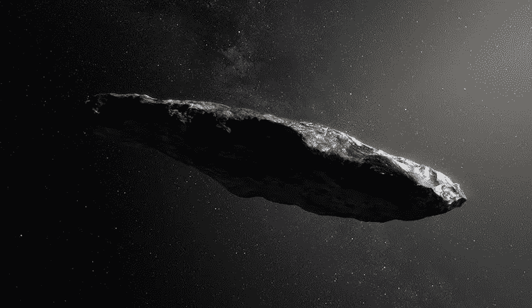
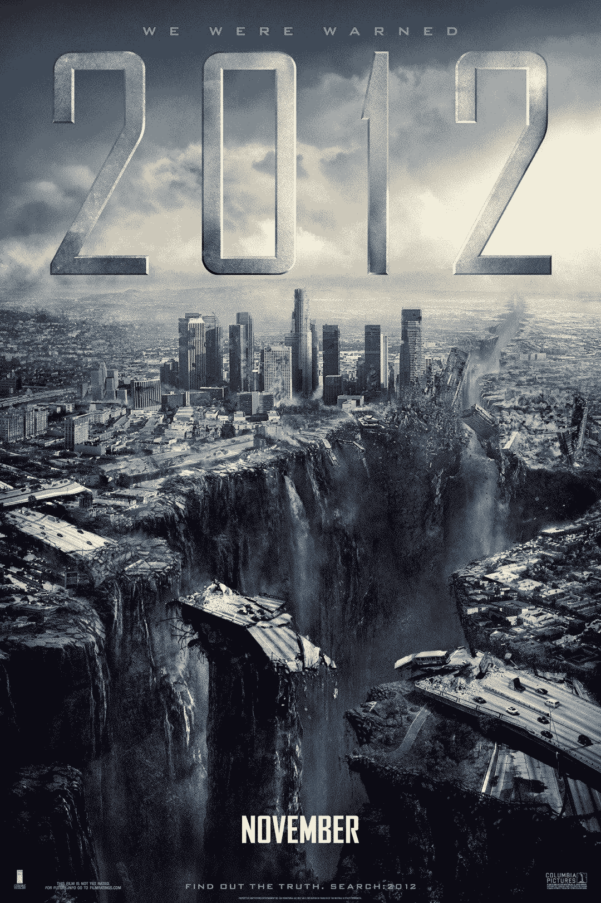
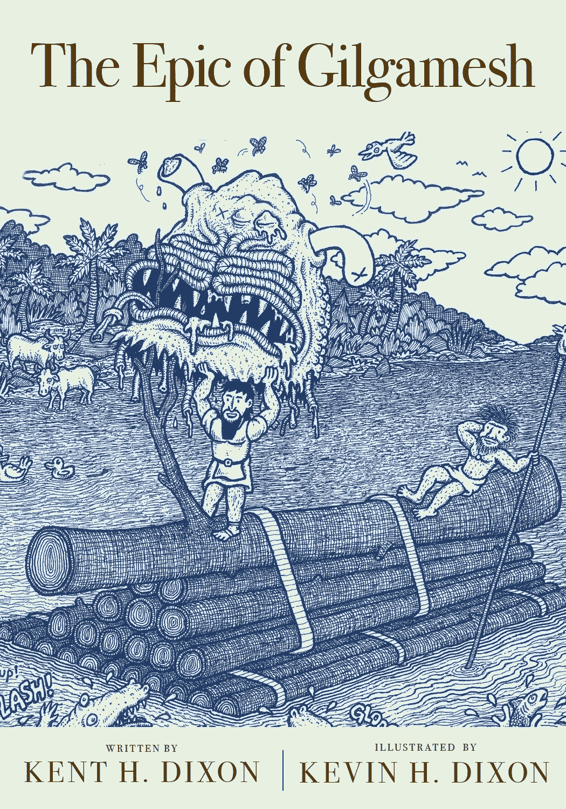
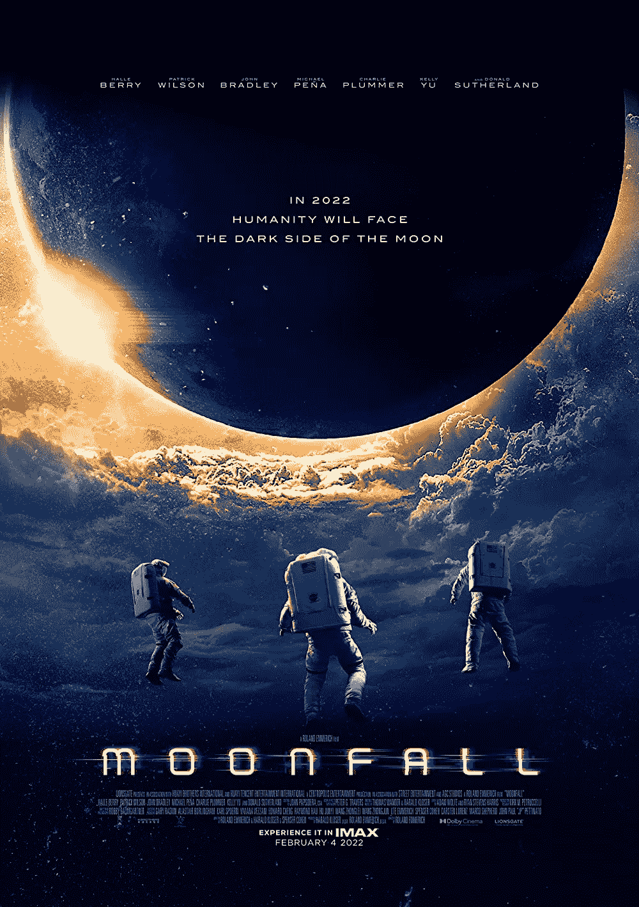
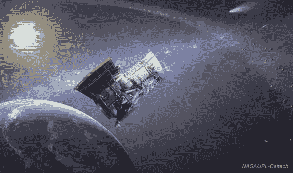

# 想知道这些著名的“末日”电影背后的科学吗？

> 原文：<https://medium.com/geekculture/ever-wondered-the-science-behind-these-famous-doomsday-movies-3a6fe1be4f98?source=collection_archive---------15----------------------->

*气候变化讽刺，* ***不要抬头*** *正式破纪录:它成为网飞历史上单周吸引最多观看时间的电影标题。所以让我们多了解一下这类末日电影背后的科学；它们是如何让我们紧紧抓住座位，让我们相信电影中的场景会真实地发生在现实生活中！*

# **1。**后天(2004)

**关于这部电影**:丹尼斯·奎德饰演杰克，一个气候学家，他预测了一个突然的新冰河时代，但是没有一个气候官员相信他。

Source: IMDB

背后的科学:这部电影描述了如果北大西洋或温盐环流被破坏会发生什么。2015 年的一项研究表明，全球变暖导致这一循环在过去 200 年里减弱了 20%。这可能会引发北大西洋、欧洲和北美的降温。

# **2。独立日(1996 年)**

**关于这部电影:**杰夫·高布伦是一个卫星奇才，他试图警告总统外星人即将对地球发动攻击。

Source: GI

**背后的科学**:2017 年，Pan-STARRS1 望远镜发现了一个不寻常的物体。它沿着一条直线而不是典型的椭圆轨道绕太阳运行。

据推断，它来自太阳系之外，被命名为 Oumuamua。哈佛天体物理学家阿维·勒布甚至称之为外星飞船。2019 年，研究人员让-皮埃尔推测，虽然外星人已经到达地球，但他们还没有联系我们，因为“如果我们知道他们，那将是文化上的破坏。”

Interstellar visitor, Oumuamua. Source: Space

# **3。2012 年(2009 年)**

关于这部电影:在得知世界将于 2012 年终结后，世界领导人开始为社会中被选中的成员的生存做秘密准备。

Source: Film Wiki

背后的科学:中美洲长历法预言了 2012 年世界末日。2012 年，水下考古学家巴拉德考察了土耳其的海岸线，贝壳的碳年代测定显示，公元前 5000 年左右发生了一场巨大的洪水。类似“大洪水”的故事出现在早期的《奥德赛》中，即吉尔伽美什的史诗。

Source: Amazon

# **4。月落(2022)**

**关于这部电影:**据发行人狮门影业说，一种神秘的力量将月球从其环绕地球的轨道上撞了下来，并将它急速送向我们。哈莉·贝瑞扮演的美国宇航局局长乔·福勒试图拯救人类。

**背后的科学**:月球绕地球运行的平均距离为 384400 公里，并对其上的潮汐负责。如果月球向我们坠落，这些相同的潮汐力也会作用于建筑物，将我们一网打尽。

# 5.不要抬头

**关于这部电影:**两位低调的天文学家进行了一次巨大的媒体之旅，以警告人类一颗即将毁灭地球的彗星，并强调了社交媒体时代普通人对科学事实的无知，同时受到了全球政治家的误导。

Source: Netflix

**背后的科学:**电影制作人亚当·麦凯根据著名天文学家艾米·梅恩泽博士的经历拍摄了这部电影。作为美国宇航局近地天体广域红外探测任务的首席研究员，她监督了历史上最大的天基小行星搜寻项目。2020 年 3 月，与该航天器合作的天文学家发现了一颗以该任务命名的彗星，NEOWISE 彗星。

Source: NASA

## 参考资料:

*   有趣的工程学——下面是科学对罗兰·艾默里奇灾难电影的看法
*   [NOS —温盐环流](https://oceanservice.noaa.gov/education/tutorial_currents/05conveyor1.html)
*   [大英百科全书——吉尔伽美什史诗](https://www.britannica.com/topic/Epic-of-Gilgamesh)
*   [Summachar —末日](https://www.stories.summachar.in/author/sampada/page/4/)