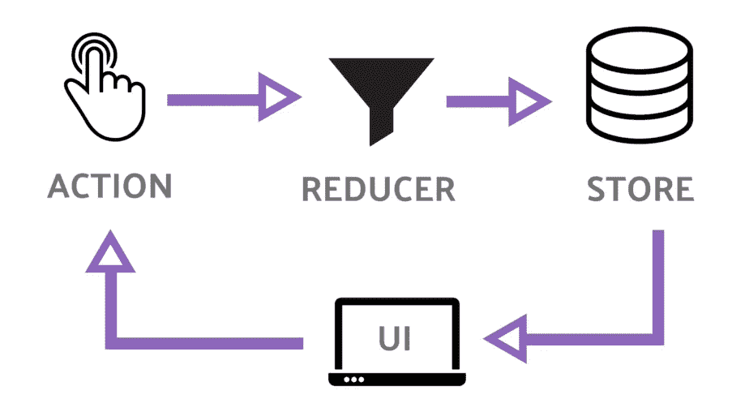
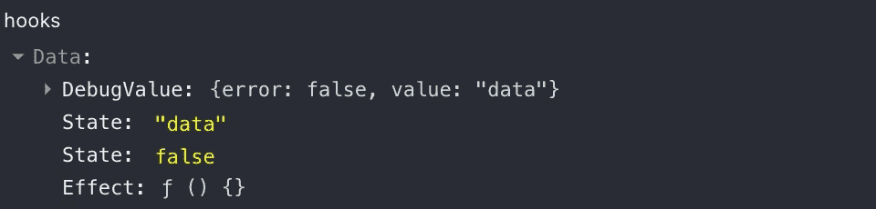

# 每个内置的 React 挂钩

> 原文：<https://medium.com/geekculture/every-built-in-react-hook-943f2735cd01?source=collection_archive---------2----------------------->

使用功能组件时，React hooks API 提供了流控制、状态管理和组件生命周期的功能。

规则很简单:

你不能从一个普通的 JavaScript 函数中调用钩子。

**你只能在 React 函数组件内部调用钩子或者自定义钩子**

钩子函数总是以“*使用”*开头，后面跟一个*“超级能力”*。

有几个内置的 React 挂钩，您可以将它们组合成自定义挂钩，用于应用程序中的特定用例。在本文中，我们将重点关注 React 内置钩子，有 3 个基本钩子在常规应用程序中经常使用，另外 7 个钩子。

## 基本挂钩

*   使用状态
*   使用效果
*   使用上下文

## 附加挂钩

*   用户教育
*   使用回调
*   使用备忘录
*   useRef
*   useImperativeHandle
*   useLayoutEffect
*   useDebugValue

# 1.使用状态

这是 react 中最重要也是最常用的钩子。我们使用这个钩子来存储状态，并在组件内部使用它。

我们用一个表示默认值的参数调用 *useState* 。它将返回一个有状态的值和一个函数来更新这个值。我们可以简单地使用析构语法来检索和命名值和 setter 函数。在下一个例子中，count 是有状态值，setCount 是 setter 函数。

# 2.*使用效果*

作为参数传递给 *useEffect* 的函数将在渲染提交到屏幕后运行。默认行为是在每次渲染后运行，但是您也可以传递第二个参数，该参数是一个依赖项数组。如果你传递依赖数组，你的函数将在数组中的每一项被改变时运行。

在 React 类的上下文中，您可以使用这个钩子获得与*componentidmount*、*componentiddupdate*或*componentidmount*类似的结果，唯一的区别是 *useEffect* 在延迟事件期间被触发。

通常你需要一个清理功能，一个取消所有听众订阅的地方。

*以下示例包含 componentDidMount 和 componentWillUnmount 的类似行为*

*以下示例包含与 componentDidUpdate* 类似的行为

# 3.使用上下文

这个挂钩允许您使用 React Context API，这是一种允许您使用发布/订阅模型(也称为发布-订阅模型)在组件之间共享数据的机制。

您将需要传递一个上下文对象作为这个钩子的参数，它将返回最近的提供者的值。

**创建上下文提供者**

用户上下文—上下文对象

UserProvider —一个函数组件，它在上下文提供者 Provider 中呈现其子级。

**使用上下文提供程序**

此时，UserProvider 的每个孩子都可以使用带有 UserContext 作为参数的 *useContext* 钩子。

您可以在断开连接的组件中使用上下文值，重要的是在组件层次结构中要有上面的提供者。在同一个组件树中可以有嵌套的提供者，每个上下文消费者将从最近的提供者中检索值。

如果你在过去使用上下文消费者，你可能已经使用了消费者组件

useContext 挂钩基本上是消费者组件的一个更干净的替代品。

# 4.用户教育

这个钩子用于高级状态管理。它是 *useState* 的替代，您可以使用这个特殊的钩子来遵循 Redux 模式。

不是直接更新状态，而是调度一个动作，该动作将触发一个 reducer 函数，reducer 函数计算并确定下一个状态。最后，状态被传递给 UI 组件。

# 5.使用回调

在 react 组件中定义函数时，会为该组件的每次渲染创建一个新的函数对象。在某些情况下，您需要记住这个函数来防止这种行为。

# 6.使用备忘录

这个挂钩可以帮助优化计算成本。

假设我们有一个昂贵的计算要做，我们想存储渲染之间的值，并在其他值改变事件时重新计算。

只有当计数改变时， *expensiveComputation* 才会重新运行，在组件的其他重新呈现中，*计算*值将是之前 *expensiveComputation* 调用的结果。

# 7.useRef

这个钩子有助于创建一个可变的对象，它将在不同的呈现之间保持相同的引用。需要记住的一点是，可变对象不会在变化时触发重新呈现。

*   useRef 的常见用例是强制访问 DOM 元素

如果您尝试使用 refs 在组件内部存储数据，您会注意到，当计数发生变化时，组件不会重新呈现。

# 8.useImperativeHandle

你很少会需要这个钩子。

useImperativeHandle 用于定制您希望使用对父组件的引用公开的值。

# 9.useLayoutEffect

另一个不常见的钩子是 *useLayoutEffect* ，它类似于 *useEffect* 钩子，唯一的区别是它将在渲染组件之后但在屏幕上绘制之前运行。这意味着 react 将在向客户端更新屏幕之前等待函数完成。

基本上，如果您想在 DOM 可视化更新之前做一些事情，您将需要使用这个钩子。

# 10.useDebugValue

这个钩子用于使用 react 开发工具调试定制钩子。

使用 React 开发工具，我们可以看到我们的调试值

# 参考资料和进一步阅读

[https://reactjs.org/docs/hooks-intro.html](https://reactjs.org/docs/hooks-intro.html)