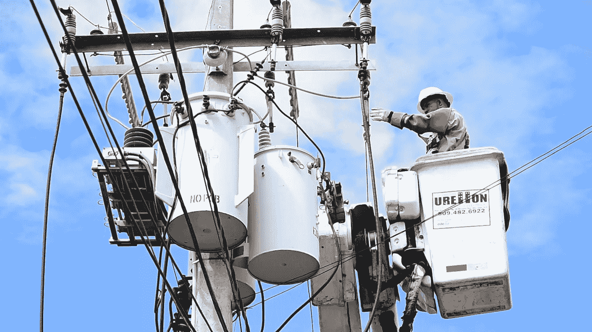

# 《每日科技》:这就是为什么你会在美国的电线杆上看到变压器

> 原文：<https://medium.com/geekculture/everyday-tech-exactly-why-you-see-transformers-on-electric-poles-in-america-12aaa905c9a3?source=collection_archive---------15----------------------->

这些巨大的、令人生畏的圆柱体栖息在城镇周围的一些电线杆上，是我们在美国安家后引起我兴趣的几件事情之一。我们中的一些人知道变压器是做什么的——升压/降压。但是这到底是什么意思呢？为什么我们的街道上需要变压器？为什么我们在一些国家看不到这种情况…