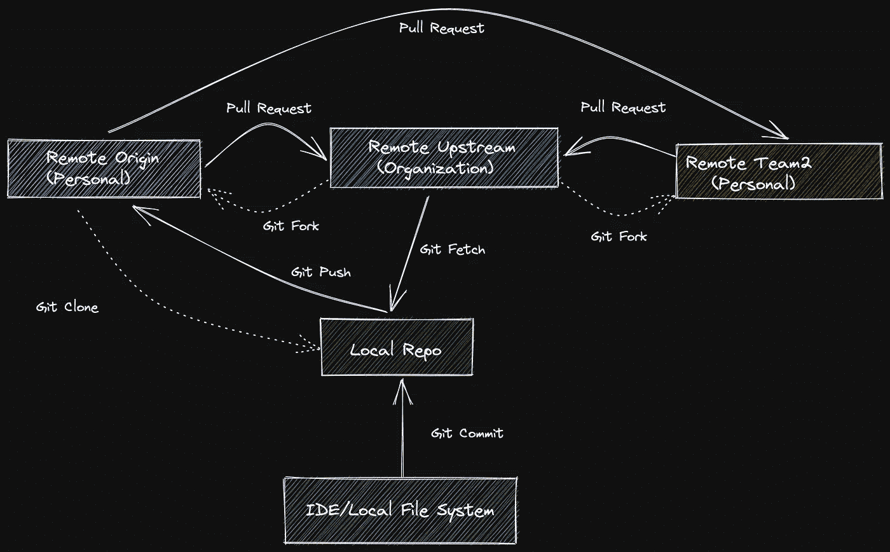

# 软件工程师应该知道的关于 GIT 的一切

> 原文：<https://medium.com/geekculture/everything-a-software-engineer-should-be-aware-of-about-git-1a5d6bab5d74?source=collection_archive---------8----------------------->

## 节目插曲

## 关于版本控制和 Git 您需要知道的一切

大家好😃,


Photo by [Tim Mossholder](https://unsplash.com/@timmossholder?utm_source=medium&utm_medium=referral) on [Unsplash](https://unsplash.com?utm_source=medium&utm_medium=referral)

今天我们将学习一个对任何软件相关人员都非常重要的话题，尤其是那些从事软件开发的人。对，就是**版本控制**。

## 1.什么是版本控制、Git、GitHub？


Photo by [CHUTTERSNAP](https://unsplash.com/@chuttersnap?utm_source=medium&utm_medium=referral) on [Unsplash](https://unsplash.com?utm_source=medium&utm_medium=referral)

我们先从阿拉斯蒂安那里得到版本控制的定义。

> 版本控制，也称为源代码控制，是跟踪和管理软件代码变更的实践。版本控制系统是帮助软件团队管理源代码随时间变化的软件工具。随着开发环境的加速，版本控制系统帮助软件团队更快更聪明地工作。

所以目前你应该得到所谓的“版本控制”。有许多系统可用于版本控制，比如 Git。Git 是一个众所周知且广泛使用的版本控制系统。所以我们要学习 Git 和 Github。到现在为止，你可能很困惑。什么是 Github？ **Linus Torvalds** 在 2005 年开发了**开源**版本管理系统，称为 **Git** 。营利性公司 GitHub 提供托管 Git 存储库的在线服务。本质上，它极大地简化了个人和团队使用 Git 进行协作和版本控制。


Photo by [Mohammad Rahmani](https://unsplash.com/@afgprogrammer?utm_source=medium&utm_medium=referral) on [Unsplash](https://unsplash.com?utm_source=medium&utm_medium=referral)

所以 VC，Git，GitHub 在理解上是明确的。为了更好地理解 Git 工作流，我们来看一些图表。

## **Git 高级基础图**



为了更好地解释这个图表，我将举一个例子来更好地理解。

```
Let's assume there is a public remote repository owned by Google on Github that has the code for the Google Sign-in feature. There is a three-member team working closely with that repository. But there is an external lead for that repository who only has write access to the repository. 
```

Google 拥有的远程存储库是这里的主存储库。它位于中间，如上图中远程上游名称所示。因此，首先，所有团队成员必须创建他们自己的组织的 git 远程存储库副本。fork 特性用于复制远程 repo，并在我们的 GitHub 帐户中创建一个远程副本。它在 GitHub 上，所以任何人都可以很容易地找到它。这个新创建的远程存储库通常被称为**源**。组织的存储库通常被称为**上游**。到目前为止，我们已经使用 fork 特性将组织的存储库复制到我们的远程存储库中。但是，出于开发目的，这些文件仍然在云中，而不是在我们的本地设置中。因此，我们需要将它带到本地存储库或文件系统中。我们可以用它。我们可以在本地系统的任何位置使用命令行界面来完成这项工作。Git 克隆特性将只创建一个本地副本。我们的本地副本和我们在 GitHub cloud (origin)中的副本之间不会有任何联系。我们需要使用`git remote`命令手动创建它。

```
git remote add origin <personal remote repo URl>
```

我们应该在组织的远程存储库(上游)和我们的本地存储库之间创建一个连接。这可以用来从 GitHub cloud 上的组织的远程存储库中获取对本地存储库的更改。我们的本地存储库和组织的远程存储库之间的连接可以通过下面的`git remote`命令来创建:

```
git remote add upstream <organization's remote repo URl>
```

> 在上图的右侧还有另一个 **team2** 远程存储库。不要混淆。它只是组织的远程存储库的一个分支，类似于左边的原点。

几天后，组织的 git 存储库可能会被那里的其他开发活动更新。但是我们的远程或本地存储库可能不会根据组织的 git 存储库进行更新。要获得本地存储库的最新更改，有一个称为“获取”的特性下面的命令用于从组织的存储库到我们的本地存储库。使用`git fetch`命令将远程存储库的提交、文件和引用下载到您的本地存储库中。这样你就可以知道其他人都在做什么了。

```
git fetch upstream
```

好了，至此，你已经学会了 git 和 GitHub 的基本结构。让我们继续一些与发展相关的东西。


Photo by [Fotis Fotopoulos](https://unsplash.com/@ffstop?utm_source=medium&utm_medium=referral) on [Unsplash](https://unsplash.com?utm_source=medium&utm_medium=referral)

假设我们已经编写了一些代码，这些代码文件保存在我们计算机的本地文件系统中，比如硬盘。它显示为 IDE 或本地文件系统。我们需要首先从我们的本地文件系统将更改的文件添加到本地存储库中。我们可以使用`git commit`命令与本地 repo 同步。当我们使用 GitHub 时，GitHub 上的所有本地存储库都会有一个远程存储库。我们可以使用`git push`命令将我们的更改添加到远程存储库中。在推送之前，我们必须设置本地存储库和远程存储库之间的源链接，如上所述。

让我们假设您已经将代码从本地存储库推到了远程存储库。尽管如此，您的代码仍然在您的存储库中，而不是组织的存储库中。现在是时候向组织的 git 库提出请求了，并说“**我已经做了一些开发并修复了你的特性上的一些 bug。请考虑这个😃".**这是由 **git 拉取请求**组织的。在创建拉取请求时，我们需要小心一点。在创建 PR (pull request)时，我们需要选择正确的存储库和正确的分支(我们稍后会了解到)。你可以在这里看到更多关于创建公关[的信息。](https://docs.github.com/en/pull-requests/collaborating-with-pull-requests/proposing-changes-to-your-work-with-pull-requests/creating-a-pull-request)

创建 PR 后，您的一些团队成员将在 GitHub 上审核和批准 PR。然后，它可以由必须对组织的 git 存储库进行写访问的人与组织的存储库合并。所以我希望您现在在某种程度上对 git 的工作流程有了更好的理解。现在让我们转到 git 中一个非常重要的特性，叫做分支。

## Git 分支


Photo by [Tim Johnson](https://unsplash.com/@mangofantasy?utm_source=medium&utm_medium=referral) on [Unsplash](https://unsplash.com?utm_source=medium&utm_medium=referral)

> git 中的分支与上面一片叶子的图片非常相似。

大多数现有的版本控制系统都具有分支特性。从本质上讲，git 分支是指向您的修改快照的链接。无论问题有多大或多小，如果您希望添加一个新特性或修复一个问题，您可以创建一个新的分支来包含您的更改。一条单独的开发线由一个分支表示。分支抽象地表示编辑/登台/提交过程。他们可能被认为是要求一个新的工作目录、临时区域和项目历史的一种方式。作为用新提交更新当前分支历史的结果，在项目历史中创建一个分支。


当我们从一个分支(例如 **main 到 thenusan** )衍生出一个分支时，新的分支 thenusan 将由创建时主分支中的所有提交组成，这意味着**分支 thenusan** 在创建时将包括前三个蓝色提交。其他三个绿色提交是在 Usan 之后添加到**分支的。类似于这个**分支，dev-1** 在从主分支创建时有前两个蓝色的提交。接下来的三个红色提交是后来添加的。**

让我们看看一些与分支相关的重要命令。

*   `git branch:`:这是 git 中与分支特性相关的主命令。
*   `git branch --list`:该命令列出了您的存储库中的所有分支。
*   `git branch <branchName>`:这个命令将从你当前的分支创建一个新的分支。但是负责人会在当前分支。
*   我们需要使用`git checkout <branchName>`命令检查新的分支。
*   我们可以使用`git branch -d <branchName>`删除分支。Git 禁止您删除包含未合并变更的分支，这是一个安全的操作。
*   `git branch -D <branchName>`:该命令用于强制删除分支。它将删除分支，即使它包含未合并的变更。
*   `git branch -m <branchName>`:用于重命名当前分支。
*   这将创建一个新的分支，头也将指向那个分支。不需要在这里再次结帐。

Git 有很多有用的命令。这些将对发展活动非常有帮助。

*   `git log`:它将列出一个特定分支中所有提交的提交消息和作者。需要按下 **q** 退出终端查看器。
*   `git status`:该命令将说出本地 git 存储库中修改、删除和创建的文件。我们可以根据它进行修改。
*   `git push -f`:有时我们的远程存储库不接受我们的推送。在那里，我们需要强制推送，将更改推送到远程存储库。这个命令在那里会很有用。但是在用力的时候你需要非常小心。
*   `git init`:该命令用于启动一个新的存储库。
*   `git rm [file]`:这个命令可以用来从 git 存储库中删除一个特定的文件。
*   `git show [commitid]`:该命令显示指定提交的元数据和内容修改。

# Git 贮藏

*   Git Stash 是软件开发中另一个非常重要的命令。
*   当您想要跟踪索引和工作目录的当前状态，但是希望返回到一个干净的工作目录时，可以使用 git stash。该命令恢复工作目录以匹配头提交，同时保存您的本地定制。
*   还有一些与 git stash 相关的命令。我们会调查的。
*   `git stash save`:该命令临时保存所有的变更跟踪文件。
*   `git stash pop`:这个命令恢复最近隐藏的文件。
*   `git stash list`:这个命令列出了已经存储的每个变更集。
*   `git stash drop`:使用这个命令删除最近存储的变更集。

*我相信你已经了解了 GIT 和 GitHub 相关问题的基础知识以及如何解决这些问题。我计划在未来的第二部分写更多关于 GIT 的内容。如果您有任何问题或澄清，不要犹豫，通过回复部分与我联系。感谢您花费宝贵的时间阅读这篇博客，我相信这将激励您继续阅读我的其他博客* [*这里*](https://sthenusan.medium.com/) *。*


Photo by [Courtney Hedger](https://unsplash.com/@cmhedger?utm_source=medium&utm_medium=referral) on [Unsplash](https://unsplash.com?utm_source=medium&utm_medium=referral)

如果你想享受这样的科技故事，并想支持我永远坚持写作的努力，可以考虑注册成为 Medium 会员。每月 5 美元，你可以无限制地阅读媒体上的故事。如果你 [*用我的链接*](https://sthenusan.medium.com/membership) *注册，我会赚一小笔佣金。你也可以跟着我上* [*中*](https://sthenusan.medium.com/) *和* [*推特*](https://twitter.com/thenusan97) *。*