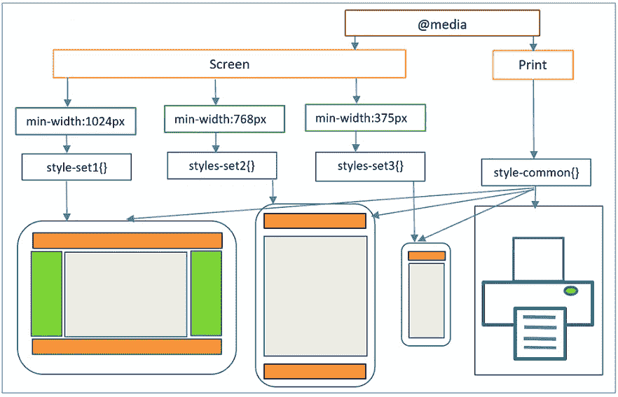
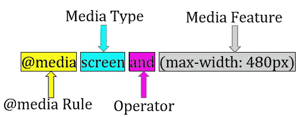
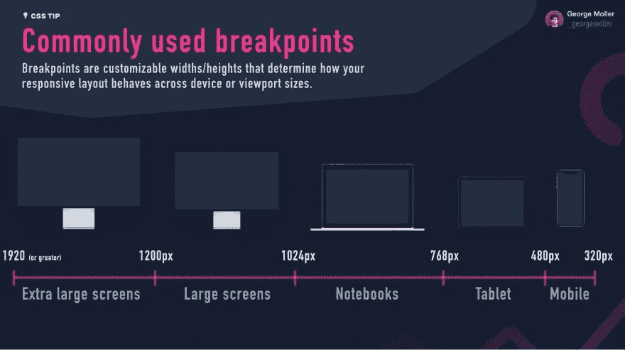

# 关于 CSS 媒体查询的一切

> 原文：<https://medium.com/geekculture/everything-about-css-media-queries-3e9786294b81?source=collection_archive---------6----------------------->

# 媒体查询简介:

媒体查询允许您的网站或应用程序根据设备特征进行更改。如今，在用户群体中，使用笔记本电脑/台式机/手机等访问任何网站都是非常常见的。(不同尺寸的设备)。因此，每个网站在小/大/不同尺寸的设备上都可以访问是非常重要的。此外，搜索引擎对高响应网站进行排名/优先排序。搜索引擎会降低没有响应的网站的等级。CSS 媒体查询对于开发响应式网站非常有用。



如上图所示，我们根据不同设备的像素使用不同的样式。

*   当屏幕宽度在 375 像素到 768 像素之间时，将应用 CSS set3 样式。
*   当屏幕宽度在 768 像素到 1024 像素之间时，将应用 CSS set2 样式。
*   当屏幕宽度超过 1024 像素时，将应用 CSS set1 样式。
*   最后，对于所有其他情况(即屏幕尺寸小于 375 像素)，将应用通用样式。

## 编写媒体查询的语法:

```
@media <media-query-list> {
  <stylesheet>
}
```

> @media 用于定义规则(称为“at-rules”)。它们是浏览器控制如何应用样式的特殊指令。

媒体查询列表由两部分组成
(一)媒体类型
(二)媒体特征

“媒体类型”和“媒体功能”这两者都用“and”子句或“，”来组合。



有 4 种可能的媒体类型
(i)屏幕→参考用户界面
(ii)打印→当用户进入打印预览模式时参考
(iii)全部→默认。用于所有媒体类型设备
(iv)语音→用于大声“读出”页面的屏幕阅读器

有 35 种不同的媒体功能。你可以在这里找到完整的名单[https://www.w3schools.com/cssref/css3_pr_mediaquery.asp](https://www.w3schools.com/cssref/css3_pr_mediaquery.asp)

# 进行媒体查询的基本要求:

1.  **始终添加元视区**
    什么是视区:视区是网页最可能的可视区域，由于手机或平板电脑等设备的屏幕大小不同，因此每个设备的视区也不同，如果没有定义视区，浏览器会尝试将桌面的整个网页放入较小的设备中，最终媒体查询将不起作用。

因此，要解决这个问题，我们需要在主 HTML 文件的头部添加一个

```
<meta name=”viewport” content=”width=device-width, initial-scale=1.0" />
```

**2。总是在 CSS 的末尾写媒体查询**

首先，将运行所有的 CSS 查询，最后，根据设备的不同，通过覆盖全局 CSS 样式来应用样式。因此，如果在开始时编写媒体查询，那么对于不同的设备，媒体查询将不起作用。

## 常用媒体查询示例:

**示例 1:-**

```
@media screen (min-width: 320px) and (max-width: 768px) {
  .element{ /*Style*/ }
}
```

**说明:**
当屏幕宽度在 320px 到 768px 之间时，对特定元素应用样式。

**例 2:-**

```
@media screen (prefers-color-scheme: dark), (min-width 1200px) {
  .element{ /*Style*/ }
}
```

**解释:**
当用户使用黑暗模式或屏幕宽度超过 1200px 时，将样式应用于特定元素。

**例 3:-**

```
@media (orientation: landscape) {
   .element{ /*Style*/ }
}
```

**说明:**
当用户将方向更改为横向模式时，将样式应用于特定元素。您也可以将方向用作纵向模式。

**例 4:-**

```
@media screen and (min-aspect-ratio: 16/9) {
  .element{ /*Style*/ }
}
```

**解释**
图像或屏幕的宽高比称为长宽比。
因此，当长宽比大于 16/9 时，样式将应用于元素。

**例 5:-**

```
@media all and (display-mode: fullscreen) {
  .element{ /*Style*/ }
}
```

**解释**
当设备完全进入全屏模式时，对元素应用样式。其他可能的显示模式可以在这里找到[https://developer . Mozilla . org/en-US/docs/Web/CSS/@ media/display-mode](https://developer.mozilla.org/en-US/docs/Web/CSS/@media/display-mode)

## 设备断点

CSS 断点是添加到代码中的点，网站内容根据设备屏幕大小对这些点做出响应。这有助于向最终用户显示理想的布局。CSS 断点与媒体查询一起使用，媒体查询也称为 CSS 媒体查询断点。



Reference by George Moller

## 常见媒体查询断点:


## 引导断点:


## 顺风断点:


## 包扎

现在，您已经很好地理解了什么是媒体查询，它们为什么有用，以及如何使用它们来使您的网站对移动设备上的访问者更具吸引力。此外，CSS 媒体查询并不是让你的网站响应迅速的最终目的。还有其他方法可以让你的设计适应，比如前面提到的 flexbox 和 grid。

我希望你至少从这篇文章中学到了一些东西，谢谢你一直读到最后！

与我联系，更多这样的东西:[https://linktr.ee/prituldave](https://linktr.ee/prituldave)