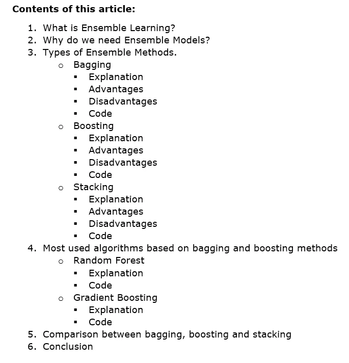
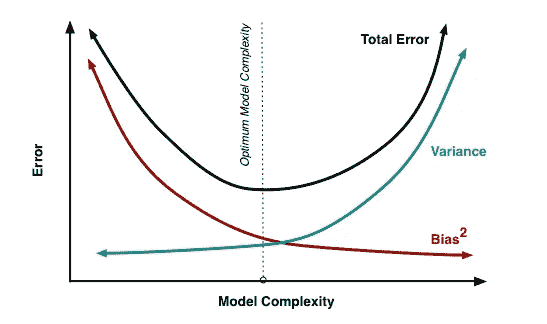
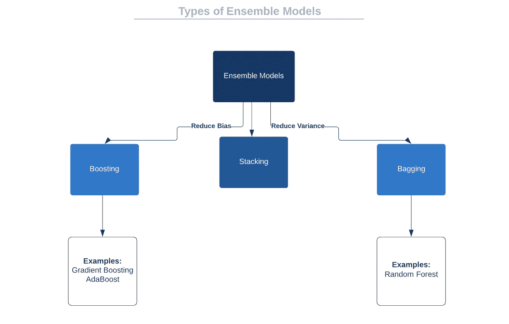
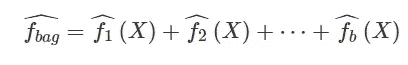
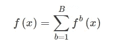
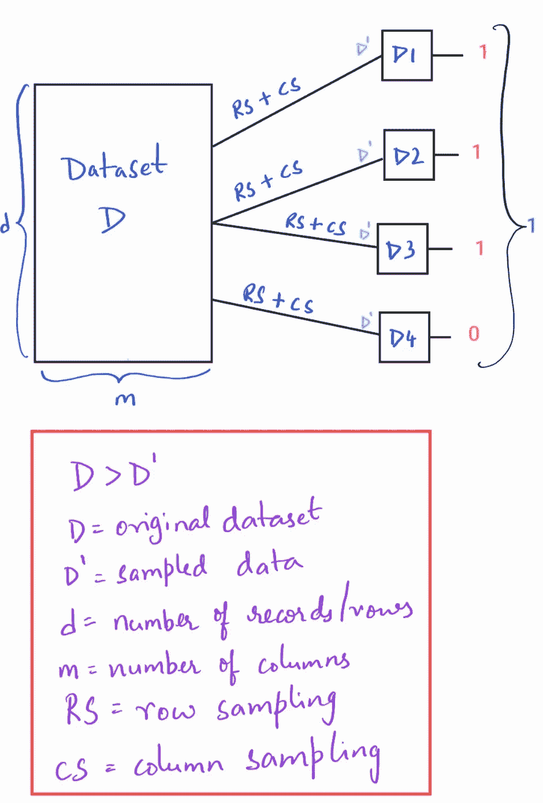
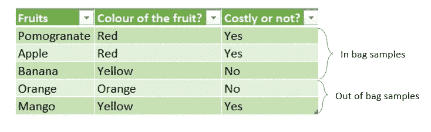
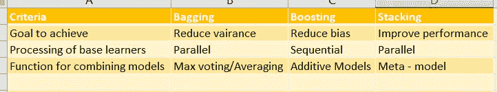

# 关于集成学习的一切

> 原文：<https://medium.com/geekculture/everything-about-ensemble-learning-46cd96d5498e?source=collection_archive---------25----------------------->

Table of Contents

# **1。什么是集成学习？**

T “整体”的一般含义是“作为一个整体而不是单独来看的一组项目”。在机器学习(ML)中也是同样的意思。集成学习是 ML 的一部分，它使用多种学习算法来获得比单独从任何基本或本质学习算法获得的预测性能更好的预测性能。

我们用一个例子来理解集成学习。当你想去一家餐馆时，你会试图从各种资源中找到关于那家餐馆的信息，比如问朋友，在谷歌上搜索评论，打电话给餐馆询问食物选择等。在考虑了所有这些意见后，你会做出决定。集合模型也以同样的方式工作。它们将来自多个模型的决策结合起来以提高性能。

Fig. 1 Ensemble Learning example

# **2。为什么我们需要集合模型？**

在理解我们为什么需要系综模型之前，让我们理解什么是偏差和方差。

> **维基百科:**
> 
> 偏差误差是来自学习算法中错误假设的误差。高偏差会导致算法错过特征和目标输出之间的相关关系(欠拟合)。
> 
> 方差是对训练集中的小波动的敏感性的误差。对训练数据中的随机噪声进行建模的算法可能会导致高方差(过拟合)。

偏差-方差权衡是监督学习的核心问题。优选地，我们想要选择一个模型，该模型准确地捕捉其训练数据中的规律性(由固定比率表征的质量),并且很好地推广到看不见的数据。通常不可能同时做到这两点。因此，我们必须保持偏差和方差的最佳平衡。

Fig. 2 Bias Variance Trade-Off

> 总误差=偏差+方差+不可约误差

当您尝试使用任何 ML 技术预测目标变量时，实际值和预测值之间差异的主要因素是噪声、方差和偏差。集成学习有助于减少除噪声之外的这些因素，噪声是不可减少的误差。减少偏差和方差使这些模型更加稳健。

# **3。集成学习方法的类型**

Fig. 3 Types of Ensemble Models

## **装袋**

Bagging 是一种并行集成元算法，是 Bootstrap 和 Aggregation 的组合，开发该算法是为了减少方差并提高 ML 问题的准确性，可以在回归和分类中使用。

**自举**是一种通过从原始数据集中随机选择替换的数据点来生成样本的技术。这些样本被称为 Bootstrap 样本，其大小小于原始数据集。

要从引导中获得最大收益，必须满足两个假设:

首先，数据集(N)的大小应该足够大，以捕捉基本分布的大部分复杂性，以便从数据集进行采样是从真实分布进行采样的良好近似。

第二，原始数据集的大小(N)应该远大于引导样本大小(B ),因为样本可以相关。

**聚合**是将拟合在自举样本上的每个模型的输出进行组合的过程。对于回归，对所有预测的输出进行平均，对于分类，使用最大投票。

Fig. 4 Bagging Equation

在上面的等式中，X 是我们想要生成预测的记录，LHS(fbag)是袋装预测，RHS 是来自单个基础学习者的预测。

让我们举个例子，

给定一个大小为 N 的标准训练集 D，bagging 通过从 D 均匀采样并替换，生成 M 个新的训练集 Di，每个训练集的大小为 B。短语“置换抽样”是指在每个 Di 中可以重复一些观察结果。

然后，使用这 M 个自举样本来拟合 Mi 模型，并通过平均输出(用于回归)和投票(用于分类)来组合 Mi 模型

Fig. 5 Example for Bagging

通常，对于 bagging，基础模型通常是具有低偏差和高方差的模型。最终模型的方差减少了，因为当数据改变时，只有一部分改变的数据被发送到每个 Mi，所以大多数 Mi 不会受到太大影响，因此总体方差减少了。

**优势**

*   许多弱学习者聚集在一起通常在整个集合中胜过单个学习者，并且具有较少的过拟合。
*   减少高方差数据集中的方差
*   培训和评估的并行处理。

**缺点**

*   它在高偏差数据集中可能表现不佳。
*   模型可解释性的丧失。
*   根据数据的不同，计算量可能很大。

## **增压**

在 ML 中，boosting 是一种顺序集成元算法，主要用于减少偏差。它是一个 ML 算法家族，将弱学习者转化为强学习者。Boosting 背后的基本直觉是依次训练弱学习者**，每个人都试图纠正其前任，这将最终减少偏差。通常，像浅层决策树一样，选择具有低方差和高偏差的弱学习器。我们必须在降低方差的同时减少偏差。**

**数学上，**

**1.使决策树适合数据:F1(x) = y**

**2.然后，我们将下一个决策树与上一个决策树的残差进行拟合:**

**h1(x) = y — F1(x)**

**3.将这个新树添加到我们的算法中:F2(x) = F1(x) + h1(x)**

**4.将下一个决策树拟合到 F2:H2(x)= y-F2(x)的残差**

**5.将这个新树添加到我们的算法中:F3(x) = F2(x) + h2(x)**

**6.继续这个过程，直到某种机制(即交叉验证)告诉我们停止。**

**这里的最后一个模型是 b 棵个体树的**阶段加性模型**:**

****

**Fig 6\. Equation for Boosting**

**这些模型被称为加性加权模型，因为每个单独的模型都被训练以适应其前一阶段结束时的残差(被忽略的误差)。**

**随着 b 值的增加，最终的模型最终具有较低的剩余误差，因为在每个阶段，我们都在根据误差拟合模型。随着训练误差的减少，偏差也会减少。**

****优势****

*   **boosting 的结果永远比单基础学习者好。**

****劣势****

*   **boosting 的一个缺点是它对异常值很敏感，因为每个分类器都必须修复前一个分类器中的错误。**

## **堆垛**

**堆叠的基本思想是考虑**异构**弱学习器，在**并行**中学习它们，并通过训练元模型来组合它们，以基于不同弱模型的预测输出预测。实际上，模型越不同越好。所有这些模型都是并行构建的，彼此独立。**

**步骤 1-在原始数据集 d 上训练 M 个模型。**

**步骤 2-制作新的数据集 D ’,该数据集由步骤 1 中 M 个模型的预测组成。**

**步骤 3-现在构建第二级模型或元模型，以对新数据集 D '进行预测。**

****优点****

*   **可以通过控制各种性能良好的模型的能力来提高性能。**

****缺点****

*   **高训练时间**
*   **高评估时间**

****代码:****

**有关[代码](http://rasbt.github.io/mlxtend/user_guide/classifier/StackingClassifier/)的更多解释**

**Code for Stacking algorithm for classification problem**

# ****4。基于 Bagging 和 Boosting 方法的最常用算法****

****随机森林****

**随机森林，也称为随机决策森林，是一种广泛用于分类和回归的 bagging 集成学习方法。我们发现许多树的地方是一片森林。在随机森林中，我们使用许多决策树作为基础模型，因此命名为森林。随机来自“随机”引导抽样。随机森林是**决策树+装袋+列抽样**(特征装袋)的组合。**

**列采样只不过是从原始数据集中选取随机要素/列进行采样。随机森林的核心思想是通过选取随机的行和列来制作样本，然后在这些样本上训练模型并聚合结果。**

**从原始数据集中采样一组点后，该样本中未被考虑的点称为袋外**点**点，被考虑的点称为袋内样本。**

****

**Fig. 7 Process of Random Forest Algorithm**

****

**Fig. 8 Sample Data of In-Bag and Out-of-Bag points**

**这些 OOB 点可用于测试根据袋内采样数据训练的模型。许多库向 OOB 提供错误，以了解基于原始数据集中的样本构建的每个模型。**

****代码:****

**关于[代码](https://scikit-learn.org/stable/modules/generated/sklearn.ensemble.RandomForestClassifier.html#sklearn.ensemble.RandomForestClassifier)的更多信息**

**Code for Random Forest with test scores**

**n _ 估计量、bootstrap、max_features 称为超参数，我们必须调整它们以避免过度拟合并提高精度。**

****梯度推进****

**梯度推进是一种用于回归和分类的集成机器学习算法，它以弱预测模型(通常是决策树)的集成的形式产生预测模型。它像其他 boosting 方法一样以**分阶段的方式**构建模型，并通过允许优化任意可微分损失函数来推广它们。**

**梯度推进建立在三个支柱之上:-**

**(一)损失函数**

**选择一个完美的损失函数取决于需要解决的问题的类型。例如；对于回归，可以使用平方误差，对于分类，可以使用对数损失。所选择的损失函数必须被优化以获得更好的结果。**

**(二)学习能力差**

**典型地，具有合理深度的决策树被用作弱学习器。这些树是贪婪地构建的，我们必须根据纯度分数(如基尼系数或熵)选择最佳分裂点。**

**(三)加法模型**

**新树的输出被添加到现有树序列的输出，以校正或改进模型的最终输出。这些树一次添加一个，模型中现有的树不变。添加树时，采用梯度下降过程来按比例降低损失。**

**由于这种算法是一种贪婪的算法，它会**过拟合**训练数据集。对于这个算法，有 4 种方法来调节这个装配问题**

**1.树约束:-该算法中使用的树需要被控制以避免过度拟合。以下是控制树的最常用参数:**

**树木数量**

**树的深度**

**节点数或叶数**

**每次分割的观察次数**

**损失的最小改善**

**2.加权更新:-每当添加新树时，可以通过控制学习速率来加权它的贡献。通常，学习率使用 0:1 到 0.3 范围内的小值。**

**3.随机梯度推进:-在装袋中制作样品的优势也可以在推进中。这降低了树之间的相关性。在每一次迭代中，从原始数据集中抽取一个样本，这个样本使用了 fit 基学习器。**

**4.惩罚梯度增强:-调整最终学习的权重有助于避免过度拟合。常用的正则化函数有:**

**L1 正规化**

**L2 正规化**

****代码:****

**关于[代码](https://scikit-learn.org/stable/modules/generated/sklearn.ensemble.GradientBoostingClassifier.html)的更多信息**

**Gradient Boosting Code on sample data**

# ****5。装袋、增压和堆垛之间的比较****

****

**Fig. 9 Comparision between various ensemble learning methods**

# **6.结论**

**每个集合模型都有自己的优点和缺点。选择正确的模型取决于问题和 ML 爱好者处理的数据集。**

****参考文献:****

**[https://sci kit-learn . org/stable/modules/generated/sk learn . ensemble . gradientboostingclassifier . html](https://scikit-learn.org/stable/modules/generated/sklearn.ensemble.GradientBoostingClassifier.html)**

**[https://sci kit-learn . org/stable/modules/generated/sk learn . ensemble . randomforestclassifier . html # sk learn . ensemble . randomforestclassifie](https://scikit-learn.org/stable/modules/generated/sklearn.ensemble.RandomForestClassifier.html#sklearn.ensemble.RandomForestClassifier)r**

**[https://medium . com/ml-research-lab/bagging-ensemble-meta-algorithm-for-reducing-variance-c 98 fffa 5489 f](/ml-research-lab/bagging-ensemble-meta-algorithm-for-reducing-variance-c98fffa5489f)**

**[https://bradleyboehmke.github.io/HOML/gbm.html](https://bradleyboehmke.github.io/HOML/gbm.html)**

**[https://machine learning mastery . com/gentle-introduction-gradient-boosting-algorithm-machine-learning/](https://machinelearningmastery.com/gentle-introduction-gradient-boosting-algorithm-machine-learning/)**

**[https://www . analyticsvidhya . com/blog/2018/06/comprehensive-guide-for-ensemble-models/](https://www.analyticsvidhya.com/blog/2018/06/comprehensive-guide-for-ensemble-models/)**

**[https://medium . com/grey atom/a-quick-guide-to-boosting-in-ml-acf7c 1585 CB 5](/greyatom/a-quick-guide-to-boosting-in-ml-acf7c1585cb5)**

**[https://towards data science . com/ensemble-methods-bagging-boosting-and-stacking-c 9214 a10a 205](https://towardsdatascience.com/ensemble-methods-bagging-boosting-and-stacking-c9214a10a205)**

**[https://en . m . Wikipedia . org/wiki/Boosting _(机器学习)#Boosting_algorithms。](https://en.m.wikipedia.org/wiki/Boosting_(machine_learning)#Boosting_algorithms.)**

**[https://en.m.wikipedia.org/wiki/Random_forest#Algorithm](https://en.m.wikipedia.org/wiki/Random_forest#Algorithm)**

**[http://rasbt . github . io/mlx tend/user _ guide/classifier/stacking classifier/](http://rasbt.github.io/mlxtend/user_guide/classifier/StackingClassifier/)**