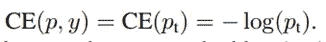
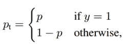
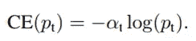
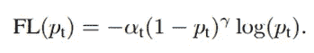
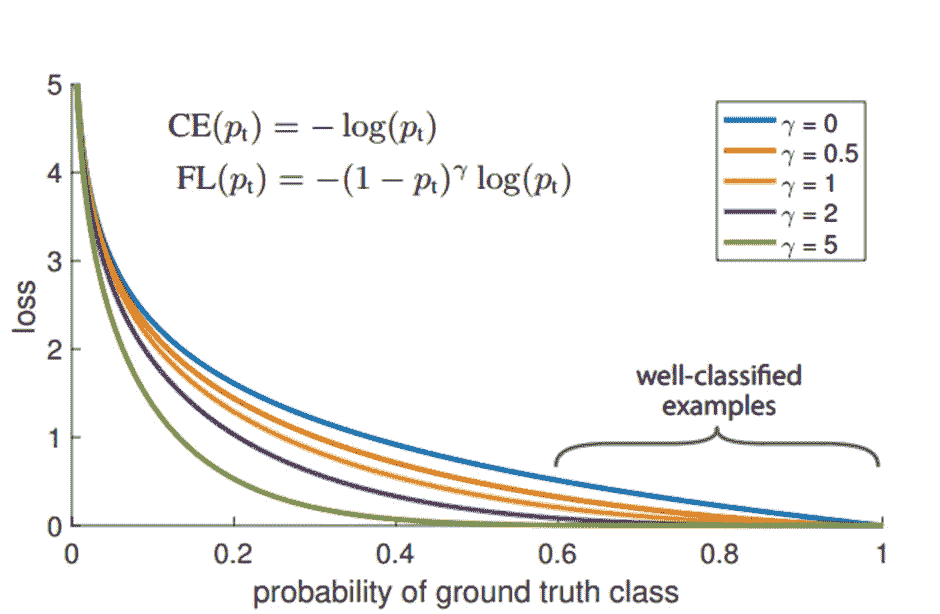
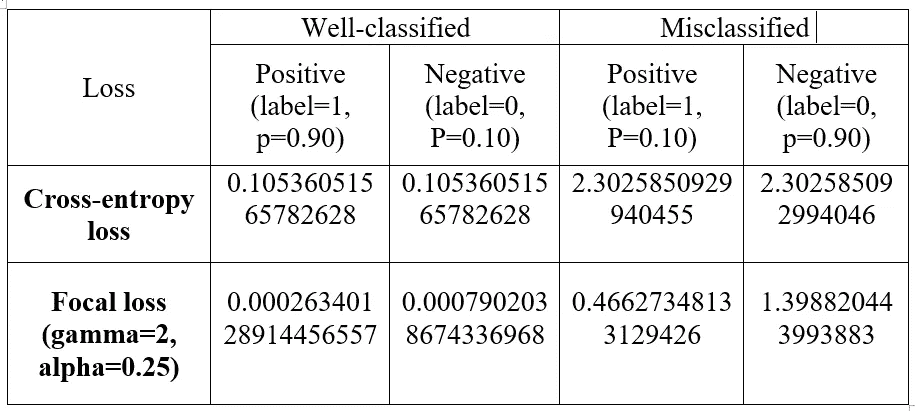

# 关于焦点丢失的一切

> 原文：<https://medium.com/geekculture/everything-about-focal-loss-f2d8ab294133?source=collection_archive---------6----------------------->

## 让我们来理解聚焦损失及其对不平衡问题的影响。


Source:[https://stock.adobe.com](https://stock.adobe.com/)

脸书人工智能研究所(FAIR)提出了**聚焦损失**概念来处理类别不平衡，并通过他们的一级探测器 RetinaNet 展示了其有效性。在进入正题之前，我们会先了解一些先决条件。

*   **反面例子**:与真实情况(低 IOU)或背景信息重叠度低的样本。
*   **正例**:与地面真实(高 IOU)或前景信息重叠较多的样本。
*   **简单例子**:正确分类的样本。
*   **硬例**:分类错误的样本。

## **阶层失衡**

在训练期间，当一个类在数据集或小批量中有更多样本时，就会出现类不平衡。从对象检测的角度来看，这可能以两种不同的方式发生:

*   在**前景-背景类不平衡**中，过表示的类是背景类，欠表示的类是前景类。
*   在**前景-前景类不平衡**中，过度表现和表现不足的类都是前景类。

前景-背景不平衡发生在密集检测器的训练期间。因为容易分类的背景样本(容易否定)对学习没有贡献，导致低效的训练并导致退化的模型。

## **焦损失**

我们将从用于二进制分类的基函数交叉熵损失开始理解焦点损失函数。

*   **交叉熵损失**

交叉熵在数学上表示为:


Eq-1

其中，y =基础真实类，p=标注 y=1 的类的估计概率。

为简单起见，我们可以将交叉熵损失重写为:



Eq-2

在哪里，



Eq-3

*   **平衡交叉熵**

为了解决类别不平衡，交叉熵乘以参数α。



Eq-4

其中，alpha 的范围在[0，1]和 class 1= alpha，class 0= (1-alpha)之间。

参数α着重于在训练期间平衡正面和反面的例子。

*   **焦损失**

焦点损失是交叉熵损失函数的改进版本。它处理单级检测器面临的类别不平衡。由于平衡交叉熵区分正面和负面的例子，焦点损失进一步区分简单和困难的例子。

焦损失给具有超参数γ的交叉熵函数增加了调制因子。伽马值为 0 到 5 的焦损失是可见的。



Eq-5



fig: Focal loss and cross-entropy loss comparison[1]

上图显示，

1.  对于简单的例子(p>=0.5)，焦点损失值小于交叉熵。
2.  随着伽玛值的增加，调制因子降低了分类良好的样本的损失值，并在训练期间对错误分类的样本给予较高的权重。
3.  伽玛的变化集中了硬样品的损失，并将所有注意力集中在硬底片上。

让我们，用例子比较一下简单和困难样本的焦损失和交叉熵损失。使用以下代码计算损失值，

```
# calculate cross entropy loss.def cross_entropy(p, label):
   if (p>=0.5 and label==1) or (p<0.5 and label==0):
      print("correctly classified example")
   else:
      print('Misclassified example')
   loss= -(label*(math.log(p)))-((1-label)*(math.log(1-p)))
   return loss# calculate focal loss.def focal_loss(p, label, alpha, gamma):
    if (p>=0.5 and label==1) or (p<0.5 and label==0):
       print("correctly classified example")
    else:
       print('Misclassified example')
    loss= -((alpha)*(1-p)**gamma*(label*(math.log(p))))-((1-alpha)*(1-(1-p))**gamma*((1-label)*(math.log(1-p)))) return loss
```



Comparison between cross entropy and focal loss with example.

从上面的比较，我们可以得出结论，

1.  交叉熵与焦损之比:易正~405.23，易负~133.36，硬正~ 4.938，硬负~ 1.646。
2.  与交叉熵损失相比，聚焦损失值较小。
3.  比值证明了简单样本的衰减贡献的焦点损失性质，并证明了在训练期间集中在硬样本上以校正错误分类的样本。
4.  焦点损失更多地集中在硬底片上。

我希望这篇博客能让你对焦损失和改变伽玛的效果有更好的了解。

谢谢你..！！！

## **参考文献**

1.  https://arxiv.org/pdf/1708.02002.pdf
2.  【https://arxiv.org/pdf/1909.00169.pdf 