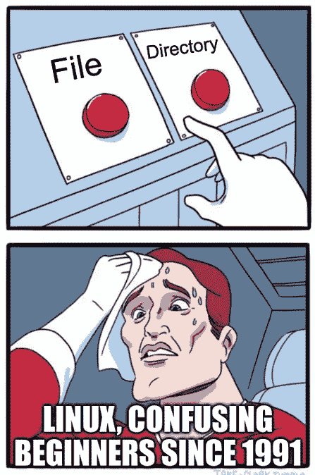

# 一切都是一个文件

> 原文：<https://medium.com/geekculture/everything-is-a-file-6ea55a5e03?source=collection_archive---------9----------------------->

Linux 文件系统简介

source: [https://imgflip.com/i/644l01](https://imgflip.com/i/644l01)

> “一切都是文件；如果一个东西不是一个文件，它就是一个过程。”[1]

文件是存储信息的离散单元。UNIX 操作系统的体系结构将目录、套接字、管道和所有东西抽象到虚拟文件系统中。我们可以在虚拟文件系统上使用文件操作系统调用，这取决于底层驱动程序…