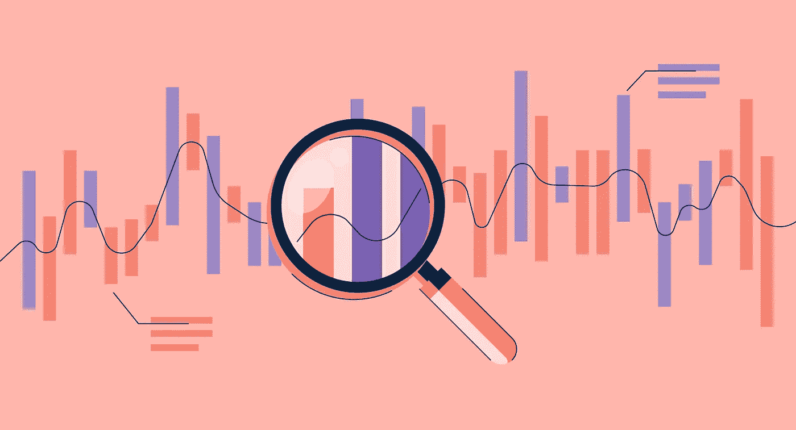

# 2021 年数据科学领域流行的一切

> 原文：<https://medium.com/geekculture/everything-popular-in-the-2021-data-science-landscape-ae266156afa9?source=collection_archive---------4----------------------->

## 2021 年 Kaggle ML & DS 调查数据简要分析

[Image Source](https://www.g2.com/articles/data-analysis-process)

*“数据是新的石油”，*他们说，需要很多框架、工具和仪器方案来使用这种新的石油，将其转化为有价值的燃料，以到达终点。这些数据以多种格式出现，如图像、视频、文本、音频等，而且人们可以…