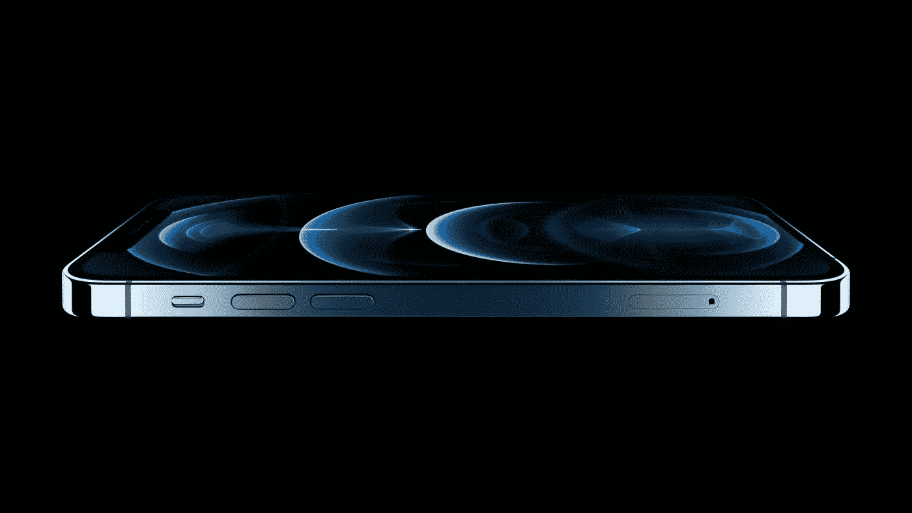
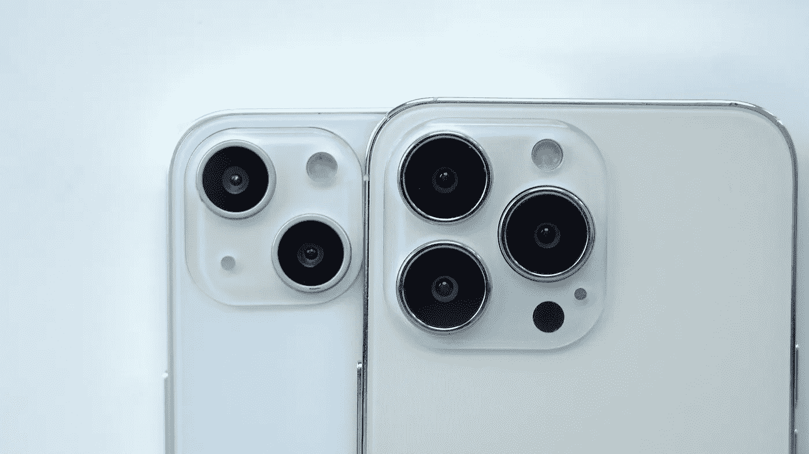
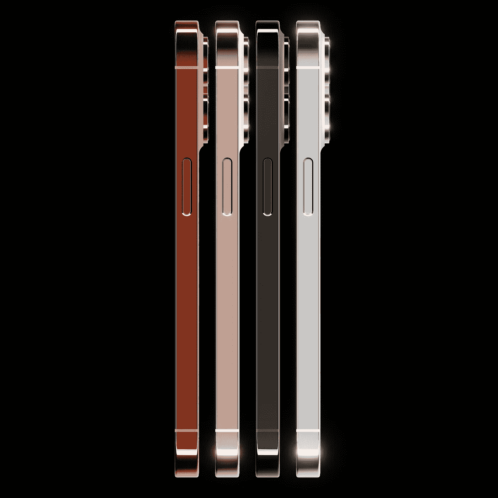
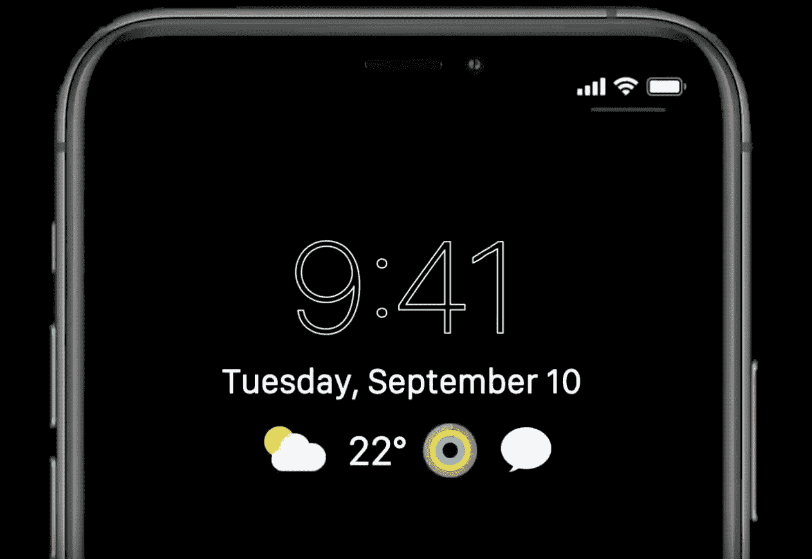

# 我们所知道的关于 iPhone 13 的一切都准备好了！

> 原文：<https://medium.com/geekculture/everything-we-know-about-the-iphone-13-line-up-8a1006ca22bf?source=collection_archive---------42----------------------->

值得买还是应该等 2022 年。

**iPhone 12 Pro |** Image from Apple.

我们现在是在八月，这意味着我们离下一次苹果 iPhone 发布会还有大约一个半月的时间，泄露还没有停止。

所以我们从名字开始，让我们假设苹果将继续自 2019 年 iPhone 11 和 2020 年 iPhone 12 以来的顺序，他们将推出 iPhone 13 而不是 iPhone 12S。

苹果似乎放弃了“S”命名，我不认为今年会有所改变，13 只是听起来更好，让你觉得这比通常较小的“S”更新更重要。

期待一个 iPhone 13 mini，iPhone 13，iPhone 13 Pro，iPhone 13 Pro Max。

不管怎样，让我们继续做更重要的事情。

**设计**

如果你现在正拿着一个 iPhone 12 模型在读这篇文章，那么这就是 iPhone 13 的基本设计。

不要指望框架会有什么大的变化，但我们会得到一个更小的缺口，设备可能会厚 0.3 毫米，以容纳所有 4 种型号的更大电池。

除了一些小的变化，所有 4 款机型的相机排列都是相同的，传感器移动稳定将扩展到整个 iPhone 系列，通过减少相机抖动来改善弱光性能和稳定性，Pro 机型的广角镜头和超广角镜头都具有该功能。

标准的 13 和 13 mini 将有一个新的相机对角线布局，但他们应该对宽镜头也有所改进。

**iPhone 13 and iPhone 13 Pro camera layout on dummy units.**

iPhone 13 Pro 和 Pro Max 这次有相同的阵容，但由于宽镜头和超宽镜头的改进，相机将更大，所以那些 iPhone 12 Pro 外壳恐怕不适合。

最后是颜色，Pro 机型太平洋蓝和石墨消失了，取而代之的是一种新的青铜色或暗铜色，被 leakers 称为夕阳金，以及一种新的太空黑，这种黑给了我们从 iPhone 7 开始就一直等待的颜色。

**Sunset Gold, Rose Gold, Black and Silver iPhone 13 Pro concept.**

金色也稍微变成了更玫瑰金的外观，只留下了 iPhone 12 Pro 系列的银色，太平洋蓝和石墨加入了 iPhone 12 Pro 午夜绿的被遗忘的颜色行列。

至于标准的 13 和 13 mini，我们没有透露今年我们应该期待什么颜色，但我想新的珊瑚色或橙色可能会取代绿色。

**显示**

因此，当我们正式发布时，这些无疑会成为今年的头条新闻。

120 赫兹促销显示器和一个更小的缺口！是的，这些将出现在 iPhone 13 Pro 机型上，而较小的缺口将出现在所有 4 款机型上。

很遗憾标准机型没有 120Hz 的显示屏，但我想苹果需要在专业机型上向你推销一些东西，所以除了更小的档次，我不确定如果你已经有一部 iPhone 12，你会不会麻烦升级到 13 或 13 mini。

120Hz 显示屏已经在 iPad Pro 上使用了几年，这是一个很好的体验，让一切看起来流畅而快速，但它不是一个交易破坏者，它确实需要大量电池。然而，这确实意味着 Pro 现在终于拥有了一些 Pro 功能，而不仅仅是长焦镜头和钢架。

**Aways on display concept.**

iPhone 13 可能会有一个类似于 Apple Watch 和大多数 Android 设备的永远在线显示屏，这将允许一些数据，如时间或电池，显示在 iPhone 的锁屏上，即使它是关闭的。我们还应该得到某种形式的通知，也许是一些模糊的应用程序图标，而不是一个完整的预览。

目前还不知道这是否会像 120Hz 显示器一样成为专业专属，或者所有 4 款机型都将拥有这一功能，我个人认为这将是另一个专业功能，因为他们拥有 LTPO 有机发光二极管 120Hz 显示器，这对那些拥有这一功能的人来说是有意义的，因为它可以更好地使用电池。

**最后**，我们还应该期待 Wifi 6E、A15 SoC、所有型号上更快的 5G 毫米波、更大的电池、对 25W 电源适配器的支持以及我个人对反向无线充电的希望，以便在我外出时给 AirPods 一点点动力。

你**不应该**期待的是触控 ID 今年回归，因为这可能是 2022 年的型号，13 和 13 mini 上的激光雷达传感器，还没有无端口 iPhone，再次没有 USB-C 端口。

总的来说，我对 Pro 机型的变化感到高兴，并期待最终拥有一些有用的功能，如一直显示和 120Hz，这些功能已经在 Android 设备上存在多年了。

Wifi 6E 和改进的 5G 毫米波的添加也使它成为一个不错的未来证明，更大的电池也非常受欢迎，因为 12 系列电池在我看来并不是那么好。

我也非常好奇，想亲自看看这种夕阳金色是什么样子，因为我已经说服自己，黑色将是我今年的选择。我将来自一个 12 Pro，我有点后悔买了标准的 iPhone 12，因为型号之间没有太多的差异，当然除了更多的内存和长焦镜头外，没有“专业”的功能。

但我不禁觉得，标准的 13 和 13 mini 是今年的跛脚鸭，没有什么值得从 iPhone 12 升级的，但来自任何低于这将是一个重大升级或来自 Android 的东西。

如果你在市场上购买一部新的低价 iPhone，并拥有一部 iPhone 11、XR 或 SE，那么一旦 13 发布，降价的 iPhone 12 或 12 mini 肯定会是一笔更好的交易。

展望未来，这将是最后一部 iPhone mini，因为明年它将被更大的低成本 6.7 英寸机型取代，因为 mini 的销售非常糟糕，所以如果你喜欢小型高端手机，那么在它们离开之前抓住 12 或 13 mini。

明年， **Pro** 型号上的凹槽很可能会缩小到只有一个孔，还有内置触控 ID 和钛框架，将取代目前的不锈钢，但所有型号都可能有 8K 视频录制和 120Hz，这使 2022 年的 iPhones 传言更加完整。

如果这足以让你再等一年，我认为你今年不会错过太多，但如果你不能等待，那么 13 Pro 或 13 Pro Max 将是我今年的选择，或者根据资金情况减少 12 或 12 mini。

这就是目前为止 iPhone 13 泄露的综合报道，以及 2022 年的预告，我不希望在下个月之前有任何重大惊喜，但在官方宣布之前，我不会说永远不会。

传闻中的在线活动日期是 9 月 14 日，所以请提前一周留意邀请函。