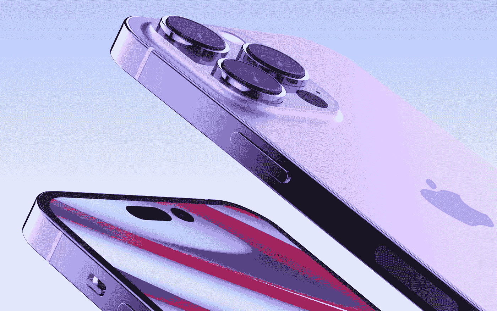
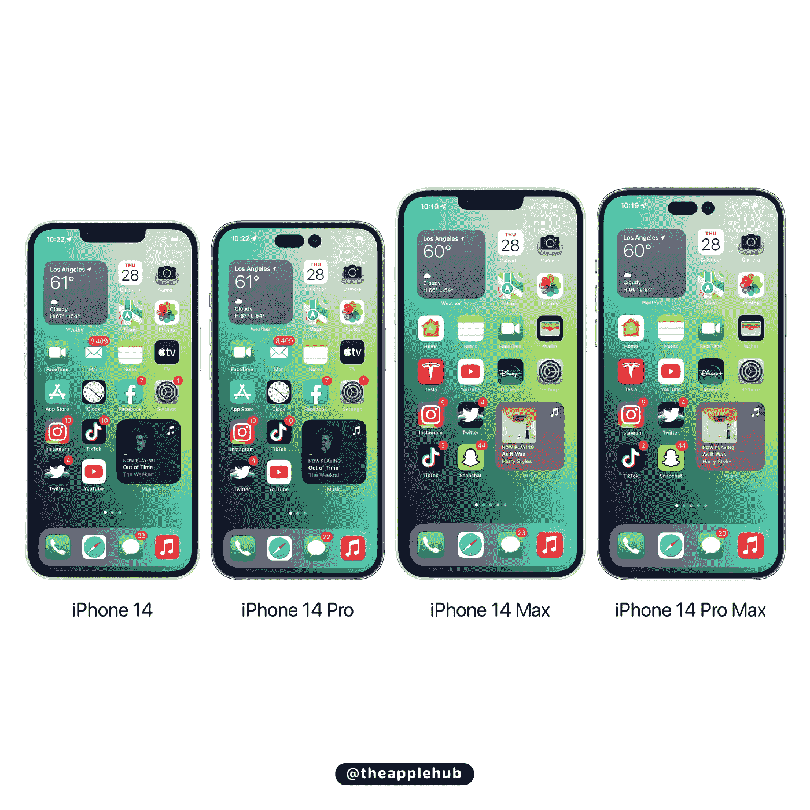
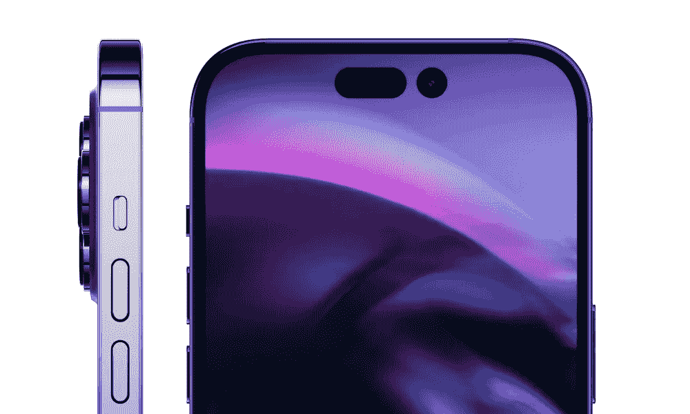
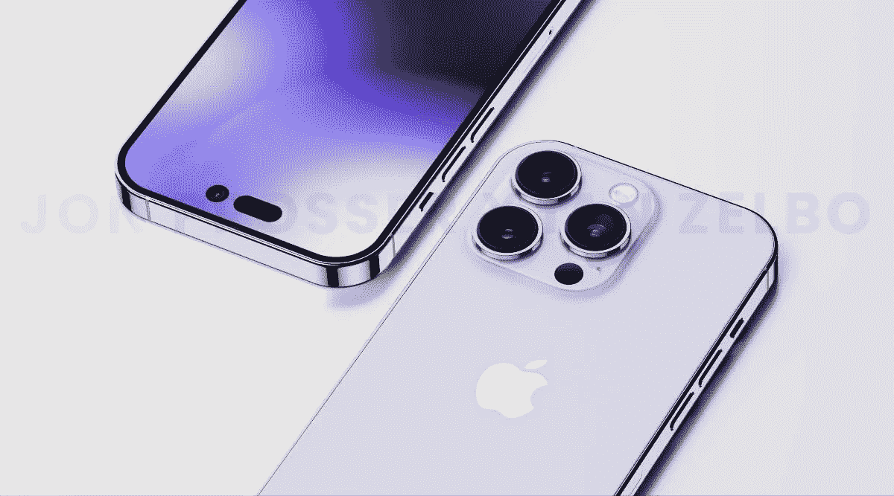
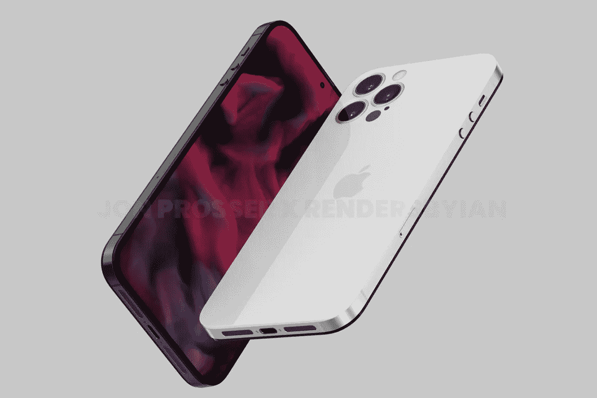

# 我们所知道的关于 iPhone 14 的一切。

> 原文：<https://medium.com/geekculture/everything-we-know-about-the-iphone-14-89a74d564eca?source=collection_archive---------12----------------------->

今年要么去职业队，要么回家。

**iPhone 14 Pro render** | by [Unbox therapy](https://www.youtube.com/c/unboxtherapy)

我们距离下一代 iPhone 只有两个月的时间了，泄露的信息已经开始形成我们今年应该期待的清晰画面。

我们知道，这将是四部 iPhones，其中两部是标准型号，两部是专业型号，但这次标准型号的尺寸有所变化，专业显示屏也有了重大升级。

让我们先解决这个问题，今年似乎没有重大的重新设计。自 iPhone X 以来，苹果公司一直使用 3 年的设计周期，因此 iPhone XS 和 iPhone 11 Pro 保留了这一设计，并进行了一些细微的调整。

iPhone 12 和 iPhone 13 采用平边工业设计，iPhone 14 预计至少会保持相同的框架。

标准的 iPhone 14 系列将放弃 5.4 英寸的 iPhone mini，转而推出更大的 6.7 英寸 iPhone 14 Max 版本，而 6.1 英寸的 iPhone 13 仍然与 6.1 英寸的 iPhone 13 相同。至于 iPhone 14 的其他规格，我认为我们不会看到后置摄像头有很大的变化，但我们应该会看到前置摄像头多年来的第一次重大升级，具有自动对焦和像素凸起。

预计该等级将持续存在，苹果有史以来第一次预计只会将 iPhone 14 Pro 和 iPhone 14 Pro Max 升级到其最新的 A16 处理器。而 iPhone 14 和 iPhone 14 Max 将保留当前 iPhone 13 系列中的相同 A15 芯片。

**Most likely iPhone 14 line up** | by [@theapplehub](https://twitter.com/theapplehub/status/1519743392011284480)

大概就是这样…是的，相当乏味，所以让我们转到专业线上。

这是真正有趣的事情开始的地方，iPhone 14 Pro 型号将使用新的“药丸+孔”设计，而不是许多其他手机使用的简单打孔切口，苹果将使用打孔切口和药丸形状切口的组合来创建一个独特的设计，很容易被识别为 iPhone。

**Pill + hole cut out concept for face ID and camera.** | by [@ID_Vova](https://twitter.com/ld_vova)

由于摄像头广泛升级到 48MP(相比之下，13 Pro 为 12MP)，14 Pro 型号还将具有更大、更突出的后置摄像头凸起。我们应该预计所有型号都可以进行 8K 录制，但 iPhone 14 仍然使用 lightning 进行数据传输，所以当试图将 8K 视频传输到笔记本电脑上时，预计速度会非常慢。

至于颜色，我们对今年 iPhone 14 的标准选择知之甚少，但我们应该会看到星光、午夜、蓝色、紫色和红色仍然存在。虽然 Pro 系列可能会有一种新的紫色来取代 Sierra Blue 或 Alpine Green，但我个人希望我们能在午夜更换石墨，因为我想念苹果的深色选择。

**iPhone 14 Pro in purple.** | [Render by Ian](https://twitter.com/ianzelbo/status/1435630057834393608?s=21&t=oCmiS4WugmoHmqowCQ5L2A)

所以现在坏消息是，许多传言指出所有型号的价格都至少上涨了 100 美元，至少对于标准的 iPhone 14 来说，这似乎是一个粗略的销售。

今年是一个真正的大杂烩，一方面，我们看到了苹果对 Pro 机型 iPhone 设计的下一阶段愿景，但另一方面，我们看到了标准 iPhone 14 的可怕升级。

对于那些预算有限并且需要升级的人来说，这将很难选择，我建议人们只购买 iPhone 13 而不是 14。就我个人而言，我会再等一年，等待传闻中的重新设计、USB-C 和所有型号的凹槽的完全移除。

**Rumoured iPhone 15 redesign, inspired by iPhone 4.** | [Renders by Ian](https://twitter.com/ianzelbo/status/1435630057834393608?s=21&t=oCmiS4WugmoHmqowCQ5L2A)

USB-C 将是 iPhone 的一个巨大升级，我将非常高兴终于能够使用同一根电线为我的所有设备充电。药丸+孔相机显示屏据称将在 2023 年出现在所有 4 款机型上，这意味着凹槽最终将被取代，重新设计可能会从标志性的 iPhone 4 中获得灵感。

我认为 iPhone 14 Pro 和 14 Pro Max 是今年唯一值得购买的真正升级产品，但现在随着价格的上涨，你可能会觉得新的相机和显示器不值得，也许会坚持到明年的大变化。

2022 年是你成为职业球员的一年，或者只是给自己一个假期。