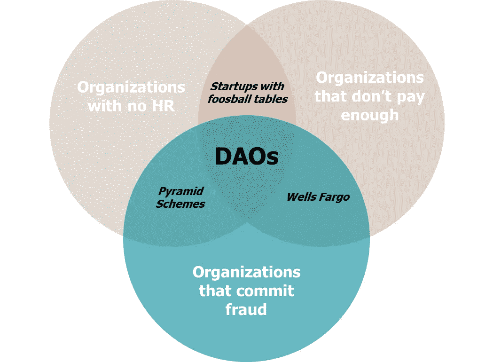

# 道斯怎么了

> 原文：<https://medium.com/geekculture/everything-wrong-with-daos-be7027bb6cd1?source=collection_archive---------6----------------------->

## 技术不是在寻找意义…你才是

[Click here for more fun graphs!](https://www.thepourquoipas.com/graphs)

在过去的几年里，我写了关于 Web3 [的](https://www.thepourquoipas.com/post/why-nfts-are-dumb)[。在某种背景下，](https://www.thepourquoipas.com/post/crypto-nft-dao-web3-questions)[它诞生于 2008 年金融危机以及随后硅谷/华尔街对经济的影响力之战](https://www.thepourquoipas.com/post/how-the-financial-crisis-trump-covid-gamestop-created-web3)。首先是加密货币的诞生。因为没有人愿意为了一条面包而接受 BTC 或 ETH，所以就产生了 NFTs。COVID…