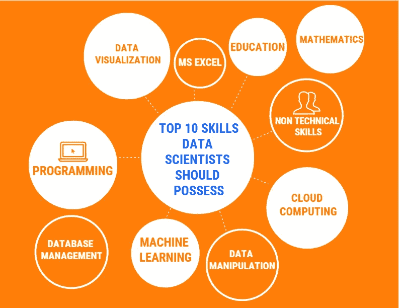
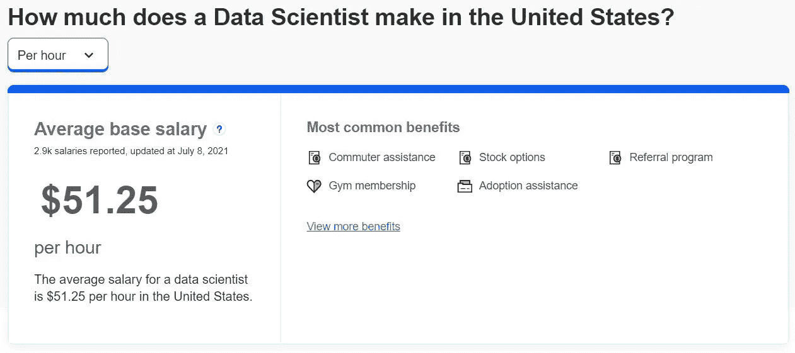

# 关于数据科学家你需要知道的一切

> 原文：<https://medium.com/geekculture/everything-you-need-to-know-about-a-data-scientist-aac866cb36f?source=collection_archive---------34----------------------->

数据科学家必备的十大技能

Photo by [Magnet.me](https://unsplash.com/@magnetme?utm_source=unsplash&utm_medium=referral&utm_content=creditCopyText) on [Unsplash](https://unsplash.com/?utm_source=unsplash&utm_medium=referral&utm_content=creditCopyText)

除非转换成有意义的信息，否则数据没有价值。数据科学是一门交叉学科。它专注于在庞大的、非结构化的或有组织的数据集中发现模式和其他见解。该领域的基本目的是在以前未探索和意想不到的领域发现答案。信息对任何公司来说都是宝贵的资产。它帮助企业了解和改进他们的流程，让他们节省时间和金钱。

一个糟糕的广告决策不仅会浪费资源，还会对业务产生负面影响。企业可以减少这种可以避免的损失。数据科学有助于检查各种营销渠道的功效，并专注于那些提供最佳投资回报的渠道。因此，在不增加广告预算的情况下，该公司将能够产生更多的销售线索。

数据科学的众多用途证明了它的重要性。它的用途从简单的任务，如向 Siri 或 Alexa 寻求建议，到更复杂的任务，如驾驶自动驾驶汽车。研究中的新发现层出不穷。因此，你正在学习新的东西。你可以学习这个领域的新技能，这将为你提供知识和能力方面的竞争优势。最后，由于存在于每一个行业，这一领域的需求预计将在未来几年飙升。

# 谁是数据科学家？

数据科学家是收集、分析和解释大量记录的专家。这个职业是许多传统技术工作的分支，包括数学家、统计学家和计算机专家。该职位还需要应用机器学习和预测建模等技术。

# 数据科学家的一般职责

*   **识别问题**
*   **选择合适的数据集**
*   **收集数据**
*   **采矿与清洁**
*   **建筑模型**
*   **分析统计数据**
*   **可视化和解释**
*   **传达结果**

# 数据科学家必备的十大技能

Image Created By Author

*   **教育**:通常需要扎实的教育基础才能获得从事这一职业所需的知识广度。计算机科学或统计学学士学位可以让你成为一名数据科学家。这些学科中的任何一个学位都会给你提供必要的能力。大多数专业人士拥有硕士或博士学位，他们还参加在线培训以掌握一项特定技能。
*   **数学**:定量查看数据的能力是提取数据成果和开发数据产品的基础。许多商业挑战可以使用基于坚实数学的分析模型来处理。为了开发这些模型，有必要了解这些模型的基本物理原理。
*   **编程** : [编程能力](https://aichapters.com/top-5-programming-language-for-machine-learning/)至关重要，因为它们包含了将原始价值转化为有意义见解所需的所有核心技能。虽然选择编程语言没有硬性的规则，但是 Python 和 R 是最受欢迎的。其他语言还包括 SQL、Java、JavaScript、MATLAB 和 TensorFlow。
*   **操作**:由于要处理大量的记录，专业人员了解数据管理是至关重要的。DBMS 接受来自应用程序的请求，并告诉操作系统提供特定的必要记录。它是可以更新、检查和操作数据库的工具的集合。它还使用户能够在大规模系统中随时存储和检索值。
*   **可视化**:可视化是对数据分析结果的图形化说明。一些可视化包括直方图、饼图、散点图、条形图、折线图和时间序列。这使得绘制重要见解的图表和可视化需要注意或发展的区域变得容易。它还有助于展示新闻和社交媒体的趋势。一些流行的信息可视化工具包括 MS Excel、Tableau、PowerBI、Google Analytics 等。
*   **机器学习** : ML 和统计、概率一样，是数据科学环境的一个子群，代表数据和结果。这是一种自动创建分析模型的方法。它基于这样一个概念，即计算机可以在没有人类交互的情况下学习、识别趋势并做出选择。专业人员使用机器学习来检测和管理欺诈和风险，并自动执行垃圾邮件过滤和其他任务。
*   **云计算**:专家的日常职责包括分析和可视化存储在云中的数据。云计算使科学家能够通过 AWS、Azure 和 Google Cloud 访问数据库、指南、软件程序和操作工具。在云计算的帮助下，人们可以改变数据变量，提高模型性能，以及收集、解析、管理、分析和争论记录。
*   MS Excel :微软 Excel 是复杂分析的关键平台。Excel 允许您筛选、合并和整理记录，以及构建数据透视表和信息图表。它允许删除重复值，并在绝对、混合和相对引用之间切换。
*   **沟通技巧**:专业人员应该能够将技术成果传达给非技术部门。他们还应该擅长团队合作，因为他们将不得不与公司高管合作制定战略，与营销人员合作发起转化率更高的活动，与客户端和服务器软件开发人员合作创建管道并提高绩效。

# 数据科学家的薪水和工作范围

薪资受到技能、经验、地点和雇主等各种因素的影响。让我们逐一看一下。

初级专业人员的薪酬将与拥有更多专业知识的高级专业人员不同。在大多数情况下，初级员工是刚从大学毕业的，或者年龄稍大一些的人，他们刚换了工作领域，之前没有这方面的知识。通常，他们的重点是学习和技能发展。另一方面，高级管理人员是专业人士，他们把自己的一生都奉献给了这个行业，是团队的一员，也是他们组织最重要的资源之一。

根据 Indeed.com 的[数据，在美国，初级员工的平均工资是每小时**37.75**12 美元。一名](https://www.indeed.com/)****中级专业人员平均每小时挣**51.25 美元**，而一名 [**高级**](https://www.indeed.com/career/senior-data-scientist/salaries) 专业人员每小时挣**63.45 美元，要高得多。******

************

******Source: Indeed******

************

******Source: Indeed******

************

******Source: Indeed******

# ******结论******

******这篇文章讨论了数据科学家的特征、重要性和薪水，它可能会说服你从事数据科学家的职业。******

******如果你觉得这篇文章有帮助，那么请把它发给其他人。******

******https://youtu.be/OSwuhYfMwWY ✅learn 过着社交焦虑的生活⇾******