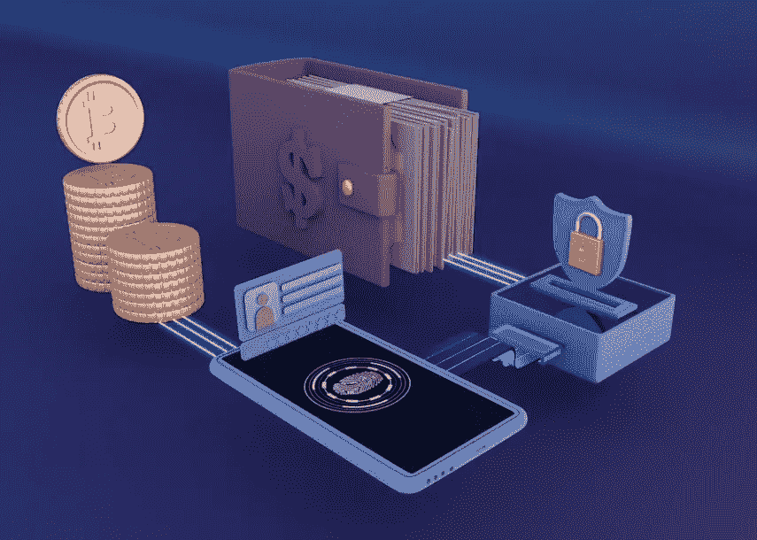

# 关于加密货币钱包开发，你需要知道的一切！

> 原文：<https://medium.com/geekculture/everything-you-need-to-know-about-cryptocurrency-wallet-development-ff0938429b5e?source=collection_archive---------18----------------------->

## 加密货币钱包的开发包括创建一个安全的数字钱包，允许用户存储、发送和接收比特币、以太坊和莱特币等加密货币。

# 什么是加密货币钱包开发？

加密货币钱包开发是创建加密钱包应用程序的过程，可以帮助人们持有和交易加密令牌。考虑到越来越多的企业开始开设网上商店，利用加密钱包模式开展业务在加密领域可能是一种非常规的做法。用户，不管他们的目的是什么(密码持有者/平台所有者)，都可以从这些应用中获得巨大的利益，我们将在博客中看到这一点。这些钱包可以说是每个 Web3 用户的必备应用，因为没有其他方式可以获得持有和投机密码的好处。

cryptocurrency wallet development

# 加密钱包的类型

*   桌面钱包使用户能够将密码存储在桌面上。
*   一个**硬件钱包**是一个专有的 USB 设备，离线存储密码。
*   **网络钱包**是一款需要互联网连接才能访问密码的应用。
*   **手机钱包**是一款支持随时随地访问密码的应用。
*   **全节点钱包**支持在区块链上存储私钥副本。
*   **保管钱包**是由第三方提供商存储私钥的钱包。
*   一个**硬币专用钱包**只存储指定的加密硬币。
*   **特定于网络的钱包**仅在单个区块链上工作，并允许存储基于网络的任何令牌。

# 加密货币钱包应用开发的优势

1.  加密货币钱包开发作为一项业务为用户提供了广阔的空间，因为它是每个 Web3 爱好者必须拥有的主要应用程序。
2.  这些钱包平台通过区块链提供的加密技术提供了一种高度安全的存储加密货币的方式。
3.  多种货币钱包的发展使用户能够以更低的费用快速进行交易，因为没有中介。
4.  使用加密钱包可能是人们的理想选择，因为他们利用区块链技术来确保交易的完整性和稳定性。
5.  这些平台支持在同一个账户中存储多种加密货币，允许用户在各种区块链网络中跨 Web3 应用无缝交易加密货币。

# 不同种类的加密钱包

H **ot 钱包**是需要互联网接入并用于交易的加密货币钱包解决方案。这些通常包括移动、网络和桌面版本的 Web3 钱包。虽然这些对于在旅途中进行交易可能是有用的。

C **旧钱包**是离线钱包，可以存储加密货币，不需要互联网。文档和硬件钱夹是保存私钥的这种钱夹的一些例子。尽管从广义上来说它们是安全的，但它们的物理性质意味着它们可能会丢失或被盗，这可能会产生意想不到的后果。

# 为什么你需要一个加密钱包作为一个创业平台？

如果你是一名关注全球的企业家，加密货币钱包的开发可能有助于吸引更广泛的 Web3 热情社区。在新一代数字环境中，拥有这样的应用程序作为您业务的主干可能是取得成功的理想选择，因为预计在不久的将来会有大量用户涌入。

利用白标加密货币钱包解决方案可以加快您的业务启动，从而更快地获得收益。基于这些应用的企业也可以通过在品牌平台上集成他们的解决方案，从品牌合作中获得更多。

# 加密钱包如何帮助您的业务？

作为一个基于 Web3 生态系统的企业，加密钱包可以在多个方面受益。该平台可以与 Web3 上的其他业务应用程序集成，包括 NFT 市场、NFT 游戏、密码交易所、metaverses 和分散式金融应用程序。与在这些模式下运作的企业建立战略伙伴关系会带来最佳收益。

除了协作之外，很容易将你的 Whitelabel Ethereum 钱包扩展到一个加密金融业务应用程序，如交易所或赌注平台，以便在竞争中脱颖而出。智能合同的使用也将大部分功能委托给网络，减轻了企业的负担。

# 创建加密钱包的过程

✏加密货币钱包的开发从构思和文档开始，所有的计划都被记录下来。

✏:然后，我们进行原型开发，设计并模拟测试平台的前端模型。

✏根据测试结果，前端设计完全具备所有必要的功能。

✏钱包的后端，然后开发。在这里，执行智能合同创建和区块链集成。

✏:现在，加密钱包使用各种测试案例进行了多次测试，错误立即得到解决。

✏加密货币钱包应用程序已经准备好，可以在促销后推出供公众使用。

✏频繁更新经常发布，以保持应用程序的稳定，并根据用户流量平稳运行。

# 加密钱包的优点和缺点

就加密钱包的优点而言，其易于访问的特性和区块链的使用使其成为持有和交易加密偿付的有效工具。此外，它为用户访问大多数应用程序提供了无障碍的体验，因为单个钱包可以作为用户的 Web3 身份。

说到一些陷阱，如果用户不遵循个人预防措施，热钱包很容易被黑客攻击。尽管托管平台可以更好地帮助他们，但如果提供商遭到黑客攻击，这也于事无补。放错硬件钱包可能是致命的，因为没有其他方法可以永远找回用户的密码。

# 常见问题(FAQ)

## 为什么加密货币钱包在美国的发展是有益的？

就美国而言，加州的加密货币钱包发展可以让风险企业受益，利用熙熙攘攘的加密场景。此外，加密货币钱包在德克萨斯州的发展可以让你到达新的市场。

## 印度的加密货币钱包开发成本是多少？

该国的加密货币钱包开发成本远低于世界其他地区，尽管具体数字取决于项目所有者的偏好。

## 推出白标加密货币钱包需要多长时间？

使用预制的加密钱包解决方案，一个商业应用程序可以在几周内启动，因为开发过程是最少的，只涉及前端和最终测试的修改。

# 结论

因此，我们可以说[加密货币钱包的开发](https://bit.ly/3GfEYJh)对于考虑成为加密领域中流砥柱而没有太多风险的企业主来说是完美的。由于有很多型号可供选择，竞争出现了分化，很容易在市场上占领一席之地。然而，如果你与一家经验丰富的加密钱包开发公司合作，为用户提供一个可以轻松实现的安全应用程序是至关重要的。

> *“通过强大、易用、功能丰富的加密货币钱包应用程序赢得全球 Web3 社区的信任！”*