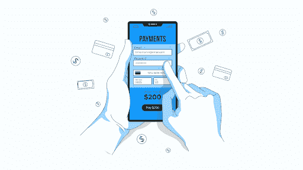

# 关于支付处理应用程序，您需要了解的一切

> 原文：<https://medium.com/geekculture/everything-you-need-to-know-about-payment-processing-apps-fa997cb60586?source=collection_archive---------14----------------------->

在创业之前，作为一个企业主，你有大量的任务要完成。许多指示和说明可以帮助你开始与库存和贷款。这是一份支付处理商和公认支付方式的快速参考指南。

无论你是有实体店还是在线电子商务平台，为你的客户组织一种购买和结账的方式并不像说的那么简单。另一方面，选择支付处理器来验证和确认信用卡和借记卡交易需要时间和精力。所以，让我们从信用卡处理的基础开始。

**什么是支付处理，它是如何工作的？**

当你用信用卡或借记卡购物时，会采取一系列电子步骤来完成交易。消费者、商家/企业、支付处理器、支付网关、银行/信用卡公司和商家账户/企业银行都涉及支付处理。信用卡交易表面上看起来很容易。就像刷卡一样简单，就搞定了。但事实远不止如此。支付被处理、验证、批准或拒绝，并且钱在单个卡交易期间被转移。整个过程只需要几秒钟。让我们一个一个地检查这些步骤。

**支付网关**

支付网关是一种通过支付处理器将客户银行提供的信息安全连接到商家账户的机制。支付网关通知处理器拒绝或接受支付。处理器仍然是通过顺利地从客户的发卡银行(信用卡/借记卡)获得卡信息并将其转移到商家账户来管理交易的处理器。

**支付处理器**

支付处理器就像一辆班车，将数据从发卡银行的信用卡消费者传输到商户账户，接受的支付最终被存入这些账户。支付处理器验证卡的安全性，并帮助将资金从发行银行转移到商家账户。

**购买积分**

当客户与商家进行交易时，他们必须首先提供一种支付形式，可能是借记卡或信用卡、现金、支票或汇票。越来越多的顾客开始使用数字支付方式进行店内和网上购物。

**使用 Quickwork 的顶级支付应用**

1.  **Instamojo**

Instamojo 是数字支付的支付者，也是印度用户的 PayPal 替代品。你可以用它在网上销售商品，收取服务费，即时收款。

**2。工资单**

Paystack 是一种基于 API 的支付服务，允许用户建立在线支付网关，使他们的企业能够接受客户的信用卡和借记卡在线支付。它自动通过最佳渠道进行支付，确保市场上最高的交易成功率。Paystack 的自动和手动欺诈系统可保护您免受欺诈交易和相关退款索赔的影响。

**3。不发光**

Unlimint 是领先的商户和银行服务提供商。Unlimint 提供了一个简单的业务接口，使支付业务能够有效地发展和转移。

Unlimint 为全球企业提供数千种新的支付方式和创新解决方案。

**4。Pi 支付**

Pi Pay 是柬埔寨的一个移动支付应用程序，是一个完全无现金的支付平台，将商家支付服务与各种社交和生活方式功能相结合，包括聊天、地图和朋友查找器。使用 Pi Pay 的 API，您可以高效地创建和管理您的信用销售，并跟踪您所有的应用内交易。

**5。Scalapay**

Scalapay 是一个安全可靠的平台，提供与在线运费支付相关的服务。您可以购买一个产品，立即收到订单，并将金额分成 3 个方便的分期付款，没有利息，按月到期。

虽然我们关注的是支付网关，但同样的集成可以与市场上的任何其他团队管理平台一起开发。每天都有许多新的应用程序出现，为您提供无限的方式来组合您最喜爱的应用程序。查看 Quickwork 平台，开始用很少或没有编码来创建旅程。