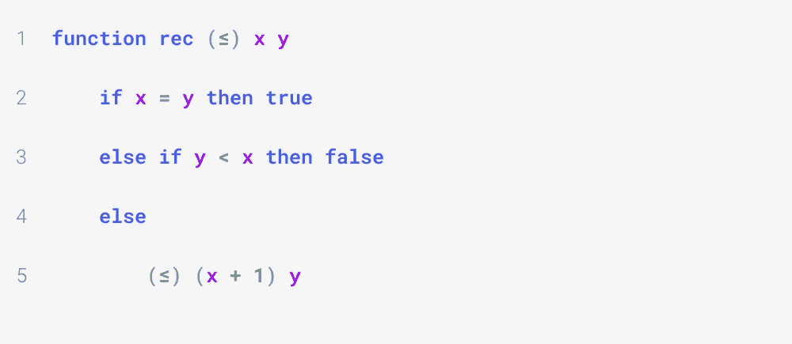
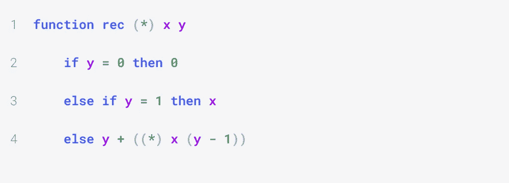
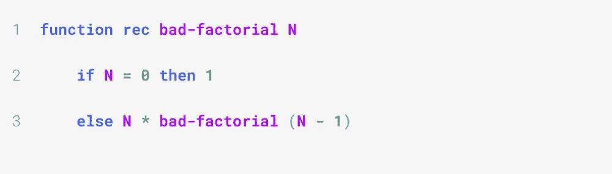
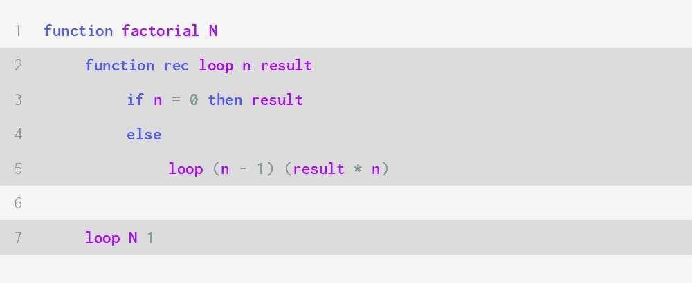
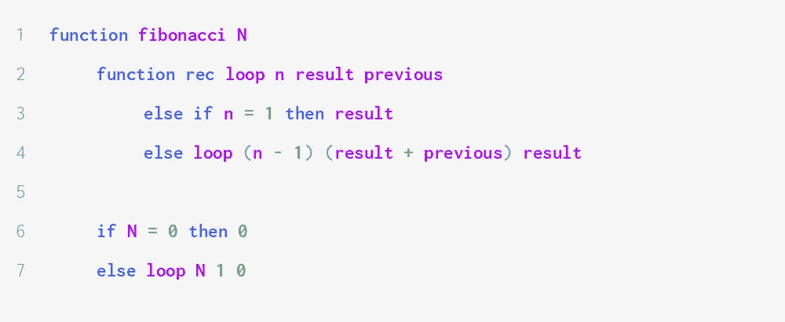
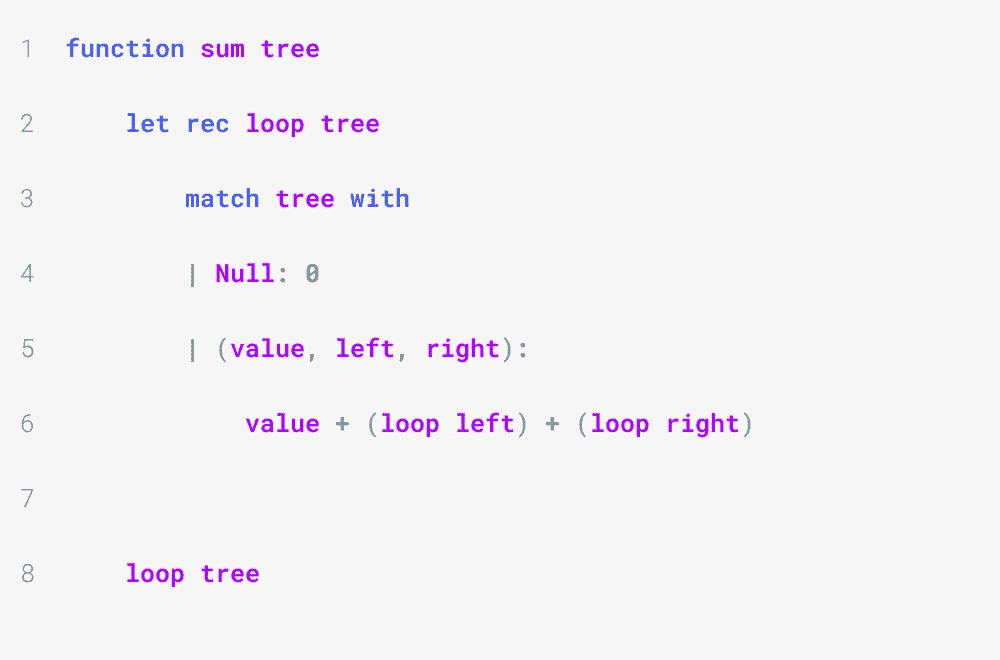
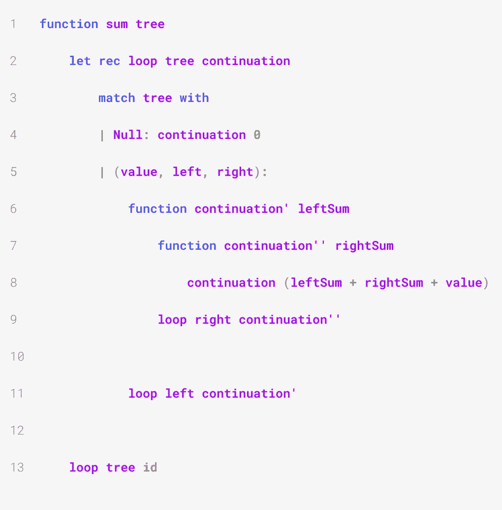
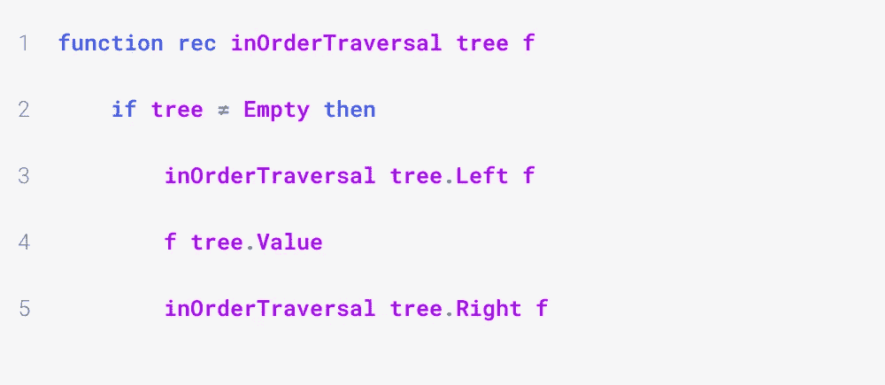
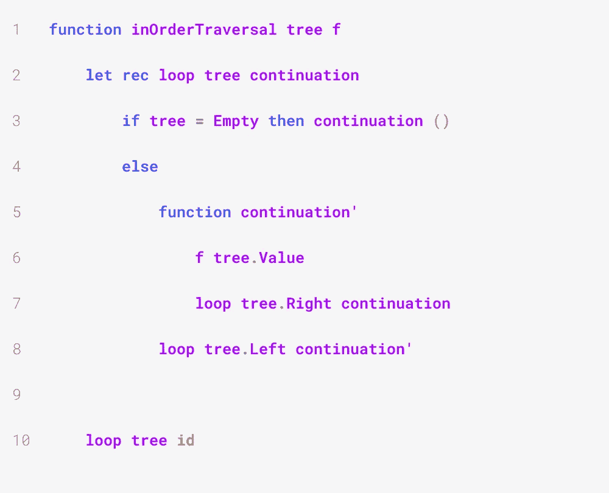

# 关于尾部递归你需要知道的一切

> 原文：<https://medium.com/geekculture/everything-you-need-to-know-about-tail-recursion-c7475ef15f4c?source=collection_archive---------25----------------------->

递归更容易编写，可读性更好，并且不需要可变性。迭代具有更好的性能，消耗更少的内存。尾部递归结合了两者的优点。本文解释了它是什么，为什么它比普通递归更有效，以及如何使函数尾递归。

本文用函数式伪代码进行了说明。

Photo by [Tom Wilson](https://unsplash.com/@pastorthomasbwilson?utm_source=medium&utm_medium=referral) on [Unsplash](https://unsplash.com?utm_source=medium&utm_medium=referral)

# 什么是尾部递归？

当递归调用是一个递归函数执行的最后一个操作时，这个递归函数被称为尾递归函数。例如，下面的函数是尾部递归的:

但是这个不是:

这是因为我们执行递归调用`(*) x (y — 1)`，然后将 *y* 加到结果上:相加就是最后一次调用。

# 何必呢？

递归函数经常因其性能而受到批评，而尾递归能够解决其中一些问题。原因有几个，但我们将重点关注其中一个:堆栈帧的积累。

考虑下面的例子:

对`bad-factorial`的每次调用都会创建一个堆栈框架，存储函数求值过程中创建的所有局部变量。一旦函数终止，堆栈帧将被擦除。

如果你调用`bad-factorial 5`，就会创建一个堆栈框架——我们称之为`bf5`。然后`bad-factorial 4`就叫了。一个新的堆栈帧`bf4`被创建，但是`bf5`仍然在内存中的某个地方，因为`bad-factorial 5`需要知道在执行它的最后一个操作之前`bad-factorial 4`将返回什么值。然后`bad-factorial 3`、`bad-factorial 2`、`bad-factorial 1`和`bad-factorial 0`都被调用，这样就创建了四个新的堆栈帧，`bf3`、`bf2`、`bf1`和`bf0`。最近的调用没有递归调用可执行，因此它终止，并且`bf0`从存储器中被擦除。这允许`bad-factorial 1`计算其返回值，并且`bf1`也消失，接着是`bf2`、`bf3`、`bf4`，最后是`bf5`。

为了计算`bad-factorial N`，我们需要分别存储`N`的所有值，并记住它们，直到原始调用终止，返回最终结果。如果我们的函数需要在每次调用时存储一个数组或任何其他更重的数据，那么所需的空间将会变得巨大。

这将导致可怕的堆栈溢出。

如果一个函数是尾递归的，它会在递归调用开始工作之前终止，因此不会导致堆栈溢出。

# 如何让一个递归函数尾部递归？

有两种主要的技术可以将一个普通的递归函数变成尾递归函数:使用累加器变量和延续传递方式。我们将在本节中探讨这两个问题。

## 累加器变量

累加器变量是一个附加参数，它对应于最后一次递归调用终止时计算的最终值。

这是我们更新的阶乘函数，现在是尾递归的:

我没有直接改变函数，而是创建了一个内部递归函数，`loop`。因此，用户不必担心累加器参数，将能够正常调用函数，只需提供 *N* 的值。

累加器变量是`result`。

我们不是将`factorial (N — 1)`的结果乘以 *N* ，而是将 *N* 传递给它，这样它就知道结果最终必须乘以 *N* 。同样，`factorial (N — 1)`将累加器乘以*N*-1——取值*N*(*N*-1)——并发送给`factorial (N — 2)`，后者将累加器更新为*N*(*N*-1)(*N*-2)，以此类推。

在我的计算机上使用 F#时，非尾递归阶乘函数在用 10^6 调用时会导致堆栈溢出，尾递归函数在这方面做得很好。

另一个更复杂的例子是计算某个自然数 *n* 的第 *n* 个斐波那契数。为了编写一个尾部递归 Fibonacci 计算器，我们需要引入两个累加器变量:一个对应于最终值，另一个对应于前一项。

我们通过添加`previous`来更新结果，在下面的递归调用中，当前结果将是前一个结果。

## 连续传球风格

使用累加器变量使函数尾部递归并不总是可能的。延续传递风格，简称 CPS，解决了这个问题:它是一种更通用的技术，允许将任何递归转换为尾部递归。它稍微复杂一些，一开始可能会有点混乱，但是一切都会好的！

我们不是将累加器变量传递给递归函数 *f* ，而是传递另一个函数告诉 *f* 当它完成计算时该做什么。我们称这个函数为连续函数。

如果我们函数的非尾递归版本有签名`f: T -> U`，其中 T 和 U 是类型，那么尾递归版本有签名`f: T -> (U -> U) -> U`。每次调用都会更新 continuation 函数，基础用例将其结果传递给它，产生最终的计算结果。

例如，假设我们想计算二叉树中所有节点的值的总和。非尾递归函数如下所示:

我们不是执行两次递归调用，而是只在一个子树(比如左边的)上递归，并使用一个连续函数来告诉递归调用:

一旦你完成了，把你的结果发给我。我会计算右子树的和，把它们加起来。”

更准确地说，我们传递给递归调用的延续函数:

1.  取一个参数，`leftSum`；
2.  递归计算右边子树的和`rightSum`;
3.  将`leftSum + rightSum`传递给最初的延续函数。

如果树是空的，我们只需向 continuation 函数发送 0。初始连续函数是恒等函数。

我们实现函数`sum`的 CPS 版本如下:

好吧，这有点让人困惑。我们会给出一个证明，证明它是正确的，希望这能让我们对它的工作原理有一些直觉。

假设我们有一棵只有一个节点的树，值为 *x* 。初始延续功能是`c0 = id`。

为了计算树的和`S`，我们首先计算左子树的和`SL`(第 11 行)，然后调用`c1`(定义在第 6 行)。`c1`计算右边子树的总和`SR`(第 9 行)并调用`c0 (x + SL + SR)`(第 7 行和第 8 行)。

由于`SL`为空，所以我们只调用`c1 0`(第 4 行)。它计算`SR`，也是空的，返回`c0 (0 + 0 + x)`，也就是`x`。

我们已经成功地计算了只有一个节点的树的和。

假设现在我们的函数可以计算一棵最多有 *n* 个节点的树的和，对于某个自然数 *n* 。更准确地说，`loop tree c`，其中`tree`最多有 *n 个*节点，返回`c ST`，其中`ST`是树的实际总和。

现在考虑具有 n + 1 个节点的树`tree`。通过归纳假设，`loop left continuation'`返回`continuation' SL`，其中`SL`是左子树的实际和。同样，`loop right continuation''`返回`continuation'' SR`，其中`SR`是右边子树的实际和。因此`loop tree id`的返回值是`id SR + SL + value`，其中`value`是根节点的值。这证明我们已经成功地计算出了`tree`的总和。

通过归纳，上面的功能`sum`是正确的。

我们以最后一个例子结束:二叉树的有序遍历。下面是一个非尾递归版本的样子:

代替在函数体中运行第 4 行和第 5 行，我们将创建一个 continuation 函数，它说“一旦你遍历了左子树，将当前值传递给`f`，然后遍历右子树。”。

下面是我们如何将它翻译成代码:

