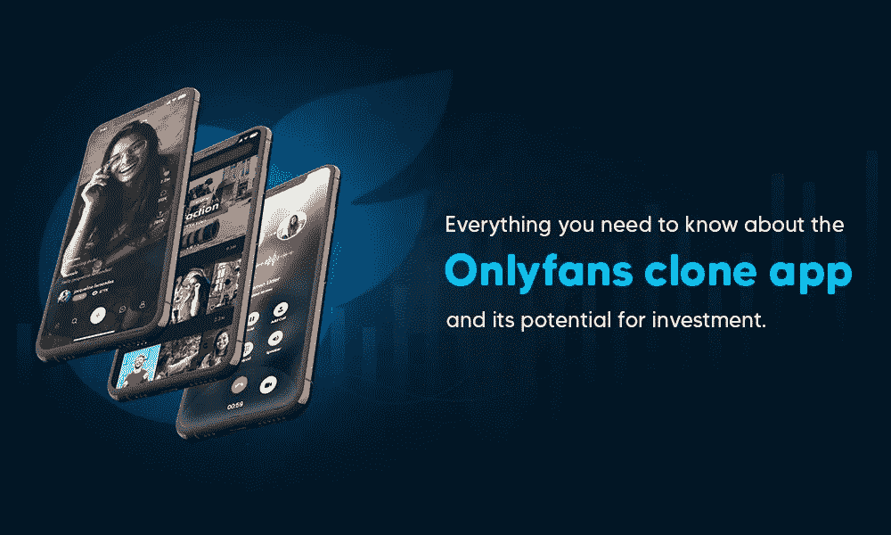

# 关于 Onlyfans 克隆应用程序及其投资潜力，你需要知道的一切。

> 原文：<https://medium.com/geekculture/everything-you-need-to-know-about-the-onlyfans-clone-app-and-its-potential-for-investment-4d7aa0c56584?source=collection_archive---------8----------------------->

Everything you need to know about the Onlyfans clone app and its potential for investment.

收取月订阅费的社交媒体应用 nlyFans clone 最近变得流行起来。由于其基于社交媒体的设计，客户可以更容易地访问它。重要的是要记住，除了名人、博主和有影响力的人之外，成人行业的专业人士也使用这个网络。尽管存在 OnlyFans 克隆应用程序，但还没有多少竞争对手。

自 2016 年首次亮相以来，仅 OnlyFans 一家就为创作者提供了超过 6 亿美元的资金。创作者可以向观众收取每月 4.99 美元至 49.99 美元的内容访问费。他们也可能提供免费的部分，观众可以购买付费内容。其他贡献者可以访问免费或付费页面。

社交网络平台 OnlyFans 允许会员出售自己的创意作品。粉丝可以按月付费观看他们喜欢的表演。由于对可以发布的内容没有限制，该应用程序脱颖而出。

# 唯一的粉丝克隆是什么？

OnlyFans 克隆使作者能够创建他们自己的安全平台，其用户界面可被大多数用户识别。他们之所以称之为克隆，是因为他们理论上复制了原始网站的所有主要功能，但允许客户改变克隆的最终形象。

根据 XSRUS 的研究，只有粉丝的创作者的平均收入大约是每月 180 美元。这个价格并不像人们想象的那么高，但它不包括模特为自己的努力获得的小费，而且有佣金政策，所以只有粉丝从每笔付款中扣除 20%。但是，通过创建一个拥有 [**OnlyFans 克隆脚本**](https://www.alwin.io/onlyfans-clone-script) 的独立网站或手机 app，可以赚得更多，还能省钱。

# 做一个类似 OnlyFans 的 App 有好处吗？

在这一节中，我们将看看为什么有人可能想要建立一个 OnlyFans 克隆的几个原因。你可以借助这些统计数据来理解 OnlyFans app 的成功。让我们开始吧:

*   OnlyFans 现在拥有超过 100 万用户。它很受欢迎，你可能很容易得到唯一的粉丝应用程序克隆。
*   许多用户从 OnlyFans 这样的应用程序中赚钱。相反，OnlyFans 克隆应用的受欢迎程度将随着时间的推移而增长。这是因为它为用户和应用程序所有者提供了创收的理想平台。
*   OnlyFans 应用一半以上的收入来自订阅，其他收入来自按次付费和小费。
*   像 OnlyFnas 这样的 app，不到一年就在用户中流行起来。
*   最受欢迎和最激动人心的应用之一，凭借其尖端的特性和功能将主宰市场。
*   只有 18 岁以上的人才能访问这个应用程序。所以你不必担心它的种类，不管是成人还是正常。其他作者可以选择查看免费或付费页面。

# Onlyfans:最新数据

该网站目前有 100 多万内容创作者，5000 万注册用户，每天有 7000-8000 名新创作者加入。Onlyfans 的首席执行官蒂姆·斯托克利(Tim Stokely)估计，每天有 20 万新客户加入在线订阅平台。

因为平台支持色情，所以通常只用 Onlyfans 做色情节目。然而，它不仅仅是一个色情网站，因为有厨师、健身教练、音乐家、舞蹈家、艺术家和其他人利用它向观众展示他们的才华并赚钱。当新冠肺炎疫情在 2020 年席卷全球时，Onlyfans 上的作者数量急剧增加，增幅约为 40%，而该网站的用户群从 750 万稳步增长至 8500 万。

# OnlyFans 克隆是如何工作的？

Onlyfans 是一个基于订阅的内容共享网络，使用简单。让我们看看 Onlyfans 是如何工作的。

平台上的创作者只需要在 Onlyfans 官方网站上创建一个账户，并开始通过向平台发布内容来赚钱。艺术家完全可以决定是免费还是收费展示他们的作品。粉丝必须按月购买付费内容订阅。

该平台通过防止内容在平台之外被共享来确保对其制作者的完全保护。如果任何 Onlyfans 用户试图对内容进行截图或制作视频，该用户个人资料将被禁止。该平台有严格的隐私政策，这表明他们对其创作者的安全有多担心。为什么不会呢？Onlyfans 创作者是平台唯一的收入来源。该公司成立了一个专门的 DMCA 团队，负责处理平台上违反隐私政策的报告，并发布正式通知，对违法者采取严厉行动。

# 如何在 Onlyfans 上注册成为创建者？

下面列出了作为创建者加入 Onlyfans 的步骤。

*   注册并建立一个帐户。
*   验证电子邮件地址后，将会建立您的个人资料。
*   输入所有必要的信息，包括姓名、地址、个人网站、个人资料图片等。
*   使您的崇拜者能够付款，包括在订阅价格的空间的银行信息。
*   选择您的国家，确认您至少 18 岁，然后选择以下步骤。
*   您现在需要提供进一步的信息，例如您的法定姓名、地址、城市、邮政编码、Twitter 和 Instagram 帐户、网站等。另外，上传一张自拍和政府颁发的身份证。
*   一旦您的帐户被批准，您可以添加您的付款细节，并开始赚钱。

# OnlyFans 应用程序将包含新功能

现在让我们看看像 OnlyFans 这样的应用程序在用户中受欢迎的因素。下面，我们包括了一些关键的元素。为您的应用选择最好的，例如 OnlyFans:

**倾翻**

这个相对较新的功能主要是由抖音推动的，最近由一个名为 OnlyFans 的应用程序推动的。该应用程序向其知名设计师或用户提供一些信息。它鼓励人们每次都创造一些有价值的或有趣的东西。

**顶级粉丝徽章**

就像游戏应用程序有宝石和其他功能一样。与此类似，你可以在 OnlyFans 这样的应用程序中使用数字徽章，通过向忠诚用户提供优质功能来识别他们。这样可以增加用户留存，帮助你的软件获得忠实用户。

**岗位排班**

该组件将允许用户组织他们的职位。他们希望为他们的粉丝和任何国家或地区发布内容。像 OnlyFans 这样的 app 在国际上很受欢迎，由于时区不同，控制好时间和来自其他地区的粉丝非常重要。通过使用后期调度组件，创作者可以随时创建内容并将其发布到他们的粉丝群。

**设计互动投票**

这可以被视为像 OnlyFans 这样的应用程序的关键组成部分。OnlyFans 的秘诀就是获得用户的关注。这就是为什么在你的应用中包含这些组件很重要。因为这些有趣的民意调查使得与粉丝互动变得如此方便，并在故事和帖子中获得他们的支持。

**购买内容**

允许人们付费从他们喜欢的创作者那里下载内容。让他们从任何在线支付方式中获利。

**网上支付**

允许顾客用任何一种数字支付方式进行支付。为消费者提供支付任何高级服务或功能的方法。

# 包扎

阅读这篇文章是创建像 OnlyFans 这样的应用程序的第一步。成本和时间分析可能会让人不知所措，但请记住，这些账目很快就会有回报。如果您对这样的开发项目有任何疑问，请联系 WeAlwin Technologies 是领先的 [**NFT 市场开发公司**](https://www.alwin.io/nft-marketplace-development) 。他们会很乐意帮助你的！