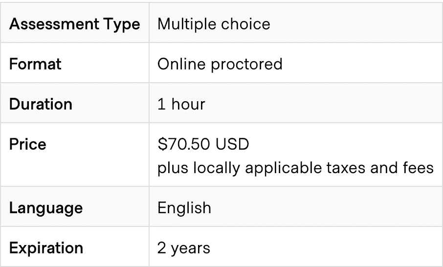
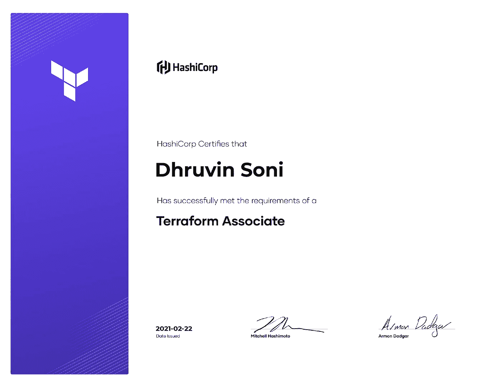

# 关于 Terraform 助理考试你需要知道的一切

> 原文：<https://medium.com/geekculture/everything-you-need-to-know-about-the-terraform-associate-exam-9ab6b45f4e04?source=collection_archive---------16----------------------->

# 什么是 Terraform？

Terraform 是一个开源的**基础设施，作为一个代码工具**，它提供了一个一致的 CLI 工作流，用于安全高效地构建、更改、管理和版本化基础设施。Terraform 帮助在各种云提供商上构建&管理基础设施，如**亚马逊网络服务、谷歌云平台、微软 Azure、**和**本地云，如 VMWare vSphere、OpenStack 或 CloudStack。**

Terraform 是 Hashicorp 的产品之一。Hashicorp 最近开始了云认证，其中包括 Terraform 助理考试。

# **关于认证:**

Terraform Associate 认证面向专门从事运营、IT 的云工程师或了解开源 HashiCorp Terraform 相关基本概念和技能的开发人员。Terraform 认证的有效期为 2 年，是最容易清除的认证之一。

# **先决条件:**

1.基本终端技能
2。对内部部署和云架构有基本的了解

# **考试详情:**

# **考试诚实复习:**

我使用 Terraform 已经有很长一段时间了，发现它是一个非常有趣和强大的基础设施管理工具，我还在各种云提供商上使用 Terraform 开发了一些项目。

在我看来，这个考试值得一试，它包含了非常简单的问题和一些你需要写代码的高级问题。它也是长度合适的考试，不像其他一些考试需要 3 个小时才能完成，PSI 的虚拟远程考试体验也比其他考试好，因为虽然考试长度只有 60 分钟。你需要出示适当的证明，还需要显示你的办公桌面积。

# **学习路径:**

1)学习基础知识

你可以从 [Terraform 课程开始学习 terra form——自动化你的 AWS 云基础设施](https://www.youtube.com/watch?v=SLB_c_ayRMo&t=2214s) youtube 视频。这个视频将涵盖理论和实践的所有基本步骤。

**2)深入学习**

学习完基础知识后，您可以通过访问 Udemy 上的 Zeal Vora 的[**terraform-初级到高级**](https://www.udemy.com/course/terraform-beginner-to-advanced/) 课程，开始深入学习 terra form 的各种主题。本课程将涵盖您需要为认证做准备的所有主题，并且本课程还有 2 个模拟测试。本课程将让您熟悉 AWS 基础架构配置。

**3)动手操作** 现在是时候动手配置、更新和销毁您首选的云提供商的基础设施了。
**理解下面 4 个字。**
1。地形初始化
2。地形图
3。地形应用
4。Terrafrom 毁灭

各种例子和语法可以参考 terraform 的官方 [**文档**](https://www.terraform.io/docs/index.html) 。

完成一些练习题
在完成课程和阅读文档后，你就为考试做好了准备，但在此之前，做一些练习题来检查你的知识总是好的，所以，我在这里给你一些最好的练习题来复习你的知识。

1.  **小考专家的** Terraform 协理实务考试 2021
    [https://www . udemy . com/course/hashi corp-certified-terra form-Associate-2020/](https://www.udemy.com/course/hashicorp-certified-terraform-associate-2020/)
2.  **Bryan Krausen 的** Terraform 协理实务考试 2021
    [https://www . udemy . com/course/terra form-Associate-Practice-Exam/](https://www.udemy.com/course/terraform-associate-practice-exam/)

**5)考试后** 考试结束后，您将立即获得详细的成绩，并在 2-4 天内获得徽章&认证。

这就是考试的全部内容。你可以随时在 LinkedIn 上和我联系:[**https://www.linkedin.com/in/dhruvinksoni/**](https://www.linkedin.com/in/dhruvinksoni/)

如果你觉得这个指南很有帮助，那么请给我一个赞，也可以随意发表评论。