# 创建 Recyclerview 应该知道的一切

> 原文：<https://medium.com/geekculture/everything-you-should-know-to-create-a-recyclerview-3defdb660a2f?source=collection_archive---------1----------------------->

## 如何用 4 个简单的步骤和 4 个例子制作 Recyclerview


Source: [Alliesinteractive](https://www.freepik.com/alliesinteractive) on [Freepik](https://www.freepik.com/vectors)

Android RecyclerView 是 ListView 的更高级版本，具有更高的性能和其他优势。RecyclerView 类扩展了 ViewGroup 类并实现了 ScrollingView 接口。它是在棉花糖中引入的。RecyclerView 主要用于设计对 android 应用程序的列表和网格进行细粒度控制的用户界面。

在本教程中，我们将学习如何使用自定义布局呈现简单的 RecyclerView。我们还将学习如何编写适配器类、定制模型和项目点击监听器。我们要设计的 recycler 视图包含了一个漫威英雄及其年龄的列表(年龄随机给出)。

# 回收视图的结构

要实现一个基本的再循环视图，需要构建三个子部分，这三个子部分为用户提供了他们在选择不同设计时所需的控制程度。

*   **项目布局**:卡片布局是一个 XML 布局，将被视为 RecyclerView 创建的列表的一个项目。
*   **数据类**:数据类是一个定制的 java 类，充当保存 RecyclerView 的每一项信息的结构。
*   **适配器**:适配器是负责 RecyclerView 的主代码。它拥有处理实现的所有重要方法
*   view holder:view holder 是一个 java 类，是适配器的一部分，它存储了对卡片布局视图的引用，在程序执行过程中，这些视图必须通过一系列数据进行动态修改，这些数据可以通过在线数据库获得，也可以通过其他方式添加。

# 适配器

成功实施的基本方法是:

*   **onCreateViewHolder** :处理卡片布局的膨胀，作为 RecyclerView 的一个项目。
*   **onBindViewHolder** :处理与点击 RecyclerView 的特定项目相关的不同数据和方法的设置。
*   **getItemCount** :返回 RecyclerView 的长度。
*   **onAttachedToRecyclerView**:将适配器连接到 RecyclerView。(不需要)

## 使用 RecyclerView 的 Gradle 依赖关系:

RecyclerView 小部件是对 API 7 或更高级别有效的单独库的一部分。在 Gradle 构建文件中添加以下依赖项以使用 recyclerview。

Gradle 脚本> build.gradle 和内部依赖项

```
dependencies {
…
   implementation "androidx.recyclerview:recyclerview:1.2.0"
}
```

# 以下是制作 Recyclerview 的步骤:

## 1.设置回收视图


如上图所示，在布局中添加 Recyclerview，并将其设置为 size " **match_parent** "。同样，给它的 id 为“ **@+id/recyclerview** ”。现在转到代码部分，将变量 **mRecyclerview** 作为 Recyclerview 的实例，并使用“ **findViewById()** ”将其附加到布局部分。

```
<androidx.recyclerview.widget.RecyclerView
    android:id="@+id/recyclerview"
    android:layout_width="match_parent"
    android:layout_height="match_parent" />//Java CodeRecyclerView mRecyclerView;//Inside OnCreate()
mRecyclerView = findViewById(R.id.*recyclerview*);
```

## 2.设计自定义项目布局

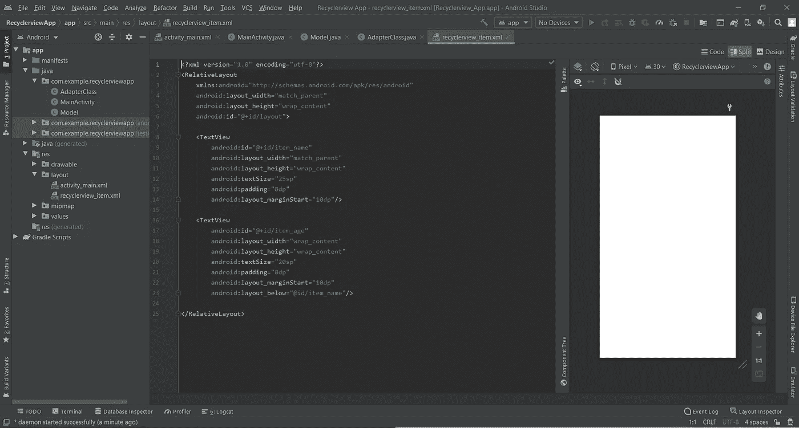

如上图所示，我们将创建一个名为“**recycle view _ item . XML**”的新资源文件。我们将在相对布局中添加两个文本视图，因为我们想显示我们英雄的名字和年龄。

```
<RelativeLayout
    xmlns:android="http://schemas.android.com/apk/res/android"
    android:layout_width="match_parent"
    android:layout_height="wrap_content">

    <TextView
        android:id="@+id/item_name"
        android:layout_width="match_parent"
        android:layout_height="wrap_content"
        android:textSize="25sp"
        android:padding="8dp"
        android:layout_marginStart="10dp"/>

    <TextView
        android:id="@+id/item_age"
        android:layout_width="wrap_content"
        android:layout_height="wrap_content"
        android:textSize="20sp"
        android:padding="8dp"
        android:layout_marginStart="10dp"
        android:layout_below="@id/item_name"/>

</RelativeLayout>
```

## 3.创建数据类(自定义模型)

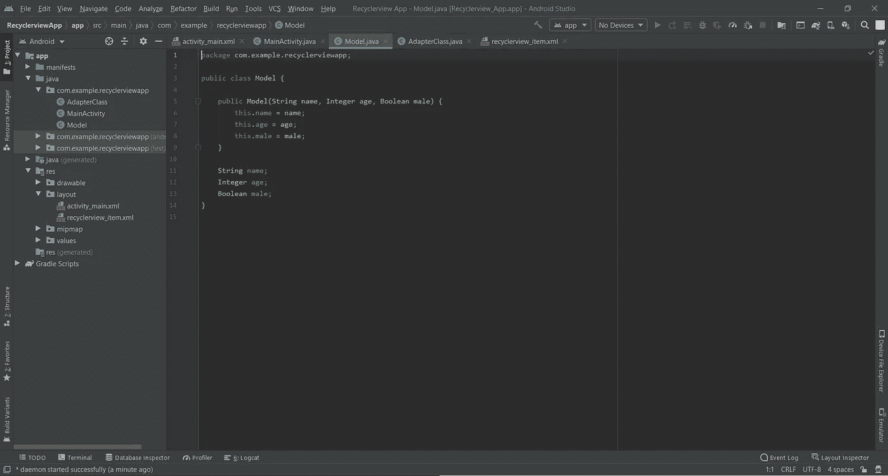

如上图所示，我们将创建一个名为“**Model.java**”的新 java 文件。它应该可以记录英雄的名字和年龄。这个变量的每一项都包含一个英雄的信息。

```
public class Model {

    public Model(String name, Integer age) {
        this.name = name;
        this.age = age;
    }

    String name;
    Integer age;
}
```

## 4.创建适配器

适配器是呈现和处理与 recyclerview 相关的一切的逻辑。Viewholder 是它的一部分，它保存对我们在结构中创建的项目布局元素的引用。

我们将创建一个新的 java 文件，命名为“**AdapterClass.java**”。我们需要适配器来扩展"**recycle view。适配器<适配器类。ViewHolder >** "但是由于我们还没有创建 ViewHolder，所以会显示一个错误。我们将使用下面给出的代码在 AdapterClass 文件中创建**视图控件**。

```
public class AdapterClass extends RecyclerView.Adapter<AdapterClass.ViewHolder> {public class ViewHolder extends RecyclerView.ViewHolder {
    TextView name, age;
   public ViewHolder(@NonNull View itemView) {
        super(itemView);
        name = itemView.findViewById(R.id.*item_name*);
        age = itemView.findViewById(R.id.*item_age*);
   }
  }
}
```

之后，我们需要实现默认的 Recyclerview 方法，按住 **Ctrl + O** ，同时将光标保持在适配器类中。会显示一个名为**实施方法**的选项，点击它，然后点击**“确定”**。您会发现有三个方法，分别是" **onCreateViewHolder()** "、" **onBindViewHolder()** "和" **getItemCount()** "，它们的功能在适配器部分有描述。

```
@NonNull
    @Override
    public AdapterClass.ViewHolder onCreateViewHolder(@NonNull ViewGroup parent, int viewType) {

    }

    @Override
    public void onBindViewHolder(@NonNull AdapterClass.ViewHolder               holder, int position) {
   }

    @Override
    public int getItemCount() {
        return 0;
    }
```

我们需要在“ **onCreateViewHolder()** ”中添加下面给出的代码，它为列表中的每个项目创建一个视图，作为我们的自定义项目布局的实例。

```
return new ViewHolder(LayoutInflater.*from*(parent.getContext()).inflate(R.layout.*recyclerview_item*, null));
```

之后，我们将创建一个名为" **data** "的自定义数组列表，如下所示，它将保存英雄的信息作为模型对象的列表。

```
ArrayList<Model> data = new ArrayList<>();
```

我们需要在“ **onBindViewHolder()** ”中添加下面给出的代码，它显示了列表中每个英雄的姓名和年龄。

```
holder.name.setText(data.get(position).name);
holder.age.setText(data.get(position).age.toString());
```

我们需要在“ **getItemCount()** ”中添加下面给出的代码，它将返回列表中出现的项目数。

```
return data.size();
```

我们已经完成了适配器的所有必要代码，但是如何才能获得适配器中的英雄数据列表呢？为此，我们将通过按下 **Alt + Insert** 并选择数据作为构造函数中的一个字段，在 AdapterClass 中添加一个**构造函数**。也可以复制如下代码。

```
public AdapterClass(ArrayList<Model> data) {
    this.data = data;
}
```

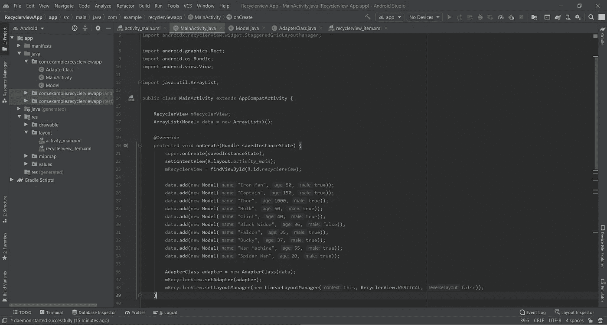

完成这些步骤后，我们将手动制作一个如上图所示的英雄及其数据列表，并制作一个**适配变量**。我们将把这个适配器分配给 mRecyclerview 变量。代码如下所示

```
// Manual Data Entry
data.add(new Model("Iron Man", 50, true));
data.add(new Model("Captain", 150, true));
data.add(new Model("Thor", 1000, true));
data.add(new Model("Hulk", 50, true));
data.add(new Model("Clint", 40, true));
data.add(new Model("Black Widow", 36, false));
data.add(new Model("Falcon", 35, true));
data.add(new Model("Bucky", 37, true));
data.add(new Model("War Machine", 55, true));
data.add(new Model("Spider Man", 20, true));mRecyclerView.setAdapter(adapter);
mRecyclerView.setLayoutManager(new LinearLayoutManager(this, RecyclerView.*VERTICAL*, false));
```

## 样品

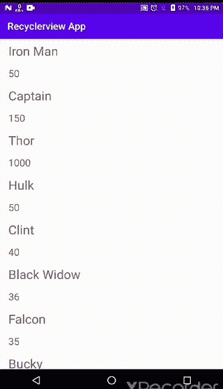

> 好哇，我们做了一个循环回顾，很简单吧？我们将在下面的例子中改进它的功能，因为现在它只会显示一个滚动的列表。

这是一个简单的 recyclerview。现在我们需要增强它，以便它可以在应用程序中成功使用。我们将研究 recyclerview 最常用的 4 个必要功能。

# 以下是我们将要研究的 4 个特性:

## 1.项目点击监听器

由于简单的列表在大多数情况下不起作用，我们将为每个项目添加一个点击监听器。它将检测用户在项目上的点击，并执行块中编写的代码。我们可以添加许多类型的侦听器，但我们将致力于“**单击侦听器**和“**长点击侦听器**”。我们将在用户点击时显示 **Toast** ，但是你可以根据你的需要自定义它，比如打开其他活动，或者显示对话框或者显示英雄细节等等。

我们需要将 id“layout”分配给“recyclerview _ item.xml”文件的相对布局。

```
android:id="@+id/layout"
```

之后，我们会将它添加到 Viewholder，如下所示。

```
RelativeLayout layout;//Inside Constructor
layout = itemView.findViewById(R.id.*layout*);
```

现在我们需要为单击和长时间单击添加点击监听器，并为它们显示不同的祝酒词，所以我们将如下所示添加它们。

```
holder.layout.setOnClickListener(new View.OnClickListener() {
    @Override
    public void onClick(View v) {
        Toast.*makeText*(mContext, data.get(position).name + " is clicked", Toast.*LENGTH_SHORT*).show();
    }
});

holder.layout.setOnLongClickListener(new View.OnLongClickListener() {
    @Override
    public boolean onLongClick(View v) {
        Toast.*makeText*(mContext, data.get(position).name + " is long clicked", Toast.*LENGTH_SHORT*).show();
        return true;
    }
});
```

## 样品

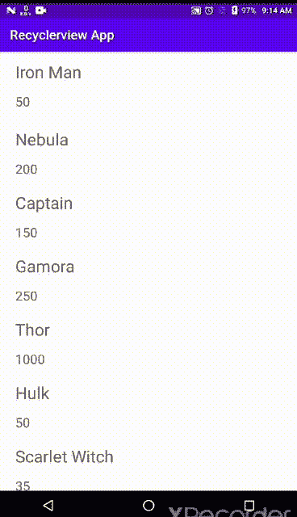

## 2.布局经理

在 Android 中，RecyclerView 需要有一个布局管理器和一个适配器来实例化。布局管理器是 recycle view 中引入的新概念，用于定义 recycle view 应使用的布局类型。它包含由条目数据填充的所有视图的引用。我们可以通过扩展**recycle view 来创建一个定制的布局管理器。LayoutManager** 类，但是 RecyclerView 提供了三种类型的内置布局管理器。

*   **线性布局管理器** —用于显示水平或垂直可滚动列表中的项目
*   **GridLayoutManager** —用于以网格格式显示项目
*   **StaggeredGridLayoutManager**—用于在交错网格中显示项目。

## 线性布局管理器

它用于显示水平或垂直可滚动列表中的项目。如果我们需要一个列表(垂直的或水平的),那么我们需要使用带有明确方向的 LinearLayoutManager。

**LinearLayoutManager(Context Context，int orientation，boolean reverseLayout):** 在此第一个参数用来设置当前上下文，第二个用来设置布局方向应该是垂直还是水平。通过使用这个构造函数，我们可以很容易地创建一个水平或垂直的列表。第三个参数是布尔值，当设置为 true 时，项目以相反的顺序显示。

**默认线性布局:**

```
// get the reference of RecyclerViewRecyclerView mRecyclerView = findViewById(R.id.recyclerview);// set a LinearLayoutManager with default mRecyclerView.setLayoutManager(new LinearLayoutManager(this, RecyclerView.*VERTICAL*, false));
```

## 样品


**反向线性布局:**

只需将**假** *改为* **真**即可逆序显示项目。

```
// get the reference of RecyclerViewRecyclerView mRecyclerView = findViewById(R.id.recyclerview);// set a LinearLayoutManager with defaultmRecyclerView.setLayoutManager(new LinearLayoutManager(this, RecyclerView.*HORIZONTAL*, false));
```

## 样品

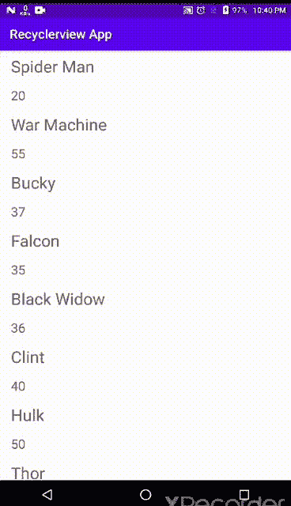

## GridLayoutManager

它用于在网格布局中显示项目。我们可以使用 GridLayoutManager 将 RecyclerView 显示为 GridView。

**GridLayoutManager(Context Context，int span count，int orientation，boolean reverse layout):** 在这个构造函数中，第一个参数用于设置当前上下文，第二个参数用于设置 span count，即网格中的列数，第三个参数用于设置布局方向，应该是垂直还是水平，最后一个参数是一个 boolean，当设置为 true 时，项目以相反的顺序显示。

```
// get the reference of RecyclerViewRecyclerView mRecyclerView = findViewById(R.id.recyclerview);// set a GridLayoutManager with 3 number of columns , horizontal gravity and false value for reverseLayout to show the items from start to end// set LayoutManager to RecyclerViewmRecyclerView.setLayoutManager(new GridLayoutManager(this,2,LinearLayoutManager.HORIZONTAL,false));
```

## StaggeredGridLayoutManager

它用于在交错的网格中显示项目。如果列表中的项目可以扩展，它比 GridLayoutManager 更好。它会自动按照项目的长度排列项目，而不会剪切它们，这在 GridLayoutManager 中是不可用的。

**StaggeredGridLayoutManager(int span count，int orientation)** :用于创建一个有两个参数的 StaggeredGridLayoutManager。第一个参数用于设置 spanCount，如果方向是垂直的，则表示列数；如果方向是水平的，则表示行数；第二个参数用于设置方向，应该是垂直或水平。

**垂直方向:**

```
// get the reference of RecyclerViewmRecyclerView = findViewById(R.id.*recyclerview*);// set a StaggeredGridLayoutManager with 3 number of columns and vertical orientation// set LayoutManager to RecyclerViewmRecyclerView.setLayoutManager(new StaggeredGridLayoutManager(2, StaggeredGridLayoutManager.VERTICAL));
```

## 样品

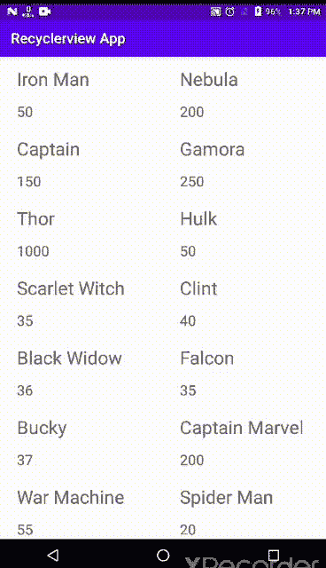

**水平方向:**

```
// get the reference of RecyclerViewmRecyclerView = findViewById(R.id.*recyclerview*);// set a StaggeredGridLayoutManager with 3 number of columns and vertical orientation// set LayoutManager to RecyclerViewmRecyclerView.setLayoutManager(new StaggeredGridLayoutManager(2, StaggeredGridLayoutManager.HORIZONTAL));
```

## 样品

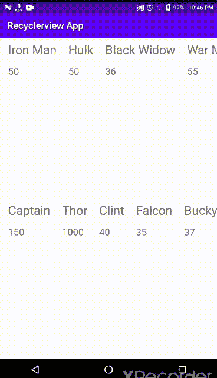

## 3.数据处理

我们在许多应用程序中看到，列表中的数据是按照升序、降序或自定义因子排列的，我们可能还需要作为开发人员来实现它。下面是我们将要进行的两种数据处理:

*   **排序**
*   **区分**

## 分类

我们将根据英雄的年龄按升序排列这个列表。为此，我们将转到 AdapterClass 并创建一个新的公共方法" **sortByAge** ",如下所示。这个方法接收并在排序后返回一个数据列表。这里我们使用 Java 的**比较器**类，比较 **o1** 和 **o2** 对象的年龄变量(每个对象都会在 o1 和 o2 内进行比较和排序)。

```
public ArrayList<Model> sortByAge(ArrayList<Model> data) {
    Collections.*sort*(data, new Comparator<Model>() {
        @Override
        public int compare(Model o1, Model o2) {
            if(o1.age>o2.age)
                return 1;
            else if(o1.age<o2.age)
                return -1;
            else return 0;
        }
    });
    return data;
}
```

我们也可以通过反转代码进行降序排序，如下所示。

```
public ArrayList<Model> sortByAge(ArrayList<Model> data) {
    Collections.*sort*(data, new Comparator<Model>() {
        @Override
        public int compare(Model o1, Model o2) {
            if(o1.age>o2.age)
                **return -1**;
            else if(o1.age<o2.age)
                **return 1**;
            else return 0;
        }
    });
    return data;
}
```

我们需要使用这种方法对我们的“**数据**列表进行排序。在创建视图之前，我们将在 **OnCreateViewHolder()** 类中调用这个方法。在 OnCreateViewHolder()中不一定要执行，它可以在任何地方执行。代码如下。

```
data = sortByAge(data);
```

## 样品

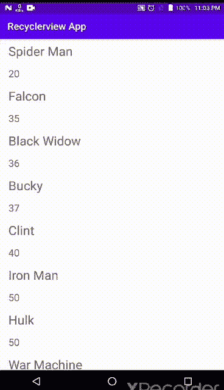

## 区别

我们可以根据数据的不同属性来处理数据。这里我们会根据性别来区分英雄，给他们不同的颜色。雄性将会是蓝色的**，雌性将会是黄色的**。为此，我们需要在**模型**文件中添加一个名为“**男性**的布尔变量，以确定主人公是否为男性。****

```
**public class Model {

    public Model(String name, Integer age, **Boolean male**) {
        this.name = name;
        this.age = age;
        **this.male = male;**
    }

    String name;
    Integer age;
    **Boolean male;**
}**
```

****我们还将创建一个名为“ **addHeros** ”的方法来代替手动数据输入(为了更好地观看，没有必要)，并添加更多的女性英雄，如下面的代码所示。****

```
**public void **addHeros**() {
    data.add(new Model("Iron Man", 50, true));
    data.add(new Model("Nebula", 200, false));
    data.add(new Model("Captain", 150, true));
    data.add(new Model("Gamora", 250, false));
    data.add(new Model("Thor", 1000, true));
    data.add(new Model("Hulk", 50, true));
    data.add(new Model("Scarlet Witch", 35, false));
    data.add(new Model("Clint", 40, true));
    data.add(new Model("Black Widow", 36, false));
    data.add(new Model("Falcon", 35, true));
    data.add(new Model("Bucky", 37, true));
    data.add(new Model("Captain Marvel", 200, false));
    data.add(new Model("War Machine", 55, true));
    data.add(new Model("Spider Man", 20, true));
    data.add(new Model("Pepper", 49, false));
}**
```

****现在我们将转到 **AdapterClass** ，我们只需要添加下面这 3 行简单的代码，它们是" **if-else** "块，用于检查男性和女性，并为他们的布局分配一种颜色。****

```
**if (data.get(position).male) {
    holder.layout.setBackgroundColor(Color.BLUE);
} else holder.layout.setBackgroundColor(Color.YELLOW);**
```

## ****样品****

****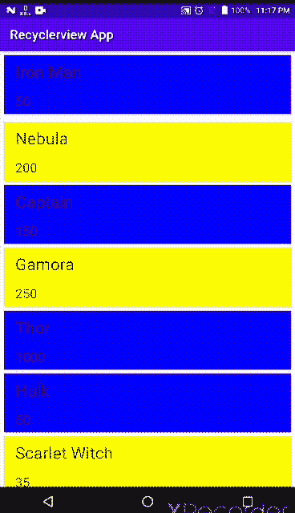****

## ****4.项目装饰****

****recycle view 允许你在 recycle view 中插入装饰物品的插件。Itemdecoration 是一个单独的组件，需要定义并添加到 recyclerview 中。物品装饰可以画在物品的四个面上。ItemDecoration 让开发人员可以完全控制装饰的测量和绘制。装饰可以是隔断，也可以只是一个插页。****

****我们采取了一个简单的方法来理解分割线，对于更高级的装饰，如盒子或线分隔符，你可以在网上搜索。****

****我们正在 MainActivity 中创建一个名为“ **Decoration** ”的客户类。我们的目标是根据用户输入在项目之间提供空间。****

```
**public class Decoration extends RecyclerView.ItemDecoration {
    private int space;

    public Decoration(int space) {
        this.space = space;
    }

    @Override
    public void getItemOffsets(Rect outRect, View view, RecyclerView parent,
            RecyclerView.State state) {
        outRect.left = space;
        outRect.right = space;
        outRect.bottom = space;

        if (parent.getChildAdapterPosition(view) == 0 | parent.getChildAdapterPosition(view)
                == 1) {
            outRect.top = space;
        }
    }
}**
```

****我们可以为 recyclerview 添加装饰，方法是创建自定义类的一个变量，然后在 MainActivity 中将它赋值，如下所示。****

```
**Decoration decoration = new Decoration(30);
mRecyclerView.addItemDecoration(decoration);**
```

## ****样品****

****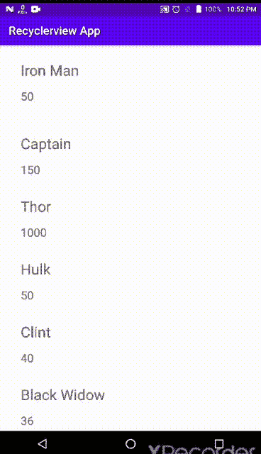****

****这里我取了 **30** ，就间距而言这是一个很大的数字，但我这样做了，所以你可以看到一个显著的差异。你想要多少空间都可以。****

> ****如果你已经到了这一步，你已经知道了制作 Recyclerview 的所有必要知识。以上 4 种是最常用的循环视图。您可以通过使用代码来探索更多内容。recyclerview 有无穷无尽的可能性和组合，所以继续学习吧。****

******这里是文件的完整代码，您可以用它来创建自定义的 recyclerview。******

## ****布局****

# ****Java 代码****

****谢谢你抽出时间。如果你觉得这个教程知识渊博，有帮助，请在下面欣赏它。你可以在这里 **找到我其他类似的文章 [**。**](https://patelvatsalb21.medium.com/)******

**如果你想谈更多或有任何疑问，你可以联系我，通过-**

**- [Linkedin](https://www.linkedin.com/in/vatsal-patel-919691193/)**

**- [推特](https://twitter.com/VatsalP68888638)**