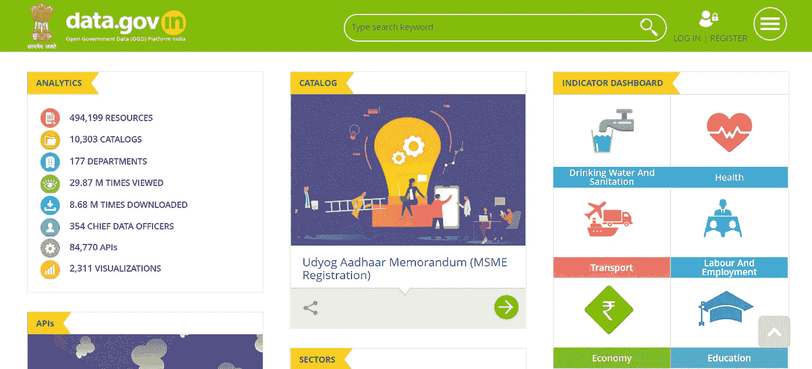
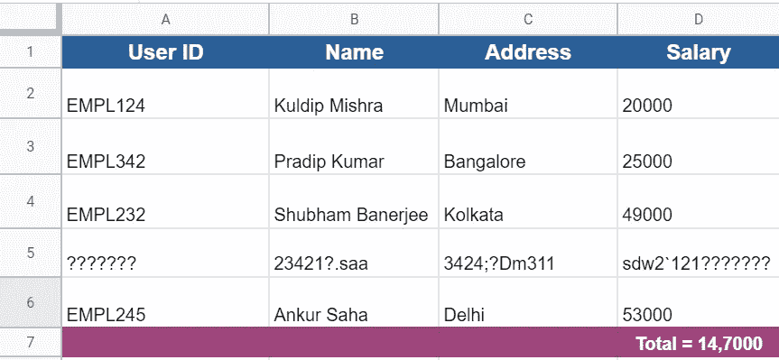
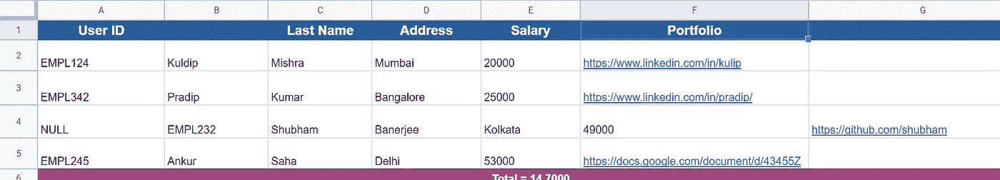
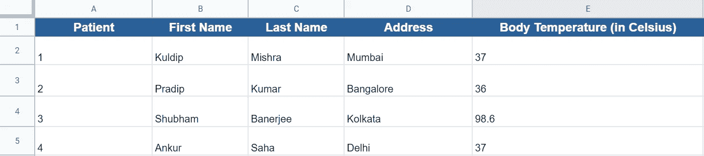
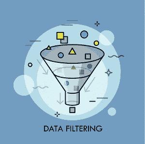

# 关于探索性数据分析(EDA)你想知道的一切第 1 部分

> 原文：<https://medium.com/geekculture/everything-youve-ever-wanted-to-know-about-exploratory-data-analysis-eda-part-1-7b48782db774?source=collection_archive---------15----------------------->

> ***如果不能简单的解释，说明你理解的不够好。***
> 
> 物理学家阿尔伯特·爱因斯坦

探索性数据分析提供了简化数据、揭示重要见解的能力，并且通常通过分析和调查数据来提供数据集中隐藏的模式。

这是第一步，也是最重要的一步，分析任何类型的数据，并试图提出一个关于它的假设，我们稍后可以使用假设检验来检验这个假设。统计学家用它来对数据进行**鸟瞰**，并试图理解它。

# 为什么探索性数据分析很重要？

EDA 有助于在做出任何假设之前查看数据。它有助于更好地理解数据中的模式，找到变量之间的关系，识别明显的错误，以及检测数据中的异常值。

> 数据科学家可以使用探索性分析来确保他们产生的结果是有效的，并且适用于任何期望的业务成果和目标。EDA 还通过确认利益相关者提出了正确的问题来帮助他们。EDA 可以帮助回答关于标准差、分类变量和置信区间的问题。一旦 EDA 完成并得出见解，其功能就可以用于更复杂的数据分析或建模，包括机器学习。

# 执行 EDA 的步骤

1.  **数据采集**

数据来自各种来源，如政府或其他公共机构收集的大量数据被公开用于研究。在数据源中，首要任务是从以下数据源收集所有信息

*a)* ***公共数据:*** *此类数据由政府或其他公共机构出于研究或其他目的公开提供。这些数据可以作为数据集直接取出，或者必须手动提取并转换成格式*

*举个例子——*[*https://data.gov.in/*](https://data.gov.in/)

*b)* ***私人数据:*** *这类数据对组织或个人来说比较敏感，这也是这类数据不能公开的原因。此外，这些类型的数据大多提供以客户为中心或以组织为中心的数据，这有助于优化组织的日常流程并增强客户体验。*

**2。数据清理**

从各种资源获取所有数据后，大多数案例数据都有重大质量问题，如**缺失值、错误的数据或格式、重复数据以及更多**。这些问题会导致错误或不相关的输出，因此有必要处理这些类型的问题并修复质量。质量检查是整个数据分析中**最关键也是最耗时的过程**之一。

数据清理过程可以根据数据集质量和改进要求而变化。尽管如此，在清理数据时，数据分析师可能会记住以下步骤以供参考:

a) ***修复行:*** *删除降低数据集质量的不正确行。可以通过* ***删除不正确的行、删除汇总行以及删除不会提供对数据集*** *的任何洞察的额外行来处理行的固定。*

*例如:在* ***图 A 中，第 5 行*** *数据损坏，建议删除这类行。如前所述，关于图 A 中* ***的汇总行，第 7 行*** *已被删除以固定行。*

**Figure — A**

*b)* ***固定列:*** *现在行数据固定后，可能还需要固定一些列，以增加数据集的质量。可以通过* ***删除不必要的列、拆分列以获得更多细节、添加缺少的列名、对齐未对齐的列、合并标识符的列来处理列的固定。***

*比如:*

*   *在图 B 的* ***中，第 4 行*** *的数据未对齐，为了解决这个问题，只需将第 5 行的列左移一位。*
*   *同样，在* ***图 B 中，B 列*** *缺少表的行名，这类问题可以通过观察列数据提供名称来解决，在当前示例中，我们可以将名称提供为“* ***名字*** *”，因为它包含员工的名字。*
*   可以为标识符合并列或最小化数据示例我们可以合并**‘名字’**、**‘姓氏’**，并创建一个新列作为**‘全名’**
*   还可以拆分列以从单个列中获取相关数据，例如，可以拆分**‘Portfolio’**列以获取员工用于展示投资组合的领域详细信息。

**Figure — B**

***3* 。修复缺失值**

*a)* ***将值设置为缺失值*** *:识别所有缺失值，如空白字符串、“NA”、“XX”、“999”等。*

*b)*

*c)* ***删除行、列:*** *如果缺失值相当大，可以删除行或列，因为处理大量缺失数据可能会导致不正确的结果。因此，如果有必要，最好删除行和列。*

*d)* ***使用商业判断填充部分缺失值:*** *使用均值、中值、众数等多种方法填充缺失数据。可以根据数据的行为改变填充过程*

**4。标准化数值**

标准化值是下一步，需要通过理解数据集来正确处理。这有助于将数据转换成通用格式，以便用户能够处理和分析数据

以下是标准化这些值时需要注意的步骤:

*a)* ***标准化单位:*** *确保所有变量都有一个通用且一致的单位，如英里/小时到公里/小时等。*

*b)* ***如有需要的标度值*** *:确保变量下的观察值具有共同的标度标准化精度，以便更好地呈现数据，例如* 3.14159 *到 3.14。*

*c)* ***移除异常值:*** *如果需要，移除会对您的分析结果产生不相称影响的高值和低值*

**5。修复无效值**

查找无效值可能会带来很大的麻烦，因为数据可能是语法无效或语义无效的，或者可能会因为编码类型而提供垃圾数据。

数据可能无法提供正确值的原因有很多，下面是一些例子:

*   ***修复不正确的数据类型:*** *修复不正确的数据类型也是分析所必需的，例如将数值型数据保存为字符串，如****‘93500’****需要保存为* ***93500***
*   ***正确编码 Unicode:****数据集可能会提供垃圾结果解决这类问题的方法是更改编码类型。*
*   ***修复不正确的值:*** *如前所述，数据中也可能存在语义问题。这种类型的错误可以通过删除行、更改列的某些值的类型来修复。*

*比如在* ***图 C 中，第 4 行:E 列*** *按照逻辑，人类无法处理****98.6*C***。因此，根据理解，可能会发生有人添加了错误的数据或数据的类型是错误的，在该示例中，****【98.6】****值可能表示特定数据是用华氏温度写入的。因此，超出范围的数据可能会被删除，或者我们可以将数据转换为所需的结果，因为这里的* ***98.6(华氏)*** *将转换为* **37 C**

**Figure — C**

*   ***不在列表中的正确值:*** *删除不属于列表的值。例如，在包含个体血型的数据集中，字符串“E”或“F”是无效值，可以被删除。*
*   ***纠正错误结构:*** *不遵循已定义结构的值可以去掉。例如，在包含印度城市的 pin 码的数据集中，10 位数的 pin 码将是无效值，需要删除。*

**6。过滤数据**

过滤数据有助于最小化数据集，并根据相关性过滤掉整个数据集。

过滤的步骤如下:

*   ***删除重复数据:*** *删除重复的行或列。*
*   ***过滤行:*** *过滤与分析示例业务团队需要洞察的 2020 年数据相关的行。在这种情况下，必须从数据集*中掺杂除 2020 年以外的所有数据
*   ***过滤列:*** *过滤与分析相关的列*
*   ***聚合数据:*** *按所需键分组，聚合其余的*

这是第一部分的结尾，也是数据源、清理、修复和数据过滤的完成。希望内容足以理解 EDA 的概念和过程。第 2 部分将涵盖数据可视化技术和其余的探索性数据分析主题。

