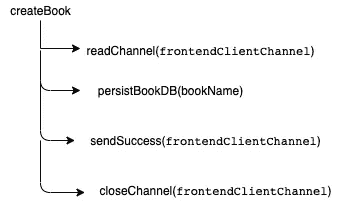
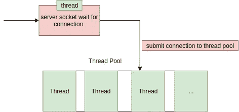
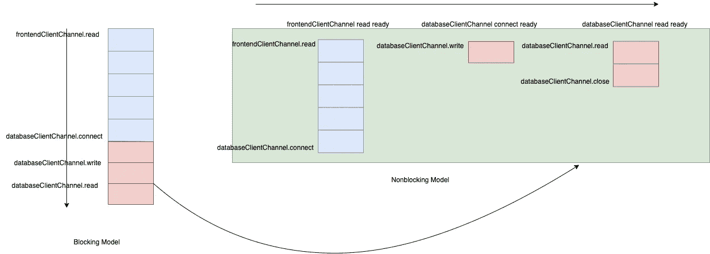
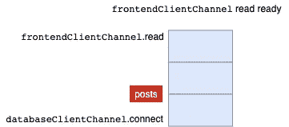
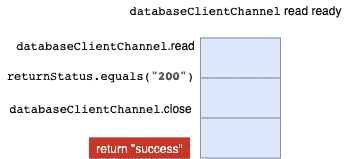
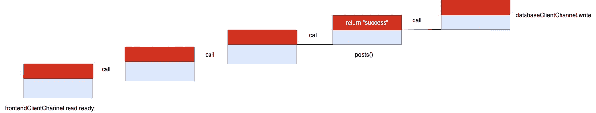
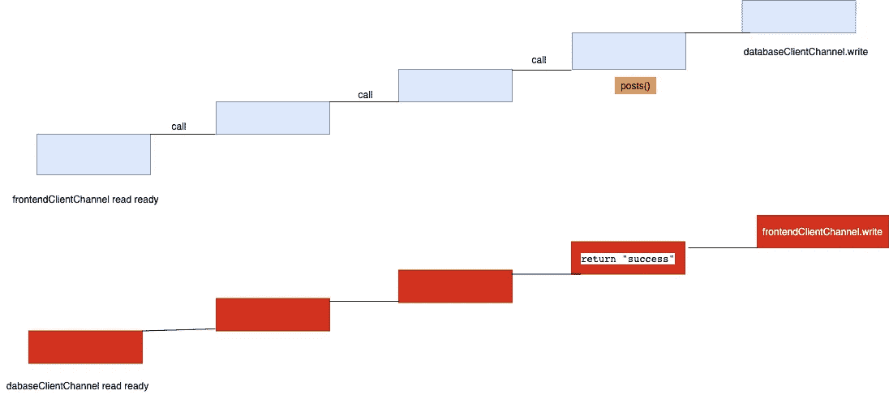
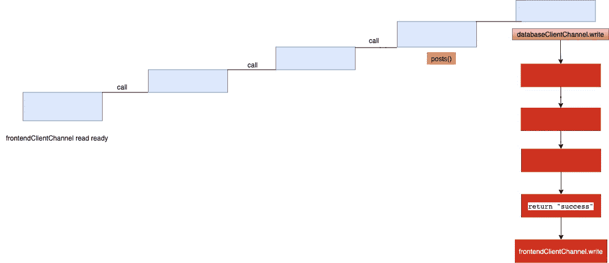
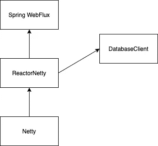

# 从命令式编程发展到反应式流

> 原文：<https://medium.com/geekculture/evolving-from-imperative-programming-to-reactive-streaming-93e683b9a67a?source=collection_archive---------13----------------------->

以前我写过一篇关于反应式流的文章。但那篇文章的结果只是反应式流的设计。它没有解释为什么反应式流会出现，服务器应用程序如何从命令式编程发展到反应式流。

在本文中，我将尝试解释为什么要设计反应式流，以及它想要解决什么问题。

我们将通过一个简化的**图书服务器**来解释不同的线程模型、它们引入的问题以及解决方案的建议。然后，我们将了解如何设计反应式流概念，以及为什么它只是解决方案之一。

**图书服务器**

图书服务器只提供了一个 API，它允许前端创建一个带有名称的图书，将图书保存在 DB 中，然后将成功发送到前端。

```
Frontend API: createBook
```

## **版本 I —每个线程一个连接，阻塞通道**

我们的 **BlockingBookServer** 的调用堆栈是



这个想法是当有一个新的连接时，一个新的任务被提交到线程池。线程池用 1000 个线程初始化。



因为通道阻塞， **readChannel，persistBookDB，sendSuccess，closeChannel** 这四个函数会阻塞当前线程。 **persistBookDB** 通常使用数据库客户端向 DB 发送 SQL 语句。目前，几乎所有的 DB 驱动器都是阻塞的(*不包括电抗 DB 驱动器*)。

假设同时有 1000 个用户会话，那么可能同时有 1000 个线程运行来服务这些客户端请求。如果计算机只有 4 个内核，这意味着只有 4 个线程在 CPU 上运行。所有其他 996 个线程要么被 IO 阻塞，要么等待操作系统调度。

**解决方案建议:**

既然只有 4 个核心，为什么不只分配 4 个线程。那么这 4 个线程可以一直在 CPU 上运行。则节省了 996 个线程资源。但是，服务器仍然要服务 1000 个连接的套接字，这意味着以上四个函数都不能阻塞任何线程。

## **版本 II —非阻塞通道、IO 线程、受限工作线程**

在阻塞模型中，调用堆栈也可以被视为下面的阶梯。


一个函数通常依赖于另一个函数的结果。

在我们简化的楼梯示例中，每个功能都可以分为两个部分。下半部分包括在调用另一个函数之前已经执行的指令。上半部分包括被调用函数返回后执行的指令。

在我们的 **BlockingBookServer** 中， **persistBookDB** 依赖于 **readChannel** 的结果。

**读通道**的实现是

```
*//blocking* **public static** String readChannel(**final** SocketChannel frontendClientChannel) **throws** IOException {
    frontendClientChannel.read(***buffer***);
    **final** String bookName = StandardCharsets.***UTF_8***.decode(***buffer***).toString();
    ***buffer***.clear();
    **return** bookName;
}
```

当 **frontendClientChannel** 阻塞时，**frontendClientChannel . read(buffer)**将阻塞当前线程，直到数据返回。

然而，当 **frontendClientChannel** 设置为非阻塞时，通道上的读/写/关闭操作将立即返回。这意味着 **readChannel** 将在没有任何数据的情况下立即返回。

在非阻塞模式下，操作系统提供不同的系统调用，以在实际读取通道之前检查通道是否有数据可用。

**选择、轮询、epoll —检查文件描述符的就绪事件**

我们将不解释这些功能的细节，因为它们属于它们自己的范围。主要区别在于，Linux 在内核中为 **epoll** 维护了一个支持数据结构，以便在与文件描述符相关的缓冲区可以被读取或写入时，在内部异步更新文件描述符事件。 **epoll** 的时间成本为 O(1)，另外两个时间成本为 O(n)。epoll 对于服务器应用来说更具可扩展性。

## **解决方案:基于 epoll** 检查 IO 事件的专用无限循环

想法是用一个无限循环的专用线程来检查使用 **epoll** 系统调用的文件描述符的事件。对于每个新连接的客户机，在服务器套接字接受连接后，将返回一个新的文件描述符。这个新的文件描述符可以再次注册到 **epoll** 以检查读取或写入事件。在 Linux 上，默认的选择器提供者是 **EPollSelectorProvider** 。

非阻塞服务器示例代码

现在我们只有一个线程。看完了书名的通道，我们还是要调用 **persistBookDB** 。

示例 **persistBookDB** 实现过于简化。它只演示了当前的数据库驱动程序是如何工作的。所有 DB 驱动程序内部都必须构建客户端通道来连接到 DB 服务器以发送命令。与数据库服务器通信的协议远比这复杂。

如果**数据库客户端通道**被阻塞，那么**连接、读取、写入、关闭**调用都将被阻塞。while 循环将被阻塞，并且不能检查所有其他通道的事件。

因此 **databaseClientChannel** 也应该被设置为非阻塞的，并注册到 **epoll** 中，以便 while 循环可以用于检查 **databaseClientSocket 的事件。**

```
**final** SocketChannel databaseClientChannel = SocketChannel.*open*();
databaseClientChannel.configureBlocking(**false**);
databaseClientChannel.register(selector, SelectionKey.***OP_CONNECT***);
databaseClientChannel.connect(**new** InetSocketAddress(**"127.0.0.1"**, 1234));
```

***需要注意的一件重要事情是，与数据库的通信通常在调用堆栈的深处。***

下面是两个模型的调用堆栈的比较。



这幅画不是 100%正确。但是它展示了在阻塞模型中，调用在调用栈中垂直发生的思想。在非阻塞模式中，每个通道操作由从 **epoll** 检查的事件触发。事件横向发生。

然而，业务逻辑应该保持不变，不管它是阻塞的还是非阻塞的。

*   当**databaseclientchannel . connect**成功时，我们就可以开始写通道了。该逻辑被转移到**数据库客户端通道**连接就绪事件处理中。
*   当**databaseClientChannel read**事件准备好时，我们就可以开始读取通道了，这个逻辑被移到**databaseClientChannel**read-ready 块。

现在，我们来看一个简单的弹簧控制器。

```
@Controller
class PostController(val postRepository: PostRepository) {
    @GetMapping("/hello")
    fun posts(): String {
        var post = Post("hello")
        postRepository.save(post)
        **return "success" => After repo.save**
    }
}
```

在控制器中调用**后库**。**post repository . save(post)**内部应该创建一个 **databaseClientChannel** 向 DB 服务器发送命令。当**post repository . save(post)**返回时，控制器向前端返回“成功”。

当从上图中处理**frontendClientChannel**ready-ready 事件时，应该调用 **posts()** 函数。 **posts()** 内部将**创建**一个 **databaseClientChannel** 来连接到 DB 服务器。



**中的`return "success"`***表示向前端返回“成功”。只有在接收到**database client channel**read-ready 事件，且条件`returnStatus.equal("200")`为真*时，才会发生。*(这里假设 DB 返回 200 表示插入命令成功。*

**

*`return “success"` **不应该在帖子返回时发生。未来应该会发生。原始的代码编写方式无法达到这个目的。***

## ***问题:如何让** `**return “success"**` **在未来发生？***

*还是用楼梯建模吧。*

**

****databaseclientchannel . write***发生在最后一块。该函数将立即返回。然而，当 **databaseClientChannel** 被检测为 read-ready 事件时，我们需要执行红色代码块。*

*等于通过**datbaseClientChannel**ready 事件触发，将整个红色方块移动到另一个楼梯。*

**

*蓝色块是在调用**databaseclientchannel . write**之前执行的代码。红色块是**databaseclientchannel . write**返回后的代码。*

***解决方案建议:**将蓝色块和红色块中的代码放入各自的类中，连接起来形成数据处理管道，并将管道绑定到通道上。当检测到通道事件时，管道被触发。*

## ***这个管道怎么建？***

```
*postRepository.save(post)
**return "success"***
```

*如果我们把**post repository . save(post)**看作是从 DB 返回插入状态，那么这个值应该也来自未来。然后我们可以创建一个数据结构**未来**或**承诺**来表示未来的数据。我们的代码变成了*

```
*Promise<String> status = postRepository.save(post)
status.then((value)-> return "success")*
```

*看起来眼熟吗？我们将逻辑包装到 lambda 回调中。这正是前端处理 http 请求结果的方式。然后实际上是将回调包装成另一个承诺。当数据可用时，就调用承诺链。*

**

*反应式流使用 Mono 或 Flux 作为数据发布者。这类似于承诺概念。Mono 和 Flux 可以流水线化，形成一个链。*

**

*运算符在内部封装 lambda。每个运营商将变成前一个节点的订户。订户有一个 **onNext(T var1)** 方法。*

```
***public interface** Subscriber<T> {
    **void** onNext(T var1);
}*
```

*毫不奇怪 lambda 会在 **onNext(T var1)** 函数**中被调用。**在 Spring Webflux 中，控制器还需要返回一个 **Mono。我们以前的代码将变成***

```
*Mono<Void> result = postRepository.save(post).
return result.map(() -> "success")*
```

*Spring Webflux 在内部创建这个管道，并将其与 **databaseClientChannel、**相关联，这样当 databaseClientChannel 就绪事件被触发时，管道就可以被拾取。靠近该流水线末端的节点将需要写入 **frontendClientChannel** 。`return “success"`就是这些节点中的一个，它是 **posts()** 函数的结果。*

**

## *摘要*

*我们已经看到，每个通道都必须注册到 epoll。在 Spring Webflux 中，web 服务器是 Netty。Netty 提供 EventLoops 向 epoll 注册通道，并检查这些通道的事件。构建在 Netty 之上的 Reactor Netty 提供了在检测到通道事件之后构建数据管道的功能。*

*由于所有数据库客户端通道也需要注册到 epoll，所有数据库驱动程序也使用 Reactor Netty 重写，以提供反应式连接。*

**

*为了摆脱许多线程，其他语言，如 go，python，kotlin 都引入了协同例程，将任务的调度转移到用户领域，从语言层面支持轻量级任务，提供高性能的 web 服务器。*

*老实说，我不确定 Spring Webflux 会走多远。只要提供了协同例程，异步方法在语言级别上就受到支持，那么开发人员就不需要学习所有这些设计的结构。*

*如果您发现任何不正确的地方，请留下您的评论。*