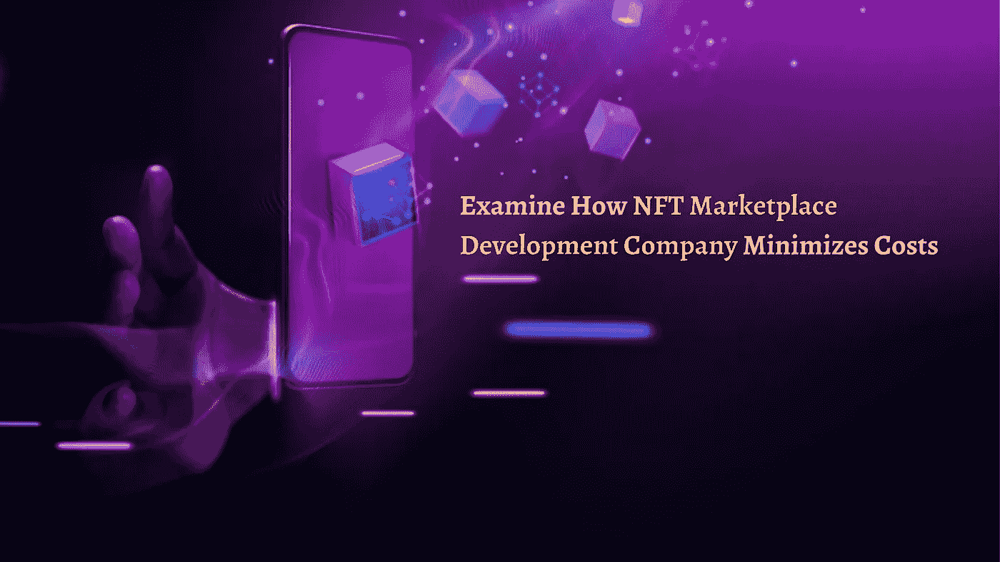

# 考察 NFT 市场发展公司如何将成本降至最低

> 原文：<https://medium.com/geekculture/examine-how-nft-marketplace-development-company-minimizes-costs-15593fee8a84?source=collection_archive---------21----------------------->

NFT Marketplace Development

NFT 市场开发公司 的 [**如何计算成本？这是一个经常被问到的问题，尤其是在有抱负的企业家中。**](https://www.cryptocurrencyscript.com/nft-marketplace-development)

施工平台董事会的成员会见了众多利益相关者，并发现成本差异可能从 50，000 美元到 150，000 美元不等。这是什么？为什么它很重要？理解是最关键的任务。但是有一个简单的答案:每 1 美元为你的项目增加一些新鲜的东西。要求额外费用的公司将在你的整个发展过程中为你提供额外的好处。让你的 NFT 市场平台成为标杆。此外，很少有其他方法可以为获得同样的福利省钱；你兴奋吗？继续看博客。你将了解 NFT 市场发展公司的成本因素和一些技巧，使您的项目符合您的预算。

让我想想…

## 影响 NFT 市场开发成本的因素

**特色**

平台特性是最有可能降低成本的考虑因素。该功能也是最重要的，因为它指导你的用户留在或离开网站。请记住，添加以下功能会增加您平台的成本。

**店面**

店面是定义用户信息和资产的仪表板。店面描述了资产数据、即将发生的事件、定价历史、以前的出价等。

**搜索能力**

搜索功能有助于管理，并使平台的类别多样化。该特征使得用户简单地工作，而不需要从第一个 NFT 滚动到最后一个。

**制作清单**

该功能面向商家。它允许用户开发新的 NFT 并编辑现有的 NFT。

**拍卖和购买**

NFT 市场的主要目的是从买家和卖家那里获得收入。

**钱包**

钱包通常用于以密码的形式存储、支付和接收 NFT。该应用程序包括所有在网上交易交易。

**实时通知**

它向客户提供最新的 NFT、最畅销的 NFT 和市场上的拍卖信息。

**评级**

该评级描述了人们与 NFTs 的互动。这一评级有助于根据用户的需求定位完美的 NFT。整合所有这些功能将增强用户体验，但也会增加您的预算支出。

开发成本

成本可能因多种因素而异。让我们仔细看看它们；

## 你的项目涉及多少个团队？

*   团队是由什么组成的？设计师、开发人员、测试人员、项目经理等。
*   技术合作伙伴的价格是多少？价格因地理、专业等因素而异。
*   你将使用什么类型的开发技术？希望从头开始开发或愿意使用现成的解决方案，如 OpenSea clone、Rarible clone 等。

## 与开发成本密切相关的技术

*   塞洛
*   皮纳塔、Filecoin 和 IPFS 是存储平台。
*   智能连锁币安
*   区块链技术选项
*   和谐。一个
*   以太坊
*   React、Angular 和 Vue 都是前端框架的例子。
*   多边形(Matic)
*   **智能合同开发是基于您希望选择的区块链技术的**。
*   令牌规格包括 ERC 721、ERC 1155、ERC 777 和 ERC 20。
*   **在加密钱包开发中**价格可能会根据即用型或定制型钱包而变化。
*   具体来说，加密钱包开发、智能合约开发、区块链、存储和前端技术都反映在成本上。

## 开发前后的维护成本

*   安全补丁
*   错误修复
*   应用程序更新
*   与第三方整合
*   服务器的成本

一些有抱负的企业家可能会在一开始检查这些费用，但让你的平台正常工作是一项更加困难的任务。当谈到 NFT 市场开发供应商，你必须询问这些费用。

## 构建 NFT 市场的有趣提示

*   首先，你必须找到自己的定位。
*   开始设计你的应用面板，因为项目文档是一个重要的步骤。
*   使用特定的软件开发工具包，您可以开发一个项目原型。
*   开发令牌生成器来构建智能契约，这是一种微观契约。
*   执行和测试，以帮助开发人员预测和纠正突出的缺陷、小故障或故障。

## 准备好了。！！

最后，您可能会获得一些关于影响 NFT 市场开发成本的因素的知识，如技术方面、技术和功能。现在是你抓住机会在 NFT 市场领域推出品牌并开始创收的时候了。