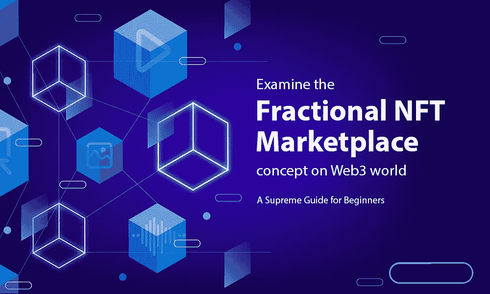

# 考察 Web3 world 上的分数 NFT 市场概念——初学者的最高指南

> 原文：<https://medium.com/geekculture/examine-the-fractional-nft-marketplace-concept-on-web3-world-a-supreme-guide-for-beginners-743689937bae?source=collection_archive---------20----------------------->

加密货币的发展花了近十年时间才获得现在享有的广泛影响力。人们慢慢意识到密码市场的真正潜力。但 NFT 的情况并非如此。NFTs 在很短的时间内就在市场上取得了巨大的成功。虽然 NFT 的概念不同于加密市场，但 NFT 已经设法在数字领域保持了非常强大的地位。NFT 现在不是密码市场的一个例子。这些惊人的功能和特点使 NFT 被公认为最值得信赖的收藏之一。

在 NFT 热潮之后，由 NFT 开发服务提供支持的部分不可替代令牌(F-NFT)现在是 NFT 社区的时髦词汇。它们是 NFT 市场的最新发展。这是因为它们有可能彻底改变非上市公司的结构，同时为投资者提供新的机会。

任何关注 NFT 发展的人都知道，非上市公司经常出现在新闻中，因为它们的估值很高。流行的 NFT 要花费数百万美元，对一般消费者来说，转换它们是负担不起的。F-NFTs 的发展正成为解决这一问题的替代方案。从财务上来说，拥有一小部分昂贵的 NFT 比以较低的价格购买多部分更有优势。

让我们来理解 F-NFT 的概念以及为什么要创建和发行它们。

# 什么是分数 NFT？

分数 NFT 形成了加密、分散和区块链中增长最快的行业的上升世代。这种将 NFT 所有权分割成更小部分的方法被称为 NFT 分割。这允许多个所有者拥有一个 NFT。分数 NFT 是不言自明的——一个 NFT(通常是 ERC-721 标准),被锁定在一个智能合约中，在这里它可以被分解为等价的可替换的 ERC-20 令牌。因此，人们可以想买多少 NFT 股票就买多少。

# 一个不完整的 NFT 市场——流动性的解决方案

ERC-721 的 NFT 通过将 NFT-ERC-721 细分为可替代的 ERC-20 解决了流动性问题。如前所述，ERC-721 令牌链接到智能合约。然后，ERC-721 令牌通过智能合约拆分为 ERC-20 令牌。当客户在我们的平台上购买 ERC-20 代币时，他们实际上购买了一部分 ERC-721 硬币。许多投资者可以购买分数 NFT。这种分数 NFT 非常实惠，可以立即购买以获得流动性。

# NFT 市场是如何运作的？

*   数字收藏的最大市值为 371.5 亿美元。即便如此，所有的加密收藏在市场上都是买得起的。
*   部分 NFTs 试图通过让小投资者以合理的价格购买有价值的资产来改变这种状况。
*   在几个市场上铸造和上市的每个不可替代的代币可以被分成数百万甚至数十亿个部分。
*   因此，加密货币、去中心化金融(Defi)代币和稳定货币是可以替代的。投资者现在甚至可以零零碎碎地购买 NFT。
*   通常，准业主会持有一定份额。一段时间后，他们可以在 NFT 市场以更高的价格出售他们的股份。
*   此外，投资者将获得更多的利润。这是因为他们转售 NFT 的价格高于购买它的成本。
*   有什么好处吗？是的，它将带来更好的价格发现、平衡的投资多样化和充足的流动性。

# 为什么部分 NFT 市场发展至关重要？

*   **二级市场流动性**

分数 NFT 在未来具有巨大的价值，并且在未来具有很高的潜力，因此所有者更喜欢通过拍卖来出售它，而不是立即出售。这是提高流动性的关键。

*   **高值**

NFT 的价值急剧上升。只有 NFT 投资者可以进行巨额投资。由于这个原因，只有一小部分投资者可以购买 NFT。只有当每个人都有足够的钱投资时，NFT 才会发展到下一个水平。

*   **利用率限制**

分数 NFT 增强了 NFT 的效用，因为它们经常可以为了多种目的而频繁交易。

*   **实惠**

因为 NFT 的价值很大，不是每个人都能轻易买到的，但是分数 NFT 让小投资者也能买到。

**分数 NFT 市场在 Web3 开发中的优势。**

对于投资者和艺术家来说，分数 NFT 的一些优势是:

*   f-NFT 将通过有效地将艺术品货币化而使艺术家受益。
*   现在，有了 F-NFT，各种规模的投资者都可以拥有 NFT。
*   NFT 的所有者可以通过细分提供更大的所有权股份来提高对其资产的兴趣。
*   创作者或细分的 NFT 可以出售他们的 NFT 的一部分，而不是全部。
*   将 NFT 转化为 F-NFT 的所有者可以获得年度馆长费用。

# 结论

随着 NFT 市场的普及和需求的扩大，随着区块链技术的发展，我们将看到更多有趣的突破和用例。虽然分数 NFT 仍处于起步阶段，但它们可能是不断增长的密码行业的最佳趋势。NFT 细分化带来了更大的流动性，并开启了无尽的投资选择。这拓宽了市场，并确保细分的 NFT 将推动下一波数字资产货币化。NFT 市场越来越受欢迎，毫无疑问，未来还会有更多的新举措。与顶尖的 [**分支 NFT 市场发展公司**](https://www.alwin.io/blog/fractional-nft-marketplace-development) 建立联系，这样你可以通过创建一个分支 NFT 市场来进一步发展 NFT 生态系统。