# JavaScript 中的媒体查询示例

> 原文：<https://medium.com/geekculture/example-media-queries-in-javascript-fe22c42f73d9?source=collection_archive---------0----------------------->


我曾经使用媒体查询，但不正确的方式，我会显示最好的方式和旧的方式，但相信我，这种方式更好。

# 想看的话视频

Video Of the Lesson

# 首先，我们有了基本结构的 HTML

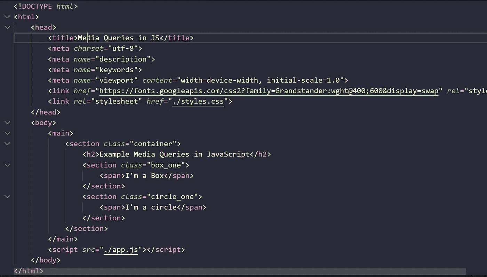

Code example for html

```
<!DOCTYPE *html*><html><head><title>Media Queries in JS</title><meta *charset*="utf-8"><meta *name*="description"><meta *name*="keywords"><meta *name*="viewport" *content*="width=device-width, initial-scale=1.0"><link *href*="https://fonts.googleapis.com/css2?family=Grandstander:wght@400;600&display=swap" *rel*="stylesheet"><link *rel*="stylesheet" *href*="./styles.css"></head><body><main><section *class*="container"><h2>Example Media Queries in JavaScript</h2><section *class*="box_one"><span>I'm a Box</span></section><section *class*="circle_one"><span>I'm a circle</span></section></section></main><script *src*="./app.js"></script></body></html>
```

# 我们的 CSS 带有一些样式

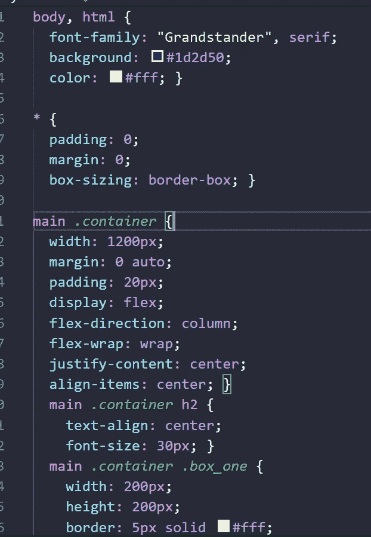

Code example for CSS in media queries with JavaScript

```
body, html {font-family: "Grandstander", serif;background: #1d2d50;color: #fff; }* {padding: 0;margin: 0;box-sizing: border-box; }main *.container* {max-width: 1200px;margin: 0 auto;padding: 20px;display: flex;flex-direction: column;flex-wrap: wrap;justify-content: center;align-items: center; }main *.container* h2 {text-align: center;font-size: 30px; }main *.container* *.box_one* {width: 200px;height: 200px;border: 5px solid #fff;display: flex;justify-content: center;align-items: center;margin: 30px 0px;transition: 2s all ease; }main *.container* *.box_one* span {font-size: 20px;text-align: center; }main *.container* *.circle_one* {width: 100px;height: 100px;border-radius: 50%;display: flex;justify-content: center;align-items: center;border: 3px solid #fff;transition: 2s all ease; }main *.container* *.circle_one* span {font-size: 15px;text-align: center; }
```

# 然后我们的 JavaScript 文件

我们从仅用于负载的监听器开始

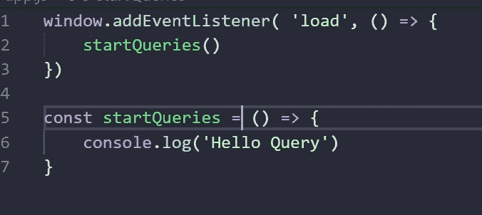

Starting JavaScript code

```
window.addEventListener( 'load', () => {startQueries()})const startQueries = () => {console.log('Hello Query')}
```

# matchMedia()方法为最佳方式

Matchmedia 是一种支持字符串的方法，如果媒体查询匹配，则返回一个对象

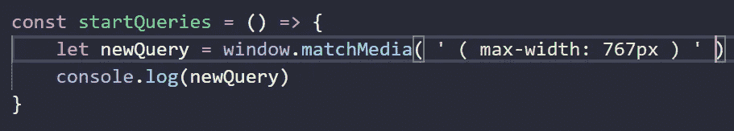

Example matchList

```
const startQueries = () => {let newQuery = window.matchMedia( ' ( max-width: 767px ) ' )console.log(newQuery)}
```

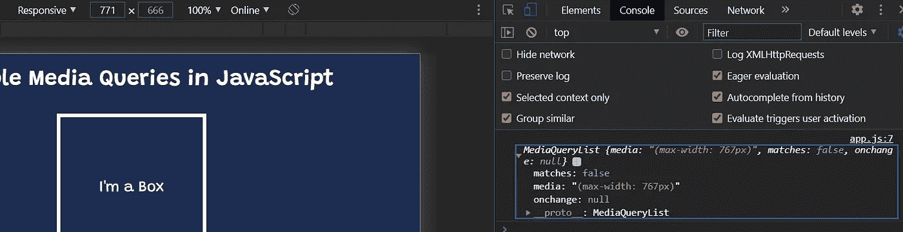

Example Responsive with matchMedia method

在这一部分，我写了 767 像素，但 matchMedia matches 对象是假的，但如果我们将窗口大小调整为 766 像素，它匹配，但**这很重要，我必须重新加载页面，稍后我会解释**

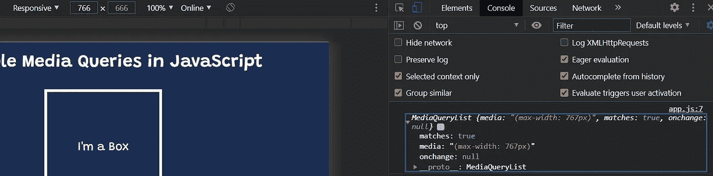

Example Responsive with matchMedia method and Object

# 在 JavaScript 中使用媒体查询

在这一步，我们将改变我们的框为一个圆圈，我们的圆圈的背景颜色为白色的 JavaScript 媒体查询

我只使用了条件语句，如果匹配的话可以使用样式，但是我必须重新加载页面

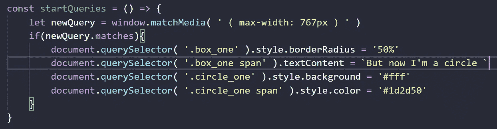

Code for matchMedia.matches

```
if( *newQuery*.matches ){document.querySelector( '.box_one' ).style.borderRadius = '50%'document.querySelector( '.box_one span' ).textContent = `But now I'm a circle `document.querySelector( '.circle_one' ).style.background = '#fff'document.querySelector( '.circle_one span' ).style.color = '#1d2d50'}
```

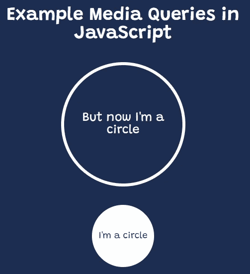

Example With MatchMedia in JavaScript

# 但是我不想重新加载页面，我们使用 addListener()方法

它会监听变化，只有我们需要通过的功能，谁会在媒体状态改变时发射非常有用

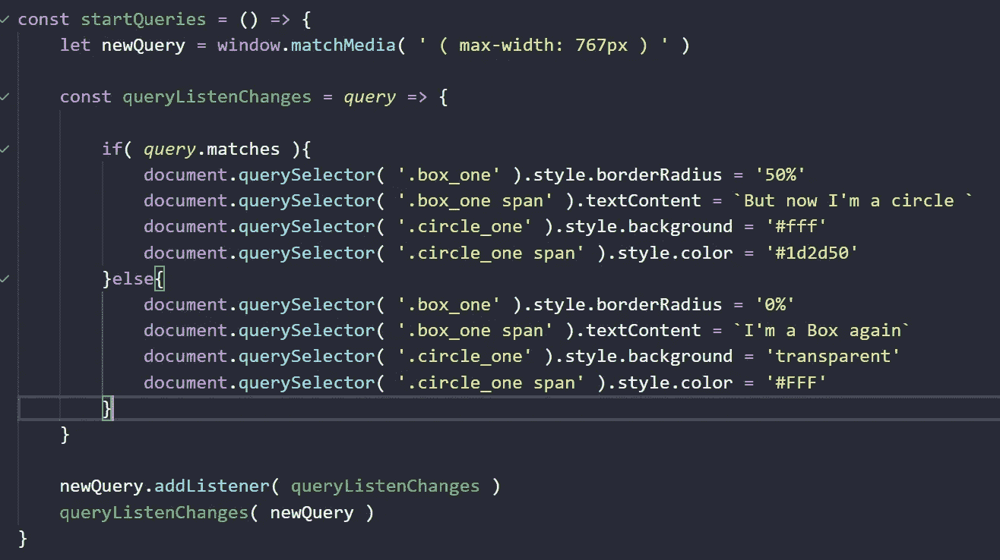

Complete code for Media Queries in JavaScript

# 最后，我们有了纯 JavaScript！！！！

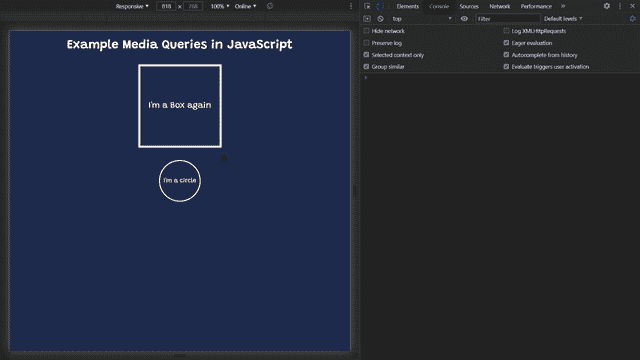

Example in real life with Media Queries in JavaScript

```
window.addEventListener( 'load', () => {startQueries()})const startQueries = () => {let newQuery = window.matchMedia( ' ( max-width: 767px ) ' )const queryListenChanges = *query* => {if( *query*.matches ){document.querySelector( '.box_one' ).style.borderRadius = '50%'document.querySelector( '.box_one span' ).textContent = `But now I'm a circle `document.querySelector( '.circle_one' ).style.background = '#fff'document.querySelector( '.circle_one span' ).style.color = '#1d2d50'}else{document.querySelector( '.box_one' ).style.borderRadius = '0%'document.querySelector( '.box_one span' ).textContent = `I'm a Box again`document.querySelector( '.circle_one' ).style.background = 'transparent'document.querySelector( '.circle_one span' ).style.color = '#FFF'}}newQuery.addListener( queryListenChanges )queryListenChanges( newQuery )}
```

# 旧版本

我真的很喜欢这种方式，但也有缺点

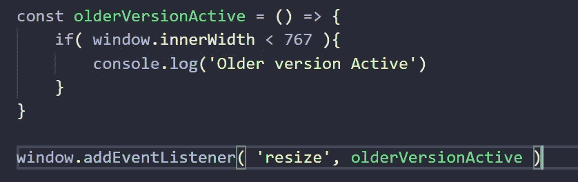

Media queries the older version

```
const olderVersionActive = () => {if( window.innerWidth < 767 ){console.log('Older version Active')}}window.addEventListener( 'resize', olderVersionActive )
```

# 不足之处

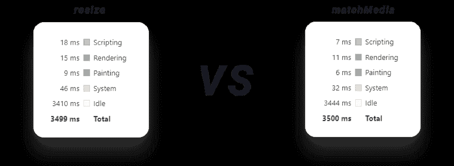

That’s a 157% increase in scripting! [Cite](https://css-tricks.com/working-with-javascript-media-queries/)

# 结论

matchMedia()是在 JavaScript 中使用媒体查询的非常有趣的方式，它非常强大，它减少了脚本编写，然后我们可以编写更高级的媒体查询结构，它将在响应式 web 设计中帮助我们很多。

# 来源

[](https://css-tricks.com/working-with-javascript-media-queries/) [## 使用 JavaScript 媒体查询| CSS-技巧

### 当你想到媒体提问时，你首先想到的是什么？也许 CSS 文件中的某个东西看起来…

css-tricks.com](https://css-tricks.com/working-with-javascript-media-queries/) [](https://developer.mozilla.org/en-US/docs/Web/API/Window/matchMedia) [## Window.matchMedia()

### 窗口接口的 matchMedia()方法返回一个新的 MediaQueryList 对象，该对象可用于确定是否…

developer.mozilla.org](https://developer.mozilla.org/en-US/docs/Web/API/Window/matchMedia)