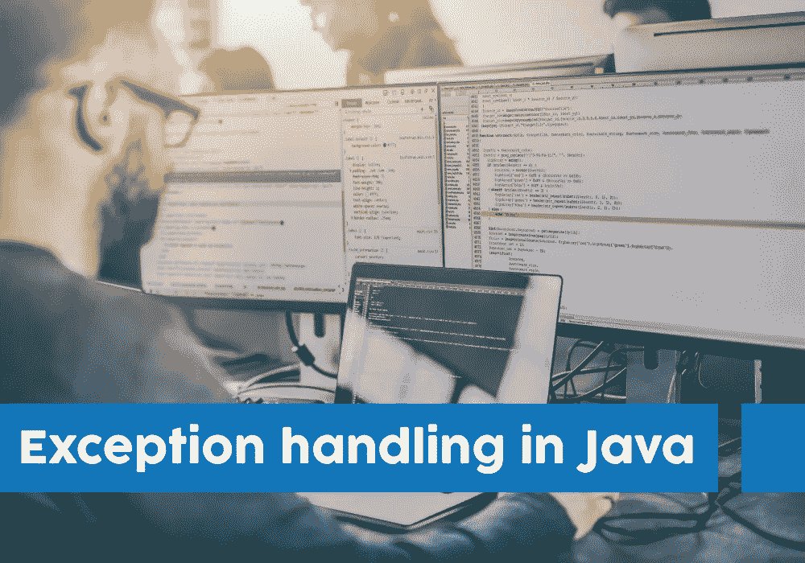
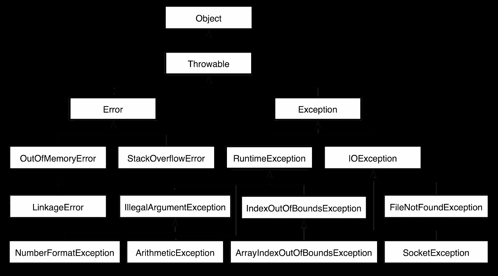
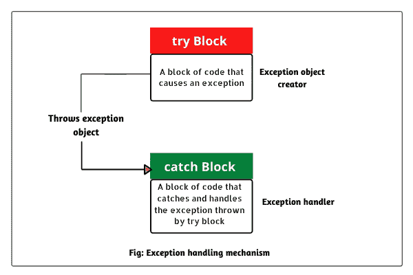
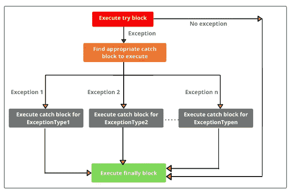

# Java 中的异常处理

> 原文：<https://medium.com/geekculture/exception-handling-in-java-c75f1eb15f7b?source=collection_archive---------23----------------------->



**异常:**Java 中的异常是一种不希望发生的事件，它会扰乱程序的正常流程。这些是可以恢复的。程序员可以处理这种情况，并采取必要的纠正措施。其中一些是 NullPointerException、SQLException、ClassNotFoundException 和 RuntimeException。例如，被零除的数是一种 RuntimeException。

```
public class Example {
   public static void main(String[] args){
      int num1 = 100;
      int num2 = 0;
      int result = num1 / num2;
   }
}Output: java.lang.ArithmeticException: / by zero
        at Example.main(Example.java:5)
```

**错误:**主要是系统资源不足导致的问题。这些是不可恢复的。其中一些是 StackOverflowError、VirtualMachineError 和 OutofMemoryError。例如，StackOverflow 错误是一个无限递归错误，其中函数调用自己的次数太多，以至于存储与每次调用相关的变量和信息所需的空间超过了**堆栈**的容量。

```
public class Example {
   public static void main(String[] args){
      recursiveMethod();
   }
   public static void recursiveMethod(){
      while(true){
         recursiveMethod();
      }
   }
}Output: Exception in thread "main" java.lang.StackOverflowError
 at ErrorExample.recursiveMethod(Main.java:7)
 at ErrorExample.recursiveMethod(Main.java:7)
 at ErrorExample.recursiveMethod(Main.java:7)
 at ErrorExample.recursiveMethod(Main.java:7)
 .
 .
 .
```

**异常处理:**这是一种处理运行时错误的机制，这样可以维持应用程序的正常流程。异常通常会扰乱程序的正常流程，这就是我们使用异常处理的原因。



**Exception Hierarchy in java**

java 中有两种类型的异常:

1.  **检查异常:**这些异常在编译时被检查，看程序员是否处理过。如果程序中没有处理这些异常，将会出现编译错误。例如，SQLException、IOException、ClassNotFoundException 等。
2.  **未检查的异常:**这些异常是在运行时检查的，所以处理这些异常是程序员的责任。例如，ArithmeticException、NullPointerException、ArrayIndexOutOfBoundsException 等。

**try 块:**这是一个由可能出现异常的语句组成的块。try 块后面总是跟着 catch 块，在 catch 块中处理这些异常。try 块后面必须跟 catch 块或 finally 块，或者两者都跟。

```
try{
   //statements that may cause an exception
}
```

**catch 块:**处理 try 块中发生的异常的块。当 try 块中出现异常时，处理该异常的 catch 块将执行。

```
try
{
     //statements that may cause an exception
}
catch (Exception(type) e(object))‏
{
     //error handling code
}
```



```
class Solution{
      public static void main(String args[]){
          int num1 = 10;
          int num2 = 0;
          try{
             System.out.println("Statement 1");
             System.out.println("Statement 2");
             int result = num1 / num2;
             System.out.println("Statement 4") }catch(ArithmeticException e){
              System.out.println("Number divide by Zero");
           }
      }
  }Output: Statement 1
        Statement 2
        Number divide by Zero
```

在上面的示例中，当一个数被零除时，catch 块捕获到一个 ArithmeticException。发生异常的语句后面的代码块将永远不会被执行。

**finally block** :无论是否发生异常，都是一定要执行的块。

```
try {
    //Statements that may cause an exception
}
catch(Exception(type) object) {
   //Handling exception
}
finally {
   //Statements to be executed
}
```



```
class Solution{
      public static void main(String args[]){
          int num1 = 10;
          int num2 = 0;
          try{
             int result = num1 / num2;
          }catch(ArithmeticException e){
              System.out.println("Number divide by Zero");
           }
          finally{
             System.out.println("finally block is executed");
          }
      }
  }Output : Number divide by Zero
         finally block is executed
```

**throw:** 是一个关键字，用来抛出我们自己定制的异常。假设你想制作一个程序，允许年满 18 岁的人在选举中投票。然后我们可以使用 **throw** 关键字来抛出我们自己定制的异常，如果一个人的年龄在 18 岁以下，它将显示“你不允许投票”。

```
class Solution{
      public static void main(String args[]){
        int personAge1 = 18;
        int personAge2 = 15;
        checkEligibility(personAge1);
        checkEligibility(personAge2);
      }

      static void checkEligibility(int age){
          if(age < 18){
          throw new ArithmeticException("You are not allowed to vote"); 
          }
      else {
         System.out.println("You are allowed to vote");
      }
      }
}Output: Exception in thread "main" java.lang.ArithmeticException:                      You are not allowed to vote
        at Solution.checkEligibility(Main.java:10)
        at Solution.main(Main.java:12)
```

**抛出:**主要用于声明异常。它告诉程序员可能会出现异常，所以最好提供异常处理代码来维持程序的流程。

```
public void myMethod() throws ArithmeticException{
  // Statements that might throw an exception 
}

public static void main(String args[]) { 
  try {
    myMethod();
  }
  catch (ArithmeticException e) {
    // Exception handling statements
  }
  catch (NullPointerException e) {
    // Exception handling statements
  }
}
```

示例:

```
class M{  
 void method()throws IOException{  
  throw new IOException("device error");  
 }  
}  
class Testthrows4{  
   public static void main(String args[])throws IOException{ 
     M m=new M();  
     m.method();  

    System.out.println("normal flow...");  
  }  
}Output: Exception in thread "main" java.io.IOException: device error
        at M.method(Main.java:10)
        at Testthrows4.main(Main.java:16)
```