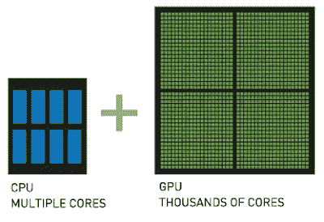

# 在 Windows 10 中使用 CUDA 和 Numba 在 GPU 上执行 Python 脚本

> 原文：<https://medium.com/geekculture/executing-a-python-script-on-gpu-using-cuda-and-numba-in-windows-10-1a1b10c29c9?source=collection_archive---------0----------------------->

图形处理单元(GPU)**拥有比**中央处理单元(CPU)更多的内核，因此，当涉及到并行数据计算时，**GPU 比 CPU**表现得格外有效，尽管与 CPU 相比，GPU 拥有**更低的时钟速度，并且缺少如此多的内核管理功能**。

