# 创建一个 10K NFT 头像集:扩张朋克一步一步

> 原文：<https://medium.com/geekculture/expansionpunks-welcome-to-the-more-inclusive-punkverse-aa77e675bcf5?source=collection_archive---------0----------------------->

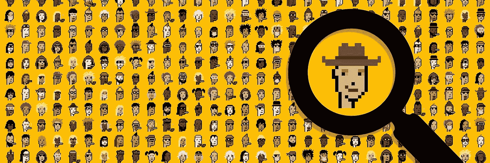

> 对 10K 独特的虚拟形象资产的程序生成进行技术探讨。

**扩张朋克**([www.ExpansionPunks.com](http://www.expansionpunks.com))是一个由 10，000 个独特的、通过程序生成的可收集的朋克组成的集合，作为 ERC721 代币存储在区块链以太坊上。与“扩展包”在传统桌面游戏中引入新角色和故事情节的方式一样，**expansion Punkverse**通过解决最初 **CryptoPunks** 系列中无意中导致排斥的微妙偏见，将 Punkverse 扩展为一个更加多样化和包容的社区。通过一种尊重和尊重原创精神的扩张方式，**expansion punk**在不牺牲与更广泛的**crypto punk**社区的凝聚力和连贯性的情况下，展现出独特的特质组合。最终， **ExpansionPunks** 致力于让每个人在这个新的区块链技术前沿感到受欢迎、受重视和被代表。

随着发布时间的临近，我们很兴奋地分享“引擎盖下”扩张朋克群体是如何一步一步诞生的。虽然下面的内容肯定没有捕捉到数月来对朋克特质细微差别的背景研究，也没有捕捉到创造一个有凝聚力的 NFT 系列所涉及的无数次试错尝试——但它仍然应该给人一种这种努力的彻底性的感觉。

ExpansionPunks 系列通过六个主要工作流程得以实现:

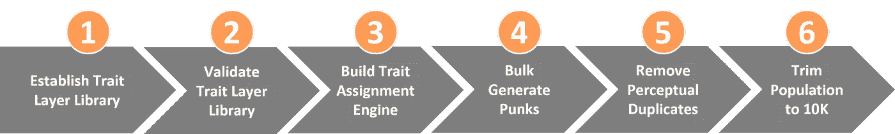

Figure 1: ExpansionPunks Approach, End-to-End

> *1。基于现有的 CryptoPunks 特征对所有特征的图像图层库进行逆向工程，以作为生成新 Punks 的原材料。*
> 
> *2。通过使用特征图层库重建原始 10K 密码朋克来验证特征图层库的准确性，验证“克隆”朋克与原始朋克之间的精确逐像素匹配*
> 
> *3。建立一个特征分配引擎来批量定义一个独特的扩张朋克群体*
> 
> *4。大量产生扩张朋克人口*
> 
> *5。移除感知上等同于加密朋克的朋克(由于隐藏特征)*
> 
> 6。将独特的种群修剪成最终的 10K

# **1。建立性状图层库**

基于现有的 CryptoPunks 特征，首先在 Photoshop 中建立了 200 个不同的 24x24 层的库。据我们所知，幼虫实验室还没有为每个特征层发布单独的文件，所以该库必须进行逆向工程，从零属性女性/男性原型开始(见*图 2* )。

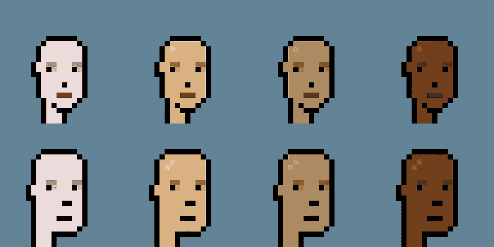

Figure 2: Zero-Attribute Female and Male Archetypes

以上 8 个朋克已经存在了——所以这些很容易。但是零属性外星人/猿/僵尸在原始集合中并不存在，所以这些罕见的原型必须通过交叉引用每个的多个样本来推断，以合成一个理论上的零属性版本— *图 3* 显示了僵尸零属性原型是如何使用朋克#8553 和#8127 推断出来的。同样的方法也用于零属性外星人和猿的原型。

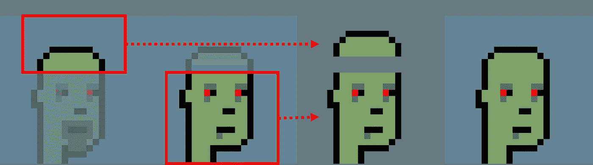

Figure 3: Deducing the Zombie Zero-Attribute Archetype

根据他们的特征，这些罕见的原型也肯定是男性，所以每个原型的女性版本也必须被推断出来，根据*图 4* 。

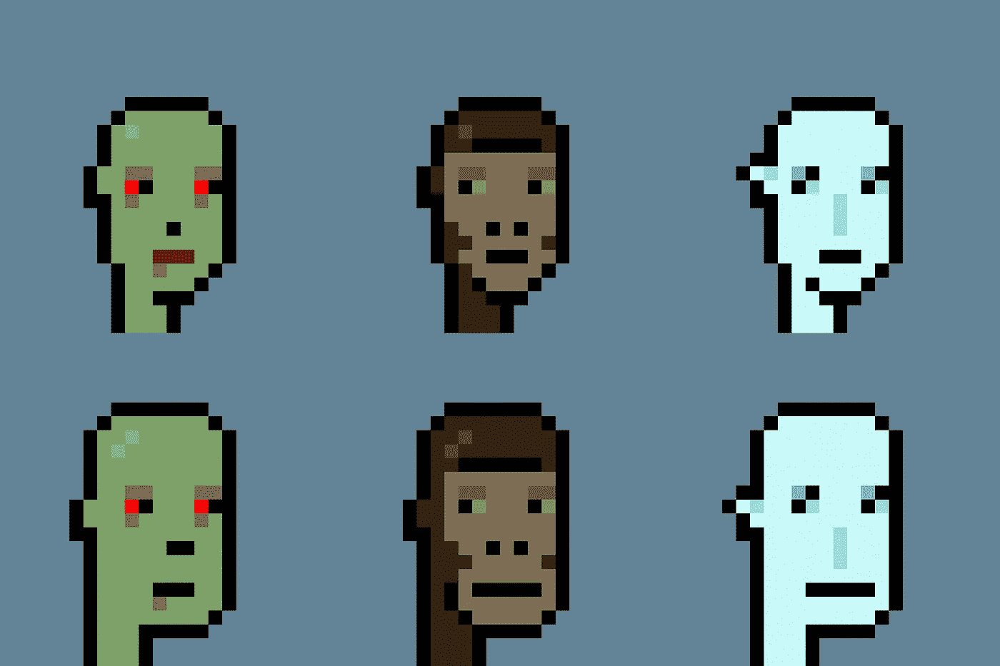

Figure 4: Rare Zero-Attribute Archetypes

有了基础原型，每个附属特征(嘴、头发、面部毛发、眼睛等)。)必须建立为独立的可分配层，即独立的透明 PNG 文件，可以堆叠起来创建新的朋克。

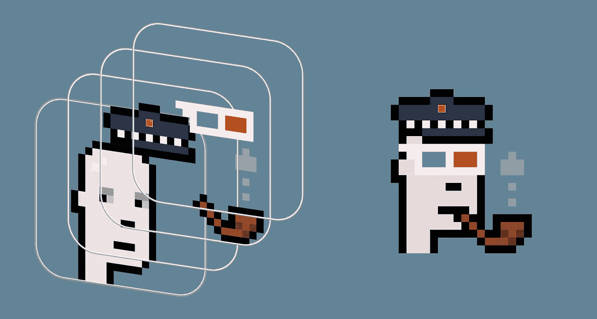

Figure 5: Stacking of Separate Transparent PNG Layers to Compose a Punk

为了定义这些特征，必须定位具有每个属性的最小属性朋克，以提取每个特征的像素细节。必须克服两个主要挑战:

> *1。推导半透明特征的 RGB 和不透明度值*
> 
> *2。特质民主化(让所有朋克获得性别专属特质)*

首先，多种特征(玫瑰色脸颊、痣、斑点、角质边框眼镜和所有 3 种眼影颜色)是半透明的，当层叠在其他特征(例如，肤色)上时，它们混合以创建新的第三种颜色，该颜色基于作为透明层不透明度值的函数的两种 RGB 值的混合。例如，肤色的 RGB 值(图 6 中的 1-5)和红润的脸颊(图 6 中的 6-10)都可以直接从具有相应特征的朋克那里获得。但是要生成这些混合结果(图 6 中的 6–10)和一个透明层，RGB 和不透明度值("？在*图 6* 中，必须计算玫瑰色脸颊的半透明层，因为该信息在任何地方都不可用。让事情变得更复杂的是——相同肤色的女性和男性之间最终的玫瑰色脸颊混合颜色是不同的——这意味着透明层也必须按照性别分开计算。

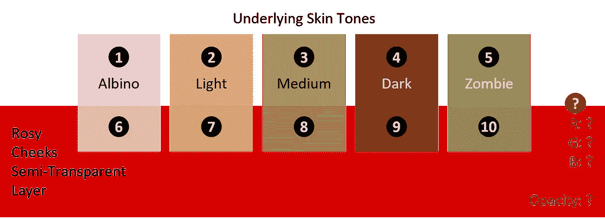

Figure 6: Rosy Cheeks as a Semi-Transparent Layer Applied to Multiple Skin Tones

为了计算玫瑰色脸颊半透明层的 RGB 和不透明度值，以下公式用于 3 个 RGB 值中的每一个、5 个肤色中的每一个以及 2 个性别原型中的每一个(即 30 个单独的计算):

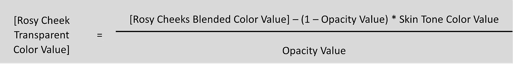

对于**男性**原型，**红色**RGB 值，在**中等**肤色上的一个(三十个)此类计算示例:

这里有两个未知值，玫瑰色脸颊透明层的红色值和不透明度值。如果你只使用 1 种肤色，1 种性别，你可以使用任何不透明度值来实现所需的“混合”,只需根据上面的公式改变 RGB 值即可——例如，根据*图 7* ,通过调整每个叠加(叠加 2、叠加 3 和叠加 4)的 RGB 和不透明度值，混合 5 =混合 6 =混合 7。

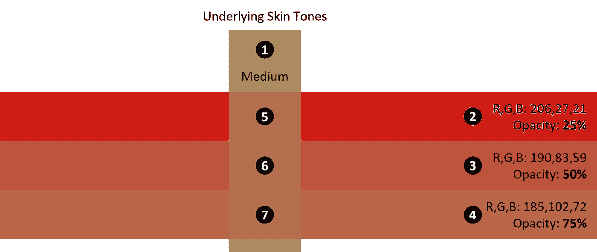

Figure 7: Multiple RGB/Opacity Combinations of Rosy Cheeks Applied to Medium Skin Tone Only

然而，一旦考虑到额外的肤色，很明显“任何”不透明度值都不行…

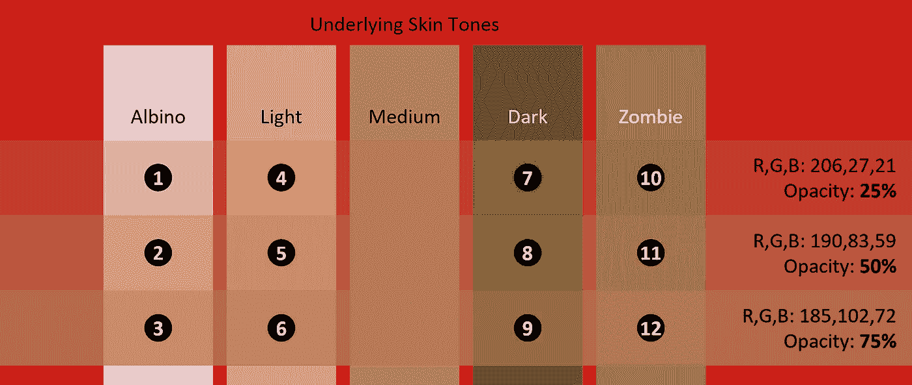

Figure 8: Attempting to use RGB and Opacity Values Calculated from a Single Skin Tone Across Other Skin Tones

如果我们仅基于中等肤色进行计算，那么我们很快在*图 8* 中看到，跨其他肤色的合成混合将是不一致的:1≠2≠3；4≠5≠6;7≠8≠9;还有 10≠11≠12。

为了找到最佳的不透明度和 RGB 值组合，可以用作单个透明的玫瑰色脸颊层，以在与所有 5 种肤色组合时创建精确的“混合”，可以同时在所有计算中使用 Excel“求解器”功能。规划求解可以测试所有可能的不透明度值(0-100%)，以找到跨肤色的最佳拟合，但受 RGB 值必须始终大于或等于 0 且小于或等于 255 的约束。*图 9* 显示了 Excel 对男性原型玫瑰色脸颊的计算结果。

Figure 9: Using Excel “Solver” Plug-in to Calculate RGB and Opacity Values Across Multiple Skin Tones

最优解(*图 9* 中的 **A** )是一个 RGB 值 R=214.5，G=0，B=0.2，不透明度=19.8%。四舍五入后，我们使用 **RGB = 215，0，0** 在 **20%不透明度**(图 9 中的 **B** )为我们单一的玫瑰色脸颊透明层(男性原型)。当在每一种不同的肤色上合成时，它会创建出在原始男性玫瑰色脸颊中发现的精确混合 RGB 值。这种求解方法必须在包含透明度(痣、斑点、角质框眼镜、蓝色/绿色/紫色眼影)的所有属性层(分别跨两种性别原型)中重复，以便正确识别最佳 RGB/不透明度值，从而为每个原始 crypto 朋克集合生成目标“混合”RGB 值。当我们可以“足够接近”以至于肉眼无法察觉 RGB 值的差异时，我们为什么要经历这样的麻烦呢？最终，我们希望 ExpansionPunks 过程尽可能真实地输出原始形式的 Punks

> …就像最初的 CryptoPunks 流程今天复活并重新运行一样。只有确保精确的像素模拟原始过程，我们才能自信地说我们实现了目标。

要解决的第二个挑战是启用性别专属特征(例如，各种帽子、发型和所有面部毛发特征等)。)来契合异性原型。鉴于男性和女性原型具有不同的表面积(例如，男性比女性宽 1 px，高 2 px)，性别专属特征不能简单地应用于替代原型:

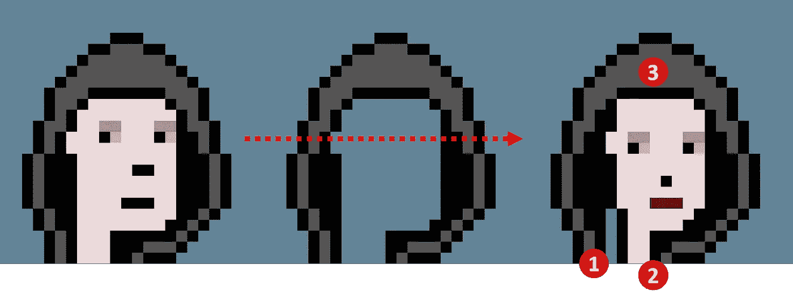

Figure 10: Attempting to Directly Apply the Hoodie to Female Archetype

在上面的*图 10* 中，简单地将连帽衫应用于女性原型会产生 3 个视觉上不协调的问题，这与 CryptoPunks 美学不同:(1)左下颈部周围缺少像素，(2)可见的女性颈部从 3 像素宽缩小到只有 2 像素宽，以及(3)前额暴露过多，失去了原来的连帽衫外观。此外，考虑到原型的框架较小，整体比例会有偏差。为了更加匀称美观，这款连帽衫经过了编辑，解决了这三个矛盾，如下图*11*所示:

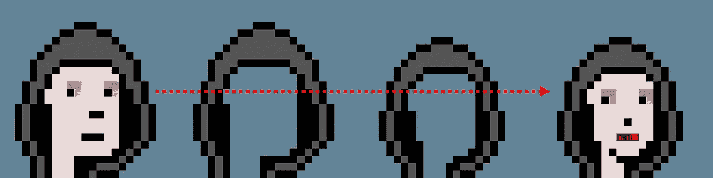

Figure 11: Creating a More Proportionate and Aesthetic Hoodie for the Smaller Female Archetype

需要注意的是，要确保原始特征的动态性也被考虑在内——在这种情况下，帽衫“隐藏”了耳环特征。以[朋克#269](https://www.larvalabs.com/cryptopunks/details/269) 为例:

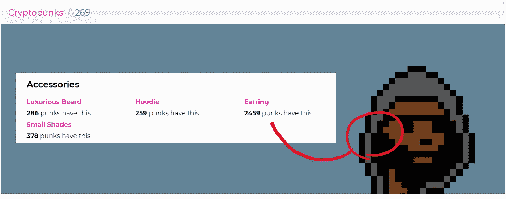

Figure 12: Example of a “Hidden” Earring Trait on Punk #269

这种动力需要在特征的民主化版本中得到尊重。每个性别专属特征都经历了类似的逐像素评估，这就是 CryptoPunks 的整体美学如何成功地贯彻到这些新的 Punk 排列中，包括以前的性别专属特征。

# 2.验证特征图层库

在尝试生成一个扩张朋克之前，我们需要验证特征层库的准确性。我们通过仅使用原始的密码朋克特征数据(所有原始朋克及其属性的 CSV 文件)结合我们新建立的特征层库，从零开始生成(克隆)整个 10K 密码朋克群体来做到这一点。我们使用 Excel 将原始的 CryptoPunk 元数据批量翻译成朋克语法的 10K 行，可以通过 Windows 命令行提供给 ImageMagic。以下是最近在苏富比拍卖行拍卖的著名的 Covid Alien Punk #7523 ( *图 13* )的语法示例:

> magick 转换 um-alien.png·um-earring.png
> um-knittedcap.png·um-medicalmask.png-背景无
> -展平 crypto punk \ punk 7523 . png

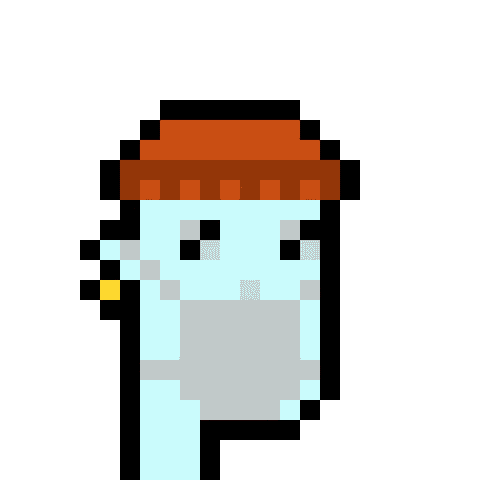

Figure 13: Punk #7523, aka “Covid Alien”

有了 10K 生成的加密朋克克隆体，我们使用 ImageMagick 将它们编译成一个 100 x 100 的朋克矩阵(2400 x 2400 像素),命名为 PunksCloned.png…

> 魔法蒙太奇*。png-几何图形 24x 24+0+0-背景无 PunksCloned.png

然后，我们对原始 crypto punks“punks . png”复合 2400 x 2400 px 图像(相同)进行了感知哈希(pHash)比较。png 图像已经被 SHA-256 散列到原始的 crypto 朋克合同中)…

> magick compare-metric phash PunksCloned.png punks.png-撰写 src Aggregate_Difference.png

上面的命令导致创建第三个 2400 x 2400 px 的图像(Aggregate_Difference.png ),该图像详细描述了任何不完全匹配的像素的位置(RGB 值、不透明度、位置)。这里有一个小得多的 24x24 px 图像的例子，再次使用我们的朋友 Covid Alien Punk #7523 和一个没有医用口罩的修改版本:

> magick compare-metric phash punk7523.png punk 7523 _ nomask . png
> -撰写 src Difference.png

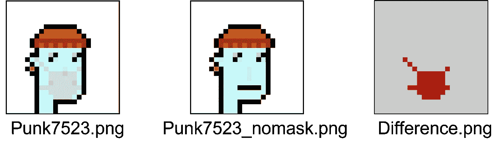

Figure 14: Comparing Every Pixel via Perceptual Hashing

如您所见，感知哈希比较只能隔离两幅图像中不完全匹配的像素(图 14)，在这种情况下，只能隔离缺失的“医用遮罩”像素。这种 pHash 比较方法在完整的集合范围内重复进行，以比较我们的 2400 x 2400 px“punks cloned . png”复合图像与原始的 2400 x 2400 px“punks . png”复合图像，每次都显示特征层中的微小像素细微差别，这些细微差别必须在特征层库中进行调整。在此克隆和比较过程的第五次迭代之后，我们的克隆和原始 crypto punk 之间没有发现更多差异——我们成功地重新设计了原始 crypto punk 的生成过程，并通过创建“PunksCloned.png”进行了验证，该“punks cloned . png”是原始“punks.png”的逐像素(5.76M 像素)精确副本(相同的感知哈希值，图像之间的汉明距离为零)。有趣的是，你在[密码朋克浏览器](https://deepzoompunks.z6.web.core.windows.net/)中看到的朋克实际上是我们的程序生成的克隆体！

# 3.构建特征分配引擎

随着层库的建立和验证，我们需要一个逻辑引擎，可以管理所有以下…

1.基于定向指示性状水平概率的批量作者性状组合

2.适应原型特定的特征逻辑，例如…

> a.外星人/类人猿应该只被赋予“帽子”属性，而不是“头发”属性。合乎逻辑——因为外星人/类人猿不会长出人类的发型(但是僵尸会，当然，因为他们以前是人类)。
> 
> b.外星人/类人猿从来没有面部毛发、瑕疵、嘴巴或鼻子特征。在扩张朋克人群中尊重这一逻辑很重要，以确保他们与原始外星人/猿类的视觉一致性。
> 
> c.带着“飞行员头盔”的朋克绝对不能被赋予“眼睛”特征(例如，眼镜、眼影等。).合乎逻辑的，因为飞行员头盔上已经有护目镜，所以有双眼特征将是一个尴尬的结果。
> 
> d.带着“焊接护目镜”的朋克绝对不能被赋予“帽子”属性——只能赋予“头发”属性。再次合乎逻辑，因为护目镜不能很好地匹配各种帽子特征。

3.根据 CryptoPunks 集合中发现的特征组合，验证特征组合是否为德杜平的唯一组合

4.批量创建 Punk 生成语法，通过 windows 命令行输入 ImageMagick。

我们使用 Microsoft Excel 在包含 4 个主要工作表的工作簿中完成了上述所有工作…

**工作表 1** : **生成器**针对每个特征概率应用“随机”整数作为乘数来随机分配特征，然后应用原型特定的逻辑，接着针对原始 CryptoPunk 群体进行特征组合反杜平——每一个新行都是一个新朋克，用“扩展”与“重复”标志来指示是否应该生成它。实际上，图 15 中的每个单元格都包含一个复杂的公式，将所有这些结合在一起。可以通过在每个单元格中加入更多公式来进一步简化可视化布局——这可能是未来的一项增强功能，使这个 Excel 工作表可配置用于创建其他集合。

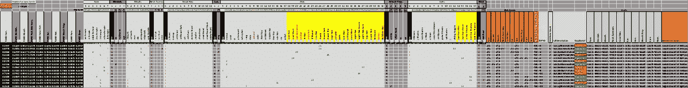

Figure 15: ExpansionPunks Trait Assignment Engine Built in Excel

**工作表 2:** **PNG 名称查找表**供生成器使用(vlookup)来创建生成的最终 Punk 语法:

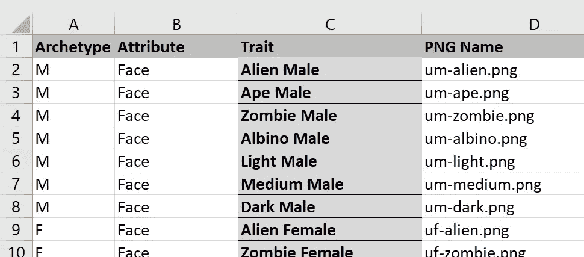

Figure 16: PNG Lookup Table

**工作表 3:** **生成器用于随机化特性分配的特性概率**—在图 17 中，您可以看到生成器遵循与原始 crypto 朋克系列相同的肤色概率的粗略说明(约 10%白化，以及约 30%亮/中/暗)。

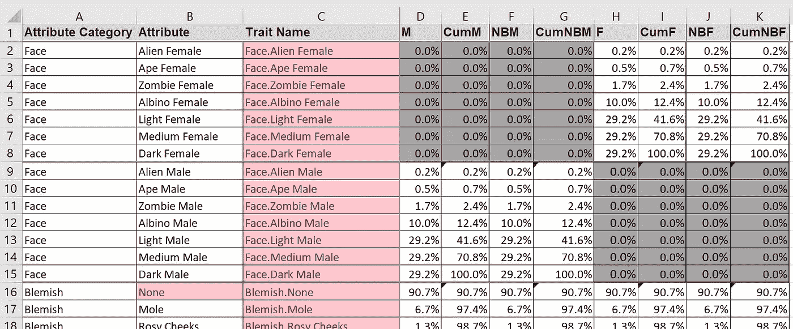

Figure 17: Trait Probabilities to Instruct Random Trait Assignment

**工作表 4:** **原始 10K 加密朋克元数据**供生成器在德都平扩展朋克特性组合中交叉引用

# 4.扩张朋克一代

有了所有特征的经验证的图像图层库和每个 punk 的单行生成语法(由我们的 Excel 生成器输出)，然后我们通过 Windows 命令行将大约 14K 行 Punk 语法输入 ImageMagick。下面是表示 Punk#10000 的示例语法:

> magick convert um-dark.png um-smile.png um-handlebars.png um-peakspike.png um-cigarette.png-背景无-扁平化扩张朋克\punk10000.png

几分钟后，我们有了 14K 个特征鲜明的 ExpansionPunks，每个都是 24x24 像素的 PNG 文件。进入资产，令人兴奋的是发现各种各样的扩张朋克仍然感觉在加密朋克中如鱼得水。在下面的*图 18* 中，我们看到一些样本扩张朋克(橙色)，我们喜欢称之为“填充朋克”，因为它们填补了一个肤色空白，否则就是一个完整的特征组合原型。

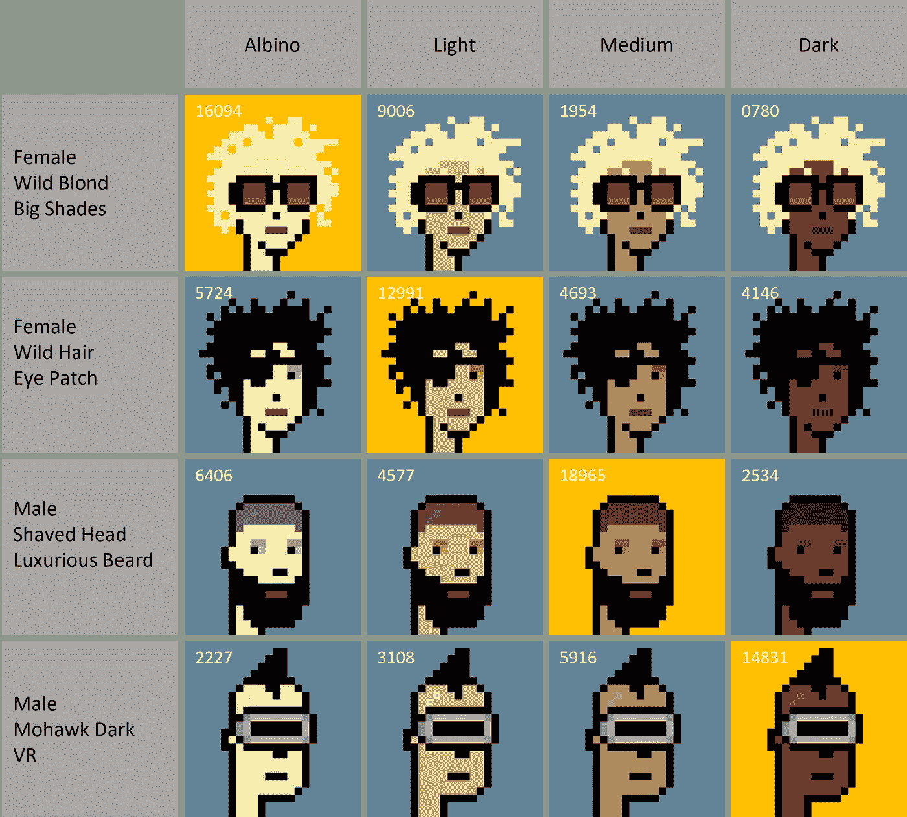

Figure 18: “Gap” Punks Filled by ExpansionPunks

当然——所有这一切中的另一个后一代兴奋之处是新的多样化原型的出现(*图 19* )，这些原型在一个小时前还只是朋克特质语法，下面是一些例子:

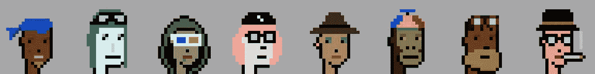

Figure 19: New, Diverse ExpansionPunk Archetypes

# 5.感性的德杜平反对密码朋克人口

对于 14K 的扩张朋克——肯定会有“感知”副本(例如，一个具有隐藏特征的扩张朋克在视觉上看起来像是现有加密朋克的精确副本)。有很多种特征可以隐藏其他特征，下面是几个例子:

> >医用口罩隐藏了所有嘴部特征(口红、微笑、皱眉、龅牙)
> >医用口罩隐藏了部分面部毛发特征(小胡子、车把)
> >大胡子藏金链
> >野毛藏耳环
> >直发藏耳环
> >等。

鉴于各种潜在的“隐藏”特征冲突，仅依靠在 Excel 预生成中执行的特征组合重复数据删除不足以确保完全唯一的扩展群体。因此，14K 图像中的每一个都必须被感知散列为唯一的“签名”值，然后可以针对 ExpansionPunk 集合本身以及针对每个原始 10K crypto punk 的感知散列签名值进行去重。再次输入 ImageMagick 进行签名散列…

> magick identify-quiet-format " % f % # \ n " *。png > Signature.txt

现在有了 14K 扩展朋克散列签名和 10K 加密朋克散列签名，一些基本的 Excel 函数来比较并从扩展朋克群体中删除任何重复的散列签名是一项简单的任务。*下面的图 20* 突出了一个特征不同的扩展候选者的例子，感知哈希揭示了由于隐藏的耳环特征与 CryptoPunk #8149 的视觉冲突。

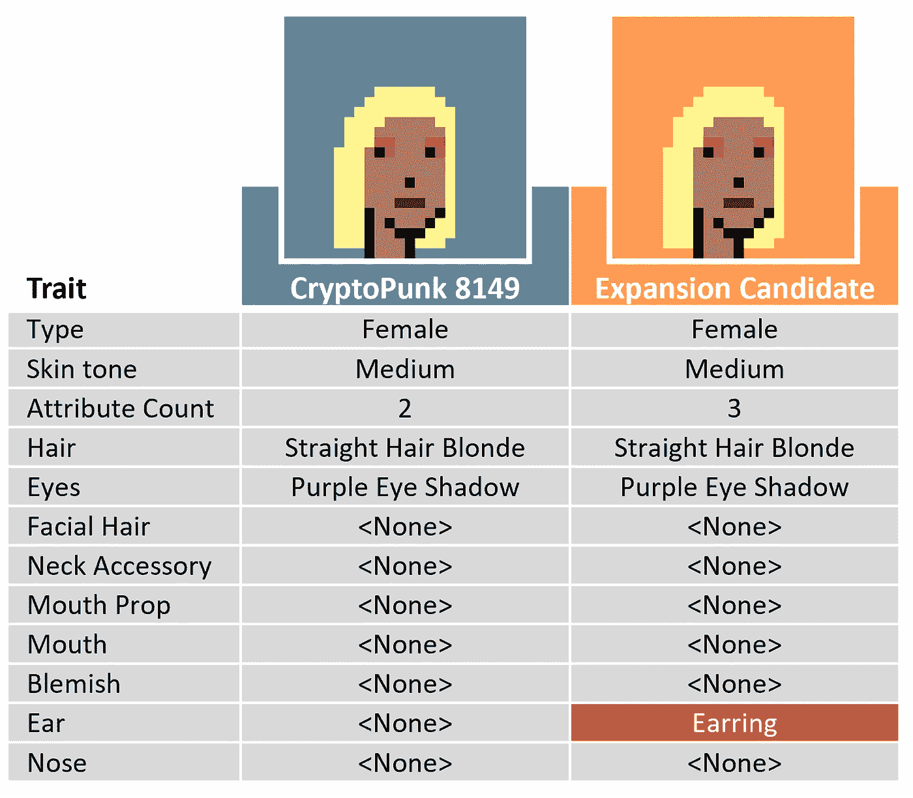

Figure 20: Trait-Distinct Punk Exposed as a Visual Collision through Perceptual Hashing

这种感知哈希过程进一步将我们的扩张朋克群体从大约 14K 减少到大约 12K，这些朋克具有独特的特征和视觉特征。

# 6.将人口减少到最终的 10K

在 12K 排朋克数据的基础上建立了各种数据透视表，以评估朋克在“类型”和“属性”上的总体分布——并且以优化特征分布的方式将集合从 12K 手动削减到 10K，以感觉更符合原始 10K 人口(至少尽可能多)。例如，在去杜平视觉碰撞之后，最终的 12K 群体比原始群体更倾向于 4/5/6 属性朋克，因此朋克减少首先集中于随机移除具有较高属性计数的朋克。这个过程与其说是科学，不如说是艺术，但它仍然只是在聚合视图上完成的(例如，查看数据透视表的值，然后通过批量操作随机删除朋克，而不是挑出单个朋克进行删除)。在下面的图 21 中，完整的 100 x 100 朋克合成首次亮相。

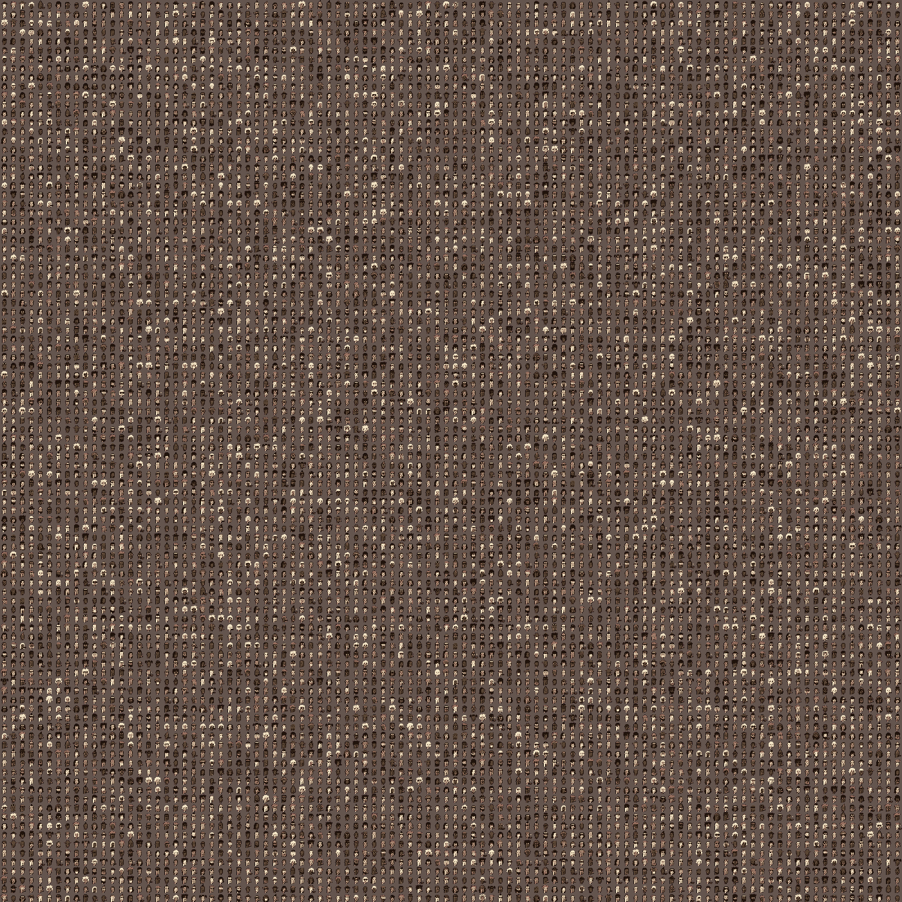

Figure 21: All 10K ExpansionPunks

# ***以上过程的一些最终注释…***

不可否认，除了使用 Excel，还有更多以代码为中心的方式来构建生成器。我们没有走那条路，我们对此没有意见😉—我们认为我们的强力 Excel 方法在这里有些独特(相对于利用其他人的生成脚本)。

*我们完全承认，在造币时期，扩张朋克是预先生成的，而不是链上生成的。我们决定预先生成，以确保不会有与密码朋克发生特征组合冲突或视觉冲突的风险。我们估计了在造币时进行这种去杜平的计算负载，并得出结论，预生成最终将是收藏家更好的铸造体验。*

*虽然上面的过程看起来非常简单——但这是几个月来在其他最终不可扩展的过程中反复试验的结果。例如，在我们发现 ImageMagick 之前，我们使用 Photoshop 中的“变量”和“数据集”功能来批量生成 ExpansionPunks。虽然可以做到这一点，但需要更多的步骤(将数据集导出为 PSD 文件，然后将 PSD 批量转换为 png，等等)。)并引入了比使用 ImageMagick 的 Windows 命令行方法更大的出错空间。*

# 下一步是什么？

扩张朋克现在已经上线，并且仍然可以铸造@[www.expansionpunks.com](http://www.expansionpunks.com)——铸造你自己的扩张朋克，加入庞克沃斯的包容性扩张吧！

与此同时，我们致力于推进整个 Punkverse，为最初的 CryptoPunks 社区带来新的体验和价值。本着这种精神，我们很高兴地推出 [10K 系列浏览器](http://www.expansionpunks.com/explorers)，这是一种浏览 10K·NFT 系列的新体验，现在可用于 CryptoPunks、ExpansionPunks 和 World of Women 系列:

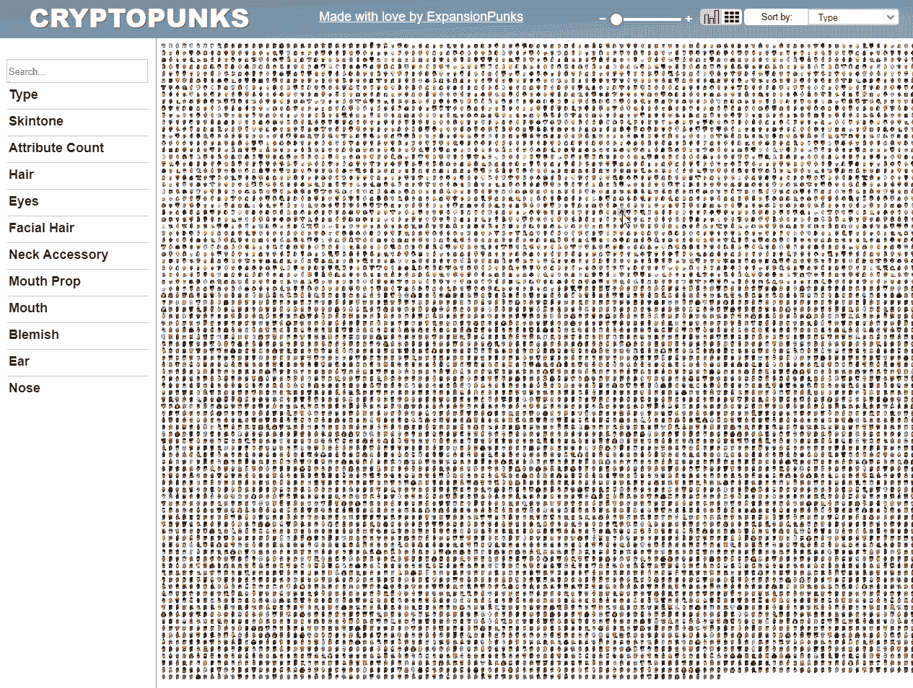

10K 收藏浏览器通过对整个收藏进行动态过滤和排序，让您在一次视觉上引人入胜的体验中获得更多见解和联系。它改变了属性数据的使用方式，揭示了原本不可见的趋势。

# 保持联系

请加入我们的 [Discord](https://discord.gg/cuTPQhDU3M) 和 [Twitter](https://twitter.com/ExpansionPunks) 以了解更多信息，保持联系并支持我们扩展 Punkverse 的使命。

[www.ExpansionPunks.com](http://www.ExpansionPunks.com)(仍在铸造)