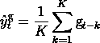
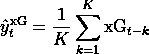

# 预期目标:他们能预测未来的目标吗？

> 原文：<https://medium.com/geekculture/expected-goals-can-they-predict-future-goals-24a1b1d0279d?source=collection_archive---------1----------------------->

## 分析变得简单

## 高于团队平均目标


山姆·格林于 2012 年在足球界引入了预期目标，并迅速成为足球分析的标准指标。许多文章已经展示了如何使用预期目标来判断一个赛季的球员或球队质量，但没有多少关于如何使用它们进行预测。

本文的目的是填补这个空白，并展示为什么预期目标可以被认为是一个很好的预测统计。使用泊松回归，我们表明，预期目标是一个比实际目标更好的预测。

# 预期目标是什么？

当你阅读关于预期目标的文章时，在得分的概率和预期目标的度量之间经常会有**的混淆。让我们澄清一下。每当一支球队有机会得分时，我们就可以联想到进球概率。请注意，概率只是一个介于 0 和 1 之间的数字。这也意味着并不是所有的进球和射门都是一样的:进球的概率可能是 0，而射在横梁上的的概率可能接近 1。**

第一个例子是里卡多·努涅斯 2021 年的目标。守门员从他的罚球区得分。那个射门变成进球的概率几乎为零。

Example of a goal with a probability of almost 0\. Video from [Último Lance](https://www.youtube.com/channel/UCP9Mwv7zFh-z5hvLpP1HS7Q).

另一方面，有目标错过的概率几乎是 1。一个经典的例子是一个开放式的进球失误，这将使你尖叫“他怎么能错过这个！”

Example of a non-goal with a probability of almost 1\. Video from [Guardian Football](https://www.youtube.com/channel/UCNHqb1IRxQ5WBsWtO53JL2g).

> 在期望进球理论中，进球得分总是价值小于 1，失球总是价值大于 0。

在足球比赛结束时，您可以将概率与球队的每个得分机会和进球关联起来。现在假设**进球** **机会是 independent⁴，**一个球队在一场比赛中的预期进球数是所有这些概率的总和。这是**队对那场比赛的预期目标**，简称 xG。

当你看足球的时候，你经常认为那个队应该赢，或者那个队不应该输。预期目标会告诉你这一点。如果你看看预期的进球结果，一支球队可能输掉了比赛，但却赢得了比赛，反之亦然。

> 目标是团队有效得分的数量。预期目标是根据比赛数据，一个队应该进的球数。

我们如何计算概率是另一个故事，超出了本文的范围。网络上充满了关于这个主题的技术文章。例如，见[这篇文章](https://dtai.cs.kuleuven.be/sports/blog/how-data-availability-affects-the-ability-to-learn-good-xg-models)或[这篇博客](https://towardsdatascience.com/modeling-expected-goals-a756baa2e1db)。

但是，这些文章缺乏的是**如何使用预期目标来做出预测**和**什么使得预期目标成为球队未来比赛的有价值的预测器**。让我们找出答案。

# 表明 xG 是一个相关的预测因子

预期目标是在比赛结束时计算的描述性统计数据。他们只是告诉你故事，他们怎么能预测任何事情？此外，它们还与特定的设备、阵容和策略相关联。单赛结果其实也是同样的问题。但是，当你开始看看过去球队的状态或者赛季平均进球数，你就能更好地了解球队的实力。

例如，你期望一个总是赢的团队也会赢得接下来的比赛。这就是看过去的平均结果来预测未来的概念。好消息是，我们也可以用预期目标和实际目标来实现。然后，使用这些平均值来预测一支球队在未来会得分多少次。

首先，让我们做一些代数运算，建立我们的预测器。我们想用一支球队过去的成绩来预测他们能进多少个球。比赛时间用 **t、**表示，之前的比赛时间用 **t-k、**表示，例如， **t-2** 应该是两场比赛之前。请注意，这些统计数据是在比赛开始前计算的，因此它们实际上是在 **t** 的比赛结果的预测器。预测器很简单，它只是球队过去 K 场比赛的平均值。我们使用目标(g)和预期目标(xG)计算统计数据，如下所示:



The predictor of future goals using past goals (g)



The predictor of future goals using past expected goals (xG)

对于每场比赛，我们可以计算两个预测值，并使用它们来预测进球数量。由于要预测的目标数量是一个正整数，我们可以假设它遵循泊松 distribution⁵.然后建立一个简单的[泊松回归](https://scikit-learn.org/stable/modules/generated/sklearn.linear_model.PoissonRegressor.html)模型来帮助我们校准预测。

我们准备了一个数据集，其中包含全球 5 年来超过 10000 万场比赛的两个预测值(可以在这里下载)。我们将使用**均方误差**损失来比较两个模型的预测:

*   *目标模型*将使用团队过去 10 个目标的平均值来拟合目标(y)。我们将这个变量命名为`goal_average`
*   *预期目标模型*将使用团队过去 10 个预期目标的平均值来拟合目标(y)。我们将这个变量命名为`xG_average`

在 [scikit-learn](https://scikit-learn.org/stable/) 中，我们可以使用`PoissonRegressor`轻松进行回归。由于我们不想使用正则化，不要忘记设置阿尔法为 0。

```
from sklearn.linear_model import PoissonRegressorregressor = PoissonRegressor(alpha = 0.0)
```

将使用`repeatedKfold`交叉验证来估计模型的均方误差。同样在 scikit-learn 中，我们做到了:

```
from sklearn.metrics import mean_squared_error# Define cv and scoring method
cv_method = RepeatedKFold(n_splits = 10, random_state=1256)
scoring='neg_mean_squared_error'# evaluate model
goal_model_mse = cross_val_score(regressor, y, goal_average, scoring=scoring, cv=cv)
xG_model_mse = cross_val_score(regressor, y, xG_average, scoring=scoring, cv=cv)
```

再现这些结果的笔记本可在[这里](https://github.com/octosport/octopy/blob/master/notebooks/Expected_Goals_Can_They_Better_Predict_Futures_Goals.ipynb)获得。执行代码将向您显示下面的方框图。


它表明，使用预期目标模型，交叉验证的 MSE 的均值和标准差都较低。预期目标模型的平均交叉验证 MSE 为 **1.35** ，而目标模型的平均交叉验证 MSE 为 **1.38** ，而标准偏差较低。这意味着预期目标平均值是一个比实际目标更有信心的更好的预测指标。

> 预期目标平均值比目标平均值更能预测未来目标

# 结论

在本文中，我们试图填补预期目标和预测建模之间的空白。实际上，如果你在实现预期目标时使用它们，那么它们是描述性的，而不是预测性的。预期进球告诉你，如果比赛在相同的射门次数下反复进行，最终得分会是多少。

但是,“预期的”这个词会产生误导，因为 xG 本身并不是一个预测因子。然而，使用 xG 过去的统计数据表明，与实际目标相比，它是未来得分的更好预测者。

# 参考

[1] M. Brechot 和 R. Flepp (2018)，[处理比赛结果的随机性:如何使用预期目标重新思考欧洲俱乐部足球的绩效评估](https://ideas.repec.org/p/zrh/wpaper/374.html)。
第 374 号工作文件，苏黎士大学工商管理系(IBW)。

[2] W. Spearman (2018)，[超越预期目标](https://www.researchgate.net/publication/327139841_Beyond_Expected_Goals)，*麻省理工斯隆体育分析大会。*

[3] A. Rathke (2017)，[足球运动中预期进球与射门效率的考察，](https://rua.ua.es/dspace/bitstream/10045/68771/1/jhse_Vol_12_N_proc2_S514-S529.pdf)人类运动与锻炼杂志，12(2)，514–529。

[4]显然是错的。假设一名球员在球门前射门，击中门框，另一名球员在空门得分。两个 xG 都是依赖的。

[5] M. J .莫罗尼(1956 年)，[来自数字的事实](https://books.google.co.uk/books/about/Facts_from_Figures.html?id=6--PAAAAIAAJ&redir_esc=y)，第三版，企鹅图书公司，伦敦。