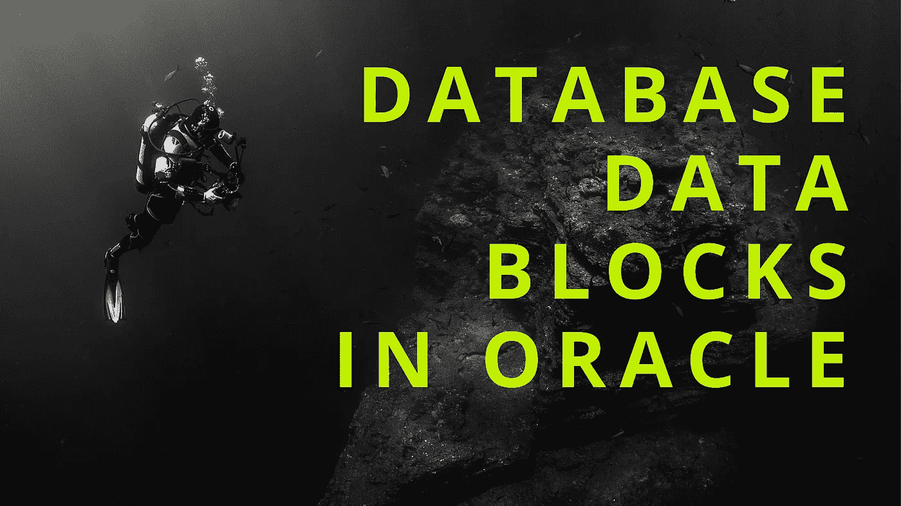
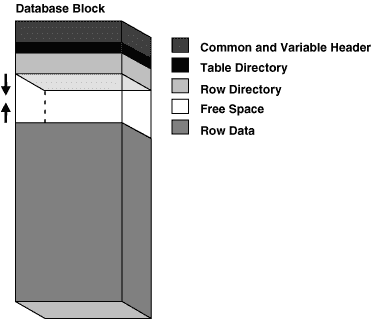
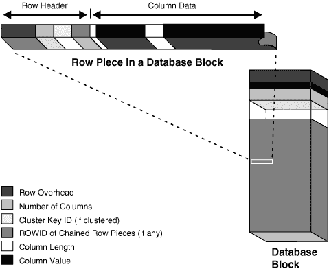

# 解释一下 Oracle 数据库数据块？|采访问答

> 原文：<https://medium.com/geekculture/explain-about-oracle-database-data-block-interview-a-be137c52fe4d?source=collection_archive---------7----------------------->

在这里，我们将了解 oracle 中的数据库块

**数据块:**

*   Oracle 数据库中的所有数据都以块的形式存储在磁盘和内存中。
*   理解 Oracle 数据库块主题非常重要。因为 Oracle 不会将整个表存储在一个块中并直接从那里返回。
*   块是数据库中存储数据的最小单位。
*   它是由多个操作系统块组成的逻辑单元。
*   可能有数百万或数十亿个数据块，它们在其中存储实际数据。
*   一个块可以有整个表或表的几行。或者有时，当多个表聚集在一起时，一个块可以有不同表的行。
*   块有特定的大小，不能直接扩展。
*   一个块的大小可以从 2KB 到 32KB，但通常默认设置为 8KB。
*   这个大小由数据库管理员在数据库安装时指定。还有，8KB 也不是个小数目。
*   当然，根据行数据的大小，它可能有数百行，也可能有数千行。因为根据表的行大小，行可以是几个字节，甚至几个位。

**Database Blocks**

**块头:**

*   块由块标题和行组成。
*   块头包括关于块类型信息(是行块还是索引块)的信息，以及包含行的表的信息，行目录表示该块中每行的地址。
*   它是一个逻辑块，每一行都存储在内存的实际块中，这些块都有特定的地址。
*   逻辑块和每一行都将被存储在内存的真实块中，而这些块都有特定的地址。

**Inside Data-blocks**

**ROWID:**

*   这是一个地址，我们可以直接找到该行的确切位置，并轻松地读取它。
*   一个块头有许多数据，所以它通常有大约 100 字节的数据。块的其余部分有行和一些空闲空间。
*   行后有大量的行和空格，总行数后有大量的空格。
*   这些行旁边和所有行底部的白色区域表示这里的空间。
*   这些空间很重要。因为，如果您进行更新并增加一行的大小，那么将这一行移到该块中的另一个位置或者另一个块的代价将会很高。
*   Oracle 在每行之后都留有一些空间。因此，如果这一行的大小增加，它只需将它写入相同的位置。
*   这将大大提高性能。但有时新的行大小可能会超过该行及其后空间的总大小。如果发生这样的事情，如果块中有足够的空间，就从这里删除这一行，写入大空间区域。
*   但是如果块中没有足够的空间，这一次它被写入另一个块中。
*   通常是这样，但是当你创建一个表时，你可以使用 PCTFREE 或 PCTUSE 参数来指定一个块中还剩下多少空闲空间。
*   因此，您可以更改这些可用空间的大小，也可以说不留下任何空间，只使用所有空间。
*   但是如果您没有在块中留下任何空闲空间，那么每次更新很可能会改变行的位置，这会降低性能。因为 IO 操作将显著增加，IO 意味着调整成本。
*   当 Oracle 试图查找您的行时，它首先查找您的行所在的块，然后使用 rowid 转到该行的地址。
*   行中还有一些附加数据。块中的行区域不仅仅由列数据组成。
*   它有一些额外的数据，比如行开销、该行中的几个列、集群的集群键 id(如果集群的话)、该列的 rowid、列长度和列值。
*   从模式中可以看出，在行标题区域，首先是行开销，然后是列数，即该行中有多少列，如果该行是一个集群的一部分，则是其集群 id，然后是该行的 rowid。
*   行标题之后是列数据。对于这一行中的每一列。
*   它有该列的长度和列值。所以每一列都存储在前一列之后。
*   但是在每一列之前，它都有它的长度。长度显示该列将读取多少字节。
*   因为读者进程需要知道从哪里开始，在哪里结束。
*   它无法知道哪一个是数据。使用这种算法，服务器可以读取数据而不会出现任何混乱。
*   这是在 Oracle 数据库中读取数据的方式。

**结论:**

*   如您所见，Oracle 不仅存储确切的数据，还存储关于行的一些附加信息。
*   因为它在很多地方使用这些信息来提高性能。