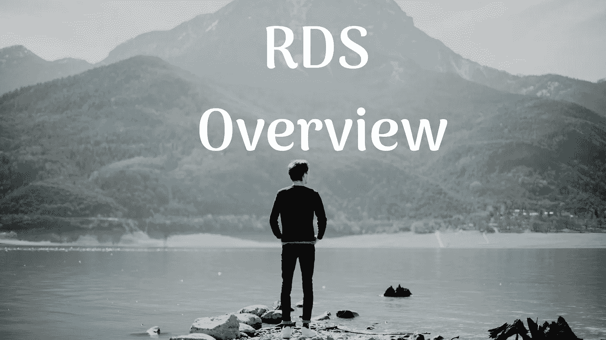
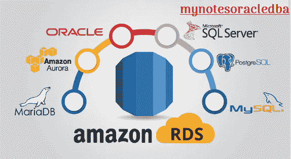

# 解释 RDS 概述结构

> 原文：<https://medium.com/geekculture/explain-about-rds-overview-structure-e0f459396d16?source=collection_archive---------16----------------------->

在这里，我们将介绍 RDS 概述体系结构

今天我们将从一个广阔的角度来看 RDS。

RDS 到底是什么？

*   RDS 是关系数据库服务的缩写。
*   它支持 SQL(结构化查询语言)
*   它支持 PostgreSQL、MySQL、Oracle、Microsoft SQL Server 和 Aurora 引擎

AWS RDS DB Flavours

*   Aurora 是亚马逊自己提供的，其他的都是第三方数据库服务。
*   它管理数据库服务。
*   它启动了一个 VPC，通常在私有子网中，并使用安全组来控制网络访问。
*   通过 EBS (gp2 或 io1)存储，可选择自动增加存储大小。
*   备份:它支持自动备份使用 PITR(时间点恢复)备份到期
*   如果您想要将备份保留更长的时间，您可以拍摄许多快照，这些快照也可以跨区域复制。
    -你可以通过云观察进行监控，甚至还可以通过社交网站话题进行订阅

**我们为什么要使用 RDS？**

-它可以管理硬件(物理)
-它可以管理软件(操作系统)
-它可以管理应用程序(数据库)

**当我们在 AWS 云上托管时(EC2，但不在 RDS 上)**

- AWS 可以管理硬件
-我们可以管理软件(OS)
-我们可以管理应用程序(DB)

**当我们使用 RDS 时，它管理一切**

-硬件
- IT 经理，您的软件补丁。
-它还能帮助您管理您的应用。

-审计还管理数据库应用程序数据库。

**使用部署在数据库上的 RDS VS EC2**

- RDS 是托管服务
*自动备份，操作系统修补
*它支持连续备份，您可以恢复到任何特定的时间戳。(时间点恢复)
*监控仪表板
*它支持读取副本以提高性能。
*支持灾难恢复的多 AZ 设置
*为升级提供维护窗口
*我们可以简单地说出 It 进行维护的首选时间段。
*它支持垂直&水平扩展容量
*由 EBS (gp2 或 IOPS)支持的存储
*我们不能使用底层数据库实例的 SSH 数据库实例