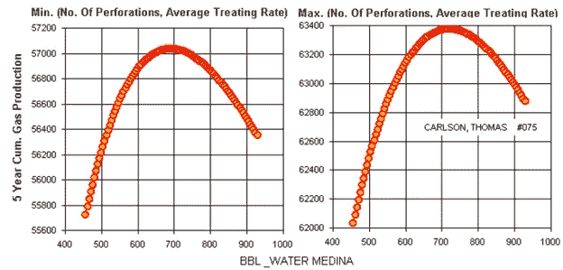
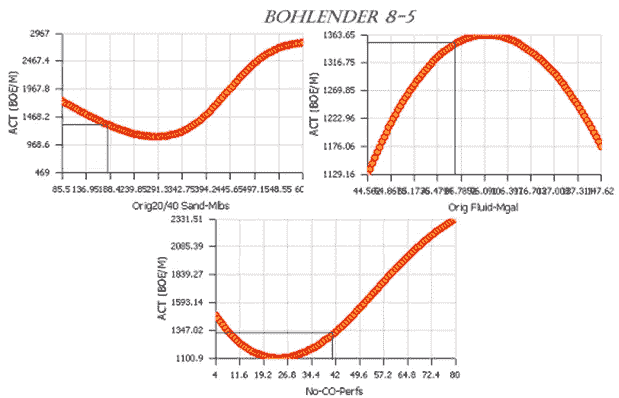
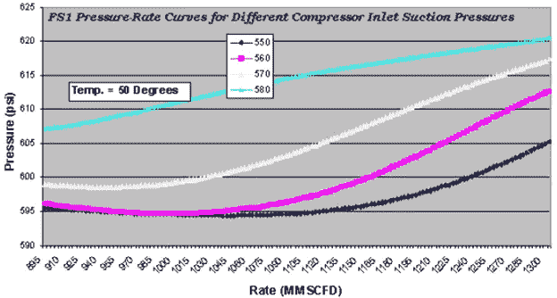
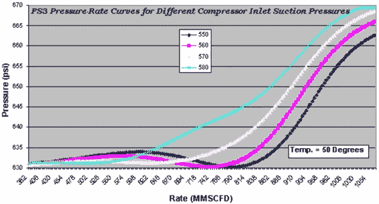
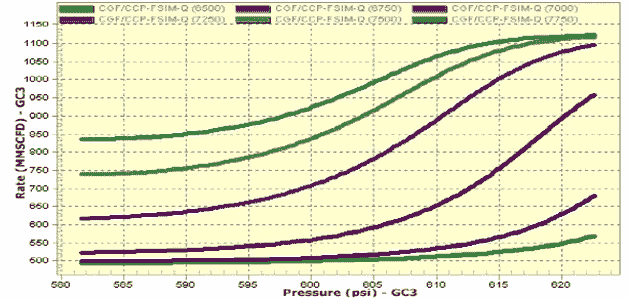
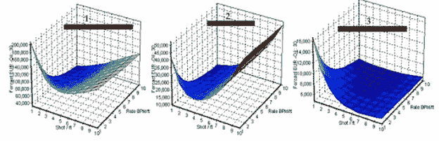
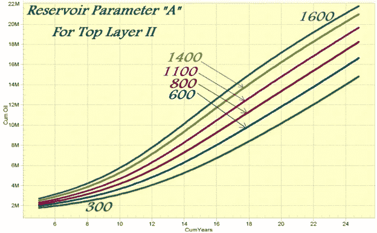
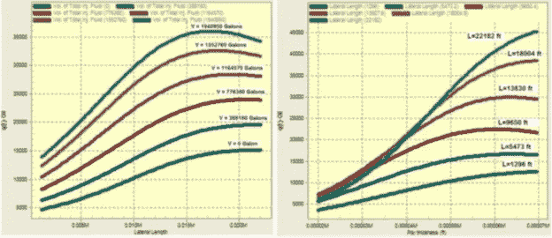

# 可解释的人工智能(XAI)

> 原文：<https://medium.com/geekculture/explainable-artificial-intelligence-xai-43bbd813c4a5?source=collection_archive---------41----------------------->

**人工智能工程应用的主要特征(四)**

**概述**
简介— **(第一部分)**
解释传统工程模型— **(第一部分)**
解释 AI 开发的物理学模型&【机器学习】— **(第二部分)**
—【XAI 第一部分:关键绩效指标(KPI) — **(第二部分)**
—【XAI 第二部分:敏感性分析— **(第二部分)**
—第二步:双参数敏感性分析— **(第二部分)**
—第三步:多参数敏感性分析— **(第二部分)**
—XAI 第三部分:典型曲线— **(第三部分)**
—非常规储层可解释人工智能模型(页岩分析)— **(第三部分)**
—常规储层可解释人工智能模型(自上而下建模)— **(第三部分)**

**石油数据分析中可解释人工智能(XAI)的历史**

自 2001 年以来，已经发表了七篇 SPE 论文，其中包括今天所谓的可解释人工智能(XAI)。这七篇 SPE 论文包括总共 38 幅图，这些图使用了预测分析模型，以解释这些模型如何解释纯粹基于现场测量而非数学方程建模的物理现象。为了展示 XAI 在石油数据分析中的历史应用，本文的这一部分展示了这七篇 SPE 技术论文中的大部分数据。

第一篇包含第一版可解释人工智能(XAI)的技术论文是一篇发表于 2001 年的 SPE 论文(SPE 72385)。本文是关于人工智能和机器学习在水力压裂建模中的应用。图 22 显示了该 SPE 论文中与 XAI 相关的几个数字。在本文中，使用人工神经网络开发(训练、校准和验证)的数据驱动模型用于解释三个水力压裂相关参数的影响。这些水力压裂相关参数是射孔数量、注入速率和注入的总水量。本文中的 XAI 解释了这些参数对油井产能(5 年累积产气量)的影响。这些参数对油井产能影响的解释用于确定油井产能优化，作为射孔数量、注入速度和注入水总量的函数。

图 22 显示了本文中的图 7，说明了油井产能(5 年累积产气量)达到最大值的条件。对于该特定油井(Carlson，Thomas #075 ),只要射孔数量和注入速率保持在最小值(注入速率为 25 桶/分钟，8 次射孔), 5 年累积产气量可达到最大值 57，050 MSCF；只要射孔数量和注入速率保持在最大值(注入速率为 60 桶/分钟，26 次射孔), 5 年累积产气量可达到最大值 63，400 MSCF。

Figure 22\. SPE 72385 paper’s figure 7\. Single well “Carlson, Thomas #075” analysis — Sensitivity to amount of water injected.

如图 22 所示，当这些参数(射孔数量和注入速度)保持在最小值时，最高的 5 年累积产气量(57，050 MSCF)在 680 桶水时达到，另一方面，当这些参数保持在最大值时，最高的 5 年累积产气量(63，400 MSCF)在大约 725 桶水注入时达到。结论可能是，该井的理想注水量约为 700 桶。本 SPE 文件包括另外两个相似的图，显示了对同一油田另外两口井的解释。

与 2001 年发表的论文类似，第二篇包含可解释人工智能(XAI)的技术论文是一篇在 ATCE 发表的 SPE 论文(SPE 77597)，发表于 2002 年[【2】](#_ftn2)。本文也是关于人工智能和机器学习在模拟科罗拉多州 DJ 盆地的再压裂(再增产)中的应用。图 23 解释了作为参数(如注入的支撑剂(砂)和流体数量以及射孔数量)函数的油井产能变化。在该图中，显示了 boh lender 8–5 井在再压裂过程中的月油桶当量和井产能。

[【1】](#_ftnref1)使用虚拟智能技术确定水力压裂的最佳实践，SPE 72385，Mohaghegh 等人。艾尔。SPE 东部地区会议于 2001 年 10 月 17-19 日在俄亥俄州坎顿市召开。

[【2】](#_ftnref2)使用智能数据挖掘工具识别水力压裂的成功实践；应用于 DJ 盆地的 Codell 地层。2002 年 9 月 29 日至 10 月 2 日在德克萨斯州圣安东尼奥举行的 SPE 年度技术会议和展览。

Figure 23\. SPE 77597 paper’s figure 8\. Sensitivity of the post-restimulation actual peak (after an average restimulation job) to different values of three parameters being studied, namely, amount of sand, amount of fluid, and number of perforations for the well Bohlender 8–5Figure 23\. SPE 77597 paper’s figure 8\. Sensitivity of the post-restimulation actual peak (after an average restimulation job) to different values of three parameters being studied, namely, amount of sand, amount of fluid, and number of perforations for the well Bohlender 8–5

第三篇包含可解释人工智能(XAI)的技术论文是一篇发表于 2002 年的 SPE 论文(SPE 77659)。本文涵盖了使用人工智能和机器学习对英国石油公司普拉德霍湾(美国阿拉斯加)地面设施进行的纯数据驱动建模。本文包括生成可解释人工智能的图表，涵盖了八种不同三相分离器设施的分离器压力、温度、碳氢化合物速率和压缩机入口吸入压力。图 24 和图 25 显示了这篇 SPE 论文中的两幅图。

[【3】](#_ftnref1)普拉德霍湾石油生产优化:使用虚拟智能技术，第一阶段:神经模型建立。SPE 77659。2002 年 9 月 29 日至 10 月 2 日在德克萨斯州圣安东尼奥举行的 SPE 年度技术会议和展览。

Figure 24\. SPE 77659 paper’s figure 13\. Rate vs. pressure curves for FS1 (three-phase separator facility) at 50 degrees Temperature and different Compressor Inlet Suction Pressures.

Figure 25\. SPE 77659 paper’s figure 15\. Rate vs. pressure curves for FS3 (three-phase separator facility) at 50 degrees Temperature and different Compressor

第四篇包含可解释人工智能(XAI)的技术论文是发表于 2004 年的 SPE 论文(SPE 89033)[【4】](#_ftn1)，其中包含了更多来自普拉德霍湾表面设施的纯数据驱动模型的 XAI 的例子。本文包括 7 幅图，涵盖了普拉德霍湾水面设施的 XAI。图 26 和图 27 显示了这篇 SPE 论文中的两幅图。

人工智能在石油工程中应用的新进展。西弗吉尼亚大学 shahab d . Mohaghegh&智能解决方案公司，SPE 89033。JPT 杰出作家系列，2004 年 4 月。

Figure 26\. SPE 89033 paper’s figure 12\. FS2 (3-phase separator facility) rate behavior, a function of pressure @ FS2 and FS1A rates.

Figure 27\. SPE 89033 paper’s figure 19\. GC3 (3-phase separator facility) rate behavior as a function of pressure @ GC3 and CCP rates.

第五篇包含可解释人工智能(XAI)的技术论文是发表于 2005 年[【5】](#_ftn1)的 SPE 论文(SPE 95942)。本文介绍了俄克拉荷马州 Golden Trend 油田水力压裂的 XAI。本文包括两张图，显示了该油田多口单井水力压裂的 XAI 结果。

图 28 说明了每英尺(x 轴)的发射量和注入速率——BPM/ft。(y 轴)影响三口单井 30 年 EUR 油井产能。随着射孔数量和每英尺产层厚度的平均注入速度的变化，这些井显示出不同类型的响应。随着射孔数量和平均注入速率开始增加，每口井的生产响应都有所不同。

[【5】](#_ftnref1)俄克拉荷马州 Golden Trend 油田最佳水力压裂实践分析。SPE 95942。SPE 年度技术会议和展览于 2005 年 10 月 9 日至 12 日在美国德克萨斯州达拉斯举行。

Figure 28\. SPE 95942 paper’s figure 13\. Sensitivity analysis for “Shot/ft” and “Rate” for three wells in the database.

第六篇包含可解释人工智能(XAI)的技术论文是发表于 2006 年的 SPE 论文(SPE 101474)。本文涵盖传统数值模拟模型的智能代理建模的 XAI。图 29 提供了模型的典型曲线，展示了特定储层参数对石油产量的影响，而图 30 提供了模型的典型曲线，展示了另一个特定储层参数对含水率的影响。

[【6】](#_ftnref1)利用替代油藏模型对中东某大油田的不确定性分析。SPE 101474。阿布扎比国际石油展览会暨会议于 2006 年 11 月 5 日至 8 日在阿联酋阿布扎比举行。

Figure 29\. SPE 101474 paper’s figure 10\. Behavior of 5-year cumulative oil production as a function of time for different values of parameter “A” of Top Layer II. This can be considered as a type curve for this particular reservoir.

Figure 30\. SPE 101474 paper’s figure 11\. Behavior of instantaneous water cut as a function of time for different values of parameter “B” of Top Layer II. This can be considered as a type curve for this particular reservoir.

第七篇包含可解释人工智能(XAI)的技术论文是发表于 2010 年[【7】](#_ftn1)的 SPE 论文(SPE 139032)。本文介绍了巴肯页岩水力压裂的完井设计特点。本文展示的可解释人工智能模型是使用 IMagine[【8】](#_ftn2)软件应用程序开发的，该软件应用程序用于开发自顶向下模型(TDM)[【9】](#_ftn3)[【10】](#_ftn4)。图 31 展示了如何使用 XAI 解释作为“横向长度”和“注入压裂液”函数的采油特性(左图)，以及作为“产层厚度”和“横向长度”函数的采油特性(右图)。

巴肯页岩地层的油田开发策略。SPE-139032。SPE 东部地区会议于 2010 年 10 月 12 日至 14 日在美国西弗吉尼亚州摩根敦召开。

[【8】](#_ftnref2)[http://intelligentsolutionsinc.com/Products/IMagine.shtml](http://intelligentsolutionsinc.com/Products/IMagine.shtml)

[【9】](#_ftnref3)[http://intelligentsolutionsinc.com/Technology/TDM-2.shtml](http://intelligentsolutionsinc.com/Technology/TDM-2.shtml)

[【10】](#_ftnref4)[http://intelligentsolutionsinc.com/Technology/TDM-1.shtml](http://intelligentsolutionsinc.com/Technology/TDM-1.shtml)

Figure 31\. SPE 139032 paper’s figures 27 and 28- Effect of volume of injected fracturing fluid and lateral length on production rate (Middle Bakken model) — Effect of pay thickness and lateral length on production rate (Middle Bakken model)

**结论**

人工智能和机器学习的工程应用与该技术的非工程应用(人工通用智能——AGI)有许多不同之处。人工智能和机器学习的工程应用的一个主要特征是它的使用今天被称为可解释的 AI (XAI)。通过人工智能和机器学习的工程应用开发的纯数据驱动模型不是“黑箱”。AI&ML 的工程应用开始超越从现场测量中提取和识别“相关性”,并开始解决“因果关系”。虽然这是在 20 世纪 90 年代末和 21 世纪初完成的，但当时它还不叫 XAI。现在，特别是自 2016 年以来，XAI 已经成为人工智能和机器学习的非工程应用中的一个重要话题，而在此之前十多年，人工智能和人工智能的工程应用就已经解决了这个问题。