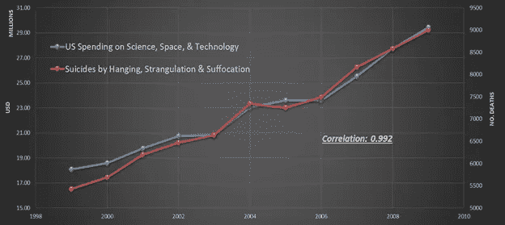
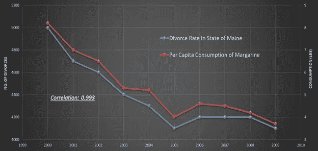
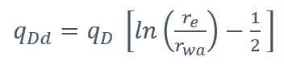
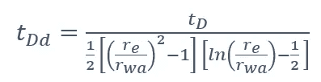
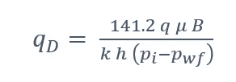
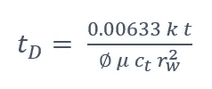
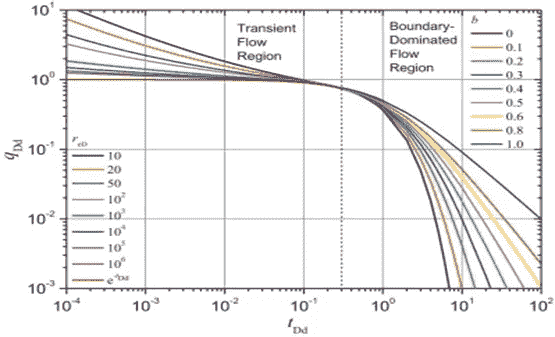
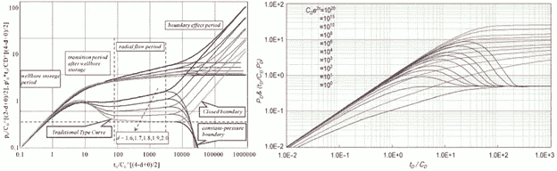

# 可解释的人工智能(XAI)

> 原文：<https://medium.com/geekculture/explainable-artificial-intelligence-xai-67444ed64a38?source=collection_archive---------22----------------------->

**人工智能工程应用的主要特征(上)**

**概述**
简介— **(第一部分)**
解释传统工程模型— **(第一部分)**
解释 AI 开发的物理学模型&【机器学习】— **(第二部分)**
—【XAI 第一部分:关键绩效指标(KPI) — **(第二部分)**
—【XAI 第二部分:敏感性分析— **(第二部分)**
—第二步:双参数敏感性分析— **(第二部分)**
—第三步:多参数敏感性分析— **(第二部分)**
—XAI 第三部分:典型曲线— **(第三部分)**
—非常规储层可解释人工智能模型(页岩分析)— **(第三部分)**
—常规储层可解释人工智能模型(自上而下建模)— **(第三部分)**

**简介**

数据科学的工程应用可以定义为纯粹基于事实(现场测量、数据)使用人工智能和机器学习对物理现象进行建模。这项技术的主要目标是完全避免假设、简化、先入为主的观念和偏见。

数据科学的工程应用的一个主要特征是它结合了可解释的人工智能(XAI)。虽然使用实际现场测量作为建模物理现象的主要构件，但数据科学的工程应用结合了几种类型的机器学习算法，包括人工神经网络、模糊集理论和进化计算。数据科学的工程应用的预测模型(数据驱动的预测模型)不是通过不可解释的“黑箱”来表示的。数据科学工程应用的预测模型是可以合理解释的。

在 20 世纪 90 年代初，当人工智能和机器学习开始用于解决工程相关问题时，工程师和科学家开始询问这项技术如何实现其预测目标。最近被称为可解释的人工智能(XAI)的人工智能和机器学习的非工程应用，在这项技术的工程应用背景下并不新鲜。人工智能和机器学习在很大程度上的工程应用背后的主要原因是可以解释的，这与应用传统统计学解决工程相关问题的历史问题有关。

传统统计学的主要解决方案是识别数据中的“相关性”，而工程师和科学家总是对能够解释“相关性”的“原因”感兴趣。这一直是使用传统统计学解决问题的主要问题之一。仍有许多数据驱动的解决方案被称为“黑盒”。人工智能和机器学习的工程应用不会产生“黑箱”解决方案。

工程师和科学家的问题引发了 2000 年初的研究和开发工作，并导致了今天所谓的可解释的人工智能(XAI)。在这篇文章中，通过 2001 年至 2010 年发表的 7 篇石油和天然气行业的技术论文，展示了今天所谓的可解释人工智能(XAI)的历史。

从历史上看，在人工智能和机器学习发展之前，传统的统计学被用来分析数据。传统统计学的主要作用是指定能够适合收集的数据的假设。因此，传统统计学背后的关键是“相关性”，而工程师和科学家一直对“因果关系”感兴趣。众所周知,“相关性”不一定决定和/或代表“因果关系”。图 1 和图 2 很好地说明了“相关性”与“因果性”没有任何关系。这些图展示了为不同变量收集的数据是如何相互关联的，而彼此之间却完全没有关系。

这篇文章的目的是覆盖和说明可解释的人工智能(XAI ),并展示它在近二十年前作为石油数据分析的一部分而出现。本文的不同部分将涵盖通过石油数据分析开发的模型如何解释使用纯数据驱动的基于人工智能的算法生成的模型的物理特性，这些算法不使用任何由数学方程生成的数据。

Figure 1\. In ten years, from 1999 to 2009, U.S. spending on Science, Space and Technology highly correlates with Suicide by Hanging, Strangulations, and Suffocation. Such correlation has absolutely nothing to do with causation.

Figure 2\. In nine years, from 2000 to 2009, Divorce Rate in the State of Maine highly correlates with Per Capita consumption of Margarine. It is quite clear that such correlation has absolutely nothing to do with causation.

**解释传统工程模型**

众所周知，通过数学方程生成的物理现象模型是可以解释的。这是工程师和科学家期望物理现象的任何潜在模型都应该是可解释的背后的主要原因之一。物理现象的传统模型的可解释性是通过用于建立模型的数学方程的解来实现的。这种模型的解释是通过数学方程的解析(对于相当简单的数学方程)或数值(对于复杂的数学方程)解来实现的。数学方程的解提供了从物理现象模型中得到几乎任何问题答案的机会。

数学方程的解用于解释模型为什么以及如何产生某些结果。它允许检查和解释所有相关参数(变量)相互之间以及对模型结果(输出参数)的影响和作用。一般来说，这就是解决问题的工程方法的定义。因此，基于数学方程的物理现象的结果(无论多么简单或复杂)都可以得到详细的解释。

图 3 显示了 Fetkovich 的“典型曲线”。包括早期时间(由瞬态流动方程驱动)和晚期时间曲线(边界主导流动，Arp 下降曲线)。以下是(等式 1 和等式 2)用于这一系列“标准曲线”的等式:

Equation 1

Equation 2

方程 1 和方程 2 中使用了无量纲速率(qD)和时间(tD ),在试井领域中，方程 2 定义如下(方程 3 和方程 4 ):

Equation 3

Equation 4

可以清楚地看到，图 3 中的曲线非常“良好”(连续的、非线性的、以相似的方式从一条曲线到另一条曲线变化的特定形状)。这些曲线“表现良好”的特征背后的原因是用来生成它们的数学方程。石油工业历史上产生的所有“典型曲线”都非常“良好”,因为它们都是使用数学方程的解开发的。图 4 展示了这种“性能良好”的“典型曲线”的另外两个例子。

Figure 3\. Fetkovich Type Curves.

Figure 4\. Examples of Type Curves.

这意味着传统的、基于数学的物理现象模型是“可解释的”。使用数学方程开发的物理现象可以通过对数学方程进行几种类型的分析来“解释”。以下是解释物理现象模型的四种方法，这些模型是使用数学方程开发和求解的:

1.识别数学方程中每个参数(变量)的影响，也称为关键绩效指标(KPI)，

2.单参数敏感性分析，

3.多参数敏感性分析，以及

4.“类型曲线”生成。

这种分析的执行可以对任何可能提出的问题提供所需的解释，这些问题涉及为什么以及如何产生某些结果，或者基于已经用于模拟物理现象的数学方程的解做出某些预测和预报。图 3 和图 4 展示了通过某些数学方程的解生成的“典型曲线”的例子。

> [***这是第一部分的结尾。第二部分请点击此处:***](https://shahab-mohaghegh.medium.com/explainable-artificial-intelligence-xai-dfb65dc28a54)