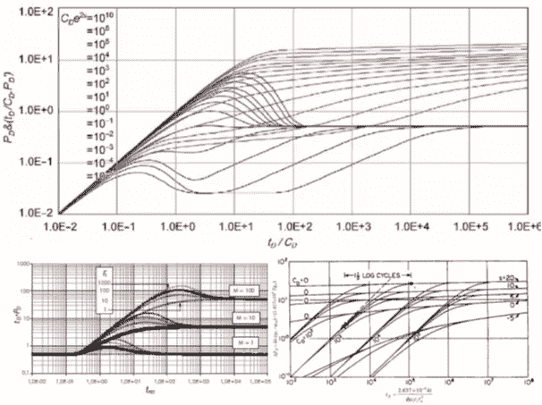
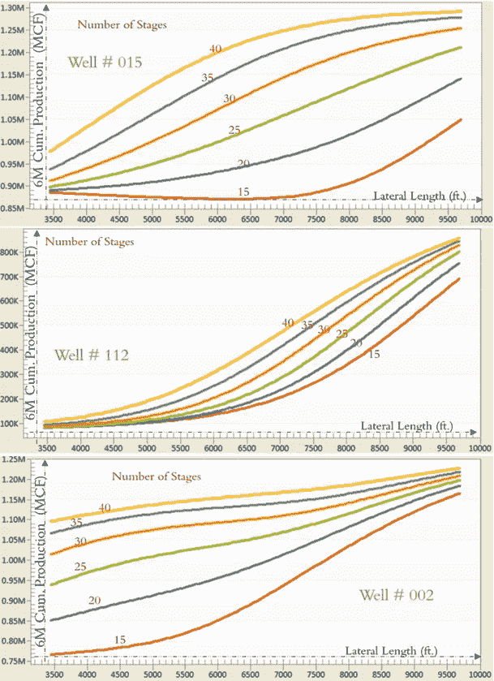
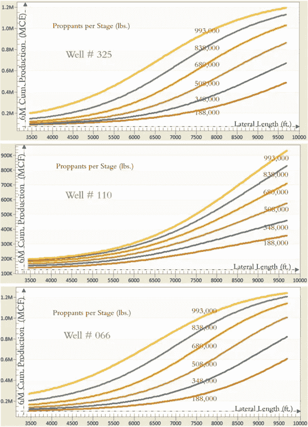
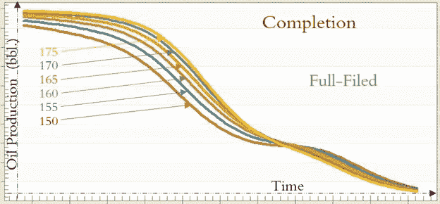
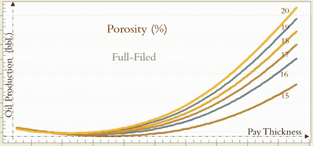

# 可解释的人工智能(XAI)

> 原文：<https://medium.com/geekculture/explainable-artificial-intelligence-xai-7a17500c09a5?source=collection_archive---------44----------------------->

**人工智能工程应用的主要特征(三)**

**概述**
简介— **(第一部分)**
解释传统工程模型— **(第一部分)**
解释 AI 开发的物理学模型&【机器学习】— **(第二部分)**
—【XAI 第一部分:关键绩效指标(KPI) — **(第二部分)**
—【XAI 第二部分:敏感性分析— **(第二部分)**
—第二步:双参数敏感性分析— **(第二部分)**
—第三步:多参数敏感性分析— **(第二部分)**
—XAI 第三部分:典型曲线— **(第三部分)**
—非常规储层可解释人工智能模型(页岩分析)— **(第三部分)**
—常规储层可解释人工智能模型(自上而下建模)— **(第三部分)**

# XAI 的第三部分:标准曲线

正如本文前面提到的，使用数学方程生成的标准曲线是非常“良好的”(连续的、非线性的、曲线与曲线之间以相似方式变化的特定形状)。图 16 展示了油藏工程中产生的更多典型曲线的例子。问题是，“能够生成一系列良好的典型曲线的模型的主要特征是什么？”对这个问题的直接、简单的回答是:“能够产生一系列良好表现的典型曲线的模型是由一个或多个数学方程开发的基于物理学的模型。清楚地解释基于物理的模型的行为的行为良好的类型曲线是通过数学方程的解生成的。”

Figure 16\. Type Curve examples of the reservoir engineering.

下一个问题是:“如果可以证明(并证明)产生良好特性曲线的模型不是使用任何数学方程开发出来的，那会怎么样？如果这个模型是纯数据(实地测量)驱动的呢？”那么有意义的答案将是:“(a)这些行为良好的典型曲线的生成证明了用于建立纯数据驱动模型的数据(现场测量)合理地代表了被建模的物理现象，(b)数据驱动预测模型可以被清楚地解释，并且用于开发这种模型的技术必须是科学上可靠的技术。”

行为良好的典型曲线的主要特征是它们对产生它们的模型的解释能力。图 17 和图 18 是“解释”开发它们的模型的好例子。图 17 包括三组图表/标准曲线。这些典型曲线具有“模拟侧向长度(英尺。)”作为它们的 x 轴，而“6 个月累积气体产量(Mscf)”作为它们的 y 轴。图表中的每条曲线代表完井期间使用的水力压裂阶段的数量。每张图中有六条曲线。每张图表都解释了宾夕法尼亚州西南部一口特定的马塞勒斯页岩油井的动态。每张图中的六条曲线显示了每口井的产能如何作为“增产侧向长度(ft。)”(从 3000 到 10000 英尺。)和级数(从 15 级到 40 级)。图 17 所示的三口井属于该特定马塞勒斯页岩资产中三个不同位置的三个不同井场。

# 非常规储层的可解释人工智能模型——页岩分析

页岩分析是人工智能和机器学习在非常规油藏中的工程应用。在页岩预测分析期间，为完井和生产优化开发的数据驱动模型完全基于现场测量。在页岩分析中，避免使用和结合任何类型的数学方程，因为缺乏对页岩中流体流动的物理特性和裂缝的形状和特征的实际理解，而裂缝是在天然裂缝中实施水力压裂的函数。

一旦页岩预测分析完成，通过生成典型曲线，可解释的人工智能(XAI)被用于解释页岩油井的完井和生产的物理过程。这种基于实际现场测量并完全避免任何假设、简化和偏见的解释无法通过过去十年在我们行业中使用的传统方法来完成。使用速率瞬态分析(RTA)和数值油藏模拟(NRS)的页岩油井油气产量的传统建模方法包括最少量的实际现场测量，并且完全由软数据控制。完全控制 RTA 和 NRS 的软数据包括裂缝半长、裂缝高度、裂缝宽度、裂缝导流能力，甚至增产储层体积(SRV)。

使用这些可以由我们生成并可以具有我们希望的任何值的软数据，而不是作为页岩分析主要基础的实际现场测量，允许我们做出任何我们想得出的结论，即使它们彼此 100%不同。换句话说，这种技术可以产生任何一种我们喜欢提出的解决方案，而与现实毫无关系。这与我们的目标有关，与页岩油井的油气生产的实际情况无关。

图 17 和图 18 显示了可解释人工智能(XAI)如何为马塞勒斯页岩资产中的每口井提供信息。可以为每个垫、页岩资产的任何特定部分或整个页岩资产生成类似的类型曲线。在图 17 中，可解释的人工智能(XAI)显示#015 井的 6 个月累积产气量从 850，000 MSCF 增加到 130 万 MSCF，作为“刺激分支长度(英尺。)”从 3500 英尺开始上升。到 10000 英尺。当水力压裂的完井设计从 15 个阶段变为 40 个阶段时，作为增产侧向长度函数的气体产量的增加是非线性的，并且可以改变该图中所示的方式，只要用于建立该模型的所有其他变量对于该特定井保持不变。如果完井设计包括 15 个阶段，那么随着增产横向长度从 3500 英尺增加，天然气产量可以从 850000 MSCF 增加到 105 万 MSCF。到 10000 英尺。

Figure 17\. Number of Stages Type Curves of the well productivity for specific wells as a function of Stimulated Lateral Length.

Figure 18\. Proppant per Stage Type Curves of the well productivity for specific wells as a function of Stimulated Lateral Length.

如果完井设计包括两倍的阶段(30 个阶段)，那么当增产横向长度从 3500 英尺增加时，天然气产量可以从 900000 MSCF 增加到 125 万 MSCF。到 10000 英尺。

对于 112 号井(图 17 中的中间图),典型曲线解释了 6 个月的累积产气量可以从 100，000 MSCF 增加到 900，000 MSCF，因为“增产横向长度(英尺。)”从 3500 英尺开始上升。到 10000 英尺。当水力压裂的完井设计从 15 个阶段变为 40 个阶段时，作为增产侧向长度函数的气体产量的增加是非线性的，并且可以改变该图中所示的方式，只要用于建立该模型的所有其他变量对于该特定井保持不变。如果完井设计包括 15 个阶段，那么随着增产横向长度从 3500 英尺增加，天然气产量可以从 100000 MSCF 增加到 700000 MSCF。到 10000 英尺。如果完井设计包括两倍的阶段(30 个阶段)，那么当增产横向长度从 3500 英尺增加时，天然气产量可以从 100000 MSCF 增加到 820000 MSCF。到 10000 英尺。

对于#002 井(图 17 中的下图),典型曲线解释了 6 个月的累积产气量可以从 750，000 MSCF 增加到 125 万 MSCF，因为“增产横向长度(英尺。)”从 3500 英尺开始上升。到 10000 英尺。当水力压裂的完井设计从 15 个阶段变为 40 个阶段时，作为增产侧向长度函数的气体产量的增加是非线性的，并且可以改变该图中所示的方式，只要用于建立该模型的所有其他变量对于该特定井保持不变。如果完井设计包括 15 个阶段，那么随着增产横向长度从 3500 英尺增加，天然气产量可以从 750000 MSCF 增加到 116 万 MSCF。到 10000 英尺。如果完井设计包括两倍多的阶段(30 个阶段)，那么随着增产横向长度从 3500 英尺增加，天然气产量可以从 100 万 MSCF 增加到 121 万 MSCF。到 10000 英尺。

图 18 中的典型曲线说明，在这个马塞勒斯页岩资产中，325 号井 6 个月的累计产气量可以从 10 万 MSCF 增加到 120 万 MSCF。)”从 3500 英尺开始上升。到 10000 英尺。当水力压裂完井设计中每级支撑剂的注入量从 188，000 lbs 改变时，作为增产侧向长度函数的气体产量的增加是非线性的，并且可以改变图中所示的方式。到 993，000 磅。只要用于建立该模型的所有其他变量对于该特定井保持不变。

如果每级支撑剂为 188，000 磅。，那么随着增产横向长度从 3500 英尺增加，天然气产量可以从 10 万 MSCF 增加到 50 万 MSCF。到 10000 英尺。如果每级支撑剂增加到 680，000 磅。，那么随着增产侧向长度从 3500 英尺增加，天然气产量可以从 15 万 MSCF 增加到 103 万 MSCF。到 10000 英尺。

对于 110 号井(图 18 中的中间图),典型曲线解释了 6 个月的累积产气量可以从 100，000 MSCF 增加到 950，000 MSCF，作为“增产侧向长度(英尺)”。)”从 3500 英尺开始上升。到 10000 英尺。当每级支撑剂从 188，000 lbs 改变时，作为增产侧向长度的函数的气体产量的增加是非线性的，并且可以改变该图中所示的方式。到 993，000 磅。只要用于建立该模型的所有其他变量对于该特定井保持不变。

如果每级支撑剂为 188，000 磅。，那么随着增产横向长度从 3500 英尺增加，天然气产量可以从 100000 MSCF 增加到 350000 MSCF。到 10000 英尺。如果每级支撑剂增加到 838，000 磅。，那么随着增产横向长度从 3500 英尺增加，天然气产量可以从 150000 MSCF 增加到 830000 MSCF。到 10000 英尺。

对于#066 井(图 18 中的下图),典型曲线解释了 6 个月的累积产气量可以从 10 万 MSCF 增加到 122 万 MSCF，因为“增产横向长度(ft。)”从 3500 英尺开始上升。到 10000 英尺。当每级支撑剂从 188，000 lbs 改变时，作为增产侧向长度的函数的气体产量的增加是非线性的，并且可以改变该图中所示的方式。到 993，000 磅。只要用于建立该模型的所有其他变量对于该特定井保持不变。

如果每级支撑剂为 188，000 磅。，那么随着增产横向长度从 3500 英尺增加，天然气产量可以从 10 万 MSCF 增加到 60 万 MSCF。到 10000 英尺。如果完井设计的每阶段注入的支撑剂增加到 993，000 磅。，那么随着增产横向长度从 3500 英尺增加，天然气产量可以从 25 万 MSCF 增加到 125 万 MSCF。到 10000 英尺。

# 常规油藏的可解释人工智能模型——自顶向下建模

图 19、图 20 和图 21 所示的典型曲线是使用自上而下建模(TDM)为北非的一个成熟海上油田开发的，TDM 是一种纯数据驱动的油藏建模[【1】](#_ftn1)技术。这些数字解释了气举(图 19)、完井(图 20)和孔隙度(图 21)等参数如何以及在何种程度上影响整个油田的石油产量。

[【1】](#_ftnref1)石油工程师学会(SPE)出版的书——《数据驱动油藏建模》。【https://store.spe.org/DATA-DRIVEN-RESERVOIR-MODELING-P1054\. ASPX

Figure 19\. Gas-Lift Type Curves of the well productivity for the entire field as a function of time (date).

Figure 20\. Completion Type Curves of the well productivity for the entire field as a function of time (date)

Figure 21\. Porosity Type Curves of the well productivity for the entire field as a function of formation Pay Thickness.

使用现场测量而非数学方程开发的这些典型曲线的良好特性清楚地显示了“可解释的人工智能(XAI)”如何被用于自上而下建模的开发。

> 第三部分到此结束。第四部分请点击此处: