# 可解释的人工智能(XAI)

> 原文：<https://medium.com/geekculture/explainable-artificial-intelligence-xai-dfb65dc28a54?source=collection_archive---------26----------------------->

**人工智能工程应用的主要特征(下)**

**概述**
简介— **(第一部分)**
解释传统工程模型— **(第一部分)**
解释 AI 开发的物理学模型&【机器学习】— **(第二部分)**
—【XAI 第一部分:关键绩效指标(KPI) — **(第二部分)**
—【XAI 第二部分:敏感性分析— **(第二部分)**
—第二步:双参数敏感性分析— **(第二部分)**
—第三步:多参数敏感性分析— **(第二部分)**
—XAI 第三部分:典型曲线— **(第三部分)**
—非常规储层可解释人工智能模型(页岩分析)— **(第三部分)**
—常规储层可解释人工智能模型(自上而下建模)— **(第三部分)**

**解释 AI 开发的物理模型&机器学习(XAI)**

在福布斯[【1】](#_ftn1)最近发表的一篇文章中提到:

*许多用于机器学习的算法不能够在事后进行检查，以具体理解决策是如何和为什么做出的。对于目前使用的最流行的算法来说尤其如此——具体来说，就是深度学习神经网络方法。可解释人工智能(XAI)是机器学习中的一个新兴领域，旨在解决人工智能系统的黑盒决策是如何做出的。到目前为止，在使机器学习的深度学习方法可以解释的领域中，只有早期的、新生的研究和工作。*

本文写于 2019 年 7 月。它表明，使用人工智能和机器学习开发的模仿人类水平智能(非工程相关问题)的系统和模型在解释这项技术如何预测、预测或决策方面存在重大问题。本文参考的人工智能和机器学习的应用类型，以及最近许多关于 XAI 的文章，主要与该技术在非工程相关问题上的应用有关。当涉及到人工智能和机器学习的工程应用时，“如何和为什么做出决定”变得远比这项技术用于非工程相关问题更重要。因此，当这项技术在 20 世纪 90 年代初开始用于石油工程时，今天所谓的可解释人工智能(XAI)一直是一个主要问题。

有趣的是，使用人工智能和机器学习开发的可解释预测模型是由 Intelligent Solutions，Inc .在 21 世纪初开发的。这些 XAI 模型是这项技术在石油数据分析中应用的一部分[【2】](#_ftn2)。如前所述，今天所谓的可解释人工智能的研究和开发背后的主要原因发生在更早的时候，与这样一个事实有关，即一旦这项技术应用于工程相关问题的解决，模型的解释能力就成为科学家和工程师的一个关键问题。

将使用人工智能和机器学习算法生成的预测模型称为“黑盒”的主要原因是，这些算法没有使用数学方程来模拟物理现象。当涉及到人工智能和机器学习的工程应用时，这种模型的“黑箱”特征会给科学家和工程师带来严重的问题。许多对这项新技术持否定态度的传统工程师通常使用“黑盒”一词，以否认这项技术对未来工程问题解决的贡献。

Intelligent Solutions，Inc .和西弗吉尼亚大学在过去三十年中开发的石油数据分析的主要贡献之一是为预测分析的所谓“黑箱”创造了透明度。由于石油数据分析是一种完全基于物理的技术，避免了任何数学方程，并生成纯数据驱动的预测模型，因此它开发了可解释的预测模型。本文的目的是展示石油数据分析的可解释的人工智能建模。该演示将通过关键性能指标、敏感性分析和典型曲线进行解释。

[【1】](#_ftnref1)《理解可解释的 AI，福布斯，认知世界》，Ron Schmelzer。2019 年 7 月。[https://www . Forbes . com/sites/cognitive world/2019/07/23/understanding-explable-ai/# 139 b 36 a 37 c 9 e](https://www.forbes.com/sites/cognitiveworld/2019/07/23/understanding-explainable-ai/#139b36a37c9e)

[【2】](#_ftnref2)[https://shahab-mohaghegh . medium . com/petroleum-data-analytics-FAQ-questions-513090783 BCF](https://shahab-mohaghegh.medium.com/petroleum-data-analytics-frequently-asked-questions-513090783bcf)

# XAI 的第 1 部分:关键绩效指标(KPI)

在石油数据分析(PDA)的背景下开发的预测模型可以提供一个龙卷风图来展示和排列用于开发(训练、校准和验证)预测模型的所有输入参数的贡献。图 5 显示了数据驱动预测模型生成的龙卷风图，该模型是使用页岩分析[【3】](#_ftn1)为宾夕法尼亚州西南部的 Marcellus 页岩油田开发的。为该油藏和完井工程相关问题开发的数据驱动预测模型包括 24 个不同的现场测量值。这种预测模型的输出是该油田每口井的“30 天累积产气量”。

这种数据驱动预测模型的 KPI tornado 图显示，平均而言，该油田的作业条件对控制前 30 天的产气量起着最重要的作用。然后是与完井设计、油井特征、水力压裂实施相关的属性，最后是地层特征。在图 5 中，每个属性(输入参数)的背景颜色表示它们属于哪一类输入参数。

[【3】](#_ftnref1)页岩分析，[https://www.springer.com/gp/book/9783319487519](https://www.springer.com/gp/book/9783319487519)

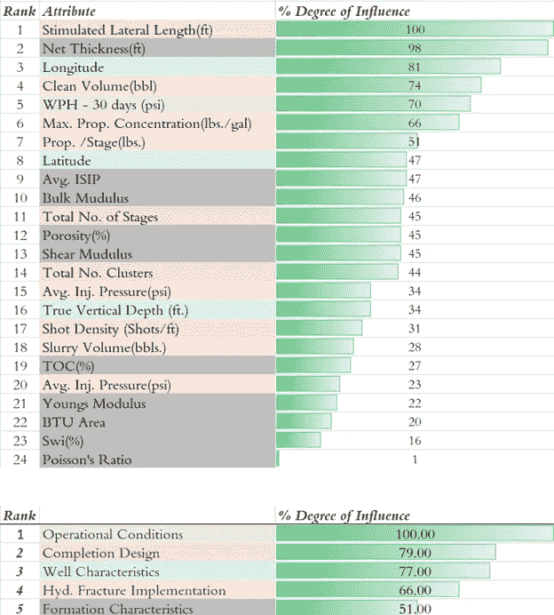

Figure 5\. Tornado chart of Key Performance Indicators generated in Shale Analytics (application of PDA in unconventional reservoirs) for a data-driven predictive model for a Marcellus Shale field in southwest Pennsylvania

# XAI 第二部分:敏感性分析

可以用来解释模型行为的主要技术之一是敏感性分析。在石油数据分析的背景下开发的预测分析模型包括几个输入参数，用于建立给定输出的纯数据(现场测量)驱动的、基于物理的模型。在油藏工程背景下，让我们考虑建立一个预测性页岩分析模型，该模型使用油藏特征以及完井设计和实施(作为其他输入参数的一部分)来模拟油井产能指数。

这些特定预测页岩分析模型的敏感性分析将在以下三个步骤中进行解释，可应用于已用于建立基于人工智能的模型的每口井。以下章节中演示的敏感性分析也可应用于储层的特定部分(在页岩资产的情况下，可应用于包括一系列页岩井的每个区块)，这将包括一定数量的井，也可应用于整个油田的所有井。

# 第一步:单参数敏感性分析

Marcellus 页岩中约 250 口井的数据用于开发这种“页岩预测分析”模型。一旦模型开发完成，为了检查模型行为，模型输出被分析为修改每个单个输入参数的函数，以查看这种分析的结果是否具有工程(物理)意义。换句话说，这个想法是为了能够“解释”基于人工智能的模型行为。

如图 6 所示，首先确定一口特定井，并展示该特定井用于建立预测页岩分析模型的每个参数的所有值。然后选择输入参数之一，在该图中是“孔隙度”。显然，这口特殊的井具有特定的孔隙度值，该孔隙度值已经过测量，然后用作整个数据集的一部分，以建立预测页岩分析模型。为 Marcellus shale 油田开发的纯数据(现场测量)驱动模型已证明，基于这一特定的孔隙度值，可提供良好的产量(6 个月的累积产气量)。

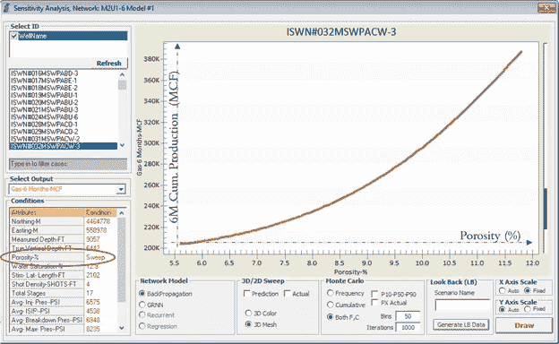

Figure 6\. How does Porosity impacts hydrocarbon production in shale wells? This figure shows that if all other involved variables are kept constant, then for a given well, increase in porosity will result in increase in hydrocarbon production for that specific well.

问题是:当该特定井的孔隙度值被修改时，模型输出(6 个月的累积产气量)会发生什么变化？保持所有其他输入参数不变，孔隙率的值在 100 块中从最小值变化到最大值。在所有其他参数保持不变的情况下，孔隙度的每个新值的油井产能(模型输出)是多少？图 6 显示了这种预测页岩分析模型的行为。这种“预测页岩分析”模型解释说，如果地层孔隙度增加，该特定油井的油气产量将增加。

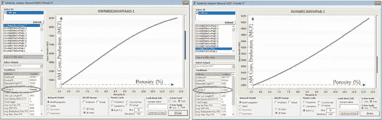

Figure 7\. Same behavior (increase in porosity resulting in increase in hydrocarbon production from wells) takes place for other wells in the same field. Given the fact that not all the variables that impact hydrocarbon production are the same for all wells, then the shape of the curves are modified.

从石油工程的角度来看，这非常合理。这一过程可以在油田的每一口井中重复进行。图 7 显示了该油田另外两口井的例子。一般来说，模型的行为是非常相同的。随着地层孔隙度的增加，油气井的产能也增加。

假设油田中每口井的所有其他输入参数都不同，则增产曲线的详细形状也各不相同。从物理学的角度来看，这也很有道理。值得注意的是，在开发这种“预测页岩分析”模型时，没有使用任何特定的数学方程(或通过基于方程的数据预先确定的相关性)。

图 8 至图 11 重复了该 Marcellus 页岩油田多口井的“增产侧向长度”和“每级支撑剂”分析。从物理学的角度来看，所有这些井和参数的模型行为非常有意义。这是 XAI 页岩分析的一个很好的例子。

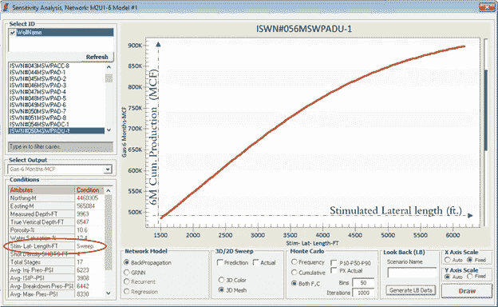

Figure 8\. How does Stimulated Lateral Length impacts hydrocarbon production in shale wells? This figure shows that if all other involved variables are kept constant, then for a given well, increase in Stimulated Lateral Length will result in increase in hydrocarbon production from that well.

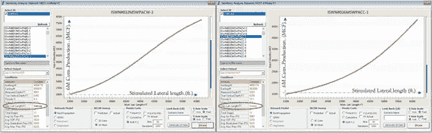

Figure 9\. Same behavior (increase in stimulated lateral length resulting in increase in hydrocarbon production from wells) takes place for other wells in the same field. Given the fact that not all the variables that impact hydrocarbon production are the same for all wells, then the shape of the curve is modified.

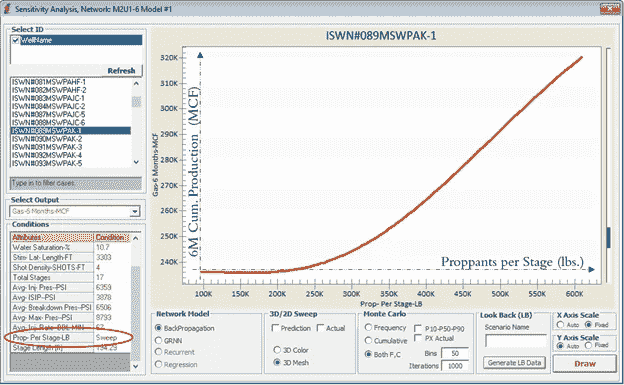

Figure 10\. How does the amount of Proppant per Stage impacts hydrocarbon production in shale wells? This figure shows that if all other involved variables are kept constant, then for a given well, increase in Proppant per Stage will result in increase in hydrocarbon production from that well.

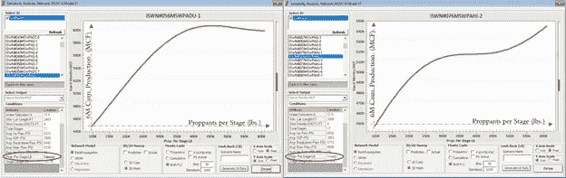

Figure 11\. Same behavior (increase in proppant per stage resulting in increase in hydrocarbon production from wells) takes place for other wells in the same field. Given the fact that not all the variables that impact hydrocarbon production are the same for all wells, then the shape of the curve is modified.

# 第二步:双参数敏感性分析

同时分析两个参数的灵敏度，而不是单个参数，将得到一个三维图形。如图 12 所示，一口确定井的产能变化被解释为两个储层特征“孔隙度”和“初始水饱和度”变化的函数。虽然基于人工智能的模型已经生成了该特定井的产能，但它正在解释井产能如何随着这两个特定储层特征的修改而变化，同时保持所有其他输入参数不变。

有趣的是，这种“预测页岩分析”模型的解释具有完美的物理意义，因为它解释了当初始水饱和度降低时，随着储层孔隙度增加，油井产能增加的方式。同样，需要注意的是:( a)该油田的每口井都有相同类型的总体趋势[随着孔隙度的增加和初始水饱和度的降低，井产能增加];( b)没有使用数学方程来生成任何数据，用于训练、校准和验证该“预测页岩分析”模型。

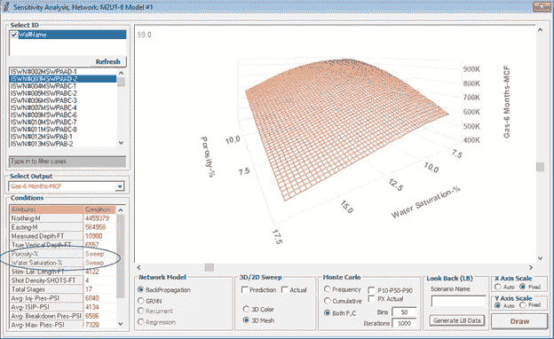

Figure 12\. This figure shows the sensitivity of the hydrocarbon production from a given shale well as a function of two variables (porosity and initial water saturation) while all other variables are kept constant.

# 第三步:多参数敏感性分析

随着输入参数数量的敏感性分析增加到两个以上的参数，那么将不再可能提供具有多个维度的图形。对多个输入参数(两个以上)进行灵敏度分析的最常见方法是蒙特卡罗模拟(MCS)。在蒙特卡罗模拟中，对于可以使用多少输入参数来执行多参数灵敏度分析没有限制。

“页岩预测分析”模型被用作蒙特卡罗模拟的目标函数。一旦确定了灵敏度分析的参数数量，就可以开始该过程。在本节所示的示例中，四个参数(孔隙度[%]、初始含水饱和度[%]、模拟侧向长度[ft。]，以及每级支撑剂[磅。])已被确定用于敏感性分析。

一旦确定了灵敏度分析的参数数量，执行蒙特卡罗模拟(MSC)需要以下三个步骤:

a)识别每个参数的分布类型[均匀分布、三角形分布、高斯分布…]，

b)必须执行 MSC 目标函数的次数[在这种情况下为“页岩预测分析”模型]以生成结果[模型输出—此处为油井产能]，最后

c)识别箱数，以证明作为所有已识别输入参数的函数修改的油井产能分布。

图 13 中列出了上述三个步骤。图 13、图 14 和图 15 显示了该油田三口井的多参数敏感性分析结果。在这些分析中，四个参数(孔隙度、初始水饱和度、增产侧向长度和每级支撑剂)用于证明每口井的产能对其修改的敏感性，而每口井的所有其他输入参数保持不变。蓝色条形图显示了油井产能的分布，作为这四个参数修正的函数，而红色曲线显示了分布的总和。

使用红色曲线，P10(几乎是该井的最高产能)、P50(几乎是该井的平均产能)和 P90(几乎是该井的最低产能)可以作为用于灵敏度分析的参数修改的函数而被识别。“蓝色条形图”和“红色曲线”的特征详细解释了该油田每口井的“页岩预测分析”模型的物理特性。

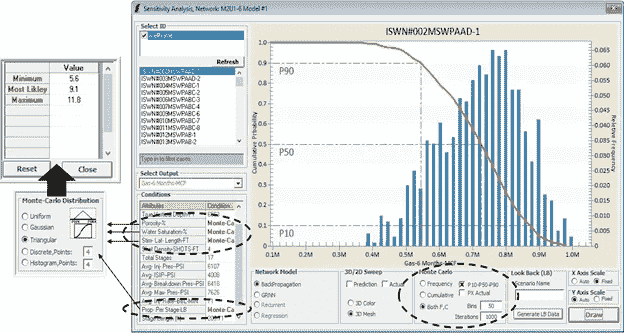

Figure 13\. Sensitivity analysis of multiple parameters using Monte Carlo Simulation (MCS). The predictive model is deployed thousands of times in order to identify the potential distribution of the hydrocarbon production as a function changes in both reservoir characteristics (porosity and initial water saturation) and completion design (stimulated lateral length and proppant per stage).

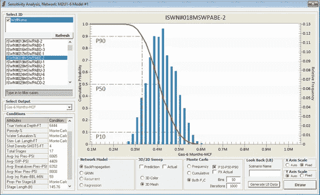

Figure 14\. The predictive model is deployed thousands of times in order to identify the potential distribution of the hydrocarbon production as a function of changes in both reservoir characteristics and completion design.

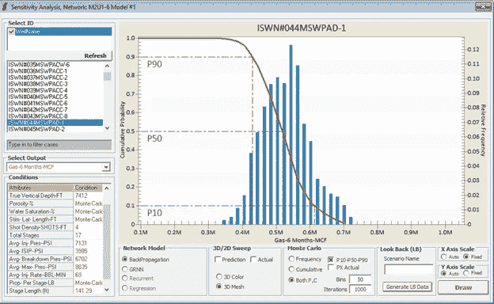

Figure 15\. The predictive model is deployed thousands of times in order to identify the potential distribution of hydrocarbon production as a function of changes in both reservoir characteristics and completion design.

> 第二部分到此结束。第三部分请点击此处: